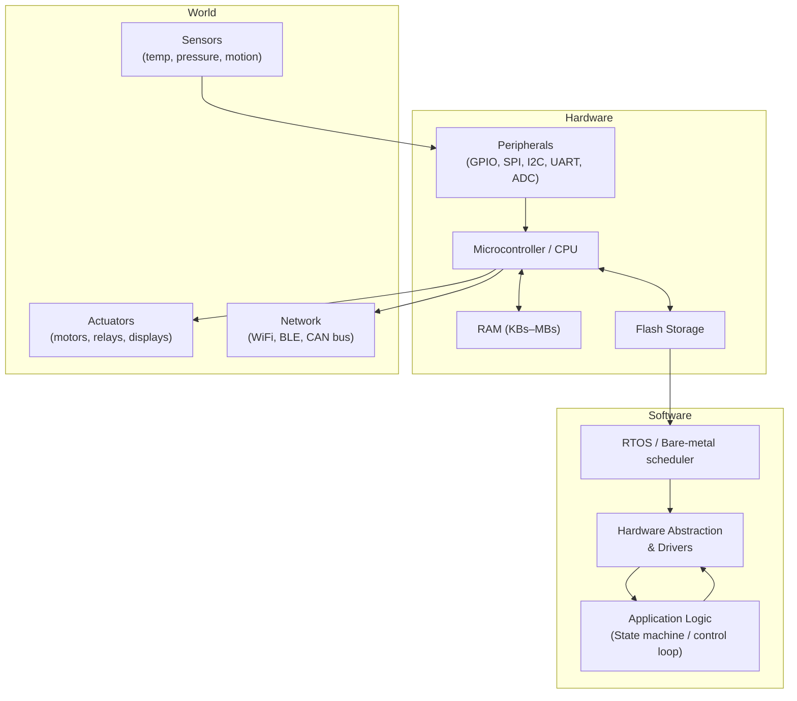

## In simple terms

An **embedded system** is a computer that doesn't look like a computer. It's the chip inside your washing machine, your fridge, your car, your toothbrush — bound to a specific task, often with tight constraints on memory, power, and timing.

Unlike a desktop where you can open any program and multitask freely, an embedded system usually runs one fixed piece of software forever. It's purpose-built: the code and the hardware are designed together as a unit.

## The Visual Map



## More detail

Embedded systems span a huge spectrum of capability:

- **Bare-metal microcontroller (MCU)** — a single chip with CPU + RAM + flash + peripherals. KBs of memory, no OS, one infinite loop. Arduino Uno (AVR, 2 KB RAM), STM32, ESP32.
- **Microprocessor + minimal Linux** — a board (Raspberry Pi, BeagleBone) running a stripped Yocto or Buildroot image. MBs of RAM, full POSIX, but still dedicated hardware.
- **Real-time OS (RTOS)** — FreeRTOS, Zephyr, VxWorks, QNX. Provides a task scheduler with deterministic preemption guarantees.
- **High-end safety-critical** — automotive ECUs, avionics flight computers, medical devices. These undergo rigorous certification: DO-178C (avionics), ISO 26262 (automotive), IEC 62443 (industrial control).

Characteristic constraints shape every design decision:

| Constraint | Typical value | Design consequence |
|---|---|---|
| RAM | 2 KB – 512 MB | No dynamic allocation in tight loops; static buffers |
| Flash | 32 KB – 8 GB | No virtual memory paging; XIP (execute in place) |
| Power budget | µW – mW | Deep sleep most of the time; wake on interrupt |
| Timing | µs–ms deadlines | Interrupt-driven, RTOS tasks, or bare-metal superloop |
| Availability | Years unattended | Watchdog timer, failsafe resets, conservative OTA |

Programming languages follow the constraints: **C** dominates for portability and zero-overhead abstraction; **C++** (with a subset: no RTTI, no exceptions, no dynamic allocation) adds type safety; **Rust** is gaining traction in safety-critical contexts (`no_std` crate ecosystem). Higher-level languages (MicroPython, TinyGo, Lua) appear on bigger devices where a few MBs are available.

Most computers in the world are embedded — by orders of magnitude. A modern car has 50–100 ECUs; a smart home has dozens. They are the invisible substrate of the physical world.

## Under the Hood

A bare-metal MCU superloop with interrupt-driven I/O — the most common embedded pattern:

```c
#include <stdint.h>
#include <stdbool.h>

/* --- Hardware registers (example: STM32-style) --- */
#define GPIOA_ODR  (*(volatile uint32_t *)0x40020014)
#define LED_PIN    (1u << 5)

/* --- Shared state updated by ISR --- */
volatile bool g_button_pressed = false;

/* Interrupt Service Routine — fires in microseconds, must be fast */
void EXTI0_IRQHandler(void) {
    g_button_pressed = true;
    EXTI->PR = (1u << 0);   /* clear pending bit */
}

/* Watchdog kick — must happen before timeout or MCU resets */
static void watchdog_kick(void) {
    IWDG->KR = 0xAAAA;
}

int main(void) {
    hardware_init();          /* clocks, GPIO, NVIC, watchdog setup */

    while (1) {
        watchdog_kick();      /* must run every ~1 s or MCU resets */

        if (g_button_pressed) {
            g_button_pressed = false;
            GPIOA_ODR ^= LED_PIN;   /* toggle LED */
        }

        __WFI();              /* Wait For Interrupt — halt CPU, save power */
    }
}
```

Key idioms visible here:
- `volatile` on any variable touched by an ISR — prevents the compiler from caching it in a register.
- `__WFI()` (Wait For Interrupt) puts the CPU into sleep mode; power draw drops from mA to µA until the next interrupt fires.
- Watchdog timer — a hardware counter that resets the MCU if software hangs; you must `kick` it regularly to prove you're alive.
- Bit-manipulation on memory-mapped registers instead of function calls — registers *are* the hardware interface.

## Engineering Trade-offs

**Resource efficiency vs. developer productivity**
Bare-metal C gives maximum control but every allocation, timing, and peripheral interaction is manual. An RTOS adds ~10–50 KB of flash overhead in exchange for preemptive scheduling, mutexes, and queues. The tradeoff is worth it once you have ≥3 concurrent tasks with different priorities.

**Hard real-time vs. general-purpose OS**
Linux (even RT-patched) has occasional scheduling jitter in the millisecond range. FreeRTOS can guarantee sub-100 µs task switching. For motor control, medical sensors, or safety interlocks, jitter is a correctness issue, not a performance issue.

**Static allocation vs. dynamic allocation**
Dynamic memory (`malloc`/`new`) is fine on a desktop but problematic embedded: heap fragmentation over months of uptime can crash a device with no user present. MISRA-C and most safety standards ban it; prefer static arrays or fixed-size memory pools.

**Over-the-air (OTA) updates vs. simplicity**
Adding OTA capability multiplies complexity (dual-bank flash, secure bootloader, rollback), but a fleet of 10,000 deployed devices with a firmware bug — and no OTA — is a recall. The simpler system is cheaper to build; the non-OTA system is vastly more expensive to fix.

**Tight coupling to hardware vs. portability**
Firmware written against specific register addresses is fast but non-portable. Hardware Abstraction Layers (HAL) and board-support packages (BSP) add indirection but let you swap MCU families without rewriting application logic.

## Real-world examples

- **Arduino** (AVR, 2 KB RAM) — the canonical learning embedded system; no OS, just `setup()` and `loop()`.
- **Anti-lock Braking System (ABS)** — a hard-real-time controller that must sense wheel slip and modulate brake pressure within single-digit milliseconds; a missed deadline is a collision.
- **SpaceX Falcon 9** — hundreds of embedded computers cooperating over a redundant CAN bus to guide, throttle, and land the booster, with no ground operator in the loop during descent.
- **James Webb Space Telescope** — onboard computer runs a SPARC-derived RAD750 chip at 200 MHz with 12 GB of solid-state storage. A $10 billion instrument running on a CPU slower than a 1990s desktop, chosen for radiation tolerance.
- **Pacemaker** — runs for 7–10 years on a small battery, fires pulses with sub-millisecond timing, certified to IEC 60601-1. Safety requirements dwarf resource constraints.

## Common misconceptions

- **"Embedded means weak."** A modern Tesla has more compute than many developer laptops — multiple ARM clusters running safety-critical automotive stacks. "Embedded" describes the deployment model (purpose-built, fixed function), not the raw power.
- **"Embedded developers don't need software engineering discipline."** They need more of it. A buggy mobile app gets a one-click update; a buggy embedded device in 50,000 cars triggers a safety recall. Unit tests, code review, static analysis (MISRA-C, Polyspace), and hardware-in-the-loop simulation are all standard practice in professional embedded work.

## Try it yourself

Simulate the core embedded pattern — a state machine with timing — using only Python 3:

```python
#!/usr/bin/env python3
"""Simulates a bare-metal embedded superloop with a watchdog and an interrupt."""
import time, random, signal, sys

WATCHDOG_TIMEOUT = 1.0   # seconds — MCU resets if not kicked
LED_STATE = [False]
BUTTON_FLAG = [False]    # shared between "ISR" and main loop

def simulate_button_interrupt():
    """Called asynchronously — mimics an external interrupt."""
    BUTTON_FLAG[0] = True

def watchdog_kick(last_kick):
    now = time.monotonic()
    if now - last_kick > WATCHDOG_TIMEOUT:
        print("WATCHDOG RESET — system hung!")
        sys.exit(1)
    return now

print("Embedded superloop running. Ctrl-C to stop.")
last_kick = time.monotonic()
cycle = 0

try:
    while True:
        # --- Watchdog kick (must happen every iteration) ---
        last_kick = watchdog_kick(last_kick)

        # --- Simulate random button press (1-in-5 cycles) ---
        if random.randint(0, 4) == 0:
            simulate_button_interrupt()

        # --- Handle deferred interrupt work ---
        if BUTTON_FLAG[0]:
            BUTTON_FLAG[0] = False
            LED_STATE[0] = not LED_STATE[0]
            print(f"  cycle {cycle:4d} | button pressed → LED {'ON ' if LED_STATE[0] else 'OFF'}")

        cycle += 1
        time.sleep(0.1)   # simulate __WFI() sleep until next tick

except KeyboardInterrupt:
    print(f"\nHalted after {cycle} cycles.")
```

Run it:

```bash
python3 - << 'EOF'
import time, random, sys
WATCHDOG_TIMEOUT = 1.0
LED_STATE = [False]
BUTTON_FLAG = [False]
def watchdog_kick(last_kick):
    now = time.monotonic()
    if now - last_kick > WATCHDOG_TIMEOUT:
        print("WATCHDOG RESET"); sys.exit(1)
    return now
print("Superloop running (5 s)...")
last_kick = time.monotonic()
for cycle in range(50):
    last_kick = watchdog_kick(last_kick)
    if random.randint(0, 4) == 0:
        BUTTON_FLAG[0] = True
    if BUTTON_FLAG[0]:
        BUTTON_FLAG[0] = False
        LED_STATE[0] = not LED_STATE[0]
        print(f"  cycle {cycle:3d} | LED {'ON ' if LED_STATE[0] else 'OFF'}")
    time.sleep(0.1)
print("Done.")
EOF
```

## Learn next

- [Real-Time OS](/t/real-time-os) — the scheduling layer that makes multi-task embedded software deterministic; FreeRTOS, Zephyr, and QNX all target the systems described here.
- [IoT](/t/iot) — when embedded systems grow a network interface and connect to cloud infrastructure, they become IoT nodes; understanding the constrained device side first makes the network side click.
- [Interrupts](/t/interrupt) — the hardware mechanism that makes the `__WFI` sleep-and-wake pattern work; essential reading for writing correct ISR code.
- [Real-Time Systems](/t/real-time-systems) — the formal study of deadlines, schedulability analysis, and what "hard real-time" means mathematically.
- [Operating System](/t/operating-system) — the contrast with a general-purpose OS clarifies exactly what an RTOS sacrifices (feature richness) and gains (determinism).
