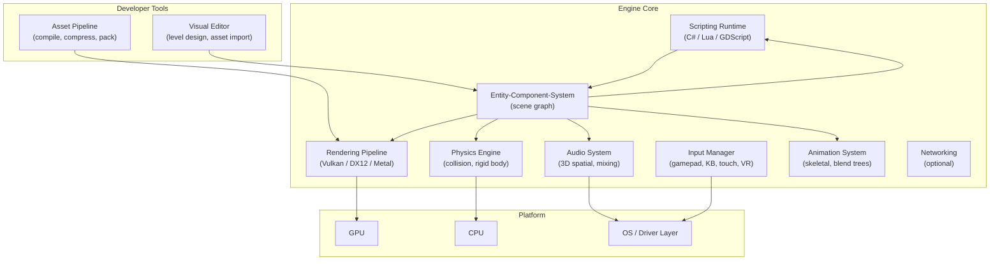

## In simple terms

A **game engine** is the toolkit you use to build a video game. Instead of writing your own 3D renderer, physics solver, audio mixer, scripting language, and editor, you adopt an engine that provides them all and focus on the game itself — the world, the rules, the art, the feel.

Think of it like a film studio's infrastructure: the cameras, the lighting rigs, the editing suite are already there. You direct the movie; you don't build the equipment from scratch.

## The Visual Map



## More detail

A game engine's subsystems must all coordinate within a 16 ms budget (60 fps) or 33 ms (30 fps):

**Rendering pipeline** — transforms scene geometry through a GPU pipeline (vertex shading → rasterization or ray tracing → fragment shading → post-process). Modern engines expose Vulkan, DirectX 12, Metal, or WebGPU to get low-overhead GPU access.

**Physics** — discrete or continuous collision detection, rigid-body dynamics (PhysX, Bullet, Jolt), optional soft-body and fluid simulation. Usually runs on a fixed timestep (e.g., 50 Hz) independent of the render rate.

**Entity-Component-System (ECS)** — the dominant scene-graph architecture. Entities are bare IDs; components are pure data (position, mesh, health); systems iterate over matching component sets. This data-oriented layout is cache-friendly and avoids deep inheritance hierarchies.

**Scripting** — Unity uses C# with the Mono/IL2CPP runtime; Unreal uses C++ with an optional visual Blueprint scripting layer; Godot uses GDScript (Python-like) or C#. Scripting bridges designer-friendly authoring with engine performance.

**Asset pipeline** — raw art (FBX, PSD, WAV) is compiled offline into engine-native binary formats (meshes, texture atlases, compressed audio). At runtime the engine streams assets from disk or memory-maps them.

Dominant engines in 2026:

| Engine | Language | Sweet spot |
|---|---|---|
| Unity | C# | Indie, mobile, AR/VR |
| Unreal Engine | C++ + Blueprints | AAA, film virtual production |
| Godot | GDScript / C# | Open-source, 2D, lightweight |
| Custom (Frostbite, id Tech, Decima) | C++ | Large studio, full control |

Engines collapsed the cost of starting a game from millions of dollars to free. Without Unity, Godot, and Unreal, the indie and mobile game booms would not have happened.

## Under the Hood

A minimal ECS loop in Python illustrates the core pattern engines run every frame:

```python
#!/usr/bin/env python3
"""Minimal Entity-Component-System demonstrating a game engine's core loop."""
from dataclasses import dataclass
from typing import Dict, Tuple, Type, Any
import time

# --- Components (pure data) ---
@dataclass
class Position:
    x: float = 0.0
    y: float = 0.0

@dataclass
class Velocity:
    dx: float = 0.0
    dy: float = 0.0

@dataclass
class Health:
    hp: int = 100

# --- World (entity registry, keyed by component type) ---
class World:
    def __init__(self):
        self._next_id = 0
        self.components: Dict[int, Dict[Type, Any]] = {}

    def spawn(self, *comps) -> int:
        eid = self._next_id
        self._next_id += 1
        self.components[eid] = {type(c): c for c in comps}
        return eid

    def query(self, *types):
        for eid, comps in self.components.items():
            if all(t in comps for t in types):
                yield eid, comps

# --- Systems (pure logic, called every frame) ---
def movement_system(world: World, dt: float):
    for _, c in world.query(Position, Velocity):
        c[Position].x += c[Velocity].dx * dt
        c[Position].y += c[Velocity].dy * dt

def damage_system(world: World):
    for eid, c in world.query(Health):
        if c[Health].hp <= 0:
            print(f"  entity {eid} destroyed")

# --- Main game loop ---
world = World()
player = world.spawn(Position(0, 0),  Velocity(5, 3),  Health(100))
enemy  = world.spawn(Position(10, 10), Velocity(-2, 1), Health(50))

print(f"{'Frame':>5}  {'Player pos':>18}  {'Enemy pos':>18}")
dt = 0.1  # 10 fps for demo

for frame in range(5):
    movement_system(world, dt)
    damage_system(world)
    p = world.components[player][Position]
    e = world.components[enemy][Position]
    print(f"{frame:>5}  ({p.x:5.2f}, {p.y:5.2f})      ({e.x:5.2f}, {e.y:5.2f})")
    time.sleep(dt)
```

The pattern shows why ECS is cache-friendly: systems iterate flat arrays of components rather than chasing pointers through object hierarchies.

## Engineering Trade-offs

**Third-party engine vs. custom engine**
A commercial/open-source engine gives you a battle-tested renderer, physics, audio, and a full editor in hours. A custom engine gives total control over memory layout, render pipeline, and platform-specific optimisations — at the cost of years of engineering before a single frame of game runs. The right answer for almost every team in 2026 is "use an engine."

**Unity vs. Unreal vs. Godot**
Unity's C# scripting lowers the barrier for non-C++ developers; Unreal's C++ pipeline delivers higher peak rendering quality but steeper learning curve; Godot's MIT licence and lightweight runtime (no royalties, no install lock-in) make it increasingly attractive for 2D and small-team 3D.

**ECS vs. object-oriented scene graphs**
Traditional OO scene graphs (node → child → child) are ergonomic but create cache-unfriendly pointer chasing and brittle deep inheritance trees. ECS trades intuitive hierarchy for data-oriented memory layout and composability. Unity's DOTS (Data-Oriented Technology Stack) and Godot 4's internal redesign both moved toward ECS or ECS-adjacent approaches.

**Fixed vs. variable physics timestep**
Running physics at a fixed rate (50 Hz) decoupled from the render rate prevents simulation instability (objects tunnelling through walls at high speed). The engine interpolates visual positions between physics ticks to keep rendering smooth at 60+ fps.

**Retained-mode rendering vs. immediate-mode**
Retained-mode (scene graph, persistent GPU state) is the engine default — efficient for complex scenes with many unchanged objects. Immediate-mode (re-submit all draw calls every frame) is simpler to reason about and used in some UI toolkits and debug renderers.

## Real-world examples

- **Fortnite** (Unreal Engine 5) — used as a reference for Nanite's virtualised geometry system, which streams and renders billions of polygon clusters at runtime.
- **Hollow Knight** and **Among Us** (Unity) — indie games with small teams; Unity's editor and asset store made their development feasible.
- **Cyberpunk 2077** (REDengine 4, custom) — CD Projekt Red's in-house engine; full control over rendering allowed the dense city lighting, at the cost of a notoriously difficult multi-platform launch.
- **Unreal Engine 5 virtual production** — used on LED-wall film sets (The Mandalorian) to render real-time environments behind actors, replacing green screen with in-camera visual effects.
- **Godot** — adopted by the EU-funded FOSS game ecosystem and several AA studios after Unity's 2023 runtime-fee controversy drove migration.

## Common misconceptions

- **"Engines make all games look the same."** The engine is the infrastructure, not the art direction. *Celeste*, *Hollow Knight*, and *Ori and the Will of the Wisps* all use Unity and look nothing alike.
- **"Real games are built without engines."** A handful are — id Software historically wrote id Tech from scratch — but today even id uses Unreal for some projects and most AAA studios buy or license base technology rather than build from zero.

## Try it yourself

Run a minimal ECS game loop to see entity positions advance each frame:

```bash
python3 - << 'EOF'
from dataclasses import dataclass
from typing import Dict, Type, Any
import time

@dataclass
class Position:
    x: float = 0.0; y: float = 0.0

@dataclass
class Velocity:
    dx: float = 0.0; dy: float = 0.0

class World:
    def __init__(self):
        self._next = 0
        self.c: Dict[int, Dict[Type, Any]] = {}
    def spawn(self, *comps):
        eid = self._next; self._next += 1
        self.c[eid] = {type(c): c for c in comps}; return eid
    def query(self, *types):
        for eid, c in self.c.items():
            if all(t in c for t in types): yield eid, c

world = World()
player = world.spawn(Position(0, 0),   Velocity(5, 3))
enemy  = world.spawn(Position(10, 10), Velocity(-2, 1))

dt = 0.1
print(f"{'Frame':>5}  {'Player':>14}  {'Enemy':>14}")
for frame in range(6):
    for _, c in world.query(Position, Velocity):
        c[Position].x += c[Velocity].dx * dt
        c[Position].y += c[Velocity].dy * dt
    p = world.c[player][Position]
    e = world.c[enemy][Position]
    print(f"{frame:>5}  ({p.x:4.1f},{p.y:4.1f})      ({e.x:4.1f},{e.y:4.1f})")
    time.sleep(0.05)
print("Done.")
EOF
```

## Learn next

- [Rasterization](/t/rasterization) — the algorithm engines use to project 3D geometry onto a 2D screen; understanding the triangle pipeline demystifies how the renderer subsystem works.
- [Shader](/t/shader) — small GPU programs that control how each pixel and vertex is coloured; writing shaders is the primary way to extend and customise an engine's visual output.
- [GPU](/t/gpu) — the hardware all real-time rendering depends on; knowing how GPU parallelism and memory bandwidth work explains why engine rendering budgets are measured in milliseconds per frame.
- [Ray Tracing](/t/ray-tracing) — the alternative to rasterization now available in Unreal 5 and Unity HDRP; understanding both illuminates why rasterization dominated for decades.
