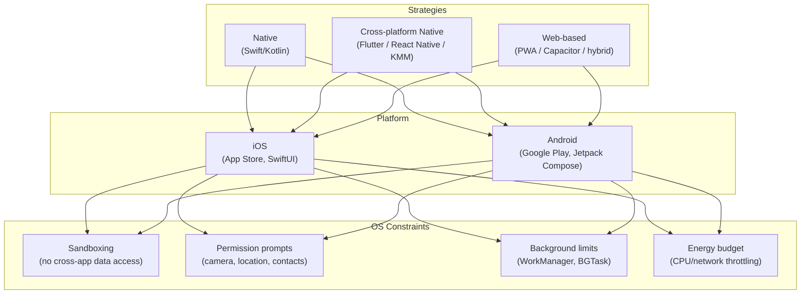

## In simple terms

A **mobile app** is a program built to run on a phone or tablet. It's distributed through an app store (Apple's App Store, Google Play, or third-party stores on Android), tightly sandboxed by the OS, and designed around touch input, small screens, and intermittent network connectivity.

Unlike a desktop program you download and run freely, a mobile app lives inside a walled garden: the platform controls what it can access, how long it can run in the background, and whether it's allowed on the store at all.

## The Visual Map



## More detail

**Three implementation strategies** sit on a spectrum between reach and capability:

| Strategy | Examples | Strengths | Weaknesses |
|---|---|---|---|
| Native | Swift/SwiftUI (iOS), Kotlin/Jetpack Compose (Android) | Best perf, full API access, first-class platform UX | Two codebases, two teams |
| Cross-platform native | Flutter (Dart → Skia/Impeller), React Native (JS → native views), Kotlin Multiplatform | One codebase → two stores | Occasional gaps in platform API coverage; debugging across the bridge is harder |
| Web-based | PWA, Capacitor, Cordova/Ionic | Web code reuse, instant updates | Weaker platform integration, no access to some native APIs, sometimes perceptible frame-rate gaps |

**Platform constraints** shape every design decision:

- **Sandboxing** — each app gets a private container; it cannot read another app's files or memory without an explicit sharing mechanism (Share Sheet, deep links, clipboard).
- **Permission prompts** — camera, microphone, location, contacts, push notifications, health data all require explicit user consent at runtime. Denials must be handled gracefully.
- **Background execution limits** — iOS severely throttles background work; Android's `WorkManager` and Doze mode similarly restrict it. Long-running tasks need platform-specific APIs (background fetch, foreground services).
- **Energy budget** — background network polling, excessive wake-locks, and high-frame-rate animations drain battery and get apps demoted in OS battery reports.
- **App store review** — Apple's review (manual + automated) takes days and enforces strict guidelines; Google Play's is mostly automated and faster. Both can reject or pull apps.

**Distribution economics** are part of the mobile story: app stores take 15–30% of in-app purchases and subscriptions. The App Store Commission has been the subject of antitrust proceedings in the EU, US, and South Korea.

Mobile is the dominant computing platform globally. For most users in 2026, software *is* mobile apps — and for a large portion of the world's internet users, the phone is their only computing device.

## Under the Hood

A minimal Android `ViewModel` + `StateFlow` pattern (the modern Kotlin/Jetpack architecture) shows how mobile apps manage UI state without memory leaks across configuration changes:

```kotlin
// ViewModel survives screen rotation; UI observes state, not raw data
class CounterViewModel : ViewModel() {
    private val _count = MutableStateFlow(0)
    val count: StateFlow<Int> = _count.asStateFlow()

    fun increment() { _count.update { it + 1 } }
    fun decrement() { _count.update { it - 1 } }
}

// Jetpack Compose UI — re-renders only when count changes
@Composable
fun CounterScreen(vm: CounterViewModel = viewModel()) {
    val count by vm.count.collectAsStateWithLifecycle()

    Column(horizontalAlignment = Alignment.CenterHorizontally) {
        Text("Count: $count", style = MaterialTheme.typography.headlineMedium)
        Row {
            Button(onClick = { vm.decrement() }) { Text("-") }
            Spacer(Modifier.width(16.dp))
            Button(onClick = { vm.increment() }) { Text("+") }
        }
    }
}
```

Key mobile-specific patterns visible here:
- `ViewModel` survives configuration changes (screen rotation destroys and recreates the `Activity`, but not the `ViewModel`).
- `StateFlow` is a reactive stream — Compose automatically re-renders the parts of the UI that depend on changed state.
- `collectAsStateWithLifecycle()` cancels collection when the screen is off, preventing wasted background work — the energy-budget constraint made concrete in code.

The iOS equivalent uses SwiftUI `@StateObject` / `@ObservableObject` with the same separation of concerns.

## Engineering Trade-offs

**Native vs. cross-platform**
Native gives the best performance, the freshest platform APIs on day one, and first-class design system integration (SF Symbols on iOS, Material You on Android). The cost is two separate codebases. Cross-platform (Flutter, React Native) pays a small runtime tax but ships to both stores from one repo — attractive until you hit a feature gap and spend more time fighting the framework than building the feature.

**Cross-platform savings erode with complexity**
Simple CRUD apps and content readers do well in Flutter or React Native. Apps that need Bluetooth LE, NFC, deep camera APIs, health kit, or platform-specific biometrics often end up writing native modules anyway, diluting the "one codebase" promise.

**Offline-first vs. always-connected**
Mobile networks are lossy. Apps that assume connectivity degrade badly in subways, rural areas, and international travel. An offline-first architecture (local SQLite/Realm, sync on reconnect) is more complex but dramatically better for users. Most consumer apps are not offline-first, and it shows.

**App size vs. startup time**
Large apps download slowly and take up storage. Flutter ships its own rendering engine (~10–15 MB) independent of the OS; native apps rely on system frameworks that are already present. React Native bundles a JS runtime. Startup time is the first impression: cold-start latency above ~400 ms is measurable in user retention data.

**App store control vs. distribution freedom**
The store provides discovery, billing, and trusted distribution. It also imposes review gatekeeping, a 15–30% commission, and guideline changes that can invalidate existing app behaviour. Web-based apps (PWAs) bypass stores entirely but get lower discoverability and no in-app purchase infrastructure.

## Real-world examples

- **WhatsApp** — cross-platform (React Native for some screens, native for others); billions of installs require extreme attention to startup time and background battery use.
- **Spotify** — uses native iOS and Android clients with shared C++ business logic (via NDK/Swift Package); the music decoding and caching layer is cross-platform, the UI is native.
- **Instagram / Facebook** — Meta pioneered React Native and still uses it for many surfaces while maintaining native rendering for the feed.
- **Google Maps** — native on both platforms; the precision of GPS integration and offline tile caching are cited as reasons to avoid a web-based approach.
- **Stardew Valley mobile** — a Unity game compiled to native iOS/Android; the same code path used for game engines applies to interactive entertainment.

## Common misconceptions

- **"Mobile apps are just smaller websites."** Touch ergonomics, energy budgets, OS-level sandboxing, push notifications, background execution limits, and deep hardware APIs (camera, sensors, NFC, ARKit) make mobile a genuinely distinct platform that requires different architecture.
- **"Cross-platform is always cheaper."** The initial savings are real, but erode as the app matures and needs deep native features. A team that ships two polished native apps can outspend and outperform a team fighting a cross-platform toolkit for platform-specific behaviour. The right answer depends on the feature set, not the deadline.

## Try it yourself

Simulate a mobile app's offline-first sync model — local state that queues writes and flushes on reconnect:

```bash
python3 - << 'EOF'
import time, random, collections

# Simulates a local write queue and a sync-on-reconnect pattern
queue = collections.deque()
synced = []
ONLINE = False

def write_locally(item):
    queue.append(item)
    print(f"  [local]  queued: {item}")

def attempt_sync():
    global ONLINE
    ONLINE = random.random() > 0.4   # 60% chance network is available
    if not ONLINE:
        print(f"  [sync]   offline — {len(queue)} item(s) pending")
        return
    while queue:
        item = queue.popleft()
        synced.append(item)
        print(f"  [sync]   uploaded: {item}")

print("Simulating offline-first mobile sync (10 ticks):\n")
actions = ["note_saved", "photo_uploaded", "form_submitted", "like_sent", "comment_posted"]
for tick in range(10):
    if random.random() > 0.5:
        write_locally(f"{random.choice(actions)}_t{tick}")
    attempt_sync()
    time.sleep(0.2)

print(f"\nFinal: {len(synced)} synced, {len(queue)} still pending.")
EOF
```

## Learn next

- [Native vs. Web](/t/native-vs-web) — a direct comparison of native, cross-platform, and web-based approaches with the trade-offs laid out systematically.
- [Progressive Web App](/t/progressive-web-app) — the web-based alternative to store-distributed apps; understanding PWAs clarifies exactly what native distribution gains you.
- [Web Browser](/t/web-browser) — mobile browsers are the runtime for PWAs and hybrid apps; knowing the browser's sandboxing model explains the limits of the web-based strategy.
- [Process](/t/process) — mobile apps are OS processes with extra constraints; understanding how the OS manages process lifecycle explains background execution limits and why apps get killed.
