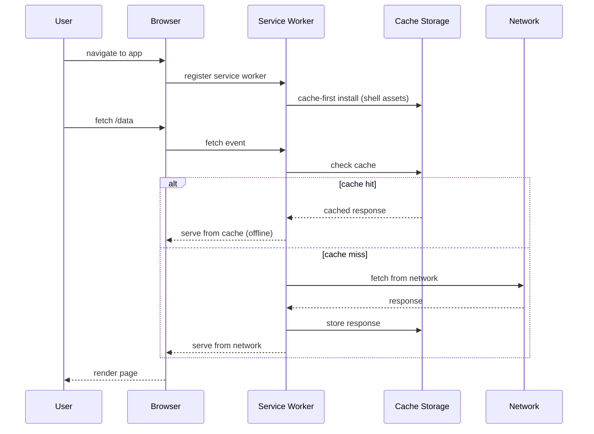

## In simple terms

A website becomes a Progressive Web App when it adds two things: a **service worker** (a JavaScript background process that intercepts network requests and caches responses, enabling offline access) and a **web manifest** (a JSON file describing the app's name, icon, and display mode). Users can install the PWA to their home screen — it gets its own icon, launches without browser chrome, and works offline. No App Store required; the install prompt comes from the browser itself.

## The Visual Map



## More detail

**Service worker** — a JavaScript file that runs as a separate background thread from the page. The browser installs it once and it persists across page visits. Key capabilities:

- **Network proxy** — intercepts every `fetch()` from the page; can serve from cache, fetch fresh, or blend both.
- **Caching strategies:**
  - *Cache-first* — serve from cache, fall back to network. Best for offline-first apps.
  - *Network-first* — try network, fall back to cache. Best for always-fresh data.
  - *Stale-while-revalidate* — serve cache immediately, update cache in background. Best UX for non-critical freshness.
- **Background sync** — defer actions (form submissions, analytics events) until connectivity returns.
- **Push notifications** — receive server-push messages even when the app is not open.

**Web App Manifest** — a JSON file (`manifest.json`) linked from `<head>` that describes the app to the browser. Controls install prompt appearance, launch icon, display mode, and theme colour.

**Installation by platform:**

| Platform | Trigger | Limitations |
|---|---|---|
| Android (Chrome) | Auto-prompt after repeat visits | Near-full PWA support |
| iOS (Safari) | Manual "Add to Home Screen" from share sheet | No push notifications before iOS 16.4; limited background sync |
| Desktop (Chrome, Edge) | Install icon in address bar | Full support; appears in taskbar/dock |

**Project Fugu** — Google's ongoing effort to close the web-native gap: File System Access API, Web NFC, Bluetooth, USB, Serial, Contact Picker, Web Share, WebCodecs, and more. Each API requires explicit user permission.

PWAs remove the App Store as a gatekeeper. A developer can ship an "app" instantly — no Apple 30% cut, no review delay, no account requirement. For developing-world markets with limited storage and expensive data, PWAs are transformative: Twitter Lite and Pinterest saw 65% and 44% engagement increases respectively after switching from full native apps.

## Under the Hood

A complete service worker implementing cache-first for the app shell and network-first for API calls:

```javascript
// sw.js — service worker (runs in its own thread, no DOM access)
const CACHE_VERSION = 'v2';
const APP_SHELL = ['/', '/app.css', '/app.js', '/offline.html'];

// Install: pre-cache the app shell so the app loads offline
self.addEventListener('install', (event) => {
  event.waitUntil(
    caches.open(CACHE_VERSION).then(cache => cache.addAll(APP_SHELL))
  );
  self.skipWaiting();   // activate immediately, don't wait for old SW to die
});

// Activate: delete old cache versions
self.addEventListener('activate', (event) => {
  event.waitUntil(
    caches.keys().then(keys =>
      Promise.all(keys.filter(k => k !== CACHE_VERSION).map(k => caches.delete(k)))
    )
  );
  self.clients.claim();  // take control of existing pages immediately
});

// Fetch: route requests by pattern
self.addEventListener('fetch', (event) => {
  const { request } = event;
  const url = new URL(request.url);

  if (url.pathname.startsWith('/api/')) {
    // Network-first for API calls — fresh data preferred
    event.respondWith(
      fetch(request)
        .then(res => {
          const clone = res.clone();
          caches.open(CACHE_VERSION).then(c => c.put(request, clone));
          return res;
        })
        .catch(() => caches.match(request))   // offline: serve stale API response
    );
  } else {
    // Cache-first for static assets
    event.respondWith(
      caches.match(request).then(cached => cached || fetch(request))
    );
  }
});
```

The web manifest that pairs with this service worker:

```json
{
  "name": "My App",
  "short_name": "App",
  "start_url": "/",
  "display": "standalone",
  "background_color": "#ffffff",
  "theme_color": "#2196F3",
  "icons": [
    { "src": "/icon-192.png", "sizes": "192x192", "type": "image/png" },
    { "src": "/icon-512.png", "sizes": "512x512", "type": "image/png", "purpose": "maskable" }
  ]
}
```

## Engineering Trade-offs

**PWA vs. native app: capability vs. reach**
PWAs require zero install friction — a URL is enough. Native apps sit behind a store, a download, and permissions. But native apps have full platform API access (health data, ARKit, deep Bluetooth), store discoverability, and in-app purchase infrastructure. For most content, productivity, and social apps the PWA trade-off is favourable; for games, AR, and hardware-intensive apps, native still wins.

**Cache-first vs. network-first strategy**
Cache-first maximises offline capability and perceived speed (instant response from local cache) but risks serving stale data. Network-first always returns fresh data but degrades to stale only on failure — a poor UX during slow (but not absent) connectivity. Stale-while-revalidate is usually the right default: serve cached content immediately (fast), update in the background (fresh next visit).

**Service worker update lifecycle**
A new service worker version waits until all tabs using the old version are closed before activating — by default. `skipWaiting()` + `clients.claim()` force immediate takeover, but can cause inconsistency if old page code and new cache assets are mixed. The update lifecycle is the most common source of PWA bugs.

**iOS Safari limitations**
Apple's WebKit engine on iOS has historically lagged Chrome in PWA capability: push notifications arrived in iOS 16.4 (2023), background sync remains limited, and Web Bluetooth / NFC are unavailable. Apps targeting iOS users heavily must account for this reduced surface.

**Storage limits and eviction**
Cache Storage is subject to the browser's storage quota (typically 5–50% of available disk space). Under storage pressure, the browser can evict the cache without warning (LRU eviction). Persistent storage (`navigator.storage.persist()`) requests protection from eviction but requires user permission on some browsers.

## Real-world examples

- **Twitter Lite** — PWA replaced the 23 MB native Android app with a 500 KB web app; 30% faster loading, 65% more pages per session, 20% lower bounce rate.
- **Starbucks** — PWA is 99.84% smaller than the iOS app (233 KB vs. 148 MB); online orders doubled after launch.
- **Pinterest** — PWA improved engagement by 44% and reduced data usage by 44% vs. the mobile web site.
- **Google Maps Go** — a PWA for low-end Android devices and slow connections where the full app (80 MB+) is impractical.
- **Microsoft 365, VS Code for Web** — desktop-class productivity tools delivered as PWAs; VS Code for the Web runs entirely in the browser via WebAssembly.

## Common misconceptions

- **"PWAs are only for mobile."** Desktop PWAs work on Windows, macOS, and ChromeOS via Chrome and Edge. Microsoft 365, Google Docs, and VS Code for the Web are installable desktop PWAs with offline capability.
- **"PWAs can't do everything native apps can."** For the majority of app use cases — content, productivity, social, e-commerce — PWAs are sufficient. The remaining gaps (heavy gaming, AR/VR, deep hardware access) are real but narrow. The more relevant question is whether your app's specific requirements fall inside or outside the gap.

## Try it yourself

Simulate service worker caching strategies to see how they differ when the network goes down:

```bash
python3 - << 'EOF'
import time

def run_strategy(name, strategy_fn, requests):
    cache = {}
    online = [True, True, False, False, True]   # goes offline at request 3-4
    print(f"\n--- {name} ---")
    for i, url in enumerate(requests):
        is_online = online[i % len(online)]
        result = strategy_fn(url, cache, is_online)
        net = "online" if is_online else "OFFLINE"
        print(f"  [{net}] {url:<12} -> {result}")

def cache_first(url, cache, online):
    if url in cache:
        return f"cache: {cache[url]}"
    if online:
        cache[url] = f"v1:{url}"
        return f"net+cache: {cache[url]}"
    return "ERROR: not cached, no network"

def network_first(url, cache, online):
    if online:
        cache[url] = f"v1:{url}"
        return f"net: {cache[url]}"
    if url in cache:
        return f"stale: {cache[url]}"
    return "ERROR: no network, no cache"

def stale_while_revalidate(url, cache, online):
    if url in cache:
        if online:
            cache[url] = f"v2:{url}"   # update in background
        return f"cache: {cache[url]} (bg-refresh={online})"
    if online:
        cache[url] = f"v1:{url}"
        return f"net+cache: {cache[url]}"
    return "ERROR: not cached, no network"

urls = ["/home", "/api/news", "/home", "/api/news", "/home"]
run_strategy("cache-first", cache_first, urls)
run_strategy("network-first", network_first, urls)
run_strategy("stale-while-revalidate", stale_while_revalidate, urls)
EOF
```

## Learn next

- [Electron](/t/electron) — the alternative for desktop-first apps that need deeper OS integration; understanding both clarifies when to use a browser-installed PWA vs. a bundled Chromium app.
- [WebAssembly](/t/webassembly) — high-performance code that runs inside PWAs; the technology behind VS Code for the Web's language servers and Figma's renderer.
- [Web Browser](/t/web-browser) — the runtime PWAs live in; the browser's caching model, fetch API, and push notification infrastructure are the PWA's foundation.
