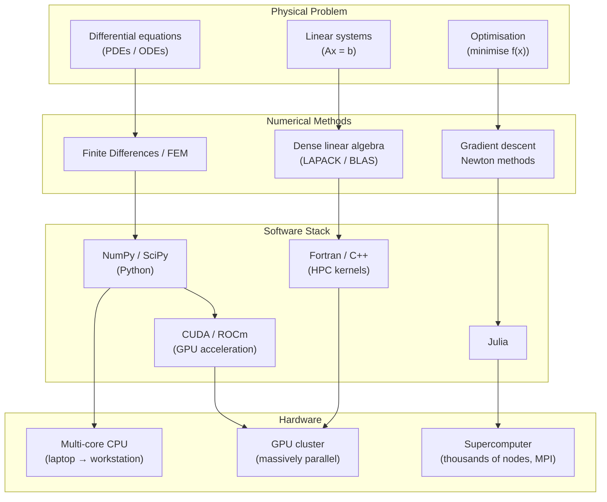

## In simple terms

**Scientific computing** is using computers as instruments of science — to simulate things too big, too small, too fast, too slow, or too dangerous to experiment on directly. You can't put the whole atmosphere in a lab, so we *simulate* it to forecast weather. You can't watch a galaxy form or a protein fold in real time, so we compute it.

By turning the equations of physics, chemistry, and biology into numbers a computer can crunch, scientific computing has become a third pillar of science alongside theory and experiment.

## The Visual Map



## More detail

The work centres on **numerical methods** — algorithms that approximate answers to mathematical problems (differential equations, linear algebra, optimisation) that have no neat closed-form solution. Continuous reality is broken into discrete pieces (a grid, a mesh, time steps) and solved step by step.

**The field's toolkit:**

| Layer | Options | Notes |
|---|---|---|
| Languages | Python, Julia, MATLAB, R, Fortran, C++ | Python for interactivity; Fortran/C++ for raw throughput; Julia attempts both |
| Key libraries | NumPy, SciPy, LAPACK/BLAS, PETSc, OpenMPI | BLAS Level 3 routines are the inner loop of most scientific computing |
| Visualisation | Matplotlib, ParaView, VisIt | ParaView handles terabyte-scale simulation output |
| Hardware | Laptop → GPU workstation → HPC cluster → supercomputer | Top-500 machines run at exaflop scale (10¹⁸ FLOP/s) |

**Concerns unique to the field:**

- **Numerical precision** — IEEE 754 floating-point arithmetic accumulates rounding error. A naive sum of one million floats loses 3–4 significant digits; Kahan compensated summation recovers them.
- **Stability** — some numerical algorithms amplify error exponentially. An unstable finite-difference scheme for a PDE will diverge even on a perfect computer; the Courant–Friedrichs–Lewy (CFL) condition is the classic stability constraint.
- **Reproducibility** — floating-point results can differ across hardware, compilers, and thread schedules (non-associativity of parallel reductions). Reproducibility is increasingly treated as a first-class requirement.
- **Parallelism** — domain decomposition, MPI (message-passing between nodes), OpenMP (threads within a node), and GPU kernels (CUDA/ROCm) are all used, often simultaneously.

Scientific computing heavily overlaps with machine learning — both are large-scale numerical optimisation on GPUs — and it's where many GPU and parallel-computing techniques were first pushed to their limits.

Simulation has become indispensable across science and engineering: weather and climate forecasting, drug discovery, aircraft design, astrophysics, genomics, and financial modelling all depend on it. It's a major driver of demand for the most powerful computers ever built.

## Under the Hood

NumPy's vectorised operations call BLAS (Basic Linear Algebra Subprograms) compiled with SIMD and multi-threading — the same routines running on supercomputers:

```python
#!/usr/bin/env python3
"""Demonstrates why vectorised NumPy outperforms Python loops for numerics."""
import time

try:
    import numpy as np
except ImportError:
    print("NumPy not available — showing pure Python only.")
    np = None

N = 1_000_000

# --- Pure Python loop ---
data = list(range(N))
t0 = time.perf_counter()
total = 0.0
for x in data:
    total += x * x
python_ms = (time.perf_counter() - t0) * 1000
print(f"Python loop:    {python_ms:7.1f} ms  (result={total:.2e})")

# --- NumPy vectorised (calls BLAS DDOT / SIMD internally) ---
if np is not None:
    arr = np.arange(N, dtype=np.float64)
    t0 = time.perf_counter()
    result = np.dot(arr, arr)          # single BLAS call
    numpy_ms = (time.perf_counter() - t0) * 1000
    print(f"NumPy vectorised:{numpy_ms:6.1f} ms  (result={result:.2e})")
    speedup = python_ms / max(numpy_ms, 0.001)
    print(f"Speedup: {speedup:.0f}x")

# --- Numerical precision: catastrophic cancellation ---
a, b     = 1.0 + 1e-15, 1.0
diff     = a - b          # should be 1e-15; gets 11% relative error
print(f"\nCatastrophic cancellation: (1.0+1e-15) - 1.0 = {diff!r}")
print(f"  expected 1e-15; relative error = {abs(diff - 1e-15)/1e-15:.1%}")

# Kahan vs naive sum of many small values
vals = [1e-8] * 10_000
naive_s = sum(vals)                    # Python's sum has some compensation but drifts
kahan_s, c = 0.0, 0.0
for v in vals:
    y = v - c; t = kahan_s + y; c = (t - kahan_s) - y; kahan_s = t
print(f"  naive sum(10000 × 1e-8) = {naive_s:.20f}")
print(f"  kahan sum              = {kahan_s:.20f}  (exact: 0.0001)")
```

## Engineering Trade-offs

**Accuracy vs. speed**
Higher-order numerical methods (more terms in a Taylor expansion, finer mesh) give more accurate results but cost more compute. Climate models run at ~10 km grid resolution because the atmosphere is 510 million km² — doubling resolution increases compute by ~8× (2D area × smaller timestep from CFL). Finding the coarsest grid that gives acceptable error is a core skill.

**Float64 vs. Float32 vs. Float16**
Double precision (float64) halves the accumulated rounding error vs. single precision. But float32 is 2× faster on most CPUs and 2–4× on GPUs, and float16 (common in ML training) is 2× faster still — at the cost of a dynamic range of only 3 orders of magnitude (catastrophic for scientific work). Mixed-precision methods compute most work in float32, then accumulate in float64.

**Shared-memory parallelism (OpenMP) vs. distributed (MPI)**
OpenMP adds `#pragma omp parallel for` to a loop — trivial to add, limited to one machine's cores. MPI sends data between nodes over the network — scales to millions of cores but requires explicitly partitioning and communicating the problem domain. Most HPC codes use both: MPI between nodes, OpenMP within.

**GPU throughput vs. CPU latency**
A GPU has thousands of cores optimised for throughput (many operations in flight simultaneously). A CPU core is optimised for latency (one operation as fast as possible). Dense matrix operations are GPU-friendly; sparse, branchy algorithms with data-dependent control flow favour CPUs. Choosing the wrong hardware for the algorithm can make things slower, not faster.

**Reproducibility vs. performance**
Non-associative floating-point means `(a + b) + c ≠ a + (b + c)` when values differ in magnitude. Multi-threaded reductions produce non-deterministic results unless reductions are ordered — which kills parallelism. Most HPC codes accept non-reproducibility for performance; reproducibility-critical work (regulatory, clinical) uses ordered reductions and fixed seeds.

## Real-world examples

- **ECMWF (European Centre for Medium-Range Weather Forecasts)** — global weather model running at 9 km resolution on a Cray supercomputer; tens of petaFLOP/s, produces the world's most accurate 10-day forecast.
- **AlphaFold2 (2021)** — used GPU-accelerated deep learning + structural biology numerical methods to predict protein structures, solving a 50-year grand challenge and depositing 200+ million structures in the public database.
- **Crash simulation** — Volkswagen, Toyota, and BMW run finite-element crash simulations (LS-DYNA) on clusters of thousands of CPU cores to reduce physical crash test requirements.
- **LIGO (gravitational wave detection)** — signal processing uses matched-filter algorithms running in near-real-time on GPU clusters to detect gravitational wave signatures buried in noise.
- **Monte Carlo drug screening** — pharmaceutical companies simulate billions of ligand–receptor binding poses to rank drug candidates before synthesis, reducing wet-lab cost by orders of magnitude.

## Common misconceptions

- **"Scientific computing is just fast math on big computers."** The hard parts are the *methods* — choosing numerical algorithms that are accurate, stable, and don't accumulate catastrophic error. A naïve algorithm run on the fastest computer in the world may give wrong answers; a well-chosen algorithm on a laptop gives correct ones.
- **"A simulation is the same as reality."** Models are approximations with assumptions and discretisation error. Simulation outputs must be validated against physical measurements and understood as statistical ensembles, not ground truth.

## Try it yourself

See the cost of floating-point error and the speedup of vectorised numerics:

```bash
python3 - << 'EOF'
import time

N = 500_000

# Floating-point precision: subtract nearly-equal numbers to expose error
a = 1.0 + 1e-15
b = 1.0
naive_diff = a - b
expected   = 1e-15
rel_err    = abs(naive_diff - expected) / expected
print("Catastrophic cancellation demo:")
print(f"  (1.0 + 1e-15) - 1.0 = {naive_diff!r}")
print(f"  expected              = {expected!r}")
print(f"  relative error        = {rel_err:.1%}")

# Kahan vs naive sum of many small values
N_KAHAN = 10_000
vals = [1e-8] * N_KAHAN
naive_sum = 0.0
for v in vals: naive_sum += v
kahan, c = 0.0, 0.0
for v in vals:
    y = v - c; t = kahan + y; c = (t - kahan) - y; kahan = t
exact = N_KAHAN * 1e-8
print(f"\nSum of {N_KAHAN} x 1e-8 (exact={exact}):")
print(f"  naive:  {naive_sum:.20f}")
print(f"  kahan:  {kahan:.20f}")

# Python loop vs list-comprehension timing
data = list(range(N))
t0 = time.perf_counter()
s = 0.0
for x in data: s += x * x
loop_ms = (time.perf_counter() - t0) * 1000

t0 = time.perf_counter()
s2 = sum(x * x for x in data)
gen_ms = (time.perf_counter() - t0) * 1000

print(f"\nSum of squares for {N:,} elements:")
print(f"  for-loop:      {loop_ms:.1f} ms")
print(f"  generator:     {gen_ms:.1f} ms")
print("  (numpy.dot would be 10-100x faster still — calls BLAS SIMD internally)")
EOF
```

## Learn next

- [Floating-Point](/t/floating-point) — the IEEE 754 representation that underlies all scientific arithmetic; understanding it is essential for diagnosing precision and stability problems.
- [GPU](/t/gpu) — the hardware that powers modern scientific and ML workloads; the massive parallelism of GPU cores maps directly onto the dense linear algebra scientific computing requires.
- [SIMD](/t/simd) — the CPU instruction set that makes NumPy's vectorised operations fast; BLAS routines are hand-optimised SIMD assembly under the hood.
- [Spreadsheet](/t/spreadsheet) — the humbler everyday cousin for tabular calculation; understanding both clarifies where scripted numerical methods start to win.
