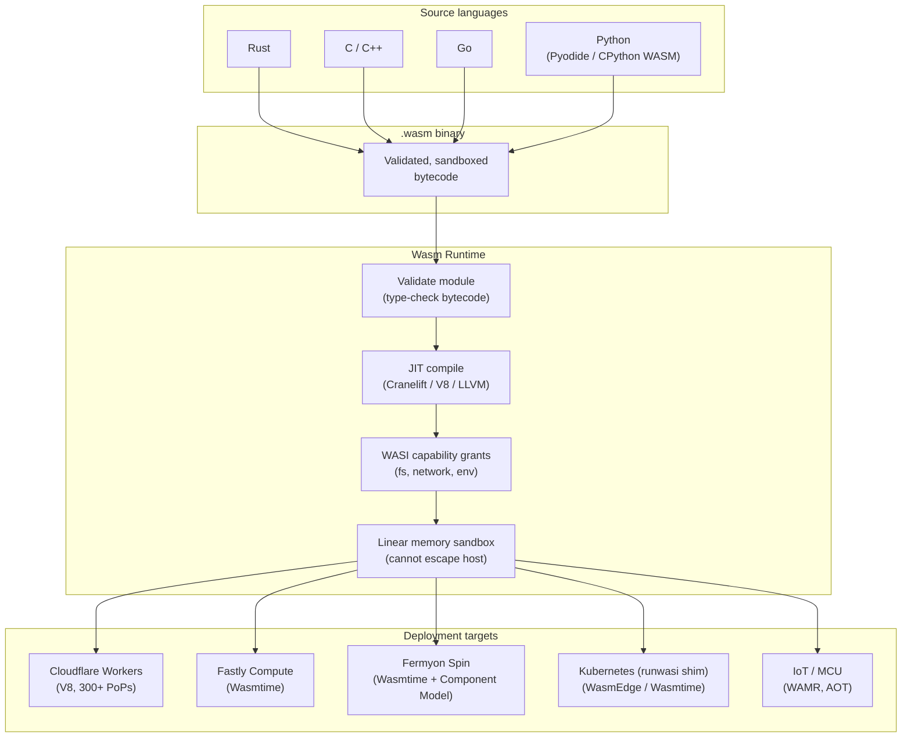

## In simple terms

WebAssembly was designed for the browser, but its properties — sandboxed execution, near-native speed, portability across languages, and microsecond startup — make it equally valuable on the server. A Wasm runtime runs `.wasm` binaries on a server or edge node: a lighter, faster alternative to containers for short-lived or sandboxed workloads.

Cloudflare Workers runs 45 million requests/second using V8's Wasm engine; Fermyon Spin runs microservices as Wasm components. Startup advantage over containers: ~1 ms vs. ~100 ms.

## The Visual Map



## More detail

**Why server-side Wasm:**

| Property | Wasm runtime | Container (OCI) |
|---|---|---|
| Cold-start latency | ~1 ms | ~100 ms – 1 s |
| Memory footprint | ~1 MB | ~50 MB+ |
| Security boundary | Language-runtime sandbox | Kernel namespace (shared kernel) |
| Language support | Any language with Wasm target | Any language (native binary) |
| OS syscall access | Capability-gated via WASI | Full (within namespace) |

**Major runtimes:**

- **Wasmtime** (Bytecode Alliance) — production-grade; built on the Cranelift JIT compiler; implements WASI Preview 1 and Preview 2 (Component Model); used by Fastly Compute@Edge; embeddable in Rust via `cargo add wasmtime`.
- **Wasmer** — multi-backend (Cranelift, LLVM, Singlepass); supports WASIX (a POSIX-compatible superset of WASI that runs musl-based Linux binaries); provides a registry for sharing Wasm packages.
- **WasmEdge** — optimised for cloud-native and edge; supports WASI Socket for network programming; used in CNCF projects, containerd plugins, and dapr.
- **WAMR** (WebAssembly Micro Runtime) — 100 KB – 1 MB footprint; designed for microcontrollers and IoT (ESP32, Arduino-class); supports AOT compilation for resource-constrained environments.

**WASI (WebAssembly System Interface):** the capability-based API layer between Wasm modules and the host OS. A Wasm module has *no* access to files, network, or environment by default. The host explicitly grants capabilities: `--dir .` grants directory access; `--env KEY=VALUE` grants an environment variable. This is a stronger isolation model than Docker (`docker run` with root has access to the host kernel).

**Component Model:** the Wasm Component Model (WIT — Wasm Interface Types) enables composing Wasm modules with typed interfaces — a Python component calling a Rust component with no FFI overhead. This enables polyglot microservice composition without a shared language or ABI.

**Platforms built on Wasm runtimes:**
- **Cloudflare Workers** — V8's Wasm engine; 300+ global PoPs; 1 ms startup; 128 MB per worker.
- **Fastly Compute@Edge** — Wasmtime; Rust, Go, C/C++, AssemblyScript.
- **Fermyon Spin** — open-source microservices on Wasmtime; HTTP triggers, KV, SQLite, Redis; Component Model native.
- **containerd Wasm shims (runwasi)** — run Wasm as Kubernetes pods; the pod image is a `.wasm` file rather than a container image.

Server-side Wasm runtimes are emerging as a lighter alternative to containers for serverless functions, plugin systems, and edge compute. For plugin architectures (Envoy Wasm filters, OPA policies, VS Code extensions), Wasm provides sandboxed extensibility without trusting plugin code. Engineers building serverless platforms or plugin systems should understand Wasm runtimes as a first-class option.

## Under the Hood

Running a Wasm module in Wasmtime via its C API (the pattern used by Fastly and Spin to embed Wasm execution):

```rust
// Embed Wasmtime in a Rust host — the pattern Fastly and Fermyon Spin use
// cargo add wasmtime

use wasmtime::*;

fn main() -> anyhow::Result<()> {
    // 1. Create an engine with JIT compilation enabled
    let engine = Engine::default();
    let mut store = Store::new(&engine, ());

    // 2. Compile a simple Wasm module (WAT text format for readability)
    let module = Module::new(&engine, r#"
        (module
          (func $add (export "add") (param i32 i32) (result i32)
            local.get 0
            local.get 1
            i32.add)
        )
    "#)?;

    // 3. Instantiate — Wasm module cannot access host until host provides imports
    let instance = Instance::new(&mut store, &module, &[])?;

    // 4. Call the exported function
    let add = instance.get_typed_func::<(i32, i32), i32>(&mut store, "add")?;
    let result = add.call(&mut store, (3, 5))?;
    println!("add(3, 5) = {result}");   // 8

    Ok(())
}
```

The same isolation model applies at the OS level via WASI — here simulated in Python:

```python
#!/usr/bin/env python3
"""Simulates WASI capability-based access control."""

class WasiCapabilities:
    """Represents the explicit grants a host gives to a Wasm module."""
    def __init__(self, allowed_dirs=None, allowed_env=None):
        self.dirs = set(allowed_dirs or [])
        self.env  = dict(allowed_env or {})

    def open_file(self, path):
        import os
        parent = os.path.dirname(os.path.abspath(path))
        if not any(parent.startswith(d) for d in self.dirs):
            raise PermissionError(f"WASI: {path!r} not in granted dirs {self.dirs}")
        return f"<file handle: {path}>"

    def getenv(self, key):
        if key not in self.env:
            raise KeyError(f"WASI: env var {key!r} not granted")
        return self.env[key]

# Host grants only /tmp and one env variable
caps = WasiCapabilities(allowed_dirs=["/tmp"], allowed_env={"APP_ENV": "prod"})

print("Wasm module requests (via WASI):")
try:
    print(f"  open /tmp/data.txt -> {caps.open_file('/tmp/data.txt')}")
except PermissionError as e: print(f"  {e}")

try:
    print(f"  open /etc/passwd   -> {caps.open_file('/etc/passwd')}")
except PermissionError as e: print(f"  BLOCKED: {e}")

print(f"  getenv APP_ENV     -> {caps.getenv('APP_ENV')}")
try:
    caps.getenv("AWS_SECRET_KEY")
except KeyError as e: print(f"  BLOCKED: {e}")
```

## Engineering Trade-offs

**Wasm modules vs. containers for isolation**
Container isolation (Linux namespaces + cgroups) shares the host kernel — a kernel exploit in one container can compromise the host. Wasm's linear memory sandbox is enforced at the language runtime level: the module can only access its own heap, and host capabilities are explicitly granted via WASI. The tradeoff: Wasm's WASI API surface is much smaller than a container's full POSIX environment, limiting what unmodified software can run.

**JIT vs. AOT compilation in runtimes**
JIT (Wasmtime/Cranelift, V8) compiles Wasm to native code at load time — fast steady-state, but adds ~1 ms startup. AOT (pre-compiled to native binary, used by WAMR and Wasmtime's `wasmtime compile`) eliminates runtime compilation entirely — critical for IoT and constrained environments. The trade: AOT binaries are platform-specific; JIT binaries remain portable `.wasm` files.

**WASI capabilities vs. full POSIX**
WASI's capability model is secure but limited. WASI Preview 1 has no networking; WASI Preview 2 (Socket) adds TCP/UDP. Wasmer's WASIX extends WASI with full POSIX compatibility (threads, sockets, signals) at the cost of portability — WASIX binaries may not run on all WASI runtimes. The tension between capability security and developer convenience is the defining design challenge of server-side Wasm.

**Component Model composition vs. monolithic Wasm**
The Component Model allows composing Wasm modules with typed interfaces — safe, zero-copy across language boundaries. This is powerful for plugin systems but requires tooling support (wasm-tools, jco) and a shift in how developers think about module boundaries. Monolithic Wasm (one big module) is simpler to produce and deploy today.

**Wasm runtimes vs. containers for long-running services**
Wasm wins on startup, footprint, and sandboxing for short-lived workloads. Containers win for long-running services: full POSIX, mature orchestration (Kubernetes, Docker Compose), rich ecosystem of base images, and support for arbitrary OS binaries. Most production deployments use containers for services and Wasm for functions, plugins, and edge compute.

## Real-world examples

- **Fastly Compute@Edge** — all edge functions run in Wasmtime; serves major CDN customers including GitHub, Reddit, and The New York Times with ~1 ms cold start.
- **Cloudflare Workers** — V8's Wasm engine processes 45+ million requests/second; used by Shopify, Discord, and Cloudflare's own products.
- **Envoy proxy Wasm filters** — extend Envoy (the service mesh proxy used by Istio) with custom logic in C++, Rust, or AssemblyScript compiled to Wasm; the filter runs sandboxed inside the Envoy process.
- **Open Policy Agent (OPA)** — compiles Rego policies to Wasm for evaluation in any host language; used for zero-trust authorization in Kubernetes, API gateways, and CI pipelines.
- **VS Code extensions (web)** — VS Code for the Web runs extension host via Wasm, letting TypeScript/JavaScript extensions run in the browser sandbox; language servers (e.g., clangd, rust-analyzer) are compiled to Wasm.

## Common misconceptions

- **"Wasm runtimes are only for Rust programs."** Any language with a Wasm compilation target — C, C++, Go, Python, Ruby, Swift, Kotlin — runs in a Wasm runtime. Rust is popular for Wasm because it produces small, efficient binaries with no GC runtime, but it is not required.
- **"Wasm runtimes replace containers."** They complement containers for specific use cases: short-lived functions, plugins, and edge compute. Containers are still preferred for long-running services with complex OS dependencies, persistent storage, and mature orchestration requirements.

## Try it yourself

Simulate the WASI capability-based access model that all Wasm runtimes enforce:

```bash
python3 - << 'EOF'
import os

class WasiSandbox:
    def __init__(self, allowed_dirs, allowed_env):
        self.dirs = [os.path.abspath(d) for d in allowed_dirs]
        self.env  = dict(allowed_env)

    def open(self, path):
        abs_path = os.path.abspath(path)
        if any(abs_path.startswith(d) for d in self.dirs):
            return f"OK: handle to {abs_path}"
        return f"DENIED: {abs_path} not in {self.dirs}"

    def getenv(self, key):
        return f"OK: {self.env[key]}" if key in self.env else f"DENIED: {key} not granted"

# Host grants /tmp + one env variable (mimics `wasmtime run --dir /tmp --env X=1`)
sandbox = WasiSandbox(allowed_dirs=["/tmp"], allowed_env={"X": "1"})

requests = [
    ("open", "/tmp/output.txt"),
    ("open", "/etc/passwd"),
    ("open", "/home/user/secret.key"),
    ("getenv", "X"),
    ("getenv", "AWS_SECRET_KEY"),
]

print("WASI capability check (host-controlled):\n")
for op, arg in requests:
    if op == "open":
        result = sandbox.open(arg)
    else:
        result = sandbox.getenv(arg)
    print(f"  wasm.{op}({arg!r})\n    -> {result}\n")
EOF
```

## Learn next

- [WebAssembly](/t/webassembly) — the binary instruction format Wasm runtimes execute; understanding the Wasm type system and memory model is prerequisite to understanding how runtimes enforce the sandbox.
- [Container](/t/container) — the alternative isolation primitive for server-side compute; understanding both clarifies when to use Wasm modules vs. OCI containers.
- [Edge Computing](/t/edge-computing) — Cloudflare Workers and Fastly Compute are the primary production deployment targets for Wasm runtimes; the edge use case is where Wasm's startup-time advantage matters most.
