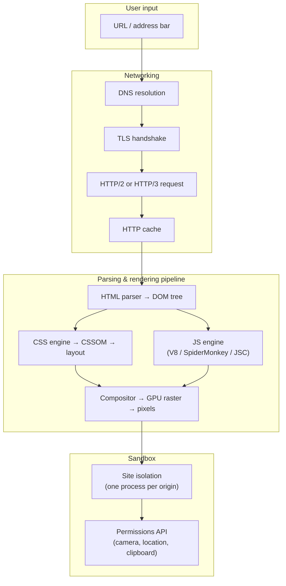

## In simple terms

A web browser is the program you use to look at websites. You type a URL, the browser fetches the page over the network, and turns the text it receives into the colourful, clickable thing on your screen.

Under the hood that sentence is hiding one of the most complex pieces of consumer software ever built — a full application platform that runs untrusted code from millions of strangers safely on your machine.

## The Visual Map



## More detail

A modern browser is one of the most complex pieces of consumer software in the world. Inside, it has at least:

- A **networking stack** that speaks HTTP/1.1, HTTP/2, HTTP/3 (QUIC), TLS 1.3, DNS-over-HTTPS, WebSockets, WebTransport, and more.
- An **HTML parser** that builds a DOM tree from the byte stream, tolerating malformed markup the spec requires it to accept.
- A **CSS engine** that resolves the cascade, computes the box model, runs layout (flow, flexbox, grid), and builds the render tree.
- A **JavaScript engine** — V8 in Chrome/Edge/Brave/Opera/Arc, SpiderMonkey in Firefox, JavaScriptCore in Safari — that JIT-compiles hot code to native machine instructions.
- A **rendering pipeline** that tiles the page into layers, rasterizes them (often on the GPU), and composites them into a final frame — targeting 60 or 120 fps.
- A **sandbox** that isolates each site from your OS and from other sites: site isolation runs each origin in a separate OS process; a compromised renderer cannot read another tab's memory.

The dominant rendering engines are **Blink** (Chrome, Edge, Brave, Opera, Arc — all derived from WebKit's fork), **WebKit** (Safari), and **Gecko** (Firefox). Engine monoculture is a real concern: Blink's dominance means one team's decisions shape the web for billions of users.

The browser is the most important application platform of the last twenty years. It is how billions of people use software every day. It is also, in effect, an operating system in its own right: it sandboxes programs (web apps), manages permissions, talks to hardware (camera, USB, Bluetooth via Web APIs), and runs continuously across sessions.

## Under the Hood

Chrome's V8 JavaScript engine compiles source text to native machine code in multiple tiers — starting fast, then specialising hot code:

```javascript
// This innocent function triggers all three JIT tiers if called enough:
function add(a, b) { return a + b; }

// Tier 1 (Ignition interpreter): runs immediately as bytecode
add(1, 2);          // first call — interpreted

// Tier 2 (SparkPlug baseline JIT): after a few hundred calls
// V8 compiles to unoptimised machine code; ~10× faster than bytecode

// Tier 3 (Maglev / TurboFan optimising JIT): after thousands of calls
// V8 sees that a and b are always Numbers, speculates on the type,
// and emits tight machine code equivalent to:  return a + b  (one instruction)

// Deoptimisation: if a string is passed, the assumption breaks
add("hello", " world");   // bailout → back to bytecode for this call
```

The full browser rendering pipeline that runs every 16 ms at 60 fps:

```
HTML bytes  → tokeniser → parser → DOM tree
CSS bytes   → tokeniser → parser → CSSOM
                                    ↓
                         Style resolution (cascade)
                                    ↓
                              Layout tree (box model, flexbox, grid)
                                    ↓
                              Paint (draw commands per layer)
                                    ↓
                              GPU rasterise → composite → frame buffer → display
```

Long-running JavaScript blocks the **main thread**, which owns both the JS engine and the layout/paint stages. A 200 ms script stall freezes the page visibly — the root cause of "janky" UIs.

## Engineering Trade-offs

**Single-process vs. multi-process architecture**
Early browsers (IE 6, Firefox 3) ran all tabs in one process. One crashed tab crashed everything. Chrome introduced per-tab processes (2008); today's model is per-site-origin (site isolation), which also closes Spectre/Meltdown-style side-channel attacks. The cost: each process has base memory overhead (~50–100 MB), which is why Chrome is notorious for RAM use.

**JIT compilation depth vs. warmup time**
The multi-tier JIT (interpreter → baseline → optimising) lets the engine start running code immediately without waiting for full optimisation. Cold startup is fast; throughput on hot loops approaches native speed. The trade-off is complexity: deoptimisation paths ("bailouts") are subtle bugs waiting to happen and are the source of many V8 CVEs.

**Layout engine performance vs. CSS expressiveness**
Grid, subgrid, container queries, and logical properties are powerful but expensive to lay out. A deep DOM with dynamic CSS causes style recalculation and forced synchronous layouts ("layout thrash"), which blocks the rendering pipeline. Browsers optimise common patterns aggressively; uncommon combinations invalidate those fast paths.

**Sandbox security vs. capability**
Running untrusted code safely requires restricting what it can do. WebAssembly runs in a linear-memory sandbox. APIs for USB, Bluetooth, and file system access exist (`navigator.usb`, File System Access API) but require explicit user permission gestures. The tension between capability (approaching native) and safety (no escape) is the defining constraint of web platform design.

**Rendering fidelity vs. battery life**
High frame rates and GPU compositing look great but drain laptop and phone batteries. Browsers throttle background tabs, reduce animation frame rates when the device is on battery, and defer non-visible work. Progressive enhancement — doing less when the user has less — is how good web apps respect this.

## Real-world examples

- **Chrome** (Blink + V8) — ~65% desktop market share; ships on Android as the default browser; its engine is embedded in millions of apps via Electron and Chromium-based wrappers.
- **Safari** (WebKit + JavaScriptCore) — the only engine permitted on iOS (App Store policy); its engineering decisions therefore govern what web APIs a billion iPhones can use.
- **Firefox** (Gecko + SpiderMonkey) — the only major non-Blink, non-WebKit engine left; Servo components (Stylo CSS engine) are gradually being upstreamed.
- **Electron** — bundles Chromium + Node.js into a desktop app; VS Code, Slack, Figma's desktop client, Discord all run this way. A browser, in effect, ships as your app.
- **Chrome V8** — also powers Node.js and Deno server-side; the same JS engine is the runtime for cloud functions, CLI tools, and full-stack apps.

## Common misconceptions

- **"All browsers render the same."** Standards compliance has never been higher, but engine differences remain real, especially around new CSS features, Web API availability (Safari often lags), and performance characteristics. "Works in Chrome" is not "works in every browser."
- **"Incognito mode hides me from websites."** It hides traces from your local device — no history, no cookies persisted after the session. The site you visit, your ISP, your employer's network, and any third-party trackers embedded in the page can still see your activity.

## Try it yourself

Inspect what your browser sends and receives at the HTTP level using `curl`, which uses the same HTTP stack a browser does:

```bash
# Fetch a page's headers the way a browser does (follow redirects, show headers)
curl -sI --http2 https://example.com

# See the raw HTML a browser would parse (first 40 lines)
curl -s https://example.com | head -40

# Time the full browser-equivalent connection pipeline
curl -so /dev/null -w \
  "DNS: %{time_namelookup}s  TLS: %{time_appconnect}s  TTFB: %{time_starttransfer}s  Total: %{time_total}s\n" \
  https://example.com
```

## Learn next

- [DNS](/t/dns) — the first step every browser takes before opening a connection; understanding name resolution explains why "the site is up but I can't reach it" happens.
- [TLS](/t/tls) — the security layer that protects every HTTPS connection; the browser's padlock icon and certificate warnings are TLS surfaced to the user.
- [JavaScript Language](/t/javascript-language) — the language the browser's JS engine runs; knowing the language and knowing the browser's execution model are different things worth separating.
- [WebAssembly](/t/webassembly) — the binary instruction format browsers now run alongside JavaScript; understanding it shows how the browser platform is expanding beyond the JS monoculture.
- [Electron](/t/electron) — what happens when you bundle Chromium as a desktop app; the browser-as-platform taken to its logical conclusion.
