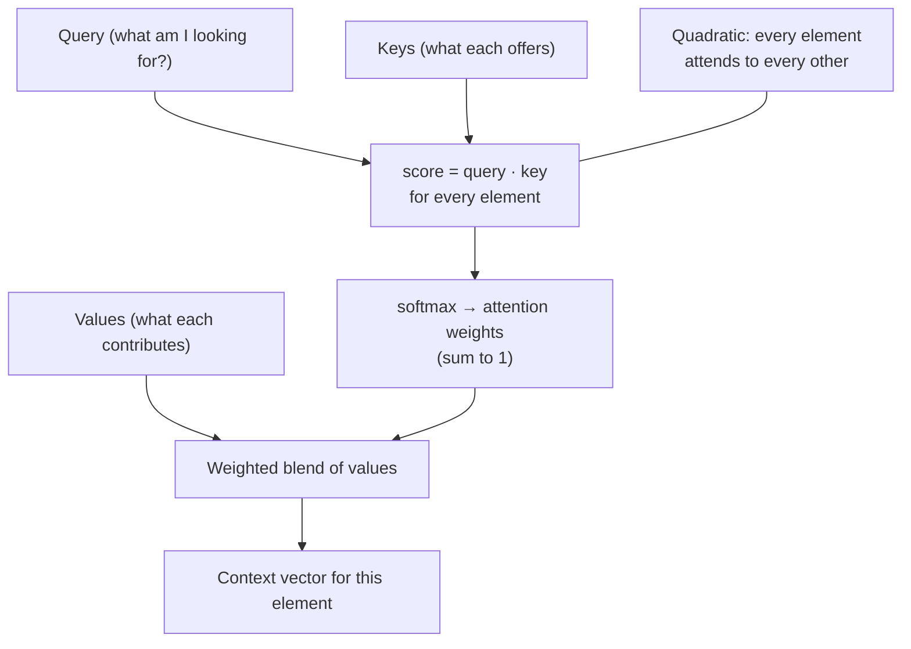

## In simple terms

**Attention** is the mechanism that lets a neural network *focus*. When processing a word in a sentence, the meaning often depends on other, possibly distant words — "it" refers to something mentioned earlier; a verb's subject might be ten words back. Attention lets the model, for each element it's processing, look across the whole input and decide **which other elements are relevant and how much**. Instead of cramming everything into a fixed summary, the model dynamically pulls in exactly the context it needs. This single idea is the engine inside the [transformer](/t/transformer) and therefore behind essentially every modern large language model.

## The Visual Map



## More detail

The most important form is **self-attention**, where a sequence attends to itself. Each element produces three vectors: a **query** (what am I looking for?), a **key** (what do I offer?), and a **value** (what do I contribute if matched?). For each element, the model compares its query against every element's key to get relevance scores, normalises them with **softmax** into weights, and produces a weighted blend of the values — relevant elements contribute more. Crucially, every position can attend to every other position **in parallel**, which is what lets transformers train so efficiently on GPUs, unlike older recurrent models that processed a sequence one step at a time.

Two refinements matter. **Multi-head attention** runs several attention operations in parallel, each free to focus on a different kind of relationship (syntax, coreference, topic). And **attention is quadratic** in sequence length — every element attends to every other — which is the main reason long context windows are computationally expensive and a major focus of efficiency research (FlashAttention, sparse and linear approximations). The 2017 paper that introduced the transformer was titled, fittingly, *"Attention Is All You Need."* By letting models capture long-range relationships directly and in parallel, attention solved the bottlenecks of earlier sequence models and made internet-scale training practical.

## Under the Hood

Attention is "softmax-weighted averaging of values." The clearest view is a *single* query attending over a set of keys/values: compute similarity, turn it into weights with softmax, and blend. Notice how a sharply-matching key dominates the result:

```python
import math
def softmax(xs):
    m = max(xs); e = [math.exp(x - m) for x in xs]; s = sum(e)
    return [v / s for v in e]
def dot(a, b): return sum(x*y for x, y in zip(a, b))

query  = [1, 0]                       # "looking for" the first feature
keys   = [[1, 0], [0.9, 0.1], [0, 1]]  # 3rd key is unrelated
values = [[100, 0], [80, 20], [0, 100]]

scores  = [dot(query, k) / math.sqrt(len(query)) for k in keys]
weights = softmax(scores)
context = [sum(weights[i]*values[i][c] for i in range(len(values))) for c in range(2)]

print("attention weights:", [round(w, 3) for w in weights])
print("blended context  :", [round(c, 1) for c in context])   # dominated by matching keys
```

The unrelated third key gets near-zero weight, so the output is mostly the values of the keys the query actually matched — "focus", implemented as arithmetic.

## Engineering Trade-offs

- **Expressiveness vs quadratic cost.** Letting every token see every other captures long-range structure but costs O(n²) time and memory in sequence length — the central bottleneck of long context.
- **Multi-head richness vs compute.** More heads capture more relationship types but multiply the work and memory per layer.
- **Exact vs approximate attention.** FlashAttention computes exact attention with less memory traffic; sparse/linear variants drop to near-linear cost at some quality risk.
- **Parallelism vs sequential decoding.** Training attends to all positions at once, but autoregressive generation still produces one token at a time — hence KV-caching to avoid recomputation.

## Real-world examples

- Every GPT-style and Claude-style **large language model** uses stacked self-attention layers as its core.
- **Attention maps** can be visualised to see which input words a model "looked at" — an imperfect window into its processing.
- The same mechanism over image patches powers **vision transformers**, and over mixed inputs powers **multimodal** models.

## Common misconceptions

- **"Attention means the model consciously decides what's important."** It's a learned weighting from query-key similarity, not deliberate focus — though the *effect* resembles focusing.
- **"More attention layers always means better understanding."** Capability scales with data, parameters, and training together; attention is the mechanism, not a dial you turn up.

## Try it yourself

Compute attention weights for one query and watch an unrelated key get near-zero weight (`python3` only):

```bash
python3 - <<'EOF'
import math
def softmax(xs):
    m=max(xs); e=[math.exp(x-m) for x in xs]; s=sum(e); return [v/s for v in e]
dot=lambda a,b: sum(x*y for x,y in zip(a,b))
q=[1,0]; keys=[[1,0],[0.9,0.1],[0,1]]; vals=[[100,0],[80,20],[0,100]]
w=softmax([dot(q,k)/math.sqrt(2) for k in keys])
ctx=[sum(w[i]*vals[i][c] for i in range(3)) for c in range(2)]
print("weights:", [round(x,3) for x in w], "-> context:", [round(c,1) for c in ctx])
EOF
```

## Learn next

- [Transformer](/t/transformer) — the architecture built around stacked attention
- [Large language model](/t/large-language-model) — what attention ultimately powers
- [Neural network](/t/neural-network) — the broader model family attention slots into
- [Embedding](/t/embedding) — the query/key/value vectors are learned embeddings of tokens
