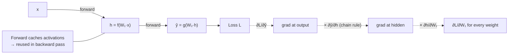

## In simple terms

Training a [neural network](/t/neural-network) requires knowing: "if I nudge weight W by a tiny amount, how much does the error change?" That question is answered by backpropagation — it sweeps through the network *backwards* from the output, computing the answer for every single weight in one efficient pass. Without it, you'd need a separate forward pass per weight to estimate each gradient numerically, making training of million-parameter networks impossible.

## The Visual Map



## More detail

A neural network is a composition of functions: input → layer 1 → layer 2 → … → output → loss. Computing a loss given inputs is the **forward pass**; finding how the loss changes with respect to each weight — `∂L/∂W` — is the **backward pass**, done by backpropagation. The mathematics is the **chain rule** applied to a computation graph: for `L = f(g(h(x)))`, `dL/dx = (dL/df)·(df/dg)·(dg/dh)·(dh/dx)`.

Backpropagation applies this starting from the loss and working backwards: compute the gradient of the loss with respect to the output activations; use the chain rule to propagate it back through each layer's weights and activations; accumulate `∂L/∂W` for every weight; then hand those gradients to [gradient descent](/t/gradient-descent). The key efficiency insight is that each intermediate gradient is computed *once* and *reused* downstream — this is **reverse-mode automatic differentiation**, what PyTorch/TensorFlow/JAX implement as `backward()`. The forward pass caches intermediate values the backward pass needs, and the backward pass computes all *n* parameter gradients in O(n) work rather than O(n²). For transformers and other modern architectures the gradient flows through attention and residual connections — the same chain rule on a more complex graph. This is *why* deep learning is tractable: one forward plus one backward pass trains the whole network.

## Under the Hood

Backprop is the chain rule, bookkept. This trains a tiny two-weight network (`ŷ = w₂·relu(w₁·x)`) on one example by computing each local derivative and multiplying them together — no framework, just the chain rule by hand:

```python
def relu(z): return max(0.0, z)
def drelu(z): return 1.0 if z > 0 else 0.0

x, target = 2.0, 10.0
w1, w2, lr = 0.5, 0.5, 0.01

for step in range(2001):
    # forward (cache the intermediates)
    z = w1 * x
    h = relu(z)
    yhat = w2 * h
    loss = (yhat - target) ** 2

    # backward: multiply local derivatives along the chain
    dL_dyhat = 2 * (yhat - target)
    dL_dw2   = dL_dyhat * h                 # ∂ŷ/∂w2 = h
    dL_dh    = dL_dyhat * w2                # ∂ŷ/∂h  = w2
    dL_dw1   = dL_dh * drelu(z) * x         # through relu, then ∂z/∂w1 = x

    w2 -= lr * dL_dw2                        # gradient descent step
    w1 -= lr * dL_dw1
    if step % 500 == 0:
        print(f"step {step:>4}: ŷ={yhat:.3f} loss={loss:.4f}")
```

`loss.backward()` in PyTorch does exactly this multiplication of local derivatives, automatically, across millions of weights.

## Engineering Trade-offs

- **Memory vs recompute.** Backprop must cache forward activations to reuse them; that costs memory proportional to depth. Gradient checkpointing trades memory for recomputing some activations in the backward pass.
- **Reverse vs forward mode.** Reverse mode is O(1) passes for many parameters and one output (the ML case); forward mode is cheaper when there are few inputs and many outputs — the opposite regime.
- **Numerical stability vs depth.** Long chains multiply many derivatives; saturating activations make them vanish or explode — fixed by ReLU, normalisation, and residual connections, not by the algorithm.
- **Exactness vs cost.** Backprop gives exact gradients cheaply; finite-difference checking is simple but costs a forward pass per parameter and is only used to validate.

## Real-world examples

- PyTorch's `loss.backward()` runs backpropagation through the whole computation graph, populating `.grad` on every leaf tensor.
- Training a 175-billion-parameter model is only feasible because backprop scales linearly with parameter count.
- Gradient-based adversarial attacks (FGSM) backpropagate to the *input* instead of the weights, finding perturbations that maximise loss.

## Common misconceptions

- **"Backprop is the same as gradient descent."** Backprop *computes* the gradients; gradient descent *uses* them. Paired but distinct.
- **"Backprop only works for feedforward networks."** It works for any differentiable computation graph — recurrent, attention, residual — because it operates on the graph, not the architecture.
- **"Deep networks vanish gradients because of backprop."** Vanishing gradients are an architecture issue (saturating activations, no shortcuts); ReLU, batch norm, and residual connections fix it.

## Try it yourself

Train a two-weight network by hand-coded backprop and watch the chain rule drive the loss down (`python3` only):

```bash
python3 - <<'EOF'
relu=lambda z:max(0.0,z); drelu=lambda z:1.0 if z>0 else 0.0
x,t=2.0,10.0; w1=w2=0.5; lr=0.01
for s in range(2001):
    z=w1*x; h=relu(z); yhat=w2*h; loss=(yhat-t)**2
    dy=2*(yhat-t)
    w2-=lr*dy*h
    w1-=lr*dy*w2*drelu(z)*x
    if s%500==0: print(f"step {s:>4}: yhat={yhat:.3f} loss={loss:.4f}")
EOF
```

## Learn next

- [Gradient descent](/t/gradient-descent) — consumes the gradients backprop produces
- [Calculus](/t/calculus-basics) — the chain rule backprop is built on
- [Neural network](/t/neural-network) — the composed function whose weights backprop differentiates
- [Training and inference](/t/training-and-inference) — the end-to-end loop backprop powers
