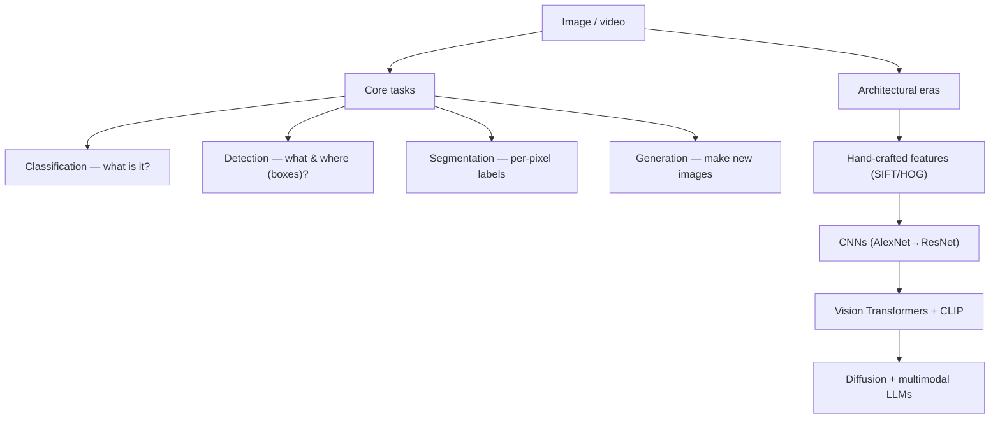

## In simple terms

**Computer vision** is the field of getting computers to interpret images and video — figuring out what's in a picture, where objects are, what's happening, sometimes even creating new images. Modern computer vision is overwhelmingly deep learning: convolutional networks until the late 2010s, transformer-based vision models from then onward.

## The Visual Map



## More detail

The core tasks span **image classification** ("what is this a picture of?"), **object detection** (boxes around objects), **semantic** and **instance segmentation** (per-pixel labels, distinguishing individual objects), **pose estimation**, **OCR**, **image generation**, **video analysis**, **3D reconstruction** (NeRF, Gaussian Splatting), and **optical flow**. The methods went through clear eras: hand-crafted features (SIFT, HOG) plus classifiers before ~2012; **CNNs** (AlexNet 2012 → VGG → ResNet → EfficientNet) for a decade; **Vision Transformers** from 2020, treating image patches as tokens; **CLIP** (2021), jointly training image and text encoders for transferable embeddings; **diffusion models** (2022+) for generation; and **multimodal LLMs** (2023+) that reason fluently about images.

The field was driven by datasets — **ImageNet** (14M labelled images, the benchmark that triggered the deep-learning revolution), **COCO** (detection and segmentation), and **LAION-5B** (5 billion image-text pairs that trained CLIP and Stable Diffusion). The hardware story is simple: vision is matrix multiplication, so GPUs win, and Vision Transformers benefit from the same matmul-heavy patterns as LLMs, letting the same GPUs serve both. Computer vision is now in every pocket — phone photos pass through neural enhancement, autofocus, scene detection, background removal, and generative fill — and in self-driving, medical imaging, satellite analysis, manufacturing QA, and moderation.

## Under the Hood

Before deep learning, vision *was* hand-coded operations on pixel grids — and those operations still underpin everything. Thresholding turns a greyscale image into a segmentation mask in one line per pixel; it's the simplest "what is foreground?" a vision system can do:

```python
# A 6x8 greyscale "image" with a bright blob on a dark background
img = [
    [10,10,12,11,10,10,10,10],
    [10,11,90,95,92,10,10,10],
    [11,12,93,99,94,11,10,10],
    [10,11,91,96,90,10,11,10],
    [10,10,12,11,10,10,10,10],
    [10,10,10,11,10,10,10,10],
]
threshold = 50                          # Otsu-style cutoff, here picked by hand
print("segmentation mask (foreground = #):")
for row in img:
    print("".join("#" if px > threshold else "." for px in row))

area = sum(px > threshold for row in img for px in row)
print(f"foreground pixels: {area}")
```

Detection, segmentation, and classification are vastly more sophisticated, but they answer the same shape of question — *which pixels belong to what* — that this threshold answers in miniature.

## Engineering Trade-offs

- **Accuracy vs latency/power.** Big transformer vision models top benchmarks but a phone or car needs real-time inference on a power budget, favouring compact CNNs or distilled models.
- **Labelled data vs capability.** Detection and segmentation need expensive pixel/box annotations; self-supervised and CLIP-style training reduce that need at the cost of more compute.
- **Generality vs robustness.** Models excel on in-distribution images but degrade on unusual angles, lighting, or adversarial pixels — robustness is still an open problem.
- **2D recognition vs 3D/temporal understanding.** Single-image classification is largely solved; video reasoning and 3D reconstruction remain active research.

## Real-world examples

- iPhone photography runs many neural networks per shot — segmentation for portrait mode, denoising for low light, scene detection for exposure.
- Tesla/Waymo stacks fuse camera (and radar/lidar); vision models classify and track every road object in real time.
- Midjourney and Stable Diffusion generate photorealistic images from short prompts — the generative side of CV.
- Deep CV models for MRI/CT analysis now match or exceed radiologists on specific narrow tasks.

## Common misconceptions

- **"Computer vision is solved."** Benchmark image classification largely is, but real-world robustness, 3D understanding, video reasoning, and out-of-distribution generalisation are very much active research.
- **"Vision Transformers replaced CNNs."** ViTs dominate large-scale; CNNs remain best for many edge and low-resource deployments because they're parameter-efficient.

## Try it yourself

Segment a bright blob from its background by thresholding — the simplest "which pixels are foreground?" (`python3` only):

```bash
python3 - <<'EOF'
img=[[10,10,12,11,10,10],[10,90,95,92,10,10],[11,93,99,94,11,10],
     [10,91,96,90,10,11],[10,12,11,10,10,10]]
thr=50
for row in img:
    print("".join("#" if p>thr else "." for p in row))
print("foreground pixels:", sum(p>thr for row in img for p in row))
EOF
```

## Learn next

- [Convolutional neural network](/t/convolutional-neural-network) — the architecture that long powered vision
- [Transformer](/t/transformer) — the model family dominant in vision today
- [Embedding](/t/embedding) — the representation at the heart of CLIP-style models
- [Neural network](/t/neural-network) — the foundation all modern CV is built on
