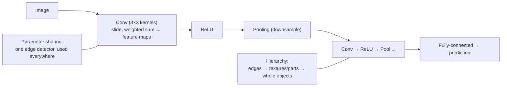

## In simple terms

A **convolutional neural network (CNN)** is a [neural network](/t/neural-network) designed for images. A plain neural network treats every pixel as an independent input, which throws away the most important fact about an image: nearby pixels are related, and a pattern (an edge, an eye, a wheel) means the same thing wherever it appears. A CNN exploits this by sliding small **filters** across the image, looking for local patterns and reusing the same pattern-detector everywhere. That makes it dramatically more efficient and effective at seeing than a generic network.

## The Visual Map



## More detail

The defining operation is **convolution**: a small grid of weights (a **kernel**, say 3×3) slides across the image, computing a weighted sum at each position to produce a **feature map**. Three properties make this powerful: **parameter sharing** (the same kernel is used across the whole image, so the network learns "an edge detector" once instead of separately for every location — far fewer parameters than a fully-connected layer), **translation invariance** (a feature is recognised wherever it appears), and **hierarchy** (stacked layers learn edges and colours early, textures and parts in the middle, whole objects deep).

A typical CNN interleaves **convolution layers**, **ReLU activations**, and **pooling layers** (which downsample to summarise a region), ending in fully-connected layers for the final prediction. Landmark architectures — **LeNet** (1998), **AlexNet** (2012, which ignited the deep-learning boom by winning ImageNet on GPUs), **VGG**, **ResNet** — went progressively deeper and more accurate. Since ~2020, **vision transformers** have matched or beaten CNNs on many large-scale tasks, but CNNs remain ubiquitous for their efficiency, especially with limited data or compute, and the core idea of exploiting local structure with shared filters extends to audio and time series too.

## Under the Hood

A convolution *is* the network's pattern detector. Slide a hand-picked vertical-edge kernel over a tiny image and it lights up exactly where light meets dark — the same operation a trained CNN learns, except it discovers the kernel weights itself:

```python
# 6x6 image: left half dark (0), right half bright (9) -> a vertical edge in the middle
img = [[0,0,0,9,9,9] for _ in range(6)]
kernel = [[-1,0,1],
          [-1,0,1],
          [-1,0,1]]            # responds to left-dark / right-bright transitions

def convolve(img, k):
    H, W, ks = len(img), len(img[0]), len(k)
    out = []
    for y in range(H-ks+1):
        row = []
        for x in range(W-ks+1):
            s = sum(img[y+i][x+j]*k[i][j] for i in range(ks) for j in range(ks))
            row.append(s)
        out.append(row)
    return out

for row in convolve(img, kernel):
    print(" ".join(f"{v:>3}" for v in row))   # large values mark the edge column
```

The output is near zero across the flat regions and spikes at the edge — one learned kernel, reused at every position, is how a CNN "sees" structure.

## Engineering Trade-offs

- **Parameter sharing vs flexibility.** Reusing one kernel everywhere slashes parameters and gives translation invariance, but assumes a pattern means the same thing in every location — usually true for images, not for all data.
- **Receptive field vs depth.** Small kernels keep each layer cheap, so seeing large structures requires stacking many layers (or dilations) — more depth to train.
- **CNN vs vision transformer.** CNNs are parameter-efficient and strong with modest data; ViTs scale better with huge data and compute but need more of both.
- **Pooling: invariance vs precision.** Pooling builds robustness to small shifts but discards exact location — bad for tasks needing pixel-precise output (segmentation uses other tricks).

## Real-world examples

- Image classification and object detection — photo tagging, tumour detection in scans, manufacturing defect detection.
- Face recognition and the autofocus/scene detection in phone cameras.
- Self-driving perception stacks historically built heavily on CNNs to detect lanes, pedestrians, and signs.

## Common misconceptions

- **"CNNs are obsolete now that we have transformers."** Vision transformers lead on some large-scale benchmarks, but CNNs are still widely used for efficiency and strong performance with modest data.
- **"A CNN understands what an object *is*."** It learns statistical visual patterns and can be fooled by adversarial pixels or unusual angles that wouldn't trouble a human.

## Try it yourself

Run an edge-detect convolution and watch one kernel find the vertical edge in an image (`python3` only):

```bash
python3 - <<'EOF'
img=[[0,0,0,9,9,9] for _ in range(6)]
k=[[-1,0,1],[-1,0,1],[-1,0,1]]
for y in range(len(img)-2):
    print(" ".join(f"{sum(img[y+i][x+j]*k[i][j] for i in range(3) for j in range(3)):>3}"
                    for x in range(len(img[0])-2)))
EOF
```

## Learn next

- [Neural network](/t/neural-network) — the general family a CNN specialises
- [Computer vision](/t/computer-vision) — the field CNNs long powered
- [Transformer](/t/transformer) — the architecture now challenging CNNs on vision
- [GPU](/t/gpu) — the hardware that made deep CNNs (AlexNet, 2012) trainable
