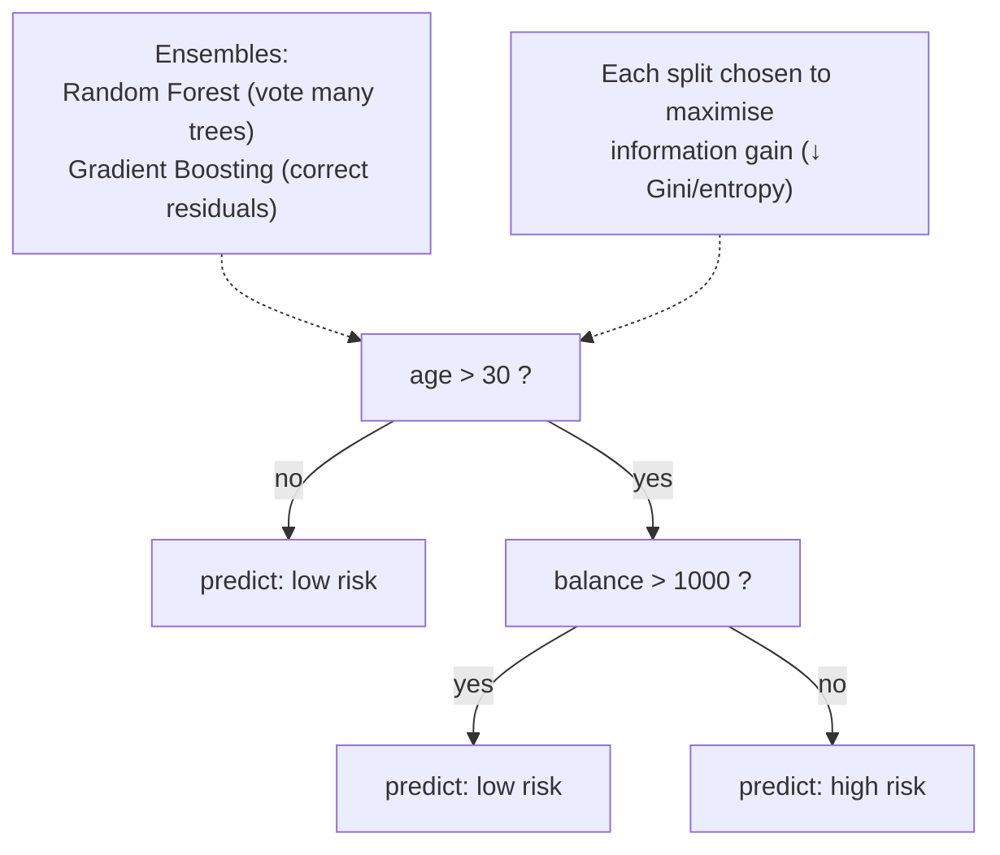

## In simple terms

A decision tree makes a prediction by asking a sequence of questions: "Is the customer's age over 30? → Yes: Is their balance over $1,000? → No: predict 'low risk'." Each question is a **split** at a node; the final category at a leaf is the prediction. The model is literally a flowchart — you can trace any prediction step by step, which makes it one of the most interpretable models in machine learning.

## The Visual Map



## More detail

**Building a tree** (training) means finding which feature and threshold to split on at each node, usually by maximising information gain — the reduction in entropy or Gini impurity after the split. Classic algorithms are **ID3** (entropy, discrete features), **C4.5** (continuous features, pruning), and **CART** (binary splits, regression via MSE). **Overfitting** is a severe risk: a tree grown to full depth memorises the training data (zero training error) but generalises poorly, so controls like maximum depth, minimum samples per leaf, and **pruning** are essential.

**Ensemble methods** dramatically improve on a single tree. A **Random Forest** builds many trees, each on a bootstrap sample with a random subset of features per split, and aggregates by vote or mean — the randomness de-correlates the trees and reduces variance. **Gradient Boosting** (XGBoost, LightGBM, CatBoost) builds trees sequentially, each correcting the previous ensemble's residuals, and is extremely powerful on tabular data. These are the default models for structured data because they need little preprocessing, handle mixed feature types, are robust to outliers, and often beat neural networks without heavy tuning. Feature importances also give a fast, interpretable view of which inputs matter — valuable in credit scoring and medical diagnosis where explainability is required.

## Under the Hood

A split is chosen by measuring how *pure* it makes the resulting groups. Gini impurity is 0 when a group is all one class; the best split minimises the weighted impurity of its two children. Here's that search over a one-feature dataset:

```python
data = [(1, 0), (2, 0), (3, 0), (5, 1), (6, 1), (7, 1)]   # (feature, label)

def gini(labels):
    if not labels: return 0
    p = sum(labels) / len(labels)
    return 1 - p**2 - (1-p)**2

def split_quality(thresh):
    left  = [y for x, y in data if x <= thresh]
    right = [y for x, y in data if x > thresh]
    n = len(data)
    return (len(left)*gini(left) + len(right)*gini(right)) / n   # weighted impurity

candidates = [2.5, 3.5, 4.0, 5.5]
best = min(candidates, key=split_quality)
print(f"{'threshold':>10}{'weighted gini':>16}")
for t in candidates:
    print(f"{t:>10}{split_quality(t):>16.3f}")
print(f"best split: feature <= {best}  (purest children)")
```

The tree picks the threshold between the two classes, where both children are pure (Gini 0) — and a real tree just repeats this search recursively on each child.

## Engineering Trade-offs

- **Interpretability vs accuracy.** A single shallow tree is a readable flowchart but weak; a 500-tree forest or boosted ensemble is far more accurate but no longer transparent.
- **Depth vs overfitting.** Deeper trees fit training data better and memorise noise; pruning and depth limits trade a little training fit for real generalisation.
- **Trees vs neural networks.** On tabular data, gradient-boosted trees are cheaper, faster, and usually more accurate; deep nets win on images, audio, and text.
- **Bagging vs boosting.** Random forests reduce variance and resist overfitting in parallel; boosting reduces bias sequentially for higher accuracy but is more sensitive to noise and tuning.

## Real-world examples

- Credit-card fraud detection and loan approval are commonly gradient-boosted trees regulators can audit.
- Gradient boosting wins structured-data competitions; XGBoost is the standard library.
- Medical decision-support systems use decision trees so clinicians can verify the reasoning path.
- Search ranking and "smart reply" systems use gradient boosting over handcrafted features.

## Common misconceptions

- **"Neural networks always beat decision trees."** On tabular data, gradient boosting routinely outperforms neural nets, especially on smaller datasets or without heavy tuning.
- **"Decision trees are interpretable — so are random forests."** A single tree is; a forest of 500 is not. Feature importances help, but full transparency is lost.

## Try it yourself

Find the best split by minimising Gini impurity — the core decision a tree makes at every node (`python3` only):

```bash
python3 - <<'EOF'
data=[(1,0),(2,0),(3,0),(5,1),(6,1),(7,1)]
def gini(ys):
    if not ys: return 0
    p=sum(ys)/len(ys); return 1-p*p-(1-p)**2
def q(t):
    L=[y for x,y in data if x<=t]; R=[y for x,y in data if x>t]
    return (len(L)*gini(L)+len(R)*gini(R))/len(data)
for t in (2.5,3.5,4.0,5.5):
    print(f"threshold {t}: weighted gini {q(t):.3f}")
print("best:", min((2.5,3.5,4.0,5.5), key=q))
EOF
```

## Learn next

- [Supervised learning](/t/supervised-learning) — the setting decision trees are trained in
- [Support vector machine](/t/support-vector-machine) — a different linear/kernel approach to the same classification task
- [Neural network](/t/neural-network) — what trees usually beat on tabular data, and lose to on images/text
- [Machine learning](/t/machine-learning) — the broader field, where boosted trees are the tabular workhorse
