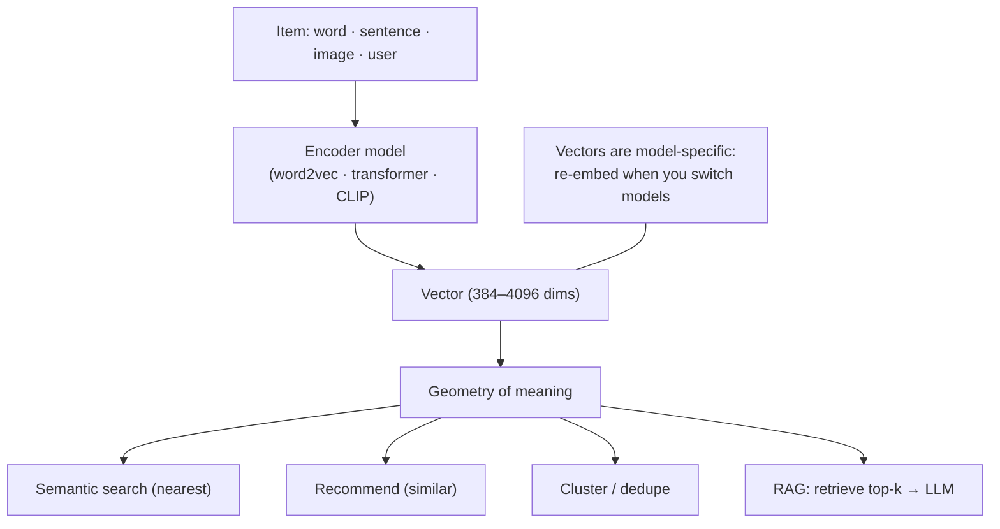

## In simple terms

An **embedding** is a way of representing something — a word, an image, a user, a song — as a list of numbers (typically a few hundred to a few thousand) such that *similar items have similar lists*. "cat" and "kitten" end up near each other in the vector space; "cat" and "thermodynamics" do not. Once you have embeddings, similarity becomes a math problem: cosine distance, dot product, k-nearest-neighbours.

## The Visual Map



## More detail

Embeddings get created in several ways: **word embeddings** (word2vec, GloVe) train a shallow network to predict surrounding words and take the input weights; **sentence/passage embeddings** (Sentence-BERT, OpenAI `text-embedding-3`) run text through a transformer and pool token vectors into one fixed-length vector; **image embeddings** (CLIP, DINO) train an image encoder, often jointly with a text encoder so cross-modal similarity works; and **user/item embeddings** (matrix factorisation, two-tower models) train so users who liked similar items have similar vectors.

Once you have them you can **search by meaning** (embed a query, find nearest documents), **recommend** (find items similar to one a user liked), **cluster**, **classify** (a small linear head on top), **deduplicate**, or do **RAG** (embed a knowledge base and the user's question, retrieve top-k, stuff into the LLM's context). Modern dimensions run 384 (small), 768 (BERT-base), to 1024–4096. **Vector databases** (pgvector, Pinecone, Weaviate, Qdrant, Milvus) store and search billions of embeddings via approximate-nearest-neighbour indexes (HNSW, IVF, ScaNN). A subtle but crucial point: **embeddings are model-specific** — a vector from one model is not comparable to a vector from another, so re-embed everything when you switch models. Embeddings are the bridge between LLMs and your data, and one of the cheapest, most reliable ML primitives: a single API call gives you a vector that opens the whole geometry-of-meaning toolbox.

## Under the Hood

The operation that makes embeddings useful is **cosine similarity** — the cosine of the angle between two vectors, which ignores magnitude and measures direction (meaning). Semantic search is just "rank everything by cosine similarity to the query":

```python
import math
def cosine(a, b):
    dot = sum(x*y for x, y in zip(a, b))
    na = math.sqrt(sum(x*x for x in a)); nb = math.sqrt(sum(y*y for y in b))
    return dot / (na * nb)

# Toy 3-dim embeddings: [feline, canine, physics]
vecs = {
    "cat":          [0.9, 0.1, 0.0],
    "kitten":       [0.85, 0.15, 0.0],
    "dog":          [0.1, 0.9, 0.0],
    "thermodynamics":[0.0, 0.0, 1.0],
}
query = vecs["cat"]
ranked = sorted(vecs.items(), key=lambda kv: -cosine(query, kv[1]))
for word, v in ranked:
    print(f"cos(cat, {word:14}) = {cosine(query, v):.3f}")
```

"kitten" ranks just below "cat" itself, "dog" trails, and "thermodynamics" is near zero — exactly the nearest-neighbour ordering a vector database returns at billion-vector scale.

## Engineering Trade-offs

- **Dimensions vs cost.** More dimensions can capture finer distinctions but cost storage, memory, and search time; 768–1024 is plenty for many tasks, and 4096 is overkill for most.
- **Exact vs approximate search.** Brute-force cosine is exact but O(n) per query; ANN indexes (HNSW/IVF) are sub-linear and scale to billions at a small recall cost.
- **Model quality vs portability.** A stronger embedding model retrieves better but locks you in — switching means re-embedding the entire corpus.
- **Single vector vs multi-vector.** One vector per document is cheap and simple; late-interaction (multi-vector) methods retrieve better on long documents at higher storage and compute cost.

## Real-world examples

- GitHub Code Search uses code embeddings plus lexical search for semantic and exact-match results.
- Spotify's recommendations lean on user and track embeddings to find "songs you might like".
- Pinterest uses visual embeddings to suggest similar pins.
- Most AI coding tools embed the codebase and retrieve relevant snippets to feed the LLM at each prompt.

## Common misconceptions

- **"All embeddings are interchangeable."** They're tied to the specific model that produced them; mixing vectors from different models is meaningless.
- **"More dimensions = better."** Past a point, more dimensions cost compute and storage without improving retrieval quality.

## Try it yourself

Rank items by cosine similarity to a query — the core of every semantic search and RAG system (`python3` only):

```bash
python3 - <<'EOF'
import math
def cos(a,b):
    return sum(x*y for x,y in zip(a,b))/(math.sqrt(sum(x*x for x in a))*math.sqrt(sum(y*y for y in b)))
vecs={"cat":[0.9,0.1,0],"kitten":[0.85,0.15,0],"dog":[0.1,0.9,0],"thermo":[0,0,1]}
q=vecs["cat"]
for w,v in sorted(vecs.items(), key=lambda kv:-cos(q,kv[1])):
    print(f"cos(cat,{w:8}) = {cos(q,v):.3f}")
EOF
```

## Learn next

- [Vector database](/t/vector-database) — stores and searches embeddings at scale via ANN indexes
- [Retrieval-augmented generation](/t/retrieval-augmented-generation) — the headline application of embeddings with LLMs
- [Transformer](/t/transformer) — the model family that produces modern text embeddings
- [Large language model](/t/large-language-model) — what embeddings feed context into
