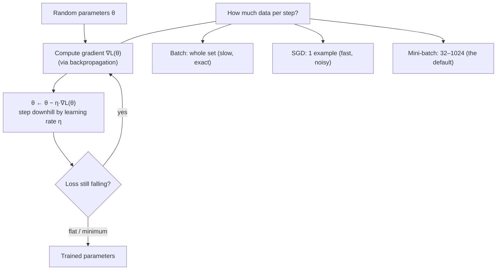

## In simple terms

**Gradient descent** is how you train almost every machine-learning model. Picture the loss as a landscape: high in places where the model is wrong, low where it's right. At each step, you compute the slope (gradient) under your feet and take a small step downhill. Repeat enough times and you reach a valley — a set of parameters that minimises the loss. That's training.

## The Visual Map



## More detail

The basic update rule is `θ_new = θ_old − η · ∇L(θ_old)`, where `θ` is the parameter vector, `L` the loss, `∇L` the gradient, and `η` the **learning rate**. Variants differ mostly in how much data each step uses: **batch** gradient descent (whole training set per step — accurate but slow), **stochastic** SGD (one example per step — fast but noisy), and **mini-batch** SGD (32–1024 examples — the sweet spot everyone uses). Computing the gradient through a deep model is the job of **backpropagation**; modern autograd libraries (PyTorch, JAX) derive the backward pass automatically from your forward pass.

Modern improvements on plain SGD include **momentum** (accumulate a velocity to smooth noisy gradients), **Adam** (per-parameter adaptive rates, the default for ~a decade), **AdamW** (Adam with decoupled weight decay, the usual choice for transformers), and **learning-rate schedules** (warmup, cosine decay) that often matter more than the optimiser itself. Practical realities: the **learning rate** is the most important hyper-parameter (too high diverges, too low crawls); **gradient clipping** stops rare huge gradients from exploding training; **mixed precision** (FP16/BF16) gives 2–3× speedup; and **distributed training** averages gradients across many GPUs each step. Knowing how the loop works lets you debug training failures and read new optimisation papers.

## Under the Hood

The whole algorithm is "evaluate the gradient, step against it." Fitting a line to noisy data shows every moving part — the squared-error loss, its gradient, and the learning-rate step — with nothing hidden:

```python
data = [(1, 2.1), (2, 3.9), (3, 6.2), (4, 7.8)]    # ~ y = 2x
w, b, lr = 0.0, 0.0, 0.01

def loss(w, b):
    return sum(((w*x + b) - y) ** 2 for x, y in data) / len(data)

for step in range(0, 1001):
    if step % 250 == 0:
        print(f"step {step:>4}: w={w:.3f} b={b:.3f}  loss={loss(w,b):.4f}")
    gw = sum(2*((w*x + b) - y)*x for x, y in data) / len(data)   # ∂L/∂w
    gb = sum(2*((w*x + b) - y)   for x, y in data) / len(data)   # ∂L/∂b
    w -= lr * gw                                                 # descend
    b -= lr * gb
```

`optimizer.step()` in PyTorch is this exact `θ -= lr * grad`, except the gradient comes from automatic differentiation through millions of parameters instead of two.

## Engineering Trade-offs

- **Batch size vs noise.** Large batches give smooth, accurate gradients but cost memory and can generalise worse; small batches are noisy and cheap, and the noise can help escape sharp minima.
- **Learning rate: speed vs stability.** A high rate converges fast until it overshoots and diverges; a low rate is stable but slow — schedules try to get both.
- **Adam vs SGD.** Adam converges quickly and tunes itself per-parameter; well-tuned SGD+momentum often generalises better on vision tasks at the cost of more tuning.
- **Mixed precision: throughput vs numerical safety.** FP16/BF16 doubles speed and halves memory but needs loss scaling and care to avoid underflow/NaNs.

## Real-world examples

- **GPT-class LLM training** runs Adam-variant SGD for trillions of token-steps across thousands of GPUs, costing tens of millions of dollars per model.
- **The 2015 ResNet** paper showed residual connections let plain SGD train 100+-layer networks — reshaping computer vision.
- **PyTorch's `optimizer.step()`** is a single call; everything here is what happens behind it.
- **One-cycle learning-rate** schedules (Smith, 2018) became a popular default across fastai, Lightning, and other stacks.

## Common misconceptions

- **"Gradient descent finds the global minimum."** It finds a *local* minimum or saddle point. For non-convex deep networks that's apparently fine — but not guaranteed best.
- **"Adam is always better than SGD."** Tuned SGD+momentum often generalises better on images; use Adam as a default and tune SGD when accuracy really matters.

## Try it yourself

Watch gradient descent fit a line to noisy data, with the loss falling each step (`python3` only):

```bash
python3 - <<'EOF'
data=[(1,2.1),(2,3.9),(3,6.2),(4,7.8)]
w=b=0.0; lr=0.01
loss=lambda: sum(((w*x+b)-y)**2 for x,y in data)/len(data)
for s in range(1001):
    if s%250==0: print(f"step {s:>4}: w={w:.3f} b={b:.3f} loss={loss():.4f}")
    gw=sum(2*((w*x+b)-y)*x for x,y in data)/len(data)
    gb=sum(2*((w*x+b)-y)   for x,y in data)/len(data)
    w-=lr*gw; b-=lr*gb
EOF
```

## Learn next

- [Backpropagation](/t/backpropagation) — how the gradient is computed through a deep network
- [Neural network](/t/neural-network) — what gradient descent is training
- [Training and inference](/t/training-and-inference) — the wider train-time vs run-time split
- [Optimization theory](/t/optimization-theory) — the mathematics of minima, convexity, and convergence
