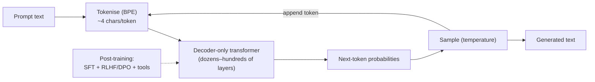

## In simple terms

A **large language model** (LLM) is a neural network trained on a huge corpus of text whose only direct job is to predict the next token (roughly, the next word piece). That deceptively simple task, scaled up to billions or trillions of parameters and similarly large datasets, produces something that can chat, summarise, translate, write code, and reason in surprising ways.

## The Visual Map



## More detail

Defining traits of modern LLMs: the **architecture** is a decoder-only transformer (tens to hundreds of layers, billions to trillions of parameters); the **pre-training objective** is next-token prediction on web-scale text; **tokenisation** chops input into subword tokens (BPE or similar, ~4 characters per token for English); the **context window** is how much input the model can consider at once (4K in 2020, 128K to multi-million by 2026); **post-training** adds supervised fine-tuning plus RLHF/RLAIF/DPO to align responses with human preferences; and **tool use** lets modern models call functions, browse, run code, and read files — moving from "text in, text out" to "agent with tools."

They're used via **zero-shot prompting** (just ask), **few-shot prompting** (include examples), **Retrieval-Augmented Generation** (look up relevant documents and put them in the prompt), **fine-tuning** (adapt to a narrow task on top of the base model), and **agent loops** (the model plans, calls tools, observes, iterates). Known weaknesses are **hallucination** (confident, plausible, wrong outputs), **stale knowledge** (bounded by the training cut-off), **no real introspection** (explanations may be post-hoc), **cost** (inference is expensive at scale), and **prompt injection** (untrusted context can hijack the model). Building on, evaluating, and safely using LLMs are now mainstream software-engineering skills.

## Under the Hood

An LLM generates **autoregressively**: predict a probability distribution over the next token, pick one, append it, repeat. The pick step — controlled by *temperature* — is where determinism versus creativity is decided. This toy model uses a hand-built next-token table to show the exact loop:

```python
import random, math
random.seed(0)

# A tiny "next token" model: given a word, scores for what follows
model = {
    "the":  {"cat": 3.0, "dog": 2.0, "idea": 1.0},
    "cat":  {"sat": 3.0, "ran": 2.0},
    "sat":  {"on": 4.0},
    "on":   {"the": 4.0},
}
def sample(scores, temp):
    items = list(scores.items())
    logits = [s / temp for _, s in items]
    m = max(logits); e = [math.exp(l - m) for l in logits]; Z = sum(e)
    r, acc = random.random(), 0.0
    for (tok, _), p in zip(items, [x/Z for x in e]):
        acc += p
        if r <= acc: return tok
    return items[-1][0]

for temp in (0.2, 1.5):
    word, out = "the", ["the"]
    for _ in range(5):
        if word not in model: break
        word = sample(model[word], temp); out.append(word)
    print(f"temp={temp}: {' '.join(out)}")
```

Low temperature sharpens the distribution toward the top choice (predictable); high temperature flattens it (more varied). A real LLM is this loop with the score table replaced by a transformer over a 100k-token vocabulary.

## Engineering Trade-offs

- **Model size vs cost.** Bigger models are more capable but cost more to train and far more to serve; carefully trained small models match big ones on narrow tasks.
- **Context length vs compute.** Longer contexts let the model see more but attention is quadratic, so doubling context roughly quadruples per-token cost.
- **Temperature: determinism vs creativity.** Low temperature is reliable and repeatable; high temperature is varied but more error-prone — a per-application choice.
- **Parametric knowledge vs retrieval.** Baking facts into weights is fast at inference but stale and unverifiable; RAG keeps knowledge fresh and citable at the cost of a retrieval step.

## Real-world examples

- GPT, Claude, Gemini, Llama, Mistral — the flagship LLM families.
- GitHub Copilot, Cursor, and similar coding tools are LLMs prompted with code context.
- RAG-powered support bots are LLMs grounded in a company's documentation.
- "Reasoning models" (o-series, DeepSeek R1) spend extra inference compute thinking step-by-step — scaling test-time compute, not just parameters, still moves the frontier.

## Common misconceptions

- **"LLMs understand."** They predict patterns in tokens. Whether that *is* understanding is a philosophical question, not a settled fact.
- **"Bigger is always better."** Carefully trained small models can match much larger ones on specific tasks; the right answer is task-dependent.

## Try it yourself

Run an autoregressive generation loop and see how temperature shifts output from predictable to varied (`python3` only):

```bash
python3 - <<'EOF'
import random, math
random.seed(1)
model={"the":{"cat":3,"dog":2,"idea":1},"cat":{"sat":3,"ran":2},"sat":{"on":4},"on":{"the":4}}
def sample(sc,temp):
    items=list(sc.items()); e=[math.exp(s/temp) for _,s in items]; Z=sum(e)
    r=random.random(); acc=0
    for (t,_),p in zip(items,[x/Z for x in e]):
        acc+=p
        if r<=acc: return t
    return items[-1][0]
for temp in (0.2,1.5):
    w="the"; out=["the"]
    for _ in range(5):
        if w not in model: break
        w=sample(model[w],temp); out.append(w)
    print(f"temp {temp}: {' '.join(out)}")
EOF
```

## Learn next

- [Transformer](/t/transformer) — the architecture LLMs are built on
- [Training and inference](/t/training-and-inference) — the cost split that dominates LLM economics
- [Prompt engineering](/t/prompt-engineering) — how to steer an LLM without retraining it
- [Retrieval-augmented generation](/t/retrieval-augmented-generation) — grounding an LLM in fresh, citable data
