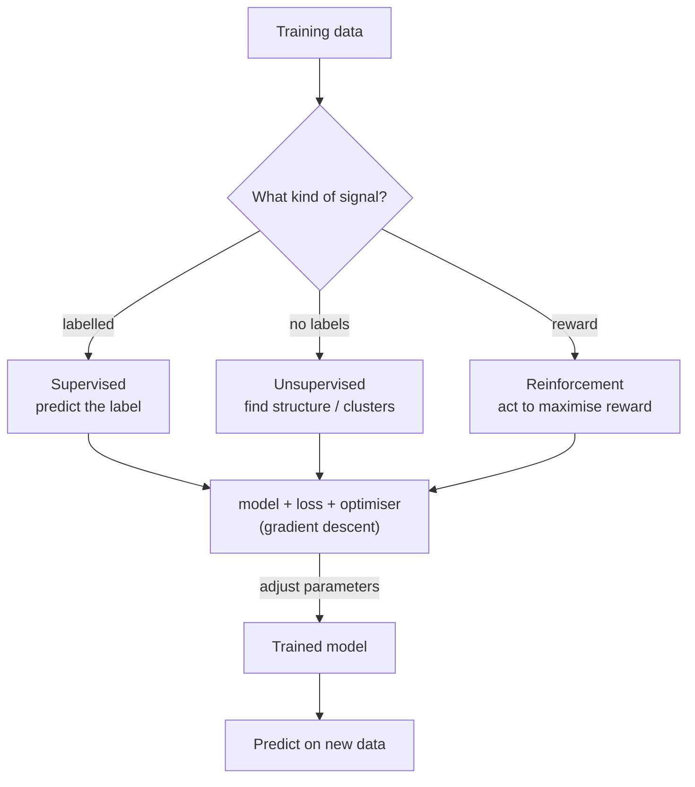

## In simple terms

Machine learning is a way of teaching a computer to do something by **showing it examples** instead of writing the rules by hand. You feed it data, it adjusts internal numbers to fit, and afterward it can make predictions on new data.

## The Visual Map



## More detail

The three classical settings are **supervised learning** (examples come with labels — "this image is a cat" — and the model learns to predict the label), **unsupervised learning** (no labels; find structure like clusters or low-dimensional embeddings), and **reinforcement learning** (an agent acts in an environment, is rewarded, and learns the actions that maximise reward).

Almost every ML method combines the same ingredients: a **model** (linear, decision tree, neural network, …), a **loss function** that measures how wrong its predictions are, and an **optimisation algorithm** (gradient descent and friends) that nudges the model's parameters to reduce the loss. The dominant flavour of ML is **deep learning** with [neural networks](/t/neural-network), especially transformer-based language and vision models — but most *production* systems on tabular data are still gradient-boosted trees (XGBoost, LightGBM). Machine learning is how modern speech recognition, recommenders, fraud detection, search ranking, image generation, and large language models all work.

## Under the Hood

Every ML method, however fancy, is "adjust parameters to reduce a loss." Here is the whole loop in miniature — fitting a line `y = wx + b` to data by gradient descent, which is exactly what a one-neuron model does:

```python
data = [(1, 3), (2, 5), (3, 7), (4, 9)]    # truly y = 2x + 1
w, b, lr = 0.0, 0.0, 0.01

for epoch in range(2000):
    # gradient of mean squared error w.r.t. w and b
    dw = sum(2 * ((w*x + b) - y) * x for x, y in data) / len(data)
    db = sum(2 * ((w*x + b) - y)     for x, y in data) / len(data)
    w -= lr * dw                            # step downhill
    b -= lr * db

print(f"learned y = {w:.2f}x + {b:.2f}   (true: 2x + 1)")
print(f"predict x=5 -> {w*5 + b:.2f}")
```

Swap the line for a neural network and the squared error for cross-entropy and the loop is unchanged — that's why "training" looks the same across the whole field.

## Engineering Trade-offs

- **Model capacity vs overfitting.** A more expressive model fits training data better but may memorise noise and generalise worse; regularisation and validation manage the bias–variance trade.
- **Data quantity vs quality.** More data helps up to a point, after which label quality, coverage, and architecture matter more than raw volume.
- **Accuracy vs interpretability.** Linear models and small trees are explainable but limited; deep nets are powerful but opaque, which matters in regulated domains.
- **Classical vs deep learning.** On tabular data, gradient-boosted trees are cheaper, faster, and often more accurate than deep nets; deep learning wins on images, audio, and text.

## Real-world examples

- Spam filters in email.
- Recommendation engines on streaming platforms.
- The autocomplete in your text editor or IDE.
- ChatGPT / Claude / Gemini and similar LLM products — and, less visibly, gradient-boosted trees ranking search results and scoring transactions.

## Common misconceptions

- **"More data always beats a better model."** Up to a point — past that, data quality and architecture matter more than raw volume.
- **"ML systems are objective."** They reflect the data they were trained on, including its biases and errors.

## Try it yourself

Train a model from scratch — fit a line to data with gradient descent and watch the parameters converge (`python3` only):

```bash
python3 - <<'EOF'
data=[(1,3),(2,5),(3,7),(4,9)]   # y = 2x+1
w=b=0.0; lr=0.01
for e in range(0,2001,500):
    print(f"epoch {e:>4}: y = {w:.3f}x + {b:.3f}")
    for _ in range(500):
        dw=sum(2*((w*x+b)-y)*x for x,y in data)/len(data)
        db=sum(2*((w*x+b)-y)   for x,y in data)/len(data)
        w-=lr*dw; b-=lr*db
EOF
```

## Learn next

- [Neural network](/t/neural-network) — the dominant model family of modern ML
- [Supervised learning](/t/supervised-learning) — the most common setting, learning from labels
- [Training and inference](/t/training-and-inference) — the two phases of every ML system's life
- [Reinforcement learning](/t/reinforcement-learning) — learning from reward instead of labels
