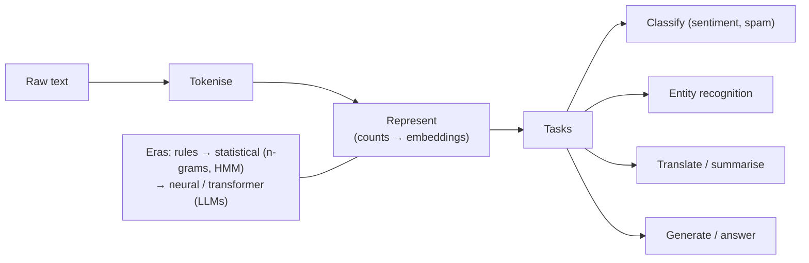

## In simple terms

**Natural Language Processing (NLP)** is the branch of AI concerned with human language — written and spoken. Computers are built for precise, structured data, but human language is ambiguous, context-dependent, and endlessly varied. NLP is the work of bridging that gap: getting machines to read, understand, translate, summarise, and *produce* language. Every spam filter, autocomplete, voice assistant, translation app, and chatbot is NLP.

## The Visual Map



## More detail

NLP covers classification (is this review positive?), named-entity recognition (which words are people, places, dates?), translation, summarisation, question answering, and text generation. Its methods went through three big eras: **rules and grammars** (until the 1990s — hand-written linguistic rules, precise but brittle), **statistical NLP** (1990s–2010s — learn patterns from corpora; words became features for n-grams, naive Bayes, and HMMs), and **neural/transformer-based NLP** (2013 onward — [word embeddings](/t/embedding) captured meaning as vectors, then the [transformer](/t/transformer) and the [large language models](/t/large-language-model) built on it largely unified the field, so one pretrained model now does many tasks that once needed bespoke systems).

A few perennial challenges show why language is hard: **ambiguity** ("I saw her duck"), **context and coreference** (what does "it" refer to?), **sarcasm and tone**, and the diversity of the world's languages, most with far less training data than English. Language is the primary interface between humans and information, so teaching machines to handle it unlocks an enormous range of applications — and NLP is where the current AI boom is most visible to ordinary people. The leap from "search by keywords" to "ask a question in plain English" is an NLP leap, and it's also where AI's hardest open problems (truthfulness, bias, reasoning) are felt most sharply.

## Under the Hood

The statistical era's workhorse — naive Bayes text classification — is still a great way to see NLP from the inside: count which words appear in each class, then score new text by those word probabilities. Here it learns "positive vs negative" from a handful of examples:

```python
import math
from collections import Counter

train = [("great wonderful love", "pos"), ("good happy nice", "pos"),
         ("terrible hate awful", "neg"), ("bad sad poor", "neg")]

words = {"pos": Counter(), "neg": Counter()}
for text, label in train:
    words[label].update(text.split())
vocab = set(w for c in words.values() for w in c)

def score(text, label):
    total = sum(words[label].values()) + len(vocab)
    s = math.log(0.5)                              # equal class prior
    for w in text.split():
        s += math.log((words[label][w] + 1) / total)   # Laplace smoothing
    return s

for text in ["love this", "awful and sad"]:
    pred = max(("pos", "neg"), key=lambda c: score(text, c))
    print(f"{text!r:18} -> {pred}")
```

A modern LLM replaces these word counts with a transformer over billions of parameters, but the task — map text to a prediction — and the reliance on statistical patterns are the same.

## Engineering Trade-offs

- **Rules vs learning.** Hand-written grammars are precise and interpretable but brittle and unscalable; learned models handle real-world variety at the cost of opacity and data hunger.
- **Big LLM vs small specialist.** One LLM does everything via prompting but is costly and overkill; a small fine-tuned classifier is cheaper, faster, and often more accurate on a narrow task.
- **Accuracy vs language coverage.** English and other high-resource languages get excellent results; low-resource languages lag due to scarce training data.
- **Fluency vs truthfulness.** Generative models produce fluent text easily, but factual accuracy, reasoning, and bias remain the hard, unsolved parts.

## Real-world examples

- Machine translation (Google Translate, DeepL) across hundreds of language pairs.
- Spam detection, sentiment analysis of reviews, and autocomplete in email and search.
- Chat assistants and coding tools built on large language models — the most prominent NLP systems today.

## Common misconceptions

- **"NLP is solved now that we have LLMs."** LLMs are a huge leap but still struggle with factual accuracy, reasoning, low-resource languages, and reliability — and many production tasks use smaller specialised models.
- **"NLP means the computer understands language like a human."** It processes statistical patterns extremely well; whether that constitutes "understanding" is a genuine, unsettled debate.

## Try it yourself

Train a naive Bayes sentiment classifier from a few examples and classify new text (`python3` only):

```bash
python3 - <<'EOF'
import math
from collections import Counter
train=[("great love wonderful","pos"),("good nice happy","pos"),
       ("terrible hate awful","neg"),("bad sad poor","neg")]
w={"pos":Counter(),"neg":Counter()}
for t,l in train: w[l].update(t.split())
V=set(x for c in w.values() for x in c)
def score(t,l):
    tot=sum(w[l].values())+len(V)
    return sum(math.log((w[l][x]+1)/tot) for x in t.split())
for t in ["love this","awful poor"]:
    print(f"{t!r:14} -> {max(('pos','neg'), key=lambda c: score(t,c))}")
EOF
```

## Learn next

- [Transformer](/t/transformer) — the architecture modern NLP is built on
- [Large language model](/t/large-language-model) — the technology that unified the field
- [Embedding](/t/embedding) — how words and sentences become vectors of meaning
- [Machine learning](/t/machine-learning) — the statistical foundation under all NLP methods
