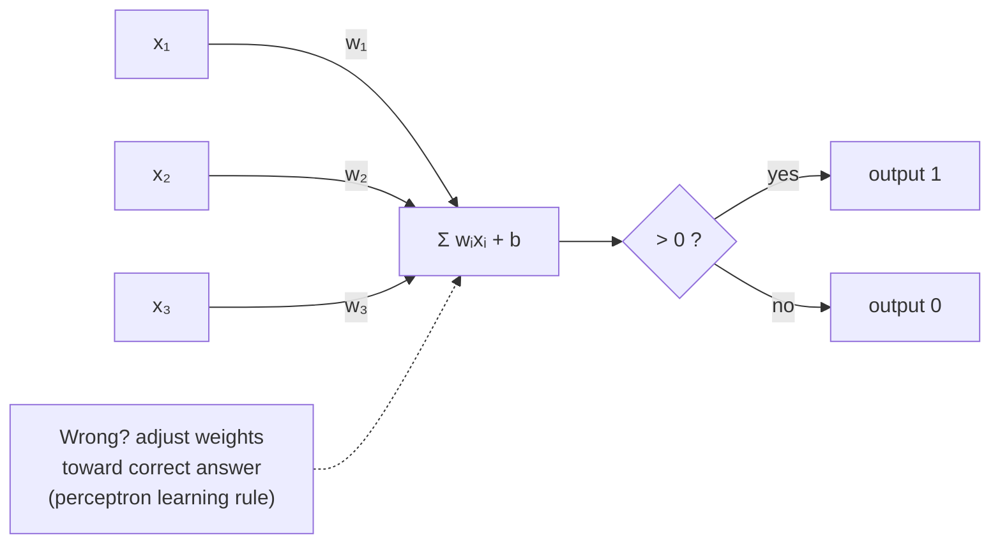

## In simple terms

A perceptron is the simplest possible "neuron": it takes several numbers as inputs, multiplies each by a weight, adds them up, and if the sum exceeds a threshold it outputs 1 (yes), otherwise 0 (no). Given labelled examples it can adjust its own weights — that is, it can *learn*. It is the conceptual atom of every neural network, and understanding it makes the whole field legible.

## The Visual Map



## More detail

Formally, for inputs `x₁, …, xₙ` with weights `w₁, …, wₙ` and bias `b`, the output is 1 if `w₁x₁ + … + wₙxₙ + b > 0` and 0 otherwise. The **perceptron learning rule** adjusts weights after each misclassification: if the output should be 1 but was 0, increase the weights of active inputs; if it should be 0 but was 1, decrease them. Rosenblatt (1958) proved the **perceptron convergence theorem**: if the data is *linearly separable*, the algorithm finds a solution in finite steps.

The critical limitation is that a single perceptron can only learn a **linear decision boundary** — a line in 2D, a plane in 3D, a hyperplane in higher dimensions. Problems like XOR, where no straight line separates the classes, cannot be solved; Minsky and Papert's 1969 analysis of this caused the first "AI winter" until multi-layer networks and backpropagation revived the field. A modern neural network is a **multi-layer perceptron**: many perceptrons stacked in layers, with non-linear activations replacing the hard threshold. Swapping the step function for sigmoid or ReLU makes the whole network differentiable, enabling [gradient descent](/t/gradient-descent) via [backpropagation](/t/backpropagation). The perceptron is the first model where a machine learned a rule from data rather than being given one — the seed of all supervised learning.

## Under the Hood

The learning rule is strikingly simple: on each mistake, push the weights toward the right answer by the input. Here a perceptron learns the AND function from scratch and converges, exactly as Rosenblatt's theorem promises for linearly separable data:

```python
# Learn AND: output 1 only when both inputs are 1
data = [((0, 0), 0), ((0, 1), 0), ((1, 0), 0), ((1, 1), 1)]
w = [0.0, 0.0]; b = 0.0; lr = 0.1

def predict(x):
    return 1 if (w[0]*x[0] + w[1]*x[1] + b) > 0 else 0

for epoch in range(20):
    errors = 0
    for x, target in data:
        err = target - predict(x)          # -1, 0, or +1
        if err:
            errors += 1
            w[0] += lr * err * x[0]         # nudge weights toward correct answer
            w[1] += lr * err * x[1]
            b    += lr * err
    if errors == 0:
        print(f"converged after epoch {epoch}: w={[round(v,2) for v in w]} b={round(b,2)}")
        break

for x, t in data:
    print(f"AND{x} -> {predict(x)} (want {t})")
```

Run the same loop on XOR and it never converges — the geometric proof, in code, of why we need hidden layers.

## Engineering Trade-offs

- **Simplicity vs expressiveness.** A perceptron is trivial to implement and provably converges on separable data, but it can only draw straight boundaries — useless for non-linear problems.
- **Hard threshold vs smooth activation.** The step function is intuitive but non-differentiable, blocking gradient descent; ReLU/sigmoid sacrifice the crisp 0/1 to make training possible.
- **Single unit vs layers.** One perceptron is cheap and interpretable; stacking them into an MLP composes linear boundaries into curves at the cost of opacity and a harder training problem.
- **Online vs batch updates.** The per-mistake rule adapts immediately and uses no memory, but is noisier than batched gradient updates.

## Real-world examples

- Email spam filters have used perceptron-style linear classifiers over word-count features.
- The SGD and AdaGrad optimisers that train deep models generalise the perceptron update rule.
- Support Vector Machines learn a different linear boundary with a wider margin — a direct descendant of the perceptron idea.

## Common misconceptions

- **"The perceptron was proven useless."** Minsky and Papert showed a *single* perceptron is limited and explicitly noted multi-layer networks overcome it; the proof was misread as a death sentence.
- **"Modern neurons are perceptrons."** Modern neurons use smooth activations (ReLU, GELU) and train with backpropagation, not the perceptron rule — related but distinct.

## Try it yourself

Train a perceptron on the AND function and watch it converge (then try changing AND to XOR and see it fail) — `python3` only:

```bash
python3 - <<'EOF'
data=[((0,0),0),((0,1),0),((1,0),0),((1,1),1)]   # AND
w=[0.0,0.0]; b=0.0; lr=0.1
pred=lambda x: 1 if w[0]*x[0]+w[1]*x[1]+b>0 else 0
for epoch in range(20):
    errs=0
    for x,t in data:
        e=t-pred(x)
        if e: errs+=1; w[0]+=lr*e*x[0]; w[1]+=lr*e*x[1]; b+=lr*e
    if errs==0: print(f"converged at epoch {epoch}"); break
print([f"AND{x}={pred(x)}" for x,_ in data])
EOF
```

## Learn next

- [Neural network](/t/neural-network) — stack perceptrons with smooth activations and you get one
- [Backpropagation](/t/backpropagation) — how multi-layer perceptrons are actually trained
- [Gradient descent](/t/gradient-descent) — the optimiser that generalises the perceptron rule
- [Support vector machine](/t/support-vector-machine) — a wider-margin descendant of the linear classifier
