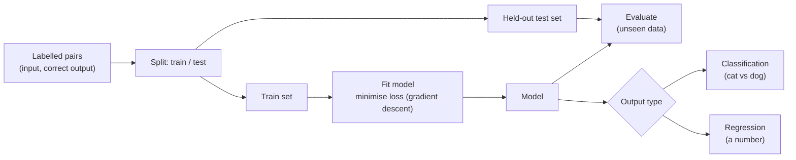

## In simple terms

In **supervised learning**, you show a model a bunch of examples paired with the correct answer ("this picture is a cat", "this email is spam") and it learns to predict the answer on new examples it hasn't seen. The word "supervised" refers to the labels — a teacher told the model what each example was.

## The Visual Map



## More detail

The training loop is: collect a dataset of input/output pairs; choose a model architecture (linear, tree, neural net, …); define a **loss function** measuring how wrong the model is; iteratively adjust parameters to reduce the loss (usually with **gradient descent**); and evaluate on a **held-out test set** the model never saw. There are two main flavours — **classification** (predict one of a fixed set of categories: cat vs dog, spam vs not, digit 0–9) and **regression** (predict a real number: tomorrow's temperature, a house price).

Common pitfalls are **overfitting** (the model memorises the training set and fails on new data), **data leakage** (test-set information sneaks into training, e.g. preprocessing on the combined set), **imbalanced classes** (accuracy is misleading when 99% of examples are one class), and **distribution shift** (production data drifts from training data and performance silently degrades). Modern industrial ML is overwhelmingly supervised — search ranking, recommendations, ad targeting, moderation, translation, code completion — and even unsupervised pre-training (a language model on raw text) is usually followed by supervised fine-tuning. The gap between an interesting prototype and a useful product is almost always a labels-and-evaluation problem.

## Under the Hood

Supervised learning lives or dies on the **train/test split**: fit on one set, judge on another. This trains a one-feature threshold classifier and shows why measuring on held-out data is the whole point — a model can look perfect on training data and still be judged honestly:

```python
# Classify points as 1 if feature > some threshold. Learn the threshold from data.
train = [(1.0, 0), (2.0, 0), (3.0, 0), (6.0, 1), (7.0, 1), (8.0, 1)]
test  = [(2.5, 0), (6.5, 1), (5.0, 1), (3.5, 0)]

# "Train": pick the threshold midway between the class means
neg = [x for x, y in train if y == 0]
pos = [x for x, y in train if y == 1]
threshold = (sum(neg)/len(neg) + sum(pos)/len(pos)) / 2
predict = lambda x: 1 if x > threshold else 0

def accuracy(data): return sum(predict(x) == y for x, y in data) / len(data)
print(f"learned threshold = {threshold:.2f}")
print(f"train accuracy = {accuracy(train):.0%}")
print(f"test  accuracy = {accuracy(test):.0%}   <- the number that actually matters")
```

A neural network replaces the threshold rule with millions of parameters and the mean-split with gradient descent, but the discipline — fit on train, report on test — is identical.

## Engineering Trade-offs

- **Model capacity vs overfitting.** A flexible model fits training data tightly but may memorise noise; held-out evaluation and regularisation keep it honest.
- **Classification vs regression framing.** Bucketing a number into classes is simpler to evaluate but discards ordering; predicting the number keeps precision at the cost of a harder loss.
- **Label quantity vs quality.** Noisy labels are tolerable at scale, but *biased* labels poison the model no matter how many you have — quality beats quantity here.
- **Accuracy vs the right metric.** Accuracy misleads on imbalanced data; precision/recall/AUC reflect real performance but are more work to reason about.

## Real-world examples

- An email spam filter is a binary classifier trained on millions of labelled emails.
- A medical-imaging model learns "tumour vs healthy" from radiologist annotations.
- A coding assistant is fine-tuned on accepted vs rejected completions.
- Labelling is now an industry: companies employ tens of thousands of raters to produce labels for everything from self-driving to LLM fine-tuning.

## Common misconceptions

- **"Supervised learning needs perfect labels."** It tolerates noisy labels surprisingly well at scale; it is far less tolerant of *biased* labels.
- **"Bigger model is the answer."** Often more or better-labelled data is; architecture matters less than people assume.

## Try it yourself

Train a threshold classifier and evaluate it on held-out data — the core train/test discipline (`python3` only):

```bash
python3 - <<'EOF'
train=[(1,0),(2,0),(3,0),(6,1),(7,1),(8,1)]; test=[(2.5,0),(6.5,1),(5,1),(3.5,0)]
neg=[x for x,y in train if y==0]; pos=[x for x,y in train if y==1]
thr=(sum(neg)/len(neg)+sum(pos)/len(pos))/2
acc=lambda d: sum((1 if x>thr else 0)==y for x,y in d)/len(d)
print(f"threshold {thr:.2f}  train {acc(train):.0%}  test {acc(test):.0%}")
EOF
```

## Learn next

- [Training and inference](/t/training-and-inference) — how a trained model is used at run time
- [Neural network](/t/neural-network) — the dominant model family for supervised learning
- [Machine learning](/t/machine-learning) — the broader field supervised learning sits in
- [Perceptron](/t/perceptron) — the simplest supervised classifier, learning a linear boundary
