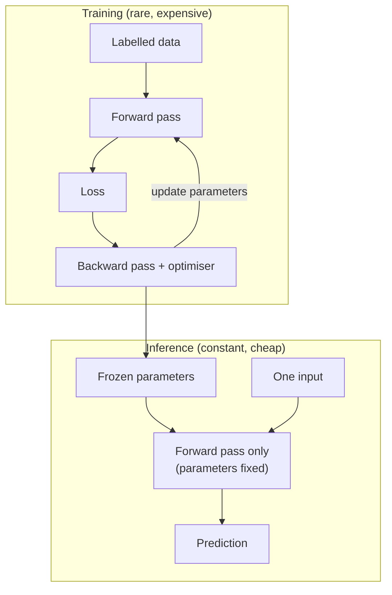

## In simple terms

A machine-learning model has two completely different jobs in its lifetime. **Training** is when you teach it: feed it labelled data, compute how wrong it is, nudge its parameters, repeat for millions of steps. **Inference** is when you use it: feed it one input, get one prediction out. Training is slow, expensive, and rare; inference is fast, cheap, and constant.

## The Visual Map



## More detail

The two phases differ on almost every axis. In **training**, the model parameters change; compute is a forward pass plus a backward pass plus an optimiser step; batches are large; hardware is GPU/TPU clusters; cost scales with total examples × parameters; and a run lasts days to weeks. In **inference**, nothing changes (parameters are fixed); compute is a forward pass only; batches are small (often 1); hardware can be anything from a CPU to a GPU; cost is driven by per-request latency; and it runs continuously.

For modern foundation models there's a third phase between them: **pre-training** (expensive, rare, learns general representations from huge data), **fine-tuning** (cheaper, narrows the model to a task), then **inference** in production. Inference has its own optimisation discipline: **quantisation** (store weights in 8- or 4-bit integers instead of 16/32-bit floats), **distillation** (train a small "student" to mimic a large "teacher"), **compilation** (turn the model graph into hardware-optimised code), and **batching/caching** (combine requests; cache key-value tensors in transformers). The economics of LLMs are now dominated by inference: pre-training is a one-time cost of millions, while serving the model to millions of users is a permanent operational expense that often dwarfs it.

## Under the Hood

The distinction is concrete in code: during training a parameter *moves*; during inference the same parameter is read-only and only the forward computation runs. This toy "model" makes the boundary explicit:

```python
# A 1-parameter model y = w*x. Train it, freeze w, then serve inferences.
data = [(1, 3), (2, 6), (3, 9)]          # y = 3x
w, lr = 0.0, 0.01

# ---- TRAINING: w changes every step ----
for _ in range(1000):
    grad = sum(2 * (w*x - y) * x for x, y in data) / len(data)
    w -= lr * grad
print(f"trained parameter w = {w:.3f}")

# ---- INFERENCE: w is frozen; only the forward pass runs ----
def infer(x): return w * x               # no gradient, no update
for x in (10, 42, 100):
    print(f"infer({x}) = {infer(x):.1f}")
```

At inference there is no loss, no gradient, and no optimiser — which is why "the model is just a matrix multiply at inference time" is roughly true, and why inference can run on far cheaper hardware than training.

## Engineering Trade-offs

- **Training cost vs inference cost.** Training is a big one-time bill; inference is a smaller per-request cost that, multiplied by billions of requests, usually dominates the lifetime spend.
- **Accuracy vs serving efficiency.** Quantisation and distillation shrink models for cheaper, faster inference at some accuracy cost — often a worthwhile trade in production.
- **Latency vs throughput.** Batching many requests improves GPU utilisation and throughput but adds queueing latency; interactive apps must balance the two.
- **Static vs online learning.** Freezing parameters makes inference cheap and reproducible; continuously updating them adapts to new data but risks drift and instability.

## Real-world examples

- ChatGPT was pre-trained for months on tens of thousands of GPUs; each chat you have is inference.
- An object-detection model runs inference on a phone in milliseconds, though it trained on a cluster for days.
- A recommendation system retrains nightly and serves inferences continuously.
- Large LLM services' inference bills run into the hundreds of millions per year — far more than the one-time training cost, which is why inference optimisation is so active.

## Common misconceptions

- **"The model 'learns' from each request."** Not unless the system is explicitly designed for online learning; most production models are static between training runs.
- **"Inference is free."** At scale, inference cost dwarfs training cost over a model's lifetime.

## Try it yourself

See the two phases in one script — train a parameter, freeze it, then serve predictions with no further updates (`python3` only):

```bash
python3 - <<'EOF'
data=[(1,3),(2,6),(3,9)]; w=0.0; lr=0.01
for _ in range(1000):                       # training: w moves
    w-=lr*sum(2*(w*x-y)*x for x,y in data)/len(data)
print(f"trained w = {w:.3f}")
infer=lambda x: w*x                          # inference: w frozen
print("inferences:", [round(infer(x),1) for x in (10,42,100)])
EOF
```

## Learn next

- [Supervised learning](/t/supervised-learning) — the classical setup that trains most models
- [Neural network](/t/neural-network) — the model family these phases apply to
- [Fine-tuning](/t/fine-tuning) — the cheaper middle phase between pre-training and inference
- [Large language model](/t/large-language-model) — where inference economics dominate
