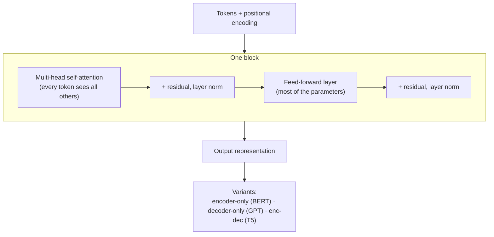

## In simple terms

A **transformer** is the neural-network design that learned to read whole sentences at once instead of one word at a time. It became the universal architecture for language — and then for images, audio, and code — because it parallelises beautifully on GPUs and gets better the more data you throw at it. Every modern large language model is a transformer.

## The Visual Map



## More detail

Introduced in "Attention Is All You Need" (Vaswani et al., 2017), the transformer replaced the recurrent and convolutional networks that previously dominated sequence modelling. Its key ingredients are **self-attention** (for each token, compute a weighted combination of all other tokens, letting every token see the whole sequence directly), **multi-head attention** (do this several times in parallel with different learned projections), **feed-forward layers** between attention layers, **positional encoding** (position is added explicitly since there's no recurrence), and **residual connections + layer normalisation** for trainability at depth. A transformer "block" stacks attention and feed-forward with residuals around each; a modern LLM stacks dozens to hundreds of these.

Three variants matter: **encoder-only** (BERT, bidirectional attention, great for understanding tasks like classification and retrieval), **decoder-only** (the GPT family, causal attention, dominant for generation and chat), and **encoder–decoder** (T5, common in translation). The transformer won for three reasons: **parallelism** (attention computes all positions at once, unlike RNNs — it loves GPUs), **predictable scaling** (performance keeps improving with more parameters and data, the empirical basis of large language models), and **generality** (the same architecture handles text, code, images via Vision Transformers, audio, and protein sequences). Without it, the 2020s AI boom would not exist in its current form.

## Under the Hood

The defining computation is **self-attention**: each token's output is a weighted average of every token's *value* vector, where the weights come from how well that token's *query* matches each *key*. Here it is end-to-end on a 3-token toy sequence, softmax and all:

```python
import math
def softmax(xs):
    m = max(xs); e = [math.exp(x - m) for x in xs]; s = sum(e)
    return [v / s for v in e]
def dot(a, b): return sum(x*y for x, y in zip(a, b))

# 3 tokens, each already projected to query/key/value (2-dim, hand-picked)
Q = [[1,0],[0,1],[1,1]]
K = [[1,0],[0,1],[1,1]]
V = [[10,0],[0,10],[5,5]]
d = len(Q[0])

for i, q in enumerate(Q):
    scores = [dot(q, k) / math.sqrt(d) for k in K]   # query · every key
    weights = softmax(scores)                         # how much to attend
    out = [sum(weights[j]*V[j][c] for j in range(len(V))) for c in range(d)]
    print(f"token {i}: attn weights {[round(w,2) for w in weights]} -> {[round(o,1) for o in out]}")
```

Each token "pulls in" a blend of the others according to relevance — stack this with feed-forward layers and residuals dozens of times and you have a GPT.

## Engineering Trade-offs

- **Parallelism vs quadratic cost.** Attending to all positions at once is GPU-friendly but costs O(n²) in sequence length — an 8K context does ~64M attention scores per head per layer, which is why long context is expensive.
- **Attention vs feed-forward.** Attention gets the headlines, but the feed-forward layers hold most parameters and much of the learned knowledge.
- **Depth vs trainability.** More blocks add capacity but need residual connections and normalisation to train at all.
- **Generality vs specialisation.** One architecture for every modality is a huge practical win, though modality-specific designs can still edge it out on narrow tasks.

## Real-world examples

- GPT, Claude, Gemini, Llama, Mistral — mostly decoder-only transformers.
- Stable Diffusion's text encoder is a transformer; modern image models often have transformers in their core too.
- AlphaFold-2's structure module is built from attention layers.
- "Linear attention" research exists precisely because the standard attention's quadratic cost dominates long-context budgets.

## Common misconceptions

- **"Transformers think."** They predict the next token from patterns in training data, very well. Whether that constitutes "thought" is a separate, contested question.
- **"Attention is the only thing that matters."** Feed-forward layers hold most of the parameters and do a lot of the work.

## Try it yourself

Compute one layer of self-attention by hand and see each token blend the others by relevance (`python3` only):

```bash
python3 - <<'EOF'
import math
def softmax(xs):
    m=max(xs); e=[math.exp(x-m) for x in xs]; s=sum(e); return [v/s for v in e]
dot=lambda a,b: sum(x*y for x,y in zip(a,b))
Q=[[1,0],[0,1],[1,1]]; K=Q; V=[[10,0],[0,10],[5,5]]; d=2
for i,q in enumerate(Q):
    w=softmax([dot(q,k)/math.sqrt(d) for k in K])
    out=[sum(w[j]*V[j][c] for j in range(3)) for c in range(d)]
    print(f"token {i}: weights {[round(x,2) for x in w]} -> {[round(o,1) for o in out]}")
EOF
```

## Learn next

- [Attention mechanism](/t/attention-mechanism) — the self-attention operation at the transformer's core
- [Large language model](/t/large-language-model) — what transformers are scaled into
- [Neural network](/t/neural-network) — the broader family the transformer belongs to
- [Embedding](/t/embedding) — the vector representations transformers consume and produce
