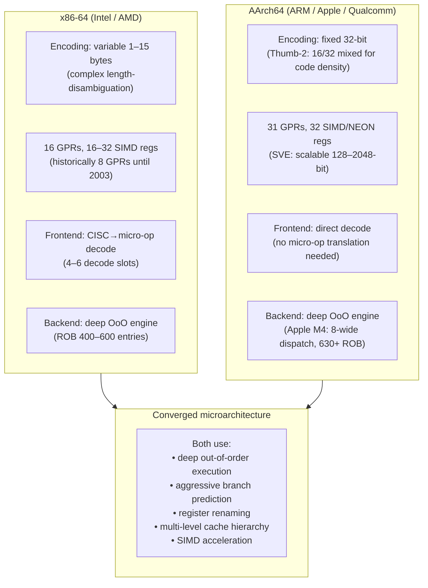

## In simple terms

x86 is the instruction set your laptop or server likely runs — descended from the Intel 8086 of 1978 and dominant in PCs, servers, and data centres for 40 years. ARM is the instruction set in every smartphone and increasingly in laptops (Apple M-series, Snapdragon X Elite) and servers (AWS Graviton, Ampere Altra). x86 historically prioritised performance; ARM prioritised power efficiency. Today, Apple's ARM chips outperform Intel's x86 in single-core benchmarks while using half the power, and 60% of new cloud CPU capacity is ARM.

## The Visual Map



## More detail

**RISC vs. CISC origins:**
x86 is CISC (Complex Instruction Set Computing): instructions are variable-length (1–15 bytes), high semantic density, many addressing modes. `SCASB` scans a string for a byte; `ENTER`/`LEAVE` manage stack frames. The design philosophy: let hardware do more work per instruction.

ARM is RISC (Reduced Instruction Set Computing): fixed-length 32-bit instructions (Thumb-2 adds 16-bit compressed mode), load-store architecture (arithmetic operates only on registers; only load/store accesses memory), orthogonal register set. Philosophy: simpler hardware, more instructions, compiler handles complexity.

**In practice, the distinction has blurred:**
Modern x86 CPUs decode complex instructions into micro-ops internally — the execution backend is effectively RISC. Modern ARM chips have complex out-of-order engines as wide as any x86 (Apple M4: 8-wide decode). Performance is determined by microarchitecture and process node, not ISA philosophy.

**x86 (AMD64 / x86-64):**
- 16 general-purpose 64-bit registers (GPRs), 16–32 SSE/AVX registers.
- Dominant in: desktop PCs, notebooks, servers, HPC.
- Only Intel and AMD manufacture x86 CPUs (closed ISA license).
- AVX-512: 512-bit SIMD, 16 float32 lanes per instruction.
- ~300 million PCs + ~15 million servers shipped per year.

**ARM (AArch64 / ARMv8-9+):**
- 31 general-purpose 64-bit registers, 32 NEON/SVE2 vector registers.
- Licensed ISA: Apple, Qualcomm, Amazon, NVIDIA, MediaTek, and others all design ARM chips.
- Dominant in: smartphones (>99%), tablets, IoT, embedded.
- Growing fast in: laptops (Apple M-series, Snapdragon X Elite), cloud servers (AWS Graviton, Ampere Altra, Google Axion).
- SVE2: scalable vector extension; vector width is implementation-defined (128–2048 bits) — one binary runs on all widths without recompilation.

**Performance comparison (2025):**

| Metric | x86-64 (Intel/AMD) | AArch64 (Apple/AWS) |
|---|---|---|
| Single-core peak | Competitive | Apple M4 leads in many benchmarks |
| Power efficiency | 100–250W TDP for desktop/server | 15–60W for equivalent performance |
| Server price-perf | Baseline | AWS Graviton3: ~40% better $/perf |
| Binary ecosystem | Mature (decades) | macOS: complete; Linux/Windows: growing |
| SIMD | AVX-512 (512-bit) | SVE2 (128–2048-bit scalable) |

## Under the Hood

Comparing the same tight loop compiled for x86-64 and AArch64 — showing the encoding difference:

```asm
; --- x86-64: dot product inner loop ---
; Uses AVX2 (256-bit): 8 float32 per VFMADD instruction
; Source: float dot(float *a, float *b, int n)
;
; rdi=a, rsi=b, edx=n, ymm0=accumulator
.loop_x86:
    vmovups ymm1, [rdi + rax*4]    ; load 8 floats from a[i..i+7]  (32 bytes)
    vfmadd231ps ymm0, ymm1, [rsi + rax*4]  ; ymm0 += ymm1 * b[i..i+7]
    add     rax, 8                  ; i += 8
    cmp     rax, rdx                ; compare to n
    jl      .loop_x86

; One instruction reads memory AND multiplies AND accumulates (CISC heritage).
; Hardware decodes this into: LOAD micro-op + FMA micro-op.

; --- AArch64: same dot product inner loop ---
; Uses NEON (128-bit): 4 float32 per FMLA instruction
; Source: same function compiled with aarch64-linux-gnu-gcc -O3 -march=armv8-a+simd
;
; x0=a, x1=b, w2=n, v0=accumulator
.loop_arm:
    ld1     {v1.4s}, [x0], #16      ; load 4 floats from a, advance pointer
    ld1     {v2.4s}, [x1], #16      ; load 4 floats from b, advance pointer
    fmla    v0.4s, v1.4s, v2.4s    ; v0 += v1 * v2 (RISC: explicit load first)
    subs    w2, w2, #4              ; n -= 4
    b.gt    .loop_arm               ; loop

; RISC requires separate load instructions. But fixed encoding means
; parallel decode: the CPU can start decoding the next instruction
; before knowing the current one's length.
```

The x86 version processes 8 floats per iteration (AVX2); the AArch64 version processes 4 (NEON 128-bit). With SVE2 at 512-bit, AArch64 could process 16. Performance depends on which specific CPU — the encoding tells only part of the story.

## Engineering Trade-offs

**Binary compatibility lock-in vs. architectural freedom**
x86's 40-year legacy means a binary compiled in 2003 runs on a 2025 Ryzen. Every ISA extension added since 1978 must remain correct in every new chip. ARM's licensed model allows Apple, Qualcomm, and Amazon to design custom microarchitectures within the ISA contract but without the binary compatibility baggage. RISC-V goes further: the entire ISA is publicly specified, no royalties, and no single company controls it.

**Register count vs. code density**
AArch64 has 31 GPRs vs. x86-64's 16. More registers mean fewer register spills to the stack, improving performance in register-heavy code (compilers, JIT engines, recursive algorithms). But each register reference requires 5 bits per field in the instruction encoding; x86 uses REX prefixes to extend from 8 to 16 registers, adding 1 byte. RISC-V has 32 GPRs (5 bits each); AArch64's 31 + zero register (also 5 bits) is the same.

**Closed ISA (x86) vs. licensed ISA (ARM) vs. open ISA (RISC-V)**
Only Intel and AMD can make x86 CPUs — the ISA is tightly controlled for compatibility (and competitive moat). ARM licenses its ISA to chip designers; Apple can design a radically different M-series microarchitecture while remaining binary compatible with all other ARM64 software. RISC-V requires no license at all — anyone can implement it, audit the spec, or add custom extensions. This matters for sovereignty: China's semiconductor strategy explicitly favours RISC-V over ARM (requires US export approval) and x86 (closed).

**Frequency scaling vs. IPC**
x86 historically scaled by increasing clock frequency (3–5 GHz); modern ARM designs scale by increasing IPC (instructions per cycle) at lower frequency (3–4 GHz). Apple M4 achieves higher IPC at 4 GHz than Intel's best at 5 GHz, partly from wider decode (8-wide vs. 6-wide), a larger ROB (630 vs. ~400 entries), and more architectural registers reducing spilling. Process node (Apple's 3nm vs. Intel's 7nm) amplifies this.

**Power envelope vs. performance ceiling**
x86 server chips (Intel Xeon, AMD EPYC) operate at 150–350W TDP because deep OoO, large caches, and high clock rates draw power. ARM server chips (AWS Graviton 3: 55W) achieve comparable throughput on most workloads at lower power, which directly translates to lower cloud operating cost ($electricity + $cooling + $rack density). For HPC where absolute peak matters more than power, x86 + AVX-512 still leads on specific numerical kernels.

## Real-world examples

- **Apple Silicon (M1–M4, 2020–)** — Apple moved the Mac lineup from Intel x86 to ARM64 in 2020. Rosetta 2 translates x86 binaries at first launch; native ARM64 apps run at 2–3× the performance of x86 equivalents. M4 MacBook Pro has longer battery life than equivalent Intel models while matching or exceeding performance.
- **AWS Graviton3 (AArch64)** — Amazon's ARM server chip, manufactured by TSMC at 5nm; runs most AWS services internally. Available as C7g, M7g, R7g instances; Amazon reports 40% better price-performance than x86 for web workloads. Used for S3, EC2 control plane, and Lambda.
- **Qualcomm Snapdragon X Elite** — ARM laptop SoC shipping in Windows PCs competing directly with Intel Core Ultra for developer and consumer workloads; ran Chrome, VS Code, and WSL natively on ARM in 2024.
- **RISC-V in production** — SiFive, Western Digital, Espressif, Alibaba, and dozens of others ship RISC-V cores without ARM license fees. China's open-source Xuantie C906 is widely deployed in embedded hardware.
- **Android on ARM** — every Android device is AArch64. The Google Play Store serves ~3 billion users exclusively on ARM. The entire Android ecosystem (apps, libraries, NDK) is ARM-first.

## Common misconceptions

- **"RISC is always more efficient than CISC."** This was true when hardware complexity dominated (1980s). Today's x86 chips decode to RISC-like micro-ops internally. The key differentiators are microarchitecture, process node, and design investment — not ISA encoding.
- **"ARM can't match x86 performance."** Apple M4 leads Intel Core in single-thread benchmarks; AWS Graviton3 matches AMD EPYC on server workloads. The historical performance gap has closed in client and general server workloads.
- **"x86 is doomed."** The installed base of x86 systems (300M PCs + datacenter) takes decades to replace. ARM is winning new deployments; replacing existing x86 infrastructure is a 20–30 year transition.

## Try it yourself

Check which ISA your CPU implements, and what extensions are available:

```bash
python3 - << 'EOF'
import platform, subprocess, sys

machine = platform.machine()
print(f"ISA: {machine}")
print(f"Processor: {platform.processor()}")
print()

if machine in ('x86_64', 'AMD64', 'i686'):
    print("x86-64 CPU detected. Checking SIMD extensions...")
    try:
        # Read /proc/cpuinfo on Linux
        with open('/proc/cpuinfo') as f:
            flags = [l for l in f if l.startswith('flags')]
            if flags:
                all_flags = flags[0].split(':')[1].strip().split()
                simd = [f for f in all_flags if f in
                        ('sse','sse2','sse4_1','sse4_2','avx','avx2','avx512f')]
                print(f"SIMD flags: {simd}")
    except FileNotFoundError:
        # Windows: use wmic
        result = subprocess.run(
            ['wmic', 'cpu', 'get', 'name', '/value'],
            capture_output=True, text=True)
        print(result.stdout.strip())

elif machine in ('aarch64', 'arm64', 'ARM64'):
    print("AArch64 (ARM64) CPU detected.")
    try:
        with open('/proc/cpuinfo') as f:
            features = [l for l in f if l.startswith('Features')]
            if features:
                feats = features[0].split(':')[1].strip().split()
                neon = 'asimd' in feats  # NEON = Advanced SIMD
                sve  = 'sve' in feats
                print(f"NEON (SIMD): {neon}")
                print(f"SVE (scalable SIMD): {sve}")
    except FileNotFoundError:
        print("(cpuinfo not available on this platform)")

print()
print(f"Python bits: {8 * __import__('struct').calcsize('P')}-bit")
print(f"Platform: {sys.platform}")
EOF
```

## Learn next

- [RISC vs CISC](/t/risc-vs-cisc) — the foundational ISA design philosophy behind ARM and x86; explains why the two architectures look the way they do and how the distinction has blurred.
- [Instruction Set](/t/instruction-set) — the formal definition of what an ISA specifies: instructions, registers, encoding, memory model, privilege levels.
- [SIMD](/t/simd) — both ARM (NEON, SVE) and x86 (SSE, AVX, AVX-512) have SIMD extensions; SIMD is where the two ISAs diverge most in implementation detail.
