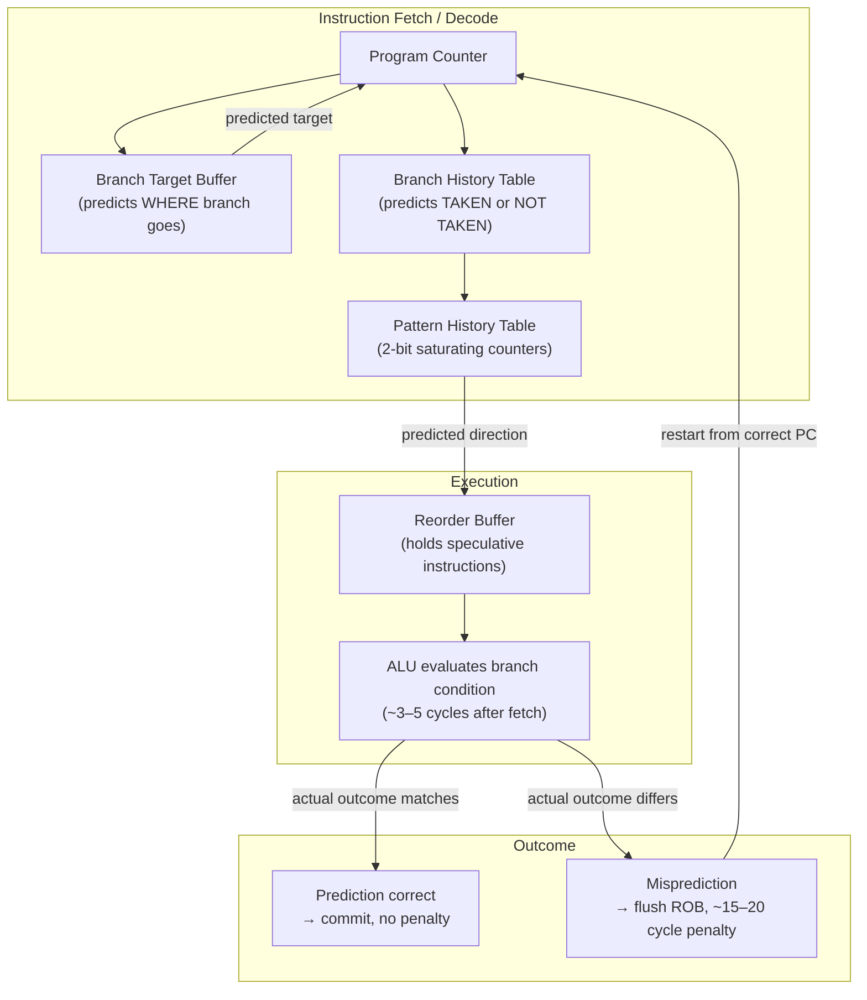

## In simple terms

Modern CPUs run instructions on an assembly line (a pipeline), starting the next instruction before the previous one finishes. But a **branch** — an `if`, a loop, a function call — creates a problem: the CPU doesn't yet know *which* instruction comes next until the condition is evaluated. Rather than wait and let the pipeline sit idle, the CPU **guesses** which way the branch will go and races ahead on that assumption. **Branch prediction** is the machinery that makes those guesses, and it's astonishingly good — modern predictors are right well over 95% of the time.

## The Visual Map



## More detail

When a branch is encountered, the pipeline has a dozen-plus instructions in flight, but it doesn't know the branch's direction for several cycles. The cost of waiting (a **pipeline stall**) is high, so the CPU predicts and **speculatively executes** the predicted path.

- **Correct prediction** — the speculative work is kept; effectively the branch was free.
- **Misprediction** — the CPU must **flush** all the wrongly-executed instructions and restart from the correct path, wasting ~15–20 cycles on a deep pipeline.

**Predictor types, from simple to advanced:**

| Predictor | How it works | Accuracy |
|---|---|---|
| Static (always-not-taken) | No hardware table; compiler-coded hint | ~50% |
| Bimodal (1-bit counter) | 1-bit per-branch state: last taken/not-taken | ~80% |
| Two-level adaptive (2-bit) | 2-bit saturating counter per branch; hysteresis against noise | ~90% |
| Correlating (gselect, gshare) | Indexes into table using branch address XOR global history; captures pattern correlation | ~93% |
| TAGE (Tournament + Geometric) | Family of tagged history tables at increasing history lengths; a miss in a short table falls back to a longer one | ~97%+ |

**Branch Target Buffer (BTB):** a separate cache predicting the *destination address* of indirect branches (function pointer calls, virtual dispatch, `switch`). Without the BTB, the CPU would have to decode the instruction just to find where to fetch next.

**Return Address Stack (RAS):** a small hardware stack (~16 entries) that records the return address for every `CALL` instruction, allowing `RET` instructions to be predicted at near-100% accuracy without waiting for the actual stack read.

Predictors learn from history. A branch the predictor *can't* learn (truly random data comparison) is far more expensive than a predictable one — which is why sorting data before a loop, or going branchless (`cmov`, bitmasking), can dramatically speed up hot code.

A famous and sobering footnote: speculative execution driven by branch prediction is the basis of the **Spectre** class of security vulnerabilities (2018) — the CPU's transient, mispredicted execution leaves measurable traces in the cache that attackers can read.

## Under the Hood

A 2-bit saturating counter — the fundamental building block of most hardware predictors:

```python
#!/usr/bin/env python3
"""Simulate a 2-bit saturating counter branch predictor (bimodal)."""

class TwoBitCounter:
    """States: 0=StrongNT, 1=WeakNT, 2=WeakTaken, 3=StrongTaken."""
    def __init__(self):
        self.state = 2  # start weakly-taken

    def predict(self):
        return self.state >= 2   # True = predict Taken

    def update(self, actual_taken: bool):
        if actual_taken:
            self.state = min(3, self.state + 1)
        else:
            self.state = max(0, self.state - 1)

STATE_NAMES = ["StrongNT", "WeakNT", "WeakTaken", "StrongTaken"]

def simulate(branch_outcomes, label):
    counter = TwoBitCounter()
    correct = 0
    print(f"\n{label}")
    print(f"  {'Actual':<8} {'Predicted':<10} {'State after':<14} {'Correct?'}")
    for taken in branch_outcomes:
        pred = counter.predict()
        counter.update(taken)
        hit = pred == taken
        correct += hit
        mark = "yes" if hit else "MISS"
        print(f"  {'T' if taken else 'NT':<8} {'T' if pred else 'NT':<10} "
              f"{STATE_NAMES[counter.state]:<14} {mark}")
    print(f"  Accuracy: {correct}/{len(branch_outcomes)} = {100*correct/len(branch_outcomes):.0f}%")

# Loop branch: taken 9x, then not-taken once — very predictable
simulate([True]*9 + [False], "Loop branch (9 taken, 1 not-taken)")

# Alternating: TNTNTN — 2-bit counter struggles with period-2 pattern
simulate([True, False]*5, "Alternating TNTN (pathological for 2-bit)")

# Random: ~50% accuracy ceiling without pattern history
import random; random.seed(42)
simulate([random.random() < 0.5 for _ in range(10)], "Random 50/50 branch")
```

## Engineering Trade-offs

**Predictor complexity vs. die area and power**
More sophisticated predictors (TAGE, perceptron) require larger tables and more logic, consuming die area and power. AMD's Zen 4 branch predictor has 16 KB of per-thread branch history. A simpler predictor (ARM Cortex-M's 2-bit bimodal) fits in a few hundred bytes. The trade-off is direct: more predictor accuracy costs silicon.

**Prediction depth vs. misprediction penalty**
Deeper pipelines achieve higher clock frequencies but increase the misprediction penalty (more instructions to flush). The Pentium 4 had a 20–31 stage pipeline, making a misprediction cost ~20 cycles. Modern Intel/AMD designs target 14–18 stages, balancing clock rate against penalty. Some CPUs add pipeline shortcut paths that resolve simple branches earlier to reduce the penalty.

**Speculative execution vs. security**
Every branch predictor enables speculative execution. Mispredicted speculation leaves microarchitectural state (cache lines, TLB entries) that can be observed by side-channel attacks. Spectre variants exploit this to read memory across security boundaries. Mitigations (IBRS, retpolines, LFENCE, KPTI) disable or slow speculation — the cost is 5–30% throughput loss on syscall-intensive workloads. This is a permanent trade-off between performance and isolation.

**Static hints vs. dynamic prediction**
Compilers can emit static branch hints (`__builtin_expect`, `[[likely]]`, `LLVM_LIKELY`) based on profiling data, helping the predictor on cold branches with little history. PGO (Profile-Guided Optimisation) lets the compiler reorder code so the likely path is the fall-through (no branch), which some CPUs prefer statically. Dynamic predictors trained at runtime are more accurate on stable patterns; static hints help before the predictor has learned.

**Branchless code vs. branchy code**
Converting `if (a > b) min = b; else min = a;` to `min = a + ((b - a) & -(b < a))` (branchless) eliminates the branch entirely — but produces more instructions. For a highly predictable branch (>95% one way), the predictor wins; the branch is nearly free. For an unpredictable branch (coin-flip), branchless always wins. The crossover point is roughly 85% prediction accuracy, which is easy to cross with profiling.

## Real-world examples

- **Sorted vs. unsorted array sum** — the famous Stack Overflow benchmark: sorting an array before summing only its values above a threshold runs ~4× faster than the unsorted version, because the branch `if (data[c] >= 128)` becomes perfectly predictable after sorting. The unsorted version generates random branch outcomes the predictor can't learn.
- **Spectre (CVE-2017-5753)** — weaponized speculative execution after a mispredicted bounds check: trains the predictor to predict "in bounds" for a secret-dependent load, reads the speculatively loaded value via a cache side-channel. Required patches to every major OS, hypervisor, and browser.
- **Linux kernel `likely`/`unlikely` macros** — wrap `__builtin_expect`; used thousands of times in hot paths (error-path branches marked `unlikely`, success-path marked `likely`) so the compiler generates fall-through code for the common case.
- **V8 (JavaScript engine)** — uses `[[Likely]]` profile feedback to rearrange JIT-compiled code, placing the hot branch arm as fall-through; a hidden class miss (polymorphic dispatch) hits the slow path predicted "not taken."
- **Tournament predictors (AMD, Intel)** — maintain two predictors (a local-history predictor and a global-history predictor) plus a meta-predictor that selects which predictor is more accurate for each branch; a branch that exhibits simple local history uses the local predictor; a branch correlated with global program history uses the global one.

## Common misconceptions

- **"A mispredict just makes things a little slower."** On a deep modern pipeline a single mispredict costs 15–20 cycles. At 3 GHz, 20% branch frequency, and 5% misprediction rate, that is ~300 million wasted cycles per second per core. Branchy hot loops with unpredictable outcomes are a real performance bottleneck.
- **"Predictable branches are slow."** It's the opposite: a consistently-taken or consistently-not-taken branch is essentially free after the predictor learns it; *unpredictable* branches are the expensive ones.
- **"Branchless code is always faster."** Branchless avoids misprediction but uses more instructions and sometimes more registers. For a branch the predictor can learn (consistent direction), the branch is cheaper. Branchless wins only when the branch is genuinely unpredictable.

## Try it yourself

Measure the concrete cost of an unpredictable branch vs. a predictable one:

```bash
python3 - << 'EOF'
import time, array, random

N = 5_000_000
random.seed(0)
data = array.array('l', [random.randint(0, 255) for _ in range(N)])
data_sorted = array.array('l', sorted(data))

def sum_above_threshold(arr, threshold=128):
    s = 0
    for x in arr:
        if x >= threshold:
            s += x
    return s

# Warm up
sum_above_threshold(data)
sum_above_threshold(data_sorted)

# Time unsorted (branch: random, ~50% predictability)
t0 = time.perf_counter()
r1 = sum_above_threshold(data)
unsorted_ms = (time.perf_counter() - t0) * 1000

# Time sorted (branch: first half always NT, second half always T)
t0 = time.perf_counter()
r2 = sum_above_threshold(data_sorted)
sorted_ms = (time.perf_counter() - t0) * 1000

print(f"Unsorted data  (unpredictable branch): {unsorted_ms:.1f} ms  sum={r1}")
print(f"Sorted data    (predictable branch):   {sorted_ms:.1f} ms  sum={r2}")
print(f"Speedup from sorting: {unsorted_ms/sorted_ms:.1f}x")
print()
print("Note: Python's overhead masks the raw effect. In C/C++ the")
print("speedup from sorting is typically 3-5x on this benchmark.")
EOF
```

## Learn next

- [CPU Pipeline](/t/cpu-pipeline) — branch prediction exists solely to keep the pipeline full; understanding pipeline stages and hazards is the prerequisite for understanding why misprediction is costly.
- [Speculative Execution](/t/speculative-execution) — the broader technique branch prediction enables; covers Spectre/Meltdown side-channel attacks and the hardware mitigations in depth.
- [Out-of-Order Execution](/t/out-of-order-execution) — works alongside branch prediction; the reorder buffer holds all speculative instructions and is flushed on misprediction.
- [Superscalar](/t/superscalar) — issuing multiple instructions per cycle amplifies both the benefit of correct prediction (more work done per speculative cycle) and the cost of misprediction (more instructions flushed).
