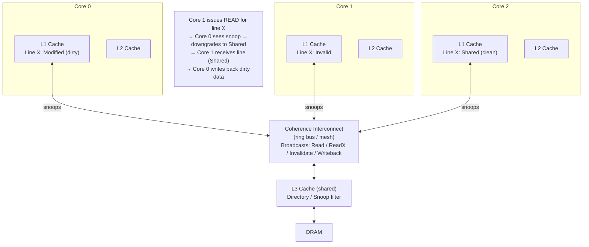

## In simple terms

Every CPU core has its own cache. If core A writes a value to memory and core B reads the same address, B's cache might still have the old value. **Cache coherence** is the hardware protocol that makes this look like it doesn't happen: it invalidates, updates, and synchronises caches so all cores agree on the value at any address. Without it, multithreaded programming would be far more painful.

## The Visual Map



## More detail

The dominant coherence protocol is **MESI** and its variants (MOESI, MESIF). Each cache line is in one of four states:

| State | Meaning | Other caches |
|---|---|---|
| **Modified** | This cache has the only copy; dirty (differs from memory) | No other copies |
| **Exclusive** | This cache has the only copy; clean (matches memory) | No other copies |
| **Shared** | This cache has a clean copy | One or more other caches also have clean copies |
| **Invalid** | This cache line is stale; must re-fetch | May or may not exist elsewhere |

State transitions are triggered by bus transactions:

- **Read (RD):** issued on a read miss. Snooping caches respond if they have the line. Modified → Shared (owner writes back). Exclusive → Shared.
- **Read-Exclusive (RdX / BusUpgr):** issued on a write. All other caches must invalidate their copy. Modified owner writes back. Requester gets the line in Modified state.
- **Writeback (WB):** issued when a Modified line is evicted. RAM is updated; line transitions to Invalid.

**Snooping vs. directory protocols:** with ≤8 cores, snooping (broadcast on a shared bus) is practical. With ≥8–16 cores, the bus becomes a bottleneck; directory protocols track which cores have a line and send point-to-point messages only to relevant parties. Intel Xeon and AMD EPYC use directory-augmented ring/mesh interconnects.

Why coherence matters to programmers:

- **False sharing** — two cores writing to *different* variables that share a 64-byte cache line ping-pong the line between caches in Modified state, even though the variables are logically independent. The line transitions M → I → M → I continuously, serialising what should be parallel writes. The fix: pad hot per-thread data to 64-byte boundaries (`alignas(64)` in C++, `#[repr(align(64))]` in Rust, `@Contended` in Java).
- **Memory model** — coherence guarantees per-address consistency but not *ordering* of operations across different addresses. That ordering — "if I wrote A then B, will you always see B after A?" — is the memory model. TSO (x86), release/acquire (ARM, C++ atomics), sequential consistency each make different guarantees. Memory fences / atomic operations carry the necessary ordering constraints.
- **Atomic operations** — `compare_and_swap`, `fetch_add` are coherent by design but more expensive than a normal write because they acquire exclusive ownership of the cache line (Modified state) even when no other cache has it — the bus transaction is mandatory.

## Under the Hood

Simulating MESI state transitions for two cores contending on one cache line:

```python
#!/usr/bin/env python3
"""MESI coherence protocol simulation: 2 cores, 1 cache line."""

STATES = {"M": "Modified", "E": "Exclusive", "S": "Shared", "I": "Invalid"}

class MESILine:
    def __init__(self, core_id):
        self.core = core_id
        self.state = "I"

    def __repr__(self):
        return f"Core{self.core}[{self.state}={STATES[self.state]}]"

def read(cores, requester_id):
    req = cores[requester_id]
    others = [c for c in cores if c.core != requester_id]

    # Check if any other core has Modified copy (must write back first)
    for c in others:
        if c.state == "M":
            print(f"  Core{c.core} writes back dirty line (M→S)")
            c.state = "S"

    if req.state == "I":
        # Any core has Shared or Exclusive? → go Shared; else → Exclusive
        shared_exists = any(c.state in ("S", "E") for c in others)
        req.state = "S" if shared_exists else "E"
        for c in others:
            if c.state == "E":
                c.state = "S"  # E→S when another reader joins
        print(f"  Core{requester_id} READ  → {req.state}")
    else:
        print(f"  Core{requester_id} READ  (already {req.state}, no change)")

def write(cores, requester_id):
    req = cores[requester_id]
    others = [c for c in cores if c.core != requester_id]

    if req.state in ("S", "I"):
        # Issue BusUpgr / RdX: invalidate all other copies
        for c in others:
            if c.state != "I":
                print(f"  Core{c.core} invalidated ({c.state}→I) by BusUpgr")
                c.state = "I"

    req.state = "M"
    print(f"  Core{requester_id} WRITE → M (exclusive dirty)")

# Two cores competing for line X
c0, c1 = MESILine(0), MESILine(1)
cores = [c0, c1]

print("Initial:", cores)
print("\n-- Core 0 reads --")
read(cores, 0);  print(" ", cores)
print("\n-- Core 1 reads --")
read(cores, 1);  print(" ", cores)
print("\n-- Core 0 writes --")
write(cores, 0); print(" ", cores)
print("\n-- Core 1 reads (triggers Core 0 writeback) --")
read(cores, 1);  print(" ", cores)
print("\n-- Core 1 writes (upgrade: S→M, Core 0 invalidated) --")
write(cores, 1); print(" ", cores)
```

## Engineering Trade-offs

**Snooping vs. directory protocol**
Snooping broadcasts every coherence message on a shared bus — simple and low-latency but the bus bandwidth scales poorly. At 16+ cores, directory protocols (a distributed table tracking which cores have each line) send point-to-point messages, dramatically reducing broadcast overhead. Directory protocols have higher per-message latency but aggregate bandwidth that scales with core count. Nearly all modern multi-core CPUs use directory-augmented hierarchies.

**False sharing performance vs. struct layout**
False sharing costs performance because a line bounces between cores even when threads write different variables. The fix — padding each hot variable to a 64-byte cache line — wastes memory but can improve throughput by 10–100× on hot contended counters. The tradeoff: more memory, less cache utilisation per byte, but no serialisation on coherence traffic.

**NUMA topology vs. coherence latency**
In a multi-socket server, coherence must run across inter-socket links (PCIe or UPI/Infinity Fabric). A read that hits a remote socket's Modified cache pays ~200–300 ns instead of ~10–20 ns. NUMA-aware programming (binding threads to NUMA nodes, allocating memory local to the accessing core) is essential at 4+ socket scale.

**Strong memory model (TSO, x86) vs. weak model (ARM, RISC-V)**
x86's Total Store Order guarantees every store becomes globally visible in program order; this simplifies correctness but requires more hardware synchronisation. ARM and RISC-V use weaker models (acquire/release) that allow more reordering for better throughput but require explicit memory barriers from the programmer. The coherence protocol itself is separate from the memory model — x86 and ARM both have MESI-class coherence, but the ordering guarantees on top differ.

**Coherent vs. non-coherent accelerators**
CPUs on the same socket are always coherent with each other. GPUs, FPGAs, and DMA engines historically were not — they required explicit cache flush/invalidate operations on the CPU side. CXL (Compute Express Link) and ARM CoreLink CMN are adding hardware-coherent interconnects for accelerators, allowing GPU and CPU to share the same coherence domain without software flushing.

## Real-world examples

- **Java `@Contended`** — Java 8+ annotation (exposed via `sun.misc.Contended`) pads fields to 128 bytes (two cache lines, for spatial safety) so the JVM avoids false sharing on hot counters; the LMAX Disruptor uses this pattern to achieve 100M+ ops/sec on its ring buffer sequence numbers.
- **Linux `____cacheline_aligned_in_smp`** — macro placing per-CPU counters on their own cache line; used extensively in the kernel's network stack and scheduler.
- **AMD EPYC / Intel Xeon directory coherence** — multi-socket Xeon uses an UPI ring; AMD EPYC uses Infinity Fabric between chiplets. Both implement directory-based coherence to avoid broadcast across >16 cores.
- **Apple M-series unified memory** — CPU and GPU cores share the same physical DRAM and the same coherence domain; no explicit DMA or cache flushing needed to pass a Metal texture from CPU to GPU. This enables Metal's zero-copy buffer sharing.
- **Meltdown / Spectre (2018)** — the speculative access that Meltdown exploits leaves a cache line in Modified state in the attacking process's L1; the attacker reads the timing of its own cache lines to infer the secret value the CPU speculatively loaded.

## Common misconceptions

- **"Cache coherence means my multithreaded code is correct."** Coherence guarantees per-address consistency (you always read the most recently written value for a single variable). It does not guarantee ordering across different addresses. A data race — writing A then B on one thread, reading B then A on another — can still see B without A, even on a coherent machine, because the memory model permits reordering. Atomics and fences are still required.
- **"Atomic operations are slow because of locks."** They're slow because they must acquire exclusive ownership of the cache line via the coherence protocol — a BusUpgr transaction that invalidates all other copies. No software lock is involved; the cost is the hardware bus transaction latency, which is ~20–200 ns depending on contention and NUMA topology.

## Try it yourself

Demonstrate false sharing — two threads updating adjacent values in the same cache line vs. separate cache lines:

```bash
python3 - << 'EOF'
import threading, time, array

ITERATIONS = 2_000_000

def bench(use_padding):
    if use_padding:
        # Pad to 64 bytes (16 int32s): each counter on its own cache line
        shared = array.array('l', [0] * 32)
        idx_a, idx_b = 0, 16
    else:
        # No padding: both counters in the same cache line
        shared = array.array('l', [0, 0])
        idx_a, idx_b = 0, 1

    def inc_a():
        for _ in range(ITERATIONS): shared[idx_a] += 1

    def inc_b():
        for _ in range(ITERATIONS): shared[idx_b] += 1

    t0 = time.perf_counter()
    ta = threading.Thread(target=inc_a)
    tb = threading.Thread(target=inc_b)
    ta.start(); tb.start()
    ta.join();  tb.join()
    return (time.perf_counter() - t0) * 1000, shared[idx_a], shared[idx_b]

# Note: Python's GIL serialises threads — real false-sharing effect needs C.
# This demo shows the concept; run the C version (below) for real numbers.
ms_shared, a1, b1 = bench(use_padding=False)
ms_padded, a2, b2 = bench(use_padding=True)

print(f"Shared cache line  (false sharing): {ms_shared:.0f} ms  (a={a1}, b={b1})")
print(f"Separate cache lines (padded):      {ms_padded:.0f} ms  (a={a2}, b={b2})")
print()
print("Python's GIL means both threads don't truly run in parallel.")
print("In C with pthreads, the padded version is typically 5-10x faster")
print("on this benchmark due to eliminating coherence ping-pong.")
EOF
```

## Learn next

- [Cache](/t/cache) — the hardware this protocol guards; cache line structure, eviction policies, and miss types are the prerequisite for understanding what coherence is synchronising.
- [Memory Hierarchy](/t/memory-hierarchy) — where cache coherence fits in the full storage hierarchy, including NUMA topology and the implications of coherence across sockets.
- [Out-of-Order Execution](/t/out-of-order-execution) — OoO CPUs can reorder memory operations within a core, adding another layer of apparent inconsistency on top of coherence; memory barriers exist at this intersection.
