## In simple terms

A CPU could finish one instruction completely before starting the next, but most of its hardware would sit idle most of the time. A **pipeline** splits each instruction into a sequence of stages (fetch, decode, execute, write back) and feeds new instructions in continuously, so different parts of the CPU are busy on different instructions simultaneously — like an assembly line in a factory.

The result: in steady state, the CPU finishes one instruction per clock cycle rather than one per *N* cycles, where N is the number of stages.

## The Visual Map

```mermaid
gantt
    title 5-Stage RISC Pipeline (5 instructions)
    dateFormat X
    axisFormat %L

    section I1 (ADD)
    IF  :a1, 0, 1
    ID  :a2, 1, 1
    EX  :a3, 2, 1
    MEM :a4, 3, 1
    WB  :a5, 4, 1

    section I2 (LOAD)
    IF  :b1, 1, 1
    ID  :b2, 2, 1
    EX  :b3, 3, 1
    MEM :b4, 4, 1
    WB  :b5, 5, 1

    section I3 (SUB)
    IF  :c1, 2, 1
    ID  :c2, 3, 1
    EX  :c3, 4, 1
    MEM :c4, 5, 1
    WB  :c5, 6, 1

    section I4 (BRANCH)
    IF  :d1, 3, 1
    ID  :d2, 4, 1
    EX  :d3, 5, 1
    MEM :d4, 6, 1
    WB  :d5, 7, 1

    section I5 (MUL)
    IF  :e1, 4, 1
    ID  :e2, 5, 1
    EX  :e3, 6, 1
    MEM :e4, 7, 1
    WB  :e5, 8, 1
```



## More detail

The classic five-stage RISC pipeline:

1. **IF** — Instruction Fetch: read the next instruction from the instruction cache.
2. **ID** — Instruction Decode: decode the opcode, identify source registers, read register file.
3. **EX** — Execute: the ALU performs the arithmetic or logic operation, or computes a memory address.
4. **MEM** — Memory Access: load data from or store data to the data cache.
5. **WB** — Write Back: store the result into the destination register.

With a 5-stage pipeline, the CPU finishes one instruction per cycle in steady state (not one per five cycles). Real CPUs have 10–20 stages to allow higher clock frequencies.

**Hazards** — the conditions that prevent steady-state throughput:

| Hazard | Cause | Solution |
|---|---|---|
| **Data** | Instruction B needs A's result before A completes WB | Forwarding (route result early) or stall (insert bubbles) |
| **Control** | Branch outcome unknown until EX; IF already loaded next instruction | Branch prediction: guess the target, speculate ahead, flush on miss |
| **Structural** | Two stages need the same hardware unit simultaneously | Duplicate the unit (separate I-cache and D-cache) |

**Forwarding** (bypass paths) detects that a result computed in EX or MEM is needed by the next instruction and routes it directly to the next instruction's ALU input, without waiting for WB. Forwarding eliminates most data hazard stalls in RISC pipelines.

**Branch penalties** — on a deeply pipelined CPU, a branch misprediction costs however many instructions were already in-flight when the branch resolved. On a 16-stage pipeline this is 12–14 cycles. At 3 GHz with 20% branch frequency and 5% misprediction rate, mispredictions cost ~300 million wasted cycles per second per core.

Modern CPUs layer additional techniques on top of the basic pipeline: **superscalar** execution (multiple parallel pipelines, 3–8 instructions per cycle), **out-of-order execution** (reorder instructions around stalls), and **simultaneous multithreading / SMT** (interleave two threads' instructions in the same pipeline to keep stages fed when one thread stalls).

Pipelining is the technique that lets a 3 GHz CPU do a few billion operations per second. It is the foundation of every other architectural trick in a modern processor.

## Under the Hood

A Python simulation of a 5-stage pipeline showing how a load-use data hazard requires a stall bubble:

```python
#!/usr/bin/env python3
"""Simulate a 5-stage RISC pipeline with data hazard detection and forwarding."""

STAGES = ["IF", "ID", "EX", "MEM", "WB"]

class Instruction:
    def __init__(self, name, dest=None, src=None, is_load=False):
        self.name = name
        self.dest = dest      # destination register
        self.src  = src or [] # source registers
        self.is_load = is_load

def simulate(instructions, forwarding=True):
    pipeline = [None] * 5  # one slot per stage
    cycle = 0
    issued = 0
    stalls = 0
    history = []

    while issued < len(instructions) or any(p is not None for p in pipeline):
        cycle += 1
        row = [None] * 5

        # Check for load-use hazard: if EX stage has a LOAD and ID needs its result
        hazard = False
        if pipeline[2] and pipeline[1]:  # EX and ID are occupied
            ex_instr = pipeline[2]
            id_instr = pipeline[1]
            if ex_instr.is_load and ex_instr.dest in id_instr.src:
                if not forwarding or ex_instr.is_load:
                    hazard = True  # must stall even with forwarding: LOAD result not ready until MEM

        # Advance stages (WB ← MEM ← EX ← ID ← IF ← new)
        if hazard:
            # Stall: freeze IF and ID, insert bubble in EX
            row[4] = pipeline[4]  # WB
            pipeline[4] = pipeline[3]  # MEM→WB
            row[3] = pipeline[3]
            pipeline[3] = pipeline[2]  # EX→MEM
            row[2] = pipeline[2]
            pipeline[2] = None    # bubble
            row[1] = pipeline[1]  # ID stays
            row[0] = pipeline[0]  # IF stays
            stalls += 1
        else:
            row[4] = pipeline[4]; pipeline[4] = pipeline[3]
            row[3] = pipeline[3]; pipeline[3] = pipeline[2]
            row[2] = pipeline[2]; pipeline[2] = pipeline[1]
            row[1] = pipeline[1]; pipeline[1] = pipeline[0]
            row[0] = pipeline[0]
            if issued < len(instructions):
                pipeline[0] = instructions[issued]
                issued += 1
            else:
                pipeline[0] = None

        history.append((cycle, [i.name if i else "---" for i in row]))

    return history, stalls

instrs = [
    Instruction("LOAD  R1,[mem]", dest="R1", src=[],       is_load=True),
    Instruction("ADD   R2,R1,R3", dest="R2", src=["R1"]),  # uses R1 from LOAD
    Instruction("SUB   R4,R2,R5", dest="R4", src=["R2"]),
    Instruction("MUL   R6,R4,R7", dest="R6", src=["R4"]),
]

print("Pipeline trace (load-use hazard with forced stall):\n")
history, stalls = simulate(instrs, forwarding=True)
print(f"  {'Cycle':>5}  {'IF':<20}{'ID':<20}{'EX':<20}{'MEM':<20}{'WB'}")
for cycle, stages in history:
    print(f"  {cycle:>5}  {stages[0]:<20}{stages[1]:<20}{stages[2]:<20}{stages[3]:<20}{stages[4]}")
print(f"\n  Stall bubbles inserted: {stalls}")
print(f"  Total cycles: {history[-1][0]}  (vs. {len(instrs)} without hazards)")
```

## Engineering Trade-offs

**Pipeline depth (stages) vs. clock frequency vs. misprediction penalty**
More stages → each stage does less work → the clock can run faster. But a branch misprediction must flush the entire in-flight pipeline. The Pentium 4's NetBurst was 20–31 stages — very high clock frequency but catastrophic misprediction penalty (~20 cycles). Modern Intel/AMD cores use 12–16 stages as a better compromise. ARM Cortex-M0 uses 3 stages for simplicity in microcontrollers.

**Forwarding hardware vs. stall cycles**
Forwarding (bypass paths) adds wiring across pipeline stages to route results early. It eliminates most data hazard stalls but increases circuit complexity and may limit clock frequency. Simple pipelines (embedded RISC) omit bypass paths and require the compiler to insert NOPs; complex pipelines implement full forwarding in hardware and expect no software NOPs.

**Deeper pipelines vs. wider (superscalar)**
A deeper pipeline achieves higher clock rates but doesn't increase IPC (instructions per cycle). A wider superscalar issues more instructions per cycle at the same clock rate, increasing IPC. Modern CPUs do both: ~15 stages deep, 4–6 instructions wide per cycle. Width is limited by instruction-level parallelism (ILP) in the code — data dependencies are the ceiling.

**Speculative execution vs. security**
Speculating past a branch (or past a load of a secret value) and then squashing on misprediction leaves microarchitectural side effects (cache state). Spectre (2018) exploited this: cause the CPU to speculate into code that reads a secret, then observe the cache state. Mitigations (IBRS, retpolines, KPTI) cost 5–30% throughput in some workloads — a direct price of speculative execution.

**In-order vs. out-of-order execution**
In-order pipelines execute instructions in program order; a stall on instruction N stalls all subsequent instructions. Out-of-order (OoO) CPUs have a reorder buffer (ROB) that holds many in-flight instructions, executes them when their inputs are ready, and commits them in program order. OoO hides latency dramatically (an L2 cache miss stalls N instructions instead of everything) but requires complex hardware (issue queues, ROB, register renaming).

## Real-world examples

- **ARM Cortex-M0** (3-stage, in-order) — the simplest modern ARM pipeline; used in IoT microcontrollers where predictable timing and low cost matter more than peak throughput.
- **Intel Pentium 4 NetBurst** (20–31 stages) — taken to extreme; allowed 3.8 GHz clocks but 20+ cycle misprediction penalties; abandoned in favour of the Core architecture.
- **Apple M-series** — exceptionally wide out-of-order backend (8 execution ports, 600+ entry ROB); achieves industry-leading IPC on a 4–5 GHz clock.
- **Spectre / Meltdown (2018)** — exploited speculative execution side effects; patches cost 5–30% throughput in syscall-heavy and VM workloads; the most consequential hardware vulnerability since the invention of the modern pipeline.
- **RISC-V** — open ISA designed to be pipelined cleanly; the reference implementation is a 5-stage in-order pipeline; education and research use it as the canonical teaching pipeline.

## Common misconceptions

- **"Longer pipelines are always faster."** Longer pipelines allow higher clock rates but pay more on every branch misprediction. The Pentium 4 era demonstrated the ceiling of this approach; modern designs favour moderate depth with wider issue width.
- **"Pipelining is free."** It is free *only* in steady state with no hazards. Real workloads have data dependencies (stalls), branches (misprediction penalties), and cache misses (bubbles). The entire job of an out-of-order engine is to hide these costs.

## Try it yourself

Simulate the stall cost of a load-use data hazard:

```bash
python3 - << 'EOF'
STAGES = ["IF", "ID", "EX", "MEM", "WB"]

def simulate_pipeline(instrs):
    """Simple 5-stage pipeline, stalls on load-use hazard."""
    pipe   = [None] * 5
    issued = 0
    cycle  = 0
    stalls = 0

    while issued < len(instrs) or any(x is not None for x in pipe):
        cycle += 1
        # Check load-use hazard: EX has LOAD, ID needs that register
        ex  = pipe[2]
        idd = pipe[1]
        hazard = (ex and ex[1] and idd and ex[1] in idd[2])

        if hazard:
            pipe[4] = pipe[3]; pipe[3] = pipe[2]
            pipe[2] = None   # bubble
            stalls += 1
        else:
            pipe[4] = pipe[3]; pipe[3] = pipe[2]
            pipe[2] = pipe[1]; pipe[1] = pipe[0]
            pipe[0] = instrs[issued] if issued < len(instrs) else None
            if issued < len(instrs): issued += 1

        row = [p[0] if p else "---" for p in pipe]
        print(f"  cycle {cycle:2d}: {' | '.join(f'{r:<16}' for r in row)}")

    return cycle, stalls

# (name, dest, sources)
program = [
    ("LOAD R1",  "R1", []),
    ("ADD  R2",  "R2", ["R1"]),   # load-use hazard on R1
    ("MUL  R3",  "R3", ["R2"]),
]
print(f"{'':8} {'IF':<16} {'ID':<16} {'EX':<16} {'MEM':<16} {'WB'}")
total, stalls = simulate_pipeline(program)
print(f"\n  Completed in {total} cycles with {stalls} stall bubble(s).")
print(f"  Without hazard: {len(program) + 4} cycles.")
EOF
```

## Learn next

- [Cache](/t/cache) — data hazards are only half the story; cache misses cause pipeline stalls 50–300 cycles long, dwarfing branch penalties.
- [Branch Prediction](/t/branch-prediction) — the technique that hides control hazards; understanding prediction strategies explains where misprediction penalties come from.
- [Out-of-Order Execution](/t/out-of-order-execution) — the superscalar technique that dynamically reorders instructions to hide pipeline stalls; the next layer above the basic pipeline.
- [Superscalar](/t/superscalar) — issuing multiple instructions per cycle from multiple parallel pipelines; the width dimension complementing pipeline depth.
