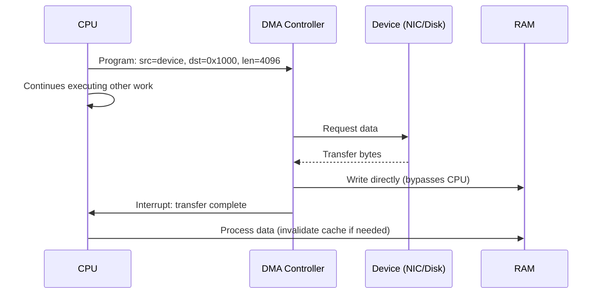

## In simple terms

When a disk, network card, or sound device needs to move a chunk of data into memory, there are two ways to do it. The slow way: the CPU copies every single byte itself, one at a time, doing nothing else. The fast way, **Direct Memory Access (DMA)**: the CPU tells a dedicated **DMA controller** "move this block from the device into memory at this address," and then goes off to do other work. The controller handles the whole transfer on its own and signals the CPU (via an interrupt) only when it's done. DMA is why your CPU isn't pegged at 100% every time you copy a large file.

## The Visual Map



## More detail

Without DMA, the CPU does **programmed I/O (PIO)** — it reads each word from the device register and writes it to memory, one at a time. For a multi-megabyte network packet or disk block, that is millions of instructions spent purely shuffling bytes.

With DMA, the flow is:

1. The CPU programs the DMA controller with a **source address**, **destination address**, and **byte count**.
2. The controller takes control of the system bus and performs the transfer directly between the device and DRAM.
3. When the transfer finishes, the controller raises an **interrupt** so the CPU can process the now-ready data.

**DMA modes:**

| Mode | How it works | Use |
|---|---|---|
| **Burst** | Controller seizes the bus for the entire transfer | Simple; starves CPU of memory access during transfer |
| **Cycle stealing** | Controller steals one bus cycle per byte, then releases | CPU interleaves; lower throughput but no stall |
| **Transparent / fly-by** | Controller runs only when CPU is not using the bus | Highest CPU throughput; complex timing |

**Modern DMA forms:**

- **PCIe bus mastering** — modern GPUs, NICs, and SSDs are PCIe **bus masters**: they initiate DMA transfers directly over PCIe without a central DMA controller. The device writes to a host memory address supplied by the driver.
- **Scatter-gather DMA** — the driver provides a list of non-contiguous memory regions (a scatter-gather list); the controller fills them in order without needing a contiguous buffer. Essential for network receive rings.
- **RDMA (Remote DMA)** — extends DMA over a network (InfiniBand, RoCE): one machine writes directly into another machine's registered memory region, bypassing both OS kernels. Used in HPC and AI training clusters for zero-latency collective communication.

**Cache coherence interaction:** DMA writes to DRAM behind the CPU cache's back. If the CPU has a cached copy of the destination region, it will read stale data after the transfer completes. Solutions:
- **Cache invalidation** — the OS driver invalidates the affected cache lines before the DMA write, or after if the transfer is to read-only memory.
- **Cache flush** — if the CPU wrote data the DMA should read (device write direction), the OS must flush dirty cache lines to DRAM before starting the DMA.
- **IOMMU** — on x86/ARM, the IOMMU (I/O Memory Management Unit) translates device DMA addresses the same way a TLB translates virtual addresses, restricting devices to only the memory regions the OS has granted. Critical for security: without IOMMU, a malicious or compromised device can DMA to arbitrary physical memory.

## Under the Hood

A Linux kernel driver programs DMA using the DMA API — a portable abstraction over platform-specific DMA controllers:

```c
/* Typical Linux kernel driver: program a scatter-gather DMA from device to kernel buffer */
#include <linux/dma-mapping.h>

/* 1. Allocate a coherent DMA buffer (visible to both CPU and device, coherency handled) */
void *cpu_addr;
dma_addr_t dma_handle;
cpu_addr = dma_alloc_coherent(dev, 4096, &dma_handle, GFP_KERNEL);

/* 2. Program the device with the DMA address (device-visible physical address) */
iowrite32(dma_handle, device_bar + DMA_ADDR_REG);
iowrite32(4096,       device_bar + DMA_LEN_REG);
iowrite32(1,          device_bar + DMA_START_REG);  /* kick the transfer */

/* 3. Wait for interrupt (IRQ handler will be called when complete) */
/* ... in IRQ handler: */
void dma_irq_handler(int irq, void *dev_id) {
    /* Data is now in cpu_addr; cache is already coherent (dma_alloc_coherent) */
    process_received_data(cpu_addr, 4096);
    /* Re-arm DMA for next transfer */
    iowrite32(dma_handle, device_bar + DMA_ADDR_REG);
    iowrite32(1,          device_bar + DMA_START_REG);
}

/* 4. Free when done */
dma_free_coherent(dev, 4096, cpu_addr, dma_handle);
```

`dma_alloc_coherent` allocates memory in a DMA-coherent region (uncached or kept coherent by hardware). `dma_handle` is the bus address the device uses; `cpu_addr` is the virtual address the CPU uses. The two are different — the IOMMU translates between them.

## Engineering Trade-offs

**DMA vs. CPU copy (PIO) at small transfer sizes**
DMA has setup overhead: programming the controller, mapping memory, handling the interrupt. For transfers under ~4 KB, this overhead often exceeds the cost of the CPU copy. PIO is faster for very small transfers (register-level device I/O). DMA wins decisively at multi-KB transfers — a 1 GB/s NIC sustains 8× that throughput with DMA, while PIO would consume the entire CPU at a fraction of that bandwidth.

**Coherent vs. streaming DMA**
`dma_alloc_coherent` provides CPU-device coherence automatically (often by marking memory as uncached on the CPU side, or using hardware coherence snooping). `dma_map_single`/`dma_sync_*` (streaming DMA) is faster because it allows cached CPU access, but the driver must explicitly sync the buffer (flush or invalidate) before and after DMA. Coherent DMA is simpler; streaming DMA is faster for high-throughput drivers.

**Scatter-gather vs. contiguous DMA**
Physical memory may be fragmented — a single 1 MB buffer may not be physically contiguous. Without scatter-gather, the OS must bounce-copy data to a contiguous physical region before DMA. With scatter-gather, the device processes non-contiguous memory directly. Virtually all modern PCIe devices support scatter-gather lists, eliminating the bounce-buffer overhead.

**IOMMU protection vs. DMA performance**
Enabling the IOMMU gives every DMA transfer a translation table lookup (similar to a TLB miss for each transfer). On high-throughput paths (40 GbE, NVMe), IOMMU overhead is measurable (5–15% in worst case). Techniques like IOMMU caching (pinned mappings, TLB hit rate optimisation) reduce this. On modern hardware (AMD V-IOMMU, Intel VT-d), the IOMMU TLB miss rate on hot drivers is typically <1%.

**RDMA vs. OS-mediated networking**
RDMA bypasses the kernel networking stack entirely: a userspace process registers memory regions, the NIC DMAs directly into another machine's registered memory, and neither machine's kernel is involved. This achieves ~1 µs latency and ~100 Gbps throughput vs. 50–100 µs for a TCP socket. The cost: RDMA requires matching hardware (InfiniBand, RoCE), network reliability guarantees, and trusted peers (each RDMA write bypasses the target's OS, so a buggy sender can corrupt the receiver's memory).

## Real-world examples

- **Linux zero-copy networking (`sendfile`)** — `sendfile(out_fd, in_fd, ...)` asks the kernel to DMA a file directly from disk to the NIC's transmit ring, bypassing the user-space copy. NGINX uses `sendfile` for static file serving; it's why high-throughput static serving is so CPU-efficient.
- **GPU texture uploads** — calling `glTexImage2D` queues a DMA transfer from CPU memory over PCIe to GPU VRAM. The GPU's command processor DMAs the data asynchronously; the driver issues a fence/semaphore so shaders wait for the transfer to complete before sampling.
- **NVMe SSDs** — NVMe replaced legacy AHCI precisely because AHCI was designed for spinning disks (single queue, CPU-mediated). NVMe allows up to 65535 parallel DMA queues, each directly bus-mastering into host memory without CPU intervention — the reason NVMe can saturate 7 GB/s PCIe 4.0 links.
- **AI training clusters (RoCE RDMA)** — NVIDIA A100/H100 clusters use RoCE (RDMA over Converged Ethernet) for AllReduce collective operations: GPUs DMA gradient tensors directly into each other's host memory across a 200 Gbps InfiniBand fabric, achieving ~90% collective bandwidth efficiency.
- **Thunderbolt / DMA attacks** — Thunderbolt devices are PCIe bus masters. Before Kernel DMA Protection (VT-d + Thunderbolt filtering), plugging in a malicious Thunderbolt device allowed an attacker to DMA to any physical memory — a known physical-access attack. IOMMU with per-device isolation closes this.

## Common misconceptions

- **"The CPU still copies the data, just faster."** No — the entire point is that the DMA *controller* (or device, for PCIe bus masters) moves the data; the CPU is free to execute unrelated instructions during the transfer.
- **"DMA is old/legacy."** The 8237 ISA DMA controller from 1974 is indeed legacy. But PCIe bus mastering, NVMe, RDMA, and GPU texture streaming are all DMA at modern bus speeds — the concept is everywhere in current hardware.
- **"DMA is always faster."** For small transfers (< ~4 KB), DMA setup overhead — interrupt latency, cache invalidation, IOMMU mapping — exceeds the cost of a CPU copy. High-throughput drivers batch many small operations or use polling (completions rings, not interrupts) to amortise this overhead.

## Try it yourself

Simulate the DMA transfer lifecycle: setup, async transfer, interrupt, cache-sync:

```bash
python3 - << 'EOF'
import time, threading, array

class DMAController:
    """Minimal DMA controller simulation."""
    def __init__(self):
        self._callback = None

    def program(self, src, dst, length, on_complete):
        """Program a transfer: returns immediately (non-blocking)."""
        self._src = src
        self._dst = dst
        self._length = length
        self._callback = on_complete

    def start(self):
        """Start transfer in background (simulates hardware running independently)."""
        def _transfer():
            time.sleep(0.01)  # simulate 10ms transfer (e.g., 4MB at 400MB/s)
            # Copy data (hardware does this directly in DRAM)
            self._dst[:self._length] = self._src[:self._length]
            # Fire interrupt (callback) when done
            self._callback()
        threading.Thread(target=_transfer, daemon=True).start()

# -- Programmed I/O (baseline) --
SIZE = 1_000_000
src_buf = array.array('B', list(range(256)) * (SIZE // 256))

t0 = time.perf_counter()
dst_pio = array.array('B', src_buf)  # CPU copies every byte
pio_ms = (time.perf_counter() - t0) * 1000

# -- DMA transfer --
dst_dma = array.array('B', [0] * SIZE)
done = threading.Event()
cpu_work_cycles = 0

def on_dma_complete():
    done.set()

dmac = DMAController()
dmac.program(src_buf, dst_dma, SIZE, on_dma_complete)

t0 = time.perf_counter()
dmac.start()

# CPU does useful work while DMA runs
while not done.is_set():
    cpu_work_cycles += 1  # simulated work
    time.sleep(0.001)

dma_ms = (time.perf_counter() - t0) * 1000

print(f"Programmed I/O:   {pio_ms:.1f} ms  (CPU busy entire time)")
print(f"DMA transfer:     {dma_ms:.1f} ms  (CPU did {cpu_work_cycles} work cycles in parallel)")
print(f"Data match: {src_buf == dst_dma}")
print()
print("DMA lets the CPU work in parallel with the transfer.")
print("At real hardware speeds (GB/s), DMA frees thousands of CPU cycles per MB.")
EOF
```

## Learn next

- [Cache Coherence](/t/cache-coherence) — DMA writes to DRAM behind the CPU cache; the coherence problem DMA creates is one of the key reasons cache-coherence protocols must handle non-CPU bus masters.
- [Memory Hierarchy](/t/memory-hierarchy) — DMA bypasses the entire CPU-side hierarchy and writes directly to DRAM; understanding where DRAM sits in the hierarchy explains why DMA is so much faster than CPU-mediated copying for large transfers.
- [Interrupt](/t/interrupt) — DMA completion is signalled by an interrupt; the interrupt handling latency is the floor on how quickly the CPU can react to a completed DMA transfer.
