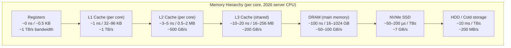

## In simple terms

A computer's storage is a pyramid. At the top are a tiny number of CPU registers — femtoseconds to access, dozens of bytes total. Below them, increasingly larger and slower: L1 cache, L2, L3, main memory (DRAM), SSD, hard disk, network storage. Each level is about an order of magnitude bigger and slower than the one above. Understanding this hierarchy is the single biggest lever for writing fast code.

## The Visual Map



## More detail

A realistic 2026 hierarchy on a server-class CPU:

| Level | Size | Latency | Bandwidth |
|---|---|---|---|
| Registers | Few hundred bytes | &lt;1 ns (free) | per cycle |
| L1 cache (per core) | 32–96 KB | ~1 ns (4 cycles) | ~1 TB/s |
| L2 cache (per core) | 0.5–2 MB | ~3–5 ns | ~500 GB/s |
| L3 cache (shared) | 16–256 MB | ~10–20 ns | ~200 GB/s |
| DRAM | 16–1024 GB | ~100 ns | ~50–100 GB/s |
| NVMe SSD | TBs | ~50–200 µs | ~7 GB/s |
| Network SSD (cloud) | "unlimited" | ~1–5 ms | varies |
| HDD (cold) | TBs | ~10 ms | ~200 MB/s |
| Tape / glacier | EBs | seconds–hours | varies |

The key implication: **memory access pattern dominates performance** for most non-trivial code. A program with great asymptotic complexity can be slower than a worse one if it stresses caches badly.

Concepts that follow from the hierarchy:

- **Locality** — spatial (nearby addresses) and temporal (recently used addresses) both speed things up. Cache lines are 64 bytes; touching one byte pulls 63 neighbours.
- **Working set** — the bytes a program actively uses at a point in time. If the working set fits in L1, the program runs at full speed. If it spills to DRAM, every miss stalls the pipeline for 300 cycles.
- **Memory-mapped files** (`mmap`) — let the kernel page disk data in on demand; integrates storage into the same address space as DRAM, with the page fault mechanism filling pages from NVMe/HDD on first access.
- **Virtual memory** — the abstraction that lets each process see a flat address space despite fragmented physical memory; the TLB caches virtual-to-physical translations, adding a second hierarchy layer.

**Why the hierarchy exists:** fast memory (SRAM for cache, registers) uses 6 transistors per bit. DRAM uses 1 transistor + 1 capacitor per bit. NAND flash uses shared transistors with wear-levelling. Cost per bit scales inversely with speed. The hierarchy is an economic Pareto frontier: buy just enough of each level to keep the CPU fed.

## Under the Hood

Measuring latency at each level of the hierarchy directly in C by controlling the access pattern:

```c
/* latency_ladder.c — compile: gcc -O2 -o latency_ladder latency_ladder.c */
#include <stdio.h>
#include <stdlib.h>
#include <time.h>
#include <string.h>

#define REPS 100000000UL

static double ns_per_access(size_t size_bytes) {
    /* Build a random pointer-chain of cache lines within size_bytes */
    size_t n = size_bytes / 64;              /* number of 64-byte lines */
    if (n < 2) n = 2;
    char **lines = malloc(n * sizeof(char*));
    char  *buf   = aligned_alloc(64, n * 64);

    /* Shuffle: create a random pointer chain through all lines */
    for (size_t i = 0; i < n; i++) lines[i] = buf + i * 64;
    for (size_t i = n - 1; i > 0; i--) {
        size_t j = rand() % (i + 1);
        char *tmp = lines[i]; lines[i] = lines[j]; lines[j] = tmp;
    }
    for (size_t i = 0; i < n; i++)
        *(char **)lines[i] = lines[(i + 1) % n];

    /* Chase the pointer chain to measure latency */
    size_t reps = (REPS / n) * n;
    struct timespec t0, t1;
    volatile char *p = lines[0];
    clock_gettime(CLOCK_MONOTONIC, &t0);
    for (size_t i = 0; i < reps; i++) p = *(char **)p;
    clock_gettime(CLOCK_MONOTONIC, &t1);

    free(lines); free(buf);
    double total_ns = (t1.tv_sec - t0.tv_sec) * 1e9 + (t1.tv_nsec - t0.tv_nsec);
    return total_ns / reps;
}

int main(void) {
    size_t sizes[] = {16*1024, 64*1024, 512*1024, 8*1024*1024, 64*1024*1024, 256*1024*1024};
    const char *labels[] = {"16 KB (L1)", "64 KB (L1/L2)", "512 KB (L2)", "8 MB (L3)", "64 MB (L3/DRAM)", "256 MB (DRAM)"};
    printf("%-20s  ns/access\n", "Level");
    for (int i = 0; i < 6; i++)
        printf("%-20s  %.1f ns\n", labels[i], ns_per_access(sizes[i]));
}
```

Running this on a modern desktop CPU typically shows: 4 ns (L1), 10 ns (L2), 30–40 ns (L3), 80–120 ns (DRAM) — each level a 3–4× jump in latency.

## Engineering Trade-offs

**Cache size vs. die area and cost**
L1 cache must respond in 1–4 clock cycles, limiting its size to 32–96 KB on current process nodes — larger SRAM has longer wire delays. L3 can be 64+ MB because 40 cycles is acceptable. DRAM is off-die entirely because it uses a different fabrication process. Each hierarchy level is sized at the largest capacity achievable within its latency budget.

**Prefetching vs. cache pollution**
Hardware prefetchers detect sequential or stride patterns and fetch cache lines before they are requested, hiding latency. Overly aggressive prefetching fetches lines that are never used, evicting useful data and wasting bandwidth. For irregular access patterns (hash tables, pointer-chasing data structures), the prefetcher is ineffective and its activity is pure overhead.

**Columnar vs. row-oriented data layout**
Relational databases that store data row-by-row (PostgreSQL heap) perform well on queries that read all columns of a few rows. Columnar stores (ClickHouse, Parquet) store one column contiguously — scanning a single column over 10M rows reads contiguous DRAM, saturating bandwidth. Row layouts scan at ~500 MB/s effective column throughput; columnar achieves ~5 GB/s on the same data.

**Memory bandwidth vs. compute throughput**
Modern CPUs can issue 16–32 FLOP per cycle at AVX-512, but DRAM delivers 50–100 GB/s. At 8 bytes per double and 3 GHz, that's ~6 GFLOP/s bandwidth-limited throughput vs. ~200 GFLOP/s compute throughput. Memory-bound algorithms (dense matrix-vector multiply, streaming sum) run at 3–5% of theoretical peak FLOP/s. This is the **roofline model** — most workloads are bound by the memory roof, not the compute ceiling.

**NUMA topology vs. access locality**
Multi-socket servers have Non-Uniform Memory Access: each socket has local DRAM, and accessing the remote socket's DRAM adds 200–400 ns of inter-socket latency. NUMA-aware allocation (Linux `numactl --membind`, `MADV_HUGEPAGE`) binds data to the NUMA node where it is processed. An MPI rank on socket 0 reading data allocated on socket 1 may run at 50% of local-access throughput.

## Real-world examples

- **ClickHouse vs. PostgreSQL for analytics** — on a 100M-row table scanning one column, ClickHouse (columnar) is typically 10–100× faster than PostgreSQL (row-oriented), almost entirely because of cache and bandwidth efficiency on the sequential scan.
- **Linked list vs. array** — iterating a linked list pointer-chases through heap-allocated nodes scattered in DRAM; each hop is a cache miss (~100 ns). Iterating an array is sequential; the prefetcher keeps L1 filled. The performance gap is 10–100× on traversal-heavy workloads.
- **DPDK / io_uring** — both bypass the kernel to keep data in user-space caches. DPDK's packet I/O model keeps NIC ring buffers in huge pages mapped to the same NUMA node as the processing thread, avoiding cache misses on packet metadata.
- **GPU HBM** — high-bandwidth memory (HBM2e/HBM3) stacks DRAM dies directly on the GPU package via silicon interposer, achieving 2–4 TB/s bandwidth vs. ~50–100 GB/s for CPU DDR5. This is why GPUs dominate memory-bandwidth-limited workloads (matrix multiply, transformer attention).
- **Intel Optane (3D XPoint)** — attempted a hierarchy insertion between DRAM and NVMe: ~300 ns latency vs. ~100 ns DRAM, ~3–10 µs NVMe. Used as a persistent memory tier or as a very large DRAM extension. Intel discontinued it in 2022, but the concept of persistent memory at DRAM-adjacent latency remains active in research.

## Common misconceptions

- **"Memory access is fast."** Compared to disk, yes. Compared to registers or L1 cache, an L3 miss to DRAM takes 300 cycles. A program that generates L3 misses constantly runs at 1% of theoretical peak throughput.
- **"More RAM always helps."** Only until the working set fits in DRAM. Extra RAM prevents paging (disk access), but once the working set is in DRAM, adding more RAM has zero effect on performance.
- **"Cache is automatic — I don't need to think about it."** Cache is transparent (no API), but its effectiveness is determined entirely by your data layout and access patterns. The compiler and OS cannot cache-optimise an algorithm that pointer-chases randomly through memory.

## Try it yourself

Measure how access stride affects effective memory bandwidth — the hardware roofline in action:

```bash
python3 - << 'EOF'
import time, array

N = 4_000_000
data = array.array('f', [1.0] * N)

def measure_stride(step):
    t0 = time.perf_counter()
    s = 0.0
    for i in range(0, N, step):
        s += data[i]
    elapsed = time.perf_counter() - t0
    elements = N // step
    bytes_read = elements * 4   # 4 bytes per float
    return elapsed, elements, bytes_read

print(f"{'Stride':>8}  {'Elements':>10}  {'Time ms':>9}  {'ns/elem':>9}  {'BW MB/s':>9}  {'Level (approx)'}")
print("-" * 80)
for stride in [1, 2, 4, 8, 16, 64, 256]:
    elapsed, elems, nbytes = measure_stride(stride)
    ns_elem = elapsed * 1e9 / elems
    bw_mbs  = nbytes / elapsed / 1e6
    level   = "L1/L2 (fast)" if stride <= 2 else "L2/L3" if stride <= 8 else "DRAM (slow)"
    print(f"{stride:>8}  {elems:>10,}  {elapsed*1000:>9.1f}  {ns_elem:>9.1f}  {bw_mbs:>9.0f}  {level}")

print()
print("As stride grows past the cache line (16 floats = 64 bytes), each")
print("access misses the cache and the effective bandwidth drops dramatically.")
EOF
```

## Learn next

- [Cache](/t/cache) — the intermediate layers of the hierarchy in depth: associativity, eviction policies, miss classification, and how cache misses stall the CPU pipeline.
- [Virtual Memory](/t/virtual-memory) — the abstraction layer above physical DRAM; the TLB is a cache for address translations, adding a parallel hierarchy on top of the data hierarchy.
- [Cache Coherence](/t/cache-coherence) — with multiple cores each owning L1/L2 caches, keeping them consistent is a separate protocol layered on the hierarchy.
- [DMA](/t/dma) — how I/O devices bypass the CPU hierarchy entirely and write directly to DRAM; understanding where DRAM sits explains why DMA is so effective.
