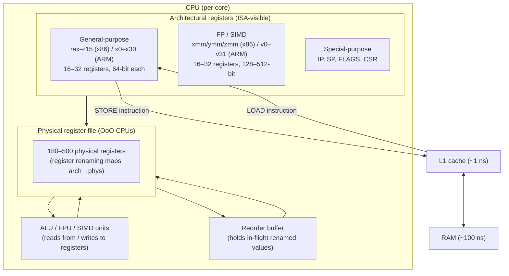

## In simple terms

A **register** is one of a small set of named storage cells inside the CPU itself. Almost every instruction reads its operands from registers and writes its result back into one. Registers are the CPU's hands — everything else (cache, RAM, disk) has to be passed through them to be operated on.

They are tiny (a few hundred bytes total) but live on the same die as the execution units and take essentially zero time to access — zero cycles, compared to 1–4 for L1 cache and 300+ for RAM.

## The Visual Map



## More detail

The registers a CPU exposes are defined by its ISA:

| Register class | x86-64 | AArch64 | RISC-V RV64I |
|---|---|---|---|
| General-purpose | 16 (rax–r15) | 31 (x0–x30) + xzr (zero) | 32 (x0–x31, x0 wired to 0) |
| FP / SIMD | 16–32 (xmm/ymm/zmm) | 32 (v0–v31, 128-bit) | 32 (f0–f31, extension F/D) |
| PC (instruction pointer) | rip | pc | pc |
| Stack pointer | rsp | sp (x28) / x29 | x2 |
| Flags / status | RFLAGS | NZCV | none (condition codes in GPRs) |

**Types of registers:**

- **General-purpose (GPR)** — integer arithmetic, addresses, temporary values. Every compiler fights to keep as many live values in GPRs as possible.
- **Floating-point / SIMD** — wider registers (128–512 bits) for floating-point scalars and vector operations. Separate from integer GPRs to allow simultaneous execution on different hardware units.
- **Special-purpose** — instruction pointer (PC, rip): the address of the current instruction; stack pointer (SP, rsp): the top of the call stack; status/flags (RFLAGS, NZCV): set by arithmetic operations, tested by branches.

**Register renaming:** the ISA exposes 16 (x86) or 32 (ARM, RISC-V) architectural registers, but modern out-of-order CPUs maintain a physical register file of 180–500 entries. The rename stage maps each architectural register reference to a fresh physical register at every write, eliminating **false dependencies** (WAW and WAR hazards) that would otherwise force the out-of-order engine to serialize independent instructions.

**Register allocation:** the compiler's register allocator decides which variables occupy registers and which get **spilled** to the stack (memory). A spill requires a STORE (register → stack slot) and later a LOAD (stack slot → register) — visible in tight inner loops. Compilers with more available registers produce less spilling; this is why x86's historical 8-register constraint (pre-x86-64) was a chronic performance bottleneck.

**Calling conventions (ABI):** inter-function calling agreements specify which registers a function may clobber (caller-saved: rax, rcx, rdx, rsi, rdi, r8–r11 on x86-64 SysV) and which it must restore (callee-saved: rbx, rbp, r12–r15). Violating the ABI causes silent data corruption — invisible until the wrong register value is used.

Registers are the choke point of execution. Every cycle the CPU does something, it is pulling values from registers and writing results back. Cache and RAM exist solely to keep registers fed.

## Under the Hood

Seeing register use directly in compiled assembly — a simple loop showing how the compiler assigns registers:

```c
// loop.c — compile with: gcc -O2 -S loop.c  (produces loop.s)
long sum_array(const long *arr, long n) {
    long s = 0;
    for (long i = 0; i < n; i++)
        s += arr[i];
    return s;
}
```

The generated x86-64 assembly (simplified) shows register assignments:

```asm
; sum_array(arr=rdi, n=rsi) → rax
sum_array:
    xor     eax, eax          ; rax = 0  (sum accumulator, zero-extended)
    test    rsi, rsi           ; if n == 0, return
    jle     .Lreturn
.Lloop:
    add     rax, [rdi]         ; rax += *arr  (one register read + memory load)
    add     rdi, 8             ; arr++  (pointer advance, in a register)
    sub     rsi, 1             ; n--
    jnz     .Lloop             ; loop if n != 0
.Lreturn:
    ret                        ; return value is in rax by calling convention
```

Three registers do all the work: `rax` (accumulator), `rdi` (array pointer), `rsi` (counter). No spills — everything fits. The loop body is 4 instructions, none of which touch RAM except the array load.

With register renaming, the out-of-order engine sees `rax` written every iteration, but each write gets a fresh physical register — the CPU can overlap several iterations in the ROB simultaneously.

## Engineering Trade-offs

**More architectural registers vs. instruction encoding width**
More GPRs reduce spilling and improve performance, but each register needs bits in the instruction encoding to name it. x86 historically had 8 GPRs — 3 bits per register field. x86-64 doubled to 16 (using a REX prefix byte). RISC-V has 32, requiring 5 bits. Beyond 64 registers, encoding overhead and the physical register file area start to dominate the benefit.

**Physical register file size vs. chip area**
Modern CPUs keep hundreds of in-flight register values in the physical file (Intel Golden Cove: ~280 integer + ~280 FP). Larger files allow more instructions in-flight (deeper speculation), extracting more instruction-level parallelism (ILP) — but the register file is one of the densest and most power-hungry structures on the die. Balancing file size against power budget is a core microarchitecture design choice.

**Caller-saved vs. callee-saved registers (ABI)**
Caller-saved registers are cheap to use inside a function but must be preserved by the caller before any function call. Callee-saved registers are safe to hold across calls but must be pushed/popped by the callee's prologue/epilogue. Deep call stacks with many callee-saved registers produce large prologue/epilogue overhead. Leaf functions (no calls) can skip this entirely — a common compiler optimisation.

**SIMD register width: 128-bit vs. 256-bit vs. 512-bit**
AVX-512 uses 512-bit zmm registers — 8 doubles or 16 floats per register, doing 8× or 16× work per instruction. But using 512-bit registers on some Intel chips triggers frequency downclocking ("AVX-512 frequency throttling") because of the thermal budget. Choosing between AVX2 (256-bit, no downclocking) and AVX-512 (512-bit, possible downclocking) requires profiling on target hardware.

**Register renaming depth vs. hazard elimination**
Register renaming eliminates WAW (write-after-write) and WAR (write-after-read) false dependencies. But the rename stage must find a free physical register for every instruction it renames — if the physical file is full, the pipeline stalls. This is the "ROB full" (reorder buffer full) stall, one of the dominant limiters on out-of-order throughput for memory-bound workloads.

## Real-world examples

- **x86-64 vs. 32-bit x86** — upgrading from 8 to 16 GPRs (plus 8 additional SSE registers) in x86-64 was one of the biggest performance improvements in the transition, independent of the 64-bit address space, because it drastically reduced register spilling in compilers.
- **Apple M1 register file** — the M1's integer physical register file has ~600 entries per core, enabling extremely deep out-of-order speculation; this large file is a key reason M1 achieves unusually high IPC for its clock frequency.
- **RISC-V calling convention** — RISC-V's ABI splits registers into a0–a7 (argument/return), t0–t6 (temporaries, caller-saved), and s0–s11 (saved, callee-saved); the explicit split makes prologue/epilogue generation mechanical.
- **GPU registers** — GPU SMs have massive register files (e.g., NVIDIA A100: 64K 32-bit registers per SM). More registers per thread enable more in-flight threads, hiding memory latency via context switching. Too many registers per thread reduces occupancy (fewer threads fit). GPU register pressure is a primary performance optimisation target.
- **RFLAGS register (x86)** — a single 64-bit register contains 6 condition codes (CF, ZF, SF, OF, PF, AF) plus 15 control/system bits. A single ADD instruction sets all 6 condition codes simultaneously; subsequent conditional branches (JE, JL, JG) read specific bits. Managing flag dependencies is a subtle source of pipeline hazards in hand-written assembly.

## Common misconceptions

- **"More registers means a faster CPU."** Up to a point — 16–32 architectural registers is the sweet spot today. More reduces spilling but increases encoding bits (reducing code density), physical file area, and rename complexity. Beyond ~64 architectural registers, gains diminish rapidly.
- **"Registers and cache are the same thing."** Same goal (fast data access), completely different mechanisms. Registers are ISA-visible named cells accessed by name in every instruction, with zero latency. Cache is transparent hardware between the CPU and RAM that is invisible to the ISA — programs cannot directly address cache lines; the hardware manages what goes in and out.

## Try it yourself

See how Python's compiler allocates "registers" (local variables mapped to fast slots in CPython's frame object):

```bash
python3 - << 'EOF'
import dis

def sum_array(arr):
    s = 0
    for x in arr:
        s += x
    return s

print("CPython bytecode for sum_array (each LOAD/STORE is a register-like slot access):\n")
dis.dis(sum_array)

print("\n--- Register pressure demo: spill vs no-spill ---")
import time

N = 1_000_000

# Few temporaries — fits in "registers" (CPython fast locals)
def tight(n):
    a = b = c = 0
    for i in range(n):
        a += i; b += i * 2; c += i * 3
    return a + b + c

# Many temporaries — CPython always uses fast locals, but shows the concept
def wide(n):
    a=b=c=d=e=f=g=h=i2=j=k=l=m=n2=o=p = 0
    for i in range(n):
        a+=i; b+=i; c+=i; d+=i; e+=i; f+=i; g+=i; h+=i
    return a+b+c+d+e+f+g+h

t0 = time.perf_counter(); tight(N); tight_ms = (time.perf_counter()-t0)*1000
t0 = time.perf_counter(); wide(N);  wide_ms  = (time.perf_counter()-t0)*1000
print(f"  tight (few locals): {tight_ms:.1f} ms")
print(f"  wide  (many locals): {wide_ms:.1f} ms")
EOF
```

## Learn next

- [CPU Pipeline](/t/cpu-pipeline) — how instructions read and write registers in pipelined stages; data hazards are fundamentally about one stage writing a register another needs to read.
- [Cache](/t/cache) — the buffer between registers and RAM; when there are no free registers, compilers spill values to the stack (which lives in cache).
- [Out-of-Order Execution](/t/out-of-order-execution) — register renaming is the technique that enables OoO CPUs to execute instructions out of program order by eliminating false register dependencies.
