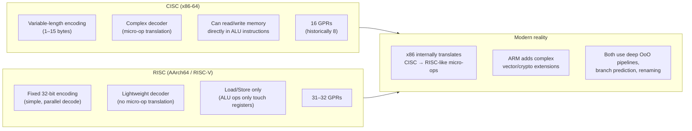

## In simple terms

**CISC** (Complex Instruction Set Computing) designs the CPU to have many, often complex instructions — "multiply this memory location by the value of that register and write to a third address" in one instruction. **RISC** (Reduced Instruction Set Computing) does the opposite: small, simple, fixed-length instructions that each do one tiny thing. The CISC vs RISC debate was the architecture argument of the 1980s; the actual outcome is that modern chips borrow from both.

## The Visual Map



## More detail

The original distinction (Patterson & Hennessy, late 1970s):

| Property | CISC (e.g. x86) | RISC (e.g. ARM, RISC-V) |
|---|---|---|
| Instruction count | Many hundreds | ~50 base instructions |
| Instruction length | Variable (1–15 bytes on x86) | Fixed (4 bytes; 2/4 with compressed) |
| Memory operands | ALU can read/write memory directly | Load/store only; ALU touches registers |
| Decode complexity | High (length-disambiguation needed) | Low (fixed-width, parallel decode) |
| Register count | 8–16 GPRs | 31–32 GPRs |
| Pipeline-friendly | Hard (variable decode width) | Easy (uniform decode slots) |

The RISC pitch: a smaller, simpler instruction set means a simpler decoder, a deeper / cleaner pipeline, higher clock speeds, easier compiler optimisation. Compilers can synthesise any complex operation from simple instructions; CPUs shouldn't pay the silicon cost of complex ones natively.

**What happened in practice:**

- **x86 internally became RISC** — modern Intel and AMD chips decode CISC instructions into RISC-like "micro-ops" at the frontend. The architectural ISA stayed CISC for backward compatibility; the execution engine went RISC. An `ADD RAX, [RBX+8]` becomes two micro-ops: a load micro-op and an add micro-op.
- **ARM added complex instructions** — modern AArch64 has extensive SIMD (NEON, SVE), cryptography acceleration, and atomic instructions that look more CISC than the 1985 ARM1 ancestor.
- **RISC-V revived pure RISC** — a clean, royalty-free ISA with a modular extension model (I, M, A, F, D, C, V) designed from scratch in 2010 with no backward-compatibility constraints.

In 2026, the meaningful differences are:

- **Encoding density** — x86 variable-length encoding tends to be more compact in bytes per program (10–15% smaller binaries than RISC-V 32-bit; RISC-V compressed extension narrows the gap).
- **Decode power** — ARM and RISC-V decoders consume less power because fixed-width instruction streams don't require length disambiguation.
- **Register pressure** — 32 GPRs (ARM, RISC-V) vs. 16 (x86-64) means compilers spill fewer variables to the stack.
- **Ecosystem** — x86 dominates Windows desktop and server; ARM dominates mobile and is growing in cloud (AWS Graviton, Apple Silicon); RISC-V is rising in embedded, FPGA, and research.

## Under the Hood

The same computation in CISC (x86-64) and RISC (AArch64) — showing how the ISA philosophy shapes encoding:

```asm
; --- x86-64 (CISC): array sum ---
; CISC allows: ADD directly from memory address [rdi + rax*8]
; The hardware decodes this into a LOAD micro-op + ADD micro-op internally.
;
; rdi = pointer to array, rsi = count
sum_loop_x86:
    xor     eax, eax            ; sum = 0
    xor     ecx, ecx            ; i = 0
.loop:
    add     rax, [rdi + rcx*8]  ; sum += arr[i]  — ONE instruction, reads memory
    inc     ecx                 ; i++
    cmp     ecx, esi            ; compare i to count
    jl      .loop               ; loop back
    ret                         ; return sum in rax

; --- AArch64 (RISC): same array sum ---
; RISC requires explicit LOAD before ADD. Load/store are the ONLY memory ops.
; Benefit: decoder is trivial (fixed 32-bit width, single-cycle decode).
;
; x0 = pointer to array, x1 = count
sum_loop_arm:
    mov     x2, #0              ; sum = 0
    mov     x3, #0              ; i = 0
.loop:
    ldr     x4, [x0, x3, lsl #3]  ; x4 = arr[i]   — LOAD (32-bit encoding)
    add     x2, x2, x4            ; sum += x4      — ADD  (32-bit encoding)
    add     x3, x3, #1            ; i++
    cmp     x3, x1                ; compare i to count
    b.lt    .loop                  ; loop
    mov     x0, x2                ; return value in x0
    ret
```

The x86 version is 5 instructions; the AArch64 version is 6. At runtime, x86's `add rax, [rdi + rcx*8]` becomes two micro-ops in the decoder — so the execution units see the same number of operations. The difference is decoder complexity, instruction encoding width, and the number of general-purpose registers.

## Engineering Trade-offs

**Encoding density vs. decoder simplicity**
Variable-length x86 encoding packs more semantic content per byte — an x86 binary is typically 10–20% smaller than the equivalent RISC-V 32-bit binary. Smaller code improves instruction-cache hit rate. But the x86 decoder must determine instruction length before it can decode — a sequential process that limits parallel decode width. Fixed-width RISC encoding lets the decoder process multiple instructions in parallel before knowing what they are, enabling wider decode without length serialisation.

**Backward compatibility vs. ISA cleanliness**
x86's biggest architectural cost is compatibility: every modern x86 chip must correctly execute 8086 code from 1978 and every extension added since. The instruction decode table is enormous and irregular. RISC-V has no legacy baggage — every decision was made with clean-slate principles. The cost: the x86 ecosystem (toolchains, operating systems, games, applications) took 40 years to build; RISC-V is re-building it from scratch.

**Register count vs. instruction encoding width**
More architectural registers reduce spilling but require more bits in the instruction encoding to name them. x86 used 8 GPRs for 30 years (3 bits); x86-64 added 8 more with a REX prefix byte. AArch64 has 31 (5 bits). RISC-V has 32 (5 bits). The compressed (Thumb-like) RISC-V encoding reduces accessible registers to 8 to save 16 bits per instruction. The sweet spot for most workloads is 32 GPRs — enough to virtually eliminate spilling.

**RISC load-store discipline vs. CISC memory operands**
RISC's load-store discipline means all arithmetic happens register-to-register. This seems like it would hurt — more instructions. But it simplifies the execution units: ALUs need no memory address computation logic, memory ports are used only by explicit loads/stores, and the pipeline can issue ALU ops while a load is in flight without conflict. CISC memory operands tie an ALU operation to a memory operation, which constrains scheduling flexibility.

**Micro-op translation overhead vs. ISA-native execution**
x86 CPUs translate CISC instructions to micro-ops at the frontend (4–8 micro-ops per complex instruction for string operations). This translation step consumes power and adds latency. For simple instructions (which make up >95% of executed code), x86 decodes to 1–2 micro-ops and the overhead is small. For complex string/crypto instructions, the micro-op overhead is amortised over large data movements.

## Real-world examples

- **Apple M1 (AArch64) vs. Intel Core i7 (x86-64)** — the M1 at 3.2 GHz matches or beats comparable Intel desktop chips at 5 GHz on single-thread workloads, despite the clock speed gap. The efficiency advantage comes from higher IPC (32 GPRs, clean decode, wider ROB) plus a vastly better process node advantage.
- **AWS Graviton 3 (AArch64)** — Amazon's ARM server chip delivers 25% better performance-per-watt than comparable x86 Xeon instances on general-purpose workloads; widely deployed in Amazon's own services (S3, EC2, Lambda) and offered to customers at lower cost.
- **RISC-V in embedded** — Western Digital (SSD controllers), Espressif (ESP32-C3 WiFi), SiFive (FPGA IP), and dozens of ASIC designs ship RISC-V cores rather than ARM because RISC-V carries no license royalties and the ISA is publicly specified.
- **Intel Itanium (VLIW)** — a third ISA philosophy (Very Long Instruction Word): the compiler explicitly schedules parallel operations into 128-bit "bundles." Itanium required perfect static scheduling for peak performance but the compiler couldn't always do it, and it was incompatible with x86. It lost to AMD's x86-64 extension despite theoretical advantages; sold primarily to HP for legacy Superdome servers until ~2021.
- **x86 compressed instruction handling** — modern Intel chips have a dedicated "simple decoder" that recognises the most common 1-micro-op x86 forms (MOV, ADD, CMP, JMP with simple addressing) and processes them without the full CISC decoder, achieving single-cycle decode for >80% of executed instructions.

## Common misconceptions

- **"RISC chips are always faster."** ISA philosophy is one factor among many: process node, microarchitecture depth, cache size, memory bandwidth, and clock frequency all matter more per chip generation than RISC vs. CISC encoding. Modern x86 chips in OoO execution internally look almost identical to RISC chips.
- **"CISC is wasteful — it has instructions no one uses."** Modern CPUs don't decode unused instructions; the silicon cost of a complex instruction that's never executed is near zero (a few decode table entries). The cost is in the decoder complexity for *frequently executed* complex instructions.
- **"x86 is doomed because ARM is winning mobile."** x86 still dominates the ~300M PC/laptop units shipped annually and the majority of installed datacenter capacity. ARM is winning *new* deployment; replacing the existing x86 base is a multi-decade project at best.

## Try it yourself

Count instructions and bytes for the same function compiled to x86 and ARM — if you have both toolchains, compare the outputs directly:

```bash
# On WSL/Linux with both gcc (x86-64) and aarch64-linux-gnu-gcc installed:
# (On a standard Ubuntu WSL: sudo apt install gcc-aarch64-linux-gnu)

cat > /tmp/sum.c << 'EOF'
long sum(const long *arr, long n) {
    long s = 0;
    for (long i = 0; i < n; i++) s += arr[i];
    return s;
}
EOF

echo "=== x86-64 (CISC): objdump of sum() ==="
if command -v gcc >/dev/null 2>&1; then
  gcc -O2 -c /tmp/sum.c -o /tmp/sum_x86.o && objdump -d -M intel /tmp/sum_x86.o
else
  echo "(gcc not installed — install with: sudo apt install gcc binutils)"
fi

echo ""
echo "=== AArch64 (RISC): objdump of sum() ==="
aarch64-linux-gnu-gcc -O2 -c /tmp/sum.c -o /tmp/sum_arm.o 2>/dev/null && \
  aarch64-linux-gnu-objdump -d /tmp/sum_arm.o || \
  echo "(aarch64-linux-gnu-gcc not installed — install with: sudo apt install gcc-aarch64-linux-gnu)"
```

## Learn next

- [Instruction Set](/t/instruction-set) — the full specification of what a CPU's ISA defines: not just RISC vs. CISC encoding, but registers, memory model, privilege levels, and binary compatibility.
- [CPU Pipeline](/t/cpu-pipeline) — RISC's fixed-width encoding was specifically designed to make pipelining easier; the connection between ISA design and pipeline implementation is direct.
- [Out-of-Order Execution](/t/out-of-order-execution) — x86's internal micro-op translation is what allows a CISC ISA to run on a RISC-like OoO engine; the two concepts are inseparable in understanding modern x86 design.
- [Branch Prediction](/t/branch-prediction) — both ISAs rely on branch prediction for throughput; the prediction machinery is substantially the same regardless of RISC vs. CISC.
