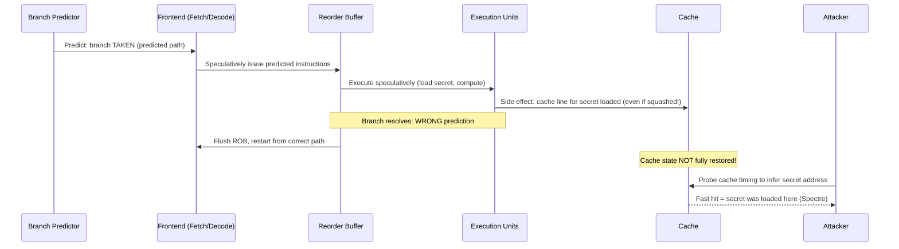

## In simple terms

A CPU branch (`if/else`) stalls the pipeline while the condition is evaluated — wasting cycles. Modern CPUs predict which branch will be taken and start executing *before* knowing the answer. If the prediction is correct (usually 95–99% of the time), those cycles weren't wasted. If wrong, the speculatively executed instructions are discarded. The trouble: even discarded speculative results leave traces in the CPU cache, and Spectre-class attacks read those traces to steal data from other processes.

## The Visual Map



## More detail

**Branch prediction:** the branch predictor examines past history to predict whether a conditional branch will be taken. Modern predictors (perceptron-based, TAGE) achieve 99%+ accuracy on most workloads. Misprediction is critical: a 20-stage pipeline with 1% misprediction on every 5th instruction → 4% throughput loss without speculation. A loop that repeats a million times, mispredicting only the final exit, is essentially free.

**Speculative execution flow:**
1. The front end predicts the branch outcome and fetches instructions from the predicted path.
2. Those instructions execute speculatively in execution units, may load data from memory, and update microarchitectural state (cache lines, TLB entries).
3. The branch condition is resolved (often 10–20 cycles later).
4. **Correct prediction:** speculative results commit — the work was useful.
5. **Wrong prediction:** the ROB flushes squashed instructions, registers are restored, execution restarts from the correct path.

Architectural state (registers, memory) from squashed instructions is never committed — correct in terms of program semantics.

**Spectre (CVE-2017-5753, -5715, 2018):** cache state is *not* fully restored on a squash. Speculative instructions may have loaded a secret value into a cache line. An attacker probes which cache lines are warm (via timing) to determine what the speculative path accessed — even though the CPU never officially performed that access.

Variant 1 (bounds-check bypass): if `if (x < array_size) return array[x]` is speculatively executed with an out-of-bounds x, the speculative load of `array[x]` (where `array[x]` is a secret) leaks via cache timing.

Variant 2 (branch target injection): the attacker poisons the branch target buffer (BTB) to redirect another process's indirect branch to attacker-chosen "gadget" code that reads a secret.

**Mitigations and their costs:**

| Mitigation | Attack | Performance cost |
|---|---|---|
| Retpoline | Spectre v2 BTB poisoning | 1–5% for indirect-branch-heavy code |
| IBRS / STIBP | Spectre v2 cross-process | 10–30% on syscall-heavy workloads |
| LFENCE at bounds check | Spectre v1 | 1–3% per guarded load |
| Site isolation (browsers) | Spectre v1 cross-origin | Significant RAM increase (~10%) |
| KPTI (Meltdown) | Meltdown (kernel VA leak) | 5–30% on syscall-intensive workloads |
| SSBD | Spectre v4 (SSB) | 2–8% |

**Store-to-load forwarding speculation:** the CPU also speculatively forwards a store's value to a subsequent load (before the store commits), reducing load latency. Spectre variant 4 (speculative store bypass) exploits this forwarding guess when it is wrong.

## Under the Hood

A simplified Spectre variant 1 gadget pattern — what defenders look for:

```c
/* Spectre v1 "gadget" — appears in legitimate code but is exploitable */
#include <stddef.h>

static uint8_t array1[16] = { 0 };
static size_t  array1_size = 16;
static uint8_t array2[256 * 512];  /* 256 cache-line-spaced slots */
uint8_t temp = 0;                  /* prevent dead-code elimination */

void victim_function(size_t x) {
    /* Bounds check — looks safe, but the CPU speculatively executes
       the body BEFORE the check resolves when x has been trained. */
    if (x < array1_size) {            /* ← mistraining target */
        /* Speculative access: even if x >= 16, this runs speculatively.
           If array1[x] is a secret byte, it loads into cache. */
        temp &= array2[array1[x] * 512];  /* cache side-channel encoding */
    }
}

/* The attacker:
   1. Calls victim_function(in-bounds) many times to train predictor → "taken".
   2. Calls victim_function(out-of-bounds x = secret_address - array1) once.
   3. CPU predicts the branch "taken" and speculatively loads array1[x] = secret.
   4. Times accesses to array2[0], array2[512], array2[1024], ...
   5. The slot that hits cache (fast access) reveals the secret byte value.

   Fix: insert LFENCE between the check and the speculative load:
     if (x < array1_size) {
         x = array_index_nospec(x, array1_size);  // Linux kernel macro
         temp &= array2[array1[x] * 512];
     }
*/
```

The `array_index_nospec` macro (Linux `<linux/nospec.h>`) uses an arithmetic mask that serialises the memory access, preventing speculative execution past the bounds check.

## Engineering Trade-offs

**Speculation depth vs. misprediction security surface**
Deeper speculation (larger ROB, more in-flight instructions) extracts more ILP but increases the window in which secret data can be speculatively accessed and encoded into microarchitectural state. A CPU that speculates 500 instructions ahead provides a larger Spectre attack surface than one that speculates 50. Hardware vendors are adding speculation barriers in security-critical paths (e.g., Intel's eIBRS, AMD's IBPB).

**Retpoline correctness vs. performance**
Retpoline replaces `JMP [register]` (indirect branch — directly speculatable) with a "return trampoline" that prevents the CPU from predicting the target. It is correct (no speculation past the indirect branch) and effective against BTB poisoning. But retpoline prevents the CPU from using branch prediction for performance on those indirect branches — it becomes a hard serialise. In code with many virtual function calls or function pointer dispatches, retpoline can cost 5–15% throughput.

**Process isolation vs. shared-cache architecture**
The root of Spectre is that the cache is shared between processes and security domains. The fix is to either (a) flush the cache on privilege transitions (expensive — seconds of cache warmup time), (b) use partitioned caches per security domain (only in very recent Intel TDX/AMD SEV designs), or (c) prevent the speculation that loads secret data. Current mitigations choose (c) with targeted barriers rather than (a).

**Browser sandboxing vs. timer precision**
Spectre attacks in browsers use high-resolution timers to detect cache state. Chrome and Firefox reduced timer resolution (`performance.now()` granularity) and disabled SharedArrayBuffer (which provides an implicit ~5 ns timer) immediately after Spectre was announced. SharedArrayBuffer was re-enabled only after Site Isolation (one process per origin) was deployed, which limits cross-origin Spectre leaks.

**Hardware mitigations vs. software mitigations**
Hardware-level mitigations (Intel's Enhanced IBRS, AMD's IBPB on all context switches, speculative tracking in silicon) are more efficient but require new microarchitecture. Software mitigations (retpoline, LFENCE, KPTI) work on existing hardware but are less efficient. The trade-off: retrofit existing deployed hardware with software mitigations at performance cost, or wait for next-gen hardware with smaller attack surface.

## Real-world examples

- **Disclosure (January 3, 2018)** — Google Project Zero, Qualcomm, Microsoft Research, and academic groups disclosed Spectre/Meltdown simultaneously after an embargo. Every x86 CPU from the past decade was affected. Cloud providers patched all physical servers within days under an industry-wide emergency response.
- **Google Cloud performance impact** — Google publicly reported the initial Meltdown/KPTI patch cost ~5% on compute workloads and up to 17% on I/O-intensive workloads. Later optimised mitigations reduced this to <1% for most cases.
- **V8 JavaScript engine** — patched within 24 hours: reduced `performance.now()` resolution, disabled SharedArrayBuffer (re-enabled with Site Isolation in Chrome 68, July 2018), and randomised array buffer addresses.
- **Linux kernel `array_index_nospec`** — introduced in kernel 4.15 (January 2018) to mask array indexes after bounds checks; used in dozens of subsystems (network, sockets, v4l2, USB) wherever a bounds-guarded access could be a Spectre gadget.
- **Intel Ice Lake (2019+) eIBRS** — Enhanced IBRS keeps IBRS always enabled in hardware, reducing the performance cost of Spectre v2 mitigation from 30% to ~1%.

## Common misconceptions

- **"Speculative execution only matters for security researchers."** Every systems programmer working with untrusted code, browsers, shared hardware (VMs, containers), or security-sensitive applications needs to understand Spectre-class attacks. Writing `if (x < n) return arr[x]` in a tight loop is a potential gadget.
- **"Disabling speculative execution fixes Spectre."** Full disabling of speculation would reduce CPU performance by 40–70%. Targeted mitigations (retpoline, IBRS, LFENCE, KPTI) address specific attack vectors with narrower performance cost.
- **"Spectre is patched and done."** New Spectre variants continue to appear (Ret2Spec, MDS/RIDL, TAA, LVI, Downfall, Inception, CrossTalk). The fundamental tension — speculation for performance vs. microarchitectural side channels — is structural and will require continued mitigation work as long as speculative execution exists.

## Try it yourself

Simulate the cache-timing side channel that Spectre exploits — without actually attacking anything:

```bash
python3 - << 'EOF'
import time, array, random

"""Simulating Spectre's cache timing oracle — conceptual demonstration.
   Real Spectre needs nanosecond timing; Python overhead is microseconds.
   This shows the *concept* of the cache timing channel."""

CACHE_SIZE = 64      # simulate a tiny "cache" of N slots
HIT_LATENCY  = 1    # simulated "fast" (cache hit)
MISS_LATENCY = 100  # simulated "slow" (cache miss)

# Simulated cache: set of currently "warm" addresses
cache = set()

def speculative_access(secret_byte, probe_array):
    """Simulate what a speculatively-executed gadget does:
       load secret_byte, use it to index probe_array (warms a cache line)."""
    # The CPU "shouldn't" do this (bounds check failed) but speculatively does:
    idx = secret_byte * 8  # encode secret in which cache slot gets warmed
    cache.add(idx)         # simulate cache line load

def probe_timing(slot):
    """Measure how long it takes to access this slot.
       Fast = cache hit = speculative load touched this slot."""
    if slot in cache:
        return HIT_LATENCY
    return MISS_LATENCY

# The secret byte value the attacker doesn't know
SECRET = 42

# Step 1: Flush the probe array from cache
cache.clear()

# Step 2: Trigger speculative access with the secret value
speculative_access(SECRET, None)

# Step 3: Probe all possible byte values (0-255)
results = {}
for candidate in range(256):
    slot = candidate * 8
    latency = probe_timing(slot)
    results[candidate] = latency

# Step 4: The fastest slot reveals the secret
fastest = min(results, key=results.get)
print(f"Secret value:    {SECRET}")
print(f"Attacker guesses: {fastest}  (latency: {results[fastest]} units)")
print(f"Correct?  {fastest == SECRET}")
print()
print("In a real Spectre attack:")
print("  - probe_timing uses rdtsc/rdtscp (cycle-accurate hardware counter)")
print("  - cache is flushed with CLFLUSH instruction before each trial")
print("  - attack runs thousands of times to average out noise")
EOF
```

## Learn next

- [Out-of-Order Execution](/t/out-of-order-execution) — speculative execution is the forward-progress technique OoO uses; the ROB and register renaming that enable OoO are also what makes speculation possible.
- [Cache Coherence](/t/cache-coherence) — the cache timing side channel that Spectre exploits is a property of cache sharing between cores/processes; cache coherence governs that sharing.
- [Side-Channel Attack](/t/side-channel-attack) — the broader class of attacks that exploit physical implementation details (timing, power, EM emissions) rather than logical bugs; Spectre is the cache-timing variant.
- [TLB](/t/tlb) — Meltdown (related to Spectre) is mitigated by KPTI, which flushes the TLB on kernel/user transitions; understanding TLB cost explains why KPTI was so expensive on syscall-heavy workloads.
