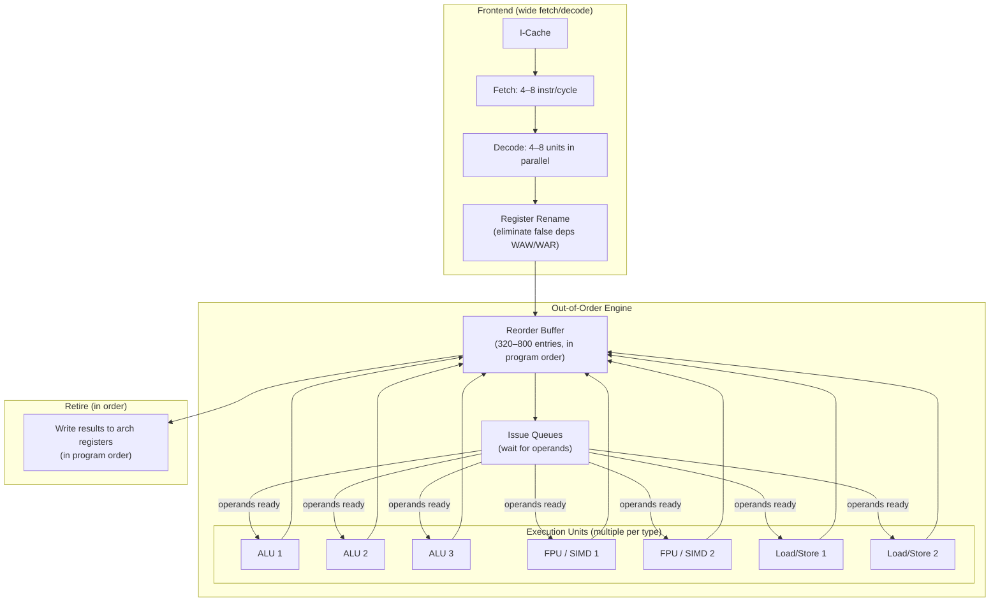

## In simple terms

A simple pipeline executes one instruction per cycle (in steady state). A superscalar processor issues two, four, or eight instructions per cycle by running multiple execution units simultaneously. If the next four instructions in your program don't depend on each other (no data hazards), they can all execute at once — the CPU finds this parallelism automatically, without the programmer or compiler doing anything special. Modern cores issue 4–6 instructions per cycle, which is why a single core runs sequential code much faster than its clock frequency alone would suggest.

## The Visual Map



## More detail

**Instruction-level parallelism (ILP):** independent instructions — no shared data, no control dependencies — can execute simultaneously. Research shows typical programs have ILP of 5–7 among nearby instructions; modern superscalar OoO processors try to exploit this automatically.

**Front end and back end:**

- **Wide fetch/decode** — the frontend must supply as many instructions per cycle as the execution engine can consume (4–8). Decoding x86 variable-length instructions requires parallel length determination; fixed-width RISC instructions decode more easily.
- **Register renaming** — Tomasulo's algorithm maps architectural registers to a larger pool of physical registers. This eliminates WAW (write-after-write) and WAR (write-after-read) false dependencies, allowing the OoO engine to find more parallelism.
- **Reorder buffer (ROB)** — a circular buffer holding all in-flight instructions in program order. Instructions execute out of order but retire (commit results to architectural state) in order, preserving sequential semantics and enabling precise exceptions.
- **Reservation stations / issue queues** — instructions wait here until all their source operands are available. The scheduler scans queues every cycle and issues any instruction whose operands have arrived.
- **Execution units** — multiple units of each type: 3–4 integer ALUs, 2 FPUs, 2–3 SIMD units, 2 load/store units. A 6-wide superscalar might issue 2 ALU ops + 1 branch + 1 FP + 2 memory ops per cycle simultaneously.

**Modern superscalar CPUs:**

| CPU | Decode width | ROB entries | Execution units |
|---|---|---|---|
| Intel Core i9 (Raptor Lake) | 6-wide | ~512 | 12 (4 ALU, 2 FP, 2 LS, ...) |
| AMD Ryzen 7 (Zen 4) | 4-wide | ~320 | 10 |
| Apple M4 | 8-wide | ~630 | 16+ |
| ARM Cortex-A78 | 4-wide | ~128 | 8 |
| ARM Cortex-A55 (in-order) | 2-wide | — | 5 (no OoO) |

**Limits to ILP:**

- **True data dependencies (RAW)** — instruction B must wait for A's result. No renaming can help; the latency is fixed by the execution unit.
- **Memory aliasing** — the CPU cannot determine if two memory accesses address the same location; it must either stall or use a memory order buffer to track potential conflicts.
- **Branch misprediction** — flushes the entire ROB; the wider the superscalar, the more instructions wasted per mispredict.
- **Issue width ceiling** — most real programs don't have 8 independent instructions in every window of 8; the IPC ceiling from real ILP is typically 3–4 even on an 8-wide machine.

## Under the Hood

Measuring Instructions Per Cycle (IPC) indirectly — compare tight independent loops vs. dependent chains:

```python
#!/usr/bin/env python3
"""Demonstrate IPC difference: independent ops vs. dependency chain.
   On a real OoO CPU, independent ops overlap; the chain is serialised.
   CPython GIL limits this, but the timing ratio shows the concept."""
import time

N = 10_000_000

def dependent_chain(n):
    """Each iteration depends on the previous: a = f(a). Pure serial."""
    a = 1.0
    for _ in range(n):
        a = a * 1.000001 + 0.000001   # RAW: new a depends on old a
    return a

def independent_four(n):
    """Four independent accumulators: OoO engine can run all 4 in parallel."""
    a = b = c = d = 1.0
    for _ in range(n):
        a = a * 1.000001 + 0.000001
        b = b * 1.000001 + 0.000001
        c = c * 1.000001 + 0.000001
        d = d * 1.000001 + 0.000001
    return a + b + c + d

# Warmup
dependent_chain(1000); independent_four(1000)

t0 = time.perf_counter(); dependent_chain(N);  chain_ms = (time.perf_counter()-t0)*1000
t0 = time.perf_counter(); independent_four(N); indep_ms = (time.perf_counter()-t0)*1000

print(f"Dependent chain (1 accumulator):    {chain_ms:.0f} ms")
print(f"Independent (4 accumulators):        {indep_ms:.0f} ms")
print(f"Ratio: {chain_ms/indep_ms:.1f}x")
print()
print("On a real OoO FPU (3-5 cycle latency, 1-cycle throughput):")
print("  dependent: one multiply per 3-5 cycles (serialised)")
print("  independent 4x: four multiplies per ~5 cycles (OoO overlapped)")
print("  expected speedup: ~3-5x")
print("  Python adds interpreter overhead that flattens the ratio.")
```

## Engineering Trade-offs

**Decode width vs. decoder complexity and power**
A 4-wide decoder handles 4 instructions per cycle; an 8-wide decoder handles 8 — but must also handle 8 simultaneous length-disambiguation and dependency checks. The decoder is one of the most power-hungry pipeline stages in modern x86 CPUs. Apple's M4 uses 8-wide decode, contributing to its high IPC but also to its large die area. Narrower decoders (Zen 4's 4-wide) consume less power and area for slightly less theoretical IPC ceiling.

**ROB size vs. speculation depth and die area**
A larger ROB allows more instructions in-flight, hiding more memory latency by finding independent work farther ahead in the instruction stream. Apple M4's ~630-entry ROB means the CPU can speculate across L3 cache miss latency (~40 cycles) and still find useful work. But the ROB is read associatively every cycle; beyond ~800 entries, the access latency itself starts to hurt cycle time.

**ILP ceiling vs. multi-core scaling**
Real application ILP is limited to 3–5 effective IPC even on the widest machines (diminishing independent instruction windows). Beyond this, adding more cores (thread-level parallelism, TLP) scales linearly if the application is parallel. Single-core optimisation (wider OoO, better branch prediction) has diminishing returns per generation; multi-core scaling requires parallel software.

**In-order vs. out-of-order at the system level**
An in-order core (ARM Cortex-A55) consumes ~1/5 the power of a comparable OoO core (Cortex-A78) at similar clock speed. For background workloads, OS services, and latency-tolerant tasks, in-order cores are far more efficient. big.LITTLE and DynamIQ designs exploit this: OoO "big" cores for foreground bursts, in-order "little" cores for background work. Modern smartphones spend >70% of active time on the little cores.

**Superscalar vs. VLIW (explicitly parallel)**
Superscalar extracts ILP dynamically in hardware at runtime. VLIW (Very Long Instruction Word — used in Intel Itanium, some DSPs) extracts ILP statically at compile time: the compiler schedules which operations run in parallel and packs them into wide instruction words. VLIW requires no hardware scheduling (simpler, lower power), but the compiler must have perfect knowledge of all latencies and hazards. If the binary is compiled for different hardware, the parallel packing may not match actual latencies — a binary compatibility problem that contributed to Itanium's failure.

## Real-world examples

- **SPEC CPU 2017** — the standard single-core benchmark suite. Apple M4 leads x86 competitors because its 8-wide decode and 630+ ROB extract more ILP from the benchmark's instruction streams.
- **JVM JIT compiler** — HotSpot's server compiler (C2) analyses hot loops, inlines callees, unrolls loops, and reorders instructions to fill superscalar slots and hide latency — essentially doing in software what the CPU's OoO engine does in hardware.
- **LLVM instruction scheduling** — the LLVM backend's machine scheduler has a model of each target's execution units, latencies, and issue width; it reorders instructions to maximise parallel slot utilisation before emitting code. This is critical for in-order targets (ARM Cortex-A55) where the compiler must do the OoO engine's job.
- **Apple M-series dominance** — Apple's CPU team at AMD Semiconductor (pre-Apple Silicon days: P.A. Semi, then Apple) invested heavily in wide-issue OoO engines. M4's 8-wide decode and large ROB give it an IPC advantage over Intel's 6-wide architecture on single-threaded code.
- **Intel Pentium (1993) — first superscalar x86** — the original Pentium was dual-issue (2 instructions per cycle) with an in-order pipeline but two integer pipelines. True OoO superscalar didn't arrive in x86 until Pentium Pro (1995) with its out-of-order ROB.

## Common misconceptions

- **"Superscalar means parallel processors."** Superscalar is ILP within a single core — finding parallelism in a single instruction stream. Multi-core (TLP) adds independent cores; SIMD adds data-level parallelism. All three are orthogonal.
- **"Faster clock = more instructions per second."** Total throughput = clock × IPC. Apple M4 at 4 GHz × 8 IPC outperforms Intel at 5 GHz × 5 IPC on many workloads. The industry's focus has shifted from clock scaling to IPC scaling since the ~2004 frequency wall.
- **"The compiler can't do anything — the hardware handles it."** The hardware handles dynamic scheduling, but the compiler heavily influences IPC: loop unrolling exposes more independent instructions, software pipelining hides latency chains, and register allocation affects how many values fit in the rename file without spilling.

## Try it yourself

Compare scalar loops vs. manually "unrolled" independent loops — mimicking what a compiler does to expose ILP:

```bash
python3 - << 'EOF'
import time

N = 8_000_000

def scalar_dot(n):
    """Sequential dependent accumulation — one chain."""
    s = 0
    for i in range(n):
        s += i * (i + 1)
    return s

def unrolled_dot(n):
    """4x unrolled: four independent partial sums — OoO can overlap."""
    s0 = s1 = s2 = s3 = 0
    n4 = (n // 4) * 4
    for i in range(0, n4, 4):
        s0 += i       * (i + 1)
        s1 += (i + 1) * (i + 2)
        s2 += (i + 2) * (i + 3)
        s3 += (i + 3) * (i + 4)
    for i in range(n4, n):   # handle tail
        s0 += i * (i + 1)
    return s0 + s1 + s2 + s3

# Warmup
scalar_dot(1000); unrolled_dot(1000)

t0 = time.perf_counter(); r1 = scalar_dot(N);   scalar_ms = (time.perf_counter()-t0)*1000
t0 = time.perf_counter(); r2 = unrolled_dot(N); unroll_ms = (time.perf_counter()-t0)*1000

print(f"Scalar (1 accumulator):      {scalar_ms:.0f} ms")
print(f"Unrolled 4x (4 independent): {unroll_ms:.0f} ms")
print(f"Speedup: {scalar_ms/unroll_ms:.1f}x")
print(f"Results match: {r1 == r2}")
print()
print("Compilers with -O3 perform this unrolling automatically.")
print("On a real OoO CPU with 3-cycle FP latency, 4x unrolling")
print("allows all 4 iterations to be in-flight simultaneously.")
EOF
```

## Learn next

- [Out-of-Order Execution](/t/out-of-order-execution) — the hardware mechanism that makes superscalar practical: dynamically scheduling which instructions to issue from the ROB each cycle based on operand readiness.
- [Branch Prediction](/t/branch-prediction) — branch misprediction flushes the ROB; on an 8-wide superscalar, a single mispredict wastes 8 × (misprediction penalty) potential instruction slots.
- [SIMD](/t/simd) — complements superscalar: where superscalar issues multiple different instructions per cycle, SIMD processes multiple data values with a single instruction; both forms of ILP are deployed in modern CPUs.
- [Speculative Execution](/t/speculative-execution) — the CPUs that implement superscalar all speculatively execute past branches; Spectre exploits the microarchitectural side effects of that speculation.
