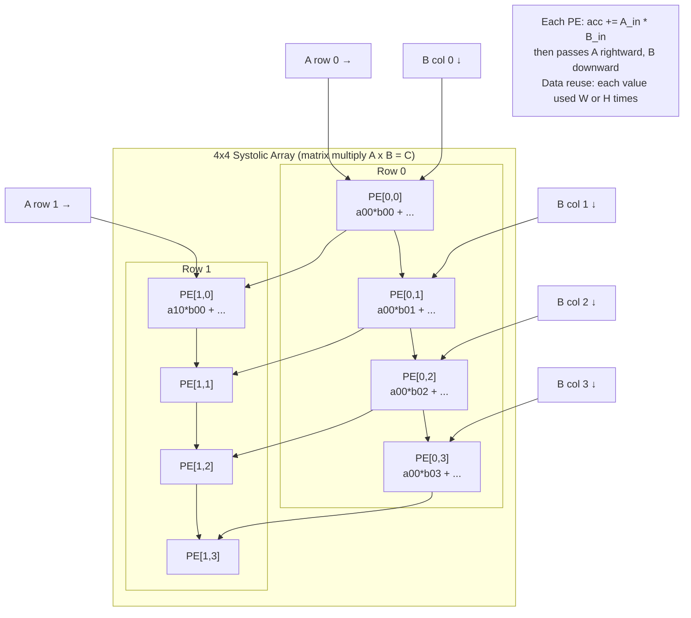

## In simple terms

A systolic array is a grid of tiny processors that each do one simple operation (multiply-and-accumulate) and pass data to their neighbours — like blood flowing through a heart, rhythmically pumping data through a fixed network. The key insight: for matrix multiplication, the same data can be reused many times as it flows through the grid, so memory bandwidth requirements are dramatically reduced. Google's Tensor Processing Unit (TPU) is essentially a massive systolic array, purpose-built to multiply matrices — the core operation in neural network inference and training.

## The Visual Map



## More detail

**Matrix multiplication and the memory wall:** multiplying two N×N matrices requires O(N³) multiply-accumulate (MAC) operations but only O(N²) data. A general-purpose CPU or GPU fetches operands from memory for each operation, burning memory bandwidth. A systolic array arranges processing elements (PEs) so that data flows through the grid naturally, being reused at each PE without returning to memory between uses — amortising memory access across many operations.

**How it works (2D systolic array for matrix multiply):**

1. Arrange PEs in a W×H grid.
2. Input matrix A flows horizontally (left to right); input matrix B flows vertically (top to bottom), staggered so that the right values meet at the right PE at the right cycle.
3. Each PE receives one element of A from the left and one element of B from above, computes MAC (`acc += A × B`), then passes A rightward and B downward.
4. After N cycles, output matrix C is accumulated in the PEs.
5. **Data reuse ratio:** each element of A is used by H PEs; each element of B by W PEs. Memory bandwidth requirement: O(N²) data for O(N³) operations — arithmetic intensity increases with array size.

**Google TPU generations:**

| Version | Year | Array size | Precision | Peak | Use |
|---|---|---|---|---|---|
| TPUv1 | 2016 | 256×256 | INT8 | 92 TOPS | Inference |
| TPUv2 | 2017 | 128×128 | BF16 | 45 TFLOPS | Training |
| TPUv4 | 2021 | 128×128 × 2 | BF16 | 275 TFLOPS | Training |
| TPUv5e | 2024 | — | INT8/BF16 | 393 TOPS | Inference |

TPUv4 pods: 4096 TPUs connected by a custom 3D torus interconnect (ICI), trained Gemini Ultra and PaLM-2.

**Contrast with GPU:** GPUs are SIMT (Single Instruction Multiple Threads) — thousands of simple cores executing the same instruction on different data. GPUs are flexible (compute shaders, any kernel), systolic arrays are rigid (matrix multiply only). For dense matrix multiply, systolic arrays achieve 3–10× better efficiency than GPUs. For irregular workloads (sparse attention, graph neural networks), GPUs win.

**Other systolic-array designs:**
- Apple Neural Engine (A12+): 8×1 MAC array, runs Core ML models at 38 TOPS (A17 Pro) at ~1/10th GPU power.
- AWS Trainium / Inferentia: custom systolic arrays for Amazon Titan and Bedrock model training.
- Nvidia Tensor Cores (A100, H100): hybrid SIMT + dedicated 4×4 matrix-multiply units, achieving 2000+ INT8 TOPS.
- Cerebras Wafer Scale Engine: a wafer-scale mesh of ~850K sparse linear algebra PEs.

## Under the Hood

A minimal systolic array simulation for 3×3 matrix multiply:

```python
#!/usr/bin/env python3
"""Simulate a 3x3 systolic array computing C = A @ B."""

def systolic_matmul(A, B):
    """Simulate systolic array: A flows right, B flows down, staggered."""
    N = len(A)
    assert len(B) == N and all(len(r) == N for r in A + B)

    # Processing elements: each accumulates A_in * B_in
    C = [[0] * N for _ in range(N)]

    # Stagger: A[i] starts at cycle i, B[j] starts at cycle j
    # Total cycles needed: 2*N - 1 (to drain the pipeline)
    total_cycles = 3 * N - 2

    # For each cycle, determine which (i,j) pairs are active
    for cycle in range(total_cycles):
        for i in range(N):
            for j in range(N):
                # PE[i][j] receives A[i] at step (i+j) and B[j] at step (i+j)
                k = cycle - i - j  # which k-element is flowing through
                if 0 <= k < N:
                    C[i][j] += A[i][k] * B[k][j]

    return C

def matmul_naive(A, B):
    N = len(A)
    return [[sum(A[i][k] * B[k][j] for k in range(N))
             for j in range(N)] for i in range(N)]

# Test with a 3x3 example
A = [[1, 2, 3],
     [4, 5, 6],
     [7, 8, 9]]

B = [[9, 8, 7],
     [6, 5, 4],
     [3, 2, 1]]

C_systolic = systolic_matmul(A, B)
C_naive    = matmul_naive(A, B)

print("A @ B =")
for row in C_systolic:
    print(f"  {row}")

print(f"\nMatches naive: {C_systolic == C_naive}")
print()
print("In hardware, each PE[i][j] performs ONE multiply-accumulate per cycle.")
print(f"A 3x3 array computes all {3*3} outputs in {3*3 - 2} + drain = ~7 cycles")
print(f"vs {3**3} separate MACs for naive scalar. Data reuse: A row reused 3 times.")
```

## Engineering Trade-offs

**Arithmetic intensity vs. array size**
A larger systolic array (more PEs) increases arithmetic intensity: each A row element is reused by H PEs (H = array height), each B column element by W PEs (W = array width). A 256×256 array achieves 256× data reuse over naive element-wise compute. But the array must be kept fed: if the input matrices are small (&lt;256×256), many PEs are idle and arithmetic intensity is low. Systolic arrays are only efficient at large batch sizes and large matrix dimensions.

**Fixed-function efficiency vs. programmability**
A systolic array does one thing: dense matrix multiply. The PEs have no branch prediction, no cache hierarchy, no complex decode logic — the die area and power that a CPU would use for those features goes into more MAC units instead. Google's TPUv1 achieved 92 TOPS with significantly less power than an equivalent GPU for the same workload. But a systolic array cannot run irregular workloads (sparse attention, custom ops) without additional general-purpose compute alongside it.

**Precision vs. throughput**
Each MAC unit has a fixed data width. INT8 MACs process twice as many elements per cycle as BF16 MACs at the same silicon area. INT8 quantisation (post-training quantisation, QAT) can reduce model size by 4× and inference cost by 2–4× at minimal accuracy loss for many transformer architectures. Systolic arrays make this trade-off particularly sharp: a 256×256 INT8 array does 4× the work of a 256×256 FP32 array.

**Interconnect topology vs. model parallelism at scale**
Training large language models (GPT-4, Gemini) requires distributing the model across thousands of accelerators. The interconnect between chips (NVLink for GPUs, ICI for TPUs) determines how fast gradients and activations can be exchanged. TPUv4's 3D torus ICI provides 460 GB/s bisection bandwidth per chip in a 4096-chip pod — the interconnect is as important as the array arithmetic for training throughput.

**Wafer-scale integration vs. yield**
Cerebras CS-3 (Wafer Scale Engine 3) places 900K cores on a single 46,225 mm² silicon die — an entire 300mm wafer. This eliminates all off-chip memory bandwidth constraints and chip-to-chip interconnect latency. But manufacturing yield for a wafer with no yield-reducing singulation means any single defective transistor could theoretically kill the chip (mitigated by redundant routing and PE mapping). Wafer-scale chips represent the extreme end of the area-vs-bandwidth trade-off.

## Real-world examples

- **Google TPUv4 pod** — 4096 TPUs, 2 × 128×128 BF16 arrays each, 275 TFLOPS/chip = ~1.1 exaFLOPS per pod. Used to train Gemini Ultra, PaLM-2, and Bard. Each TPU connects to the pod via 3D torus ICI at 460 GB/s.
- **Apple A17 Pro Neural Engine** — 38 TOPS at &lt;2W, running Core ML models (Stable Diffusion, on-device LLM inference). The systolic array handles the attention + FFN matrix multiplies; Apple's GPU handles the embedding and normalization ops that the fixed-function array can't run.
- **AWS Trainium2** — Amazon's custom ASIC training chip (2023); systolic array for matrix multiply + NeuronCore-v2 for custom ops; used for Amazon Titan and internally for AWS services.
- **Nvidia H100 Tensor Cores** — 4th-gen tensor cores: 4×4 matrix-multiply units, 2000 INT8 TOPS. Hybrid: SIMT cores for irregular compute, tensor cores for dense matrix multiply. Allows flexibility while approaching systolic efficiency for matmul.
- **Waymo TPU-based inference** — Waymo's autonomous driving perception stack runs on TPUs in data centers for training and custom ASICs in the car; the perception model's matrix multiplies map efficiently to systolic array hardware.

## Common misconceptions

- **"Systolic arrays are just GPUs."** GPUs are programmable SIMT processors with general-purpose cores; systolic arrays are fixed-function pipelines optimised for matrix multiply. The trade-off: flexibility vs. efficiency per watt.
- **"TPUs can only run TensorFlow."** Modern TPUs support JAX, PyTorch/XLA, and any framework that compiles to XLA HLO. The hardware is framework-agnostic; the XLA compiler maps computation to the systolic array.
- **"Bigger arrays are always better."** A 256×256 array is only efficient when matrices are large enough to keep all 65,536 PEs busy. For small batch inference (single-request latency-optimised serving), many PEs are idle — efficiency falls to GPU parity or below.

## Try it yourself

Simulate the data reuse advantage of a systolic array vs. naive element-wise compute:

```bash
python3 - << 'EOF'
import time

def naive_matmul(A, B):
    """O(N^3) with no data reuse — fetches every element independently."""
    N = len(A)
    C = [[0.0]*N for _ in range(N)]
    for i in range(N):
        for k in range(N):
            for j in range(N):
                C[i][j] += A[i][k] * B[k][j]
    return C

def blocked_matmul(A, B, block=32):
    """Cache-blocked matmul: reuse data within a cache block (approximates systolic)."""
    N = len(A)
    C = [[0.0]*N for _ in range(N)]
    for i0 in range(0, N, block):
        for k0 in range(0, N, block):
            for j0 in range(0, N, block):
                for i in range(i0, min(i0+block, N)):
                    for k in range(k0, min(k0+block, N)):
                        aik = A[i][k]
                        for j in range(j0, min(j0+block, N)):
                            C[i][j] += aik * B[k][j]
    return C

N = 64
A = [[float((i+j) % 7) for j in range(N)] for i in range(N)]
B = [[float((i*j+1) % 5) for j in range(N)] for i in range(N)]

t0 = time.perf_counter()
C1 = naive_matmul(A, B)
naive_ms = (time.perf_counter()-t0)*1000

t0 = time.perf_counter()
C2 = blocked_matmul(A, B)
block_ms = (time.perf_counter()-t0)*1000

# Verify
ok = all(abs(C1[i][j]-C2[i][j]) < 1e-9 for i in range(N) for j in range(N))
print(f"Matrix size: {N}x{N}  ({N**3:,} MACs)")
print(f"Naive matmul (row-major order):   {naive_ms:.0f} ms")
print(f"Blocked matmul (cache-friendly):  {block_ms:.0f} ms")
print(f"Speedup: {naive_ms/block_ms:.1f}x  (Results match: {ok})")
print()
print("A real systolic array achieves the same data reuse in silicon:")
print(f"  Data loaded: {N*N*2:,} elements ({N*N*2*4/1024:.0f} KB)")
print(f"  MACs performed: {N**3:,}")
print(f"  Arithmetic intensity: {N**3 / (N*N*2):.0f} MACs per element loaded")
print(f"  For N=256 (TPUv1): {256**3 / (256*256*2):.0f} MACs per element = 128x reuse")
EOF
```

## Learn next

- [SIMD](/t/simd) — a simpler form of data-parallel computation within a single CPU core; the conceptual predecessor to systolic arrays (both exploit data-level parallelism, but at very different scales).
- [GPU](/t/gpu) — the primary alternative to systolic arrays for ML acceleration; GPUs are programmable SIMT processors, systolic arrays are fixed-function; understanding both is essential for ML hardware selection.
- [Superscalar Execution](/t/superscalar) — the general-purpose CPU version of extracting instruction-level parallelism; comparing superscalar ILP to systolic array data-level parallelism shows why dedicated ML hardware is needed.
- [Out-of-Order Execution](/t/out-of-order-execution) — what CPUs do to hide latency and extract parallelism from general code; systolic arrays avoid the need for OoO by having the data flow perfectly regular by design.
