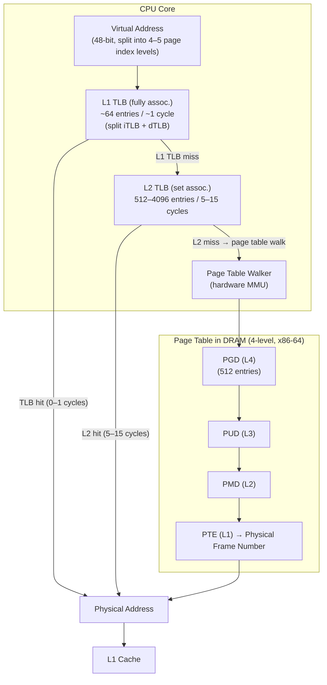

## In simple terms

Virtual memory gives every process its own address space, but every memory access must be translated from virtual to physical address — which requires walking a multi-level page table stored in memory. That walk takes 20–100+ memory accesses. The TLB is a tiny cache (64–2048 entries) that stores recent virtual-to-physical translations. A TLB hit costs 0–1 cycles; a TLB miss triggers a full page table walk. With a good hit rate (99%+), virtual memory overhead is nearly invisible.

## The Visual Map



## More detail

**Page table walk:** on a TLB miss, the CPU's MMU walks the page table (a tree structure in physical memory, up to 5 levels for x86-64 5-level paging). Each level is a 4 KB page of 512 entries. Walking 4 levels requires 4 additional memory accesses — potentially 4 cache misses (100–300 cycles each). Modern CPUs use dedicated page-walk hardware that performs this in parallel with other work where possible.

**TLB structure:**

| Level | Size | Latency | Notes |
|---|---|---|---|
| L1 iTLB (instructions) | 64 entries | ~1 cycle | Fully associative |
| L1 dTLB (data) | 64 entries | ~1 cycle | Fully associative |
| L2 TLB (unified) | 512–4096 entries | 5–15 cycles | Set-associative |
| Page table walk | N/A | ~100–1000 cycles | 4 cache lookups |

**Coverage and huge pages:** a 4 KB page × 64 TLB entries = 256 KB of address space covered by the L1 TLB. A working set larger than this causes frequent TLB misses. **Huge pages** (2 MB or 1 GB) give each TLB entry 512× or 262,144× more coverage:
- 4 KB pages: 64-entry TLB covers 256 KB
- 2 MB huge pages: 64-entry TLB covers 128 MB
- 1 GB huge pages: 64-entry TLB covers 64 GB

Database systems (PostgreSQL, Oracle, MySQL) and JVMs configure huge pages to reduce TLB pressure on large buffer pools.

**TLB shootdown:** when a page mapping changes (`munmap`, `mprotect`, `mmap`), the TLB entry must be invalidated on *every core* that might have cached it. This requires an inter-processor interrupt (IPI) to each core — the "TLB shootdown." In a 128-core NUMA system, a single `munmap` triggers 127 IPIs. Linux's lazy TLB optimisation (delay TLBs not actively used) and batched shootdowns mitigate this.

**PCID (Process-Context Identifiers):** x86 hardware can tag TLB entries with a 12-bit process ID, avoiding the need to flush the entire TLB on context switches (which was the main cost before PCID). Linux uses PCID on Skylake+ processors for context switches.

**Meltdown and KPTI:** Meltdown (2018) allowed userspace to speculatively read kernel memory via kernel page table mappings present in user-mode TLBs. The fix — Kernel Page-Table Isolation (KPTI) — maintains two page tables per process: one with kernel mappings (in kernel mode), one without (in user mode). The switch flushes non-PCID TLBs, adding ~5–30% overhead on syscall-heavy workloads. With PCID, the overhead drops to ~1%.

**Software vs. hardware TLB fill:**
- **Hardware-filled (x86, ARMv8.4+):** the MMU fills the TLB automatically; the OS only provides the page table structure.
- **Software-filled (MIPS, older SPARC):** a TLB miss triggers a kernel trap; the OS fills the TLB. More flexible (OS can implement any page table format) but higher miss cost.

## Under the Hood

Demonstrating TLB pressure — comparing sequential access (TLB-friendly) vs. random access across a large buffer (TLB-thrashing):

```c
/* tlb_demo.c — compile: gcc -O2 -o tlb_demo tlb_demo.c
   Run: ./tlb_demo
   Shows sequential vs. random access with large buffers that overflow TLB coverage */
#include <stdio.h>
#include <stdlib.h>
#include <time.h>
#include <string.h>

#define GB (1UL << 30)
#define PAGE_SIZE 4096

static double now_s(void) {
    struct timespec ts;
    clock_gettime(CLOCK_MONOTONIC, &ts);
    return ts.tv_sec + ts.tv_nsec * 1e-9;
}

int main(void) {
    /* 256 MB buffer — overflows all TLB coverage (64 entries x 4KB = 256 KB) */
    const size_t SIZE = 256 * 1024 * 1024;
    const size_t N_PAGES = SIZE / PAGE_SIZE;

    char *buf = aligned_alloc(PAGE_SIZE, SIZE);
    memset(buf, 0, SIZE);  /* fault in all pages */

    /* Build random page permutation for TLB-thrashing access */
    size_t *perm = malloc(N_PAGES * sizeof(size_t));
    for (size_t i = 0; i < N_PAGES; i++) perm[i] = i;
    for (size_t i = N_PAGES - 1; i > 0; i--) {
        size_t j = rand() % (i + 1);
        size_t tmp = perm[i]; perm[i] = perm[j]; perm[j] = tmp;
    }

    /* Sequential: TLB prefetches work, each page hit from iTLB */
    double t0 = now_s();
    volatile long s1 = 0;
    for (size_t i = 0; i < N_PAGES; i++)
        s1 += *(long *)(buf + i * PAGE_SIZE);
    double seq_ms = (now_s() - t0) * 1000;

    /* Random page-at-a-time: every access is a TLB miss (different page) */
    t0 = now_s();
    volatile long s2 = 0;
    for (size_t i = 0; i < N_PAGES; i++)
        s2 += *(long *)(buf + perm[i] * PAGE_SIZE);
    double rnd_ms = (now_s() - t0) * 1000;

    printf("Buffer: %zu MB, %zu pages (4KB each)\n", SIZE >> 20, N_PAGES);
    printf("Sequential access (TLB-friendly): %.1f ms\n", seq_ms);
    printf("Random page access (TLB-thrashing): %.1f ms  (~%.0fx slower)\n",
           rnd_ms, rnd_ms / seq_ms);
    printf("(dummy: %ld %ld)\n", s1, s2);

    free(buf); free(perm);
    return 0;
}
```

On a typical desktop CPU, the random page access pattern is 5–20× slower because every access causes a TLB miss and triggers a page table walk.

## Engineering Trade-offs

**TLB size vs. die area and access latency**
Fully-associative TLBs have the best hit rate but require a comparator for every entry checked in parallel. With 64 entries, 64 comparators cost ~1% of L1 cache area. Scaling to 2048 entries fully associative is impractical; set-associative L2 TLBs use 4–8-way sets, trading some hit rate for lower area. The L1 TLB must respond in 1 cycle; area constraints limit it to 64 entries on current process nodes.

**Huge pages vs. memory waste**
2 MB huge pages cover 512× more address space per TLB entry. But a huge page is always allocated as a full 2 MB aligned contiguous physical region — if only 4 KB is used, 2044 KB is wasted. Huge pages also fragment the physical address space, making it harder for the OS to satisfy future large allocations. Best for large, long-lived buffers (database pools, ML model weights) — harmful for small, short-lived allocations.

**PCID vs. TLB flush on context switch**
Without PCID, every context switch flushes the TLB (all entries become invalid for the new process's address space). On a server running thousands of short syscalls per second, flushing 2048 entries ~100,000 times/second costs substantial pipeline time. PCID tags entries with a 12-bit process ID; context switches can preserve the previous process's TLB entries for later reuse (software lazy-TLB). Linux only uses PCID where hardware supports it (x86 Skylake+).

**KPTI kernel isolation vs. syscall performance**
KPTI maintains two page tables per process (user and kernel mappings). The switch from user to kernel mode invalidates user-space TLB entries if PCID isn't used. On Meltdown-affected CPUs without PCID, every syscall costs a full TLB flush — ~50–200 ns. Redis and Nginx, which issue millions of syscalls per second, saw 5–20% throughput loss from initial KPTI patches.

**5-level paging vs. address space size**
x86-64 originally used 4-level paging (48-bit virtual addresses, 256 TB user space). Linux 5-level paging (57-bit virtual addresses, 128 PB) added a fifth level to the page table walk. This adds one extra memory access per TLB miss, increasing miss cost by ~25%. For systems with >256 TB of virtual address space (huge VMs, in-memory databases), 5-level paging is necessary; for smaller systems, keeping 4-level avoids the extra walk cost.

## Real-world examples

- **PostgreSQL huge_pages=on** — PostgreSQL allocates its shared buffer pool as huge pages (2 MB). For a 256 GB buffer pool, 4 KB pages need 65,536 TLB entries; 2 MB huge pages need 128. Typical PostgreSQL configurations see 15–30% throughput improvement on large OLAP queries with huge pages.
- **Oracle SGA with 1 GB huge pages** — Oracle 19c/21c uses 1 GB huge pages for the System Global Area (SGA). A 512 GB SGA requires 512 TLB entries with 1 GB pages vs. 134 million with 4 KB pages.
- **JVM `-XX:+UseHugePages`** — Java heap with 64 GB RAM, using 4 KB pages: ~16M TLB entries needed. With 2 MB huge pages: ~32,768. GC-intensive applications see 30–50% less time in page-walk code.
- **KPTI performance recovery with PCID** — Initial Linux 4.15 KPTI patches on Meltdown-affected hardware (pre-Skylake): up to 30% regression on Redis. With PCID on Skylake/Ice Lake: regression reduced to <1%, because TLBs are tagged and not flushed on syscall boundary.
- **TLB shootdown in tcmalloc** — Google's tcmalloc (thread-cached malloc) defers returning memory to the OS to avoid frequent `munmap` TLB shootdowns. It batches memory returns in "release to OS" background threads to reduce IPI overhead on high-core-count servers.

## Common misconceptions

- **"Virtual memory is slow because of address translation."** With a high TLB hit rate (99%+ for programs with good locality), the overhead is under 1%. The TLB makes virtual memory essentially free.
- **"Huge pages are always better."** Huge pages are beneficial for large, contiguous working sets. For general-purpose heap allocation, they waste memory (most allocations are much smaller than 2 MB) and can cause OOM by fragmenting the physical address space.
- **"KPTI is still expensive."** Initial KPTI (Linux 4.15, January 2018) was expensive because it flushed TLBs on every syscall. With PCID and optimised context-switch code in Linux 5.x+, KPTI overhead on PCID-capable hardware is <1%.

## Try it yourself

Measure TLB miss cost by accessing memory with strides larger than the TLB coverage:

```bash
python3 - << 'EOF'
import time, array

# TLB coverage: ~64 entries x 4KB page = 256KB
# When we stride through more than 256KB, each access lands on a new page -> TLB miss

PAGE = 4096  # bytes per page
LONGS_PER_PAGE = PAGE // 8  # 512 longs per 4KB page

def time_access(buf, stride_pages, n_accesses):
    stride = stride_pages * LONGS_PER_PAGE
    t0 = time.perf_counter()
    s = 0
    idx = 0
    for _ in range(n_accesses):
        s += buf[idx % len(buf)]
        idx += stride
    return (time.perf_counter() - t0) * 1e9 / n_accesses, s

# 64MB buffer = 16,384 pages (well beyond TLB coverage)
N_PAGES = 16384
buf = array.array('q', [0] * (N_PAGES * LONGS_PER_PAGE))

N = 50000
print(f"{'Stride (pages)':>15}  {'ns/access':>12}  {'TLB coverage':>15}")
print("-" * 50)
for stride_pages in [1, 2, 4, 8, 16, 64, 256]:
    ns, _ = time_access(buf, stride_pages, N)
    covered_kb = 64 * stride_pages * 4  # rough: 64 TLB entries x stride x 4KB
    coverage = f"{covered_kb} KB covered" if covered_kb < 1024 else f"{covered_kb//1024} MB covered"
    print(f"{stride_pages:>15}  {ns:>12.1f}  {coverage}")

print()
print("As stride grows past ~64 pages (256 KB = TLB coverage),")
print("each access hits a new page and the ns/access rises sharply.")
print("Python loop overhead dominates; in C this effect is 10-30x more visible.")
EOF
```

## Learn next

- [Virtual Memory](/t/virtual-memory) — the abstraction the TLB serves; page tables, page faults, and the OS memory management model that the TLB hardware accelerates.
- [Memory Hierarchy](/t/memory-hierarchy) — the TLB is a cache for page table entries, adding a parallel hierarchy of address-translation latencies on top of the data cache hierarchy.
- [Cache Coherence](/t/cache-coherence) — TLB shootdowns are a multi-core synchronisation problem structurally similar to cache coherence; both require cross-core invalidation when shared state changes.
- [Speculative Execution](/t/speculative-execution) — Meltdown exploited kernel page table entries cached in the TLB during speculative execution; KPTI is the TLB-level mitigation.
