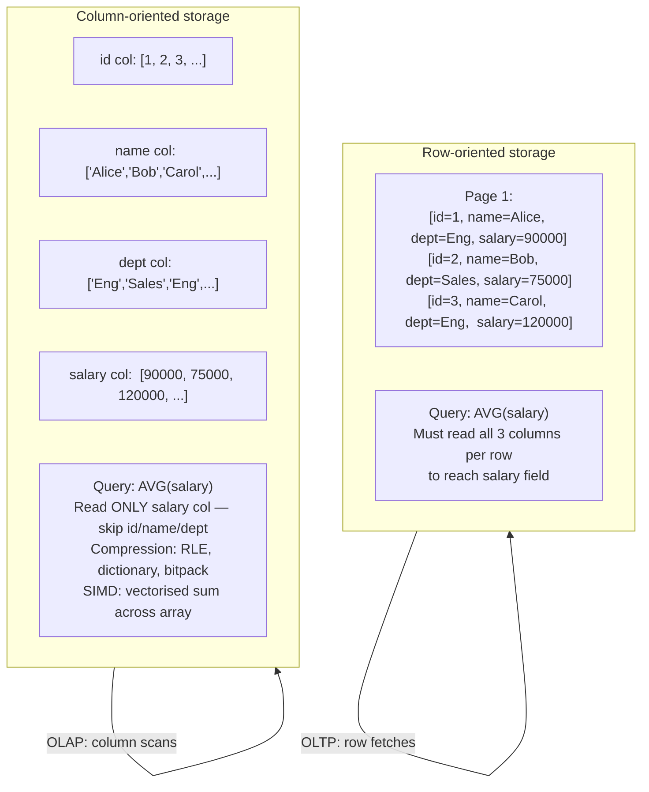

## In simple terms

A regular row-oriented database stores each row together: all columns of row 1, then all columns of row 2. This is great for fetching a complete record by primary key. An analytical query like "what is the average salary across 50 million employees?" only needs the salary column — but a row store fetches *all* columns of every row. A columnar store flips the layout: it stores all salaries together, then all departments, then all hire dates. The salary query reads only the salary column — far fewer cache lines and disk pages.

## The Visual Map



## More detail

**Layout difference:**

| Row store | Columnar store |
|---|---|
| `[id=1, name='Alice', salary=90000]` | salary column: `[90000, 75000, 120000, ...]` |
| `[id=2, name='Bob', salary=75000]` | name column: `['Alice', 'Bob', 'Carol', ...]` |

For OLAP workloads (aggregations, scans, GROUP BY, window functions) that read many rows but few columns, columnar stores are 10–100× faster because:

1. **Column projection** — only the needed columns are read from disk; the rest are not accessed.
2. **Compression** — values in a column have similar types and often similar values: run-length encoding (RLE), dictionary encoding, and bitpacking achieve 5–20× compression, reducing I/O.
3. **Vectorised execution** — SIMD operates on arrays of same-type values. Columnar data maps directly to vector register operations — one instruction processes 8 or 16 int32 values simultaneously.
4. **Late materialisation** — filter operations work on column arrays and produce position bitmaps; the actual row data is only fetched for rows that pass all filters.
5. **Zone maps / min-max indexes** — each column chunk stores its min and max value. A query `WHERE year = 2025` can skip all chunks where `year_max < 2025 OR year_min > 2025` without reading the data.

**OLTP vs. OLAP:**
Row stores (PostgreSQL, MySQL) excel at OLTP — frequent small point reads and writes ("get order #12345"). Columnar stores excel at OLAP — large analytical scans ("revenue by region last quarter"). The write path of a columnar store is typically slower: inserting one row requires appending to every column file. Modern systems use a delta buffer (in-memory row store) for recent writes, merging into column files in the background.

**Major columnar systems:**

| System | Type | Notes |
|---|---|---|
| **DuckDB** | In-process | Zero-config, embedded in Python/R notebooks |
| **ClickHouse** | Server | Extreme write + read throughput |
| **Redshift** | Cloud DW | AWS-managed, separation of storage/compute |
| **BigQuery** | Cloud DW | Serverless, billed per bytes scanned |
| **Snowflake** | Cloud DW | Multi-cloud, virtual warehouses |
| **Apache Parquet** | File format | Column-oriented file used in data lakes |

**Parquet** is the column-oriented file format used in data lakes. Apache Spark, Apache Iceberg, Delta Lake, and Hudi all use Parquet as their default storage format. The query engine reads only the needed columns from each row group (128 MB chunk) and uses statistics to skip entire row groups whose min/max don't match the query filter.

## Under the Hood

Simulating columnar vs. row-oriented scan in Python:

```python
#!/usr/bin/env python3
"""Row vs. columnar layout: scan only salary column across 1M records."""
import time, array, random

N = 1_000_000

# Row-oriented: interleaved columns (id:int, dept:int, salary:int, age:int)
COLS = 4  # columns per row
row_data = array.array('i', [0] * (N * COLS))
for i in range(N):
    base = i * COLS
    row_data[base + 0] = i               # id
    row_data[base + 1] = i % 10          # dept (0..9)
    row_data[base + 2] = 50000 + (i % 100000)  # salary
    row_data[base + 3] = 20 + (i % 50)  # age

# Column-oriented: each column is a separate contiguous array
id_col   = array.array('i', range(N))
dept_col = array.array('i', [i % 10 for i in range(N)])
sal_col  = array.array('i', [50000 + (i % 100000) for i in range(N)])
age_col  = array.array('i', [20 + (i % 50) for i in range(N)])

# Query: AVG(salary) WHERE dept = 3  — needs only dept_col + sal_col

# Row scan: must read all 4 columns of every row to reach salary
t0 = time.perf_counter()
total, count = 0, 0
for i in range(N):
    if row_data[i * COLS + 1] == 3:       # dept check
        total += row_data[i * COLS + 2]   # salary (4 memory accesses away)
        count += 1
row_ms = (time.perf_counter() - t0) * 1000

# Column scan: only dept_col and sal_col accessed, contiguous in memory
t0 = time.perf_counter()
total2, count2 = 0, 0
for i in range(N):
    if dept_col[i] == 3:
        total2 += sal_col[i]
        count2 += 1
col_ms = (time.perf_counter() - t0) * 1000

print(f"Rows: {N:,}  Columns per row: {COLS}")
print(f"Row scan:    {row_ms:.0f} ms  avg_salary={total//count if count else 0:,}")
print(f"Column scan: {col_ms:.0f} ms  avg_salary={total2//count2 if count2 else 0:,}")
print(f"Speedup: {row_ms/col_ms:.1f}x")
print(f"\nIn real columnar stores, SIMD + compression add another 10-100x advantage.")
print(f"Reading {COLS} ints vs 2 ints per row = {COLS/2:.0f}x less data in column scan.")
```

## Engineering Trade-offs

**Column scan vs. single-row fetch**
For aggregation over millions of rows, columnar storage reads far less data. For fetching one complete row by primary key ("get employee id 42"), a columnar store must reassemble the row from N separate column files — each potentially a different disk block. Row stores read the full row from one sequential page. Most columnar stores maintain a separate B-tree index or partition for recent rows (delta buffer) to handle point lookups efficiently.

**Compression ratio vs. write throughput**
Columnar compression (RLE, dictionary encoding) can compress repeated values aggressively — a `dept` column with 10 distinct values across 100M rows compresses to ~4 bits per value. But compression must be built and maintained on writes. Columnar systems typically batch writes (micro-partitions in Snowflake, segments in ClickHouse) and compress during the background merge/compaction, accepting higher write latency for better scan performance.

**Vectorised execution vs. general-purpose processing**
SIMD-based vectorised execution (processing 8–16 values per instruction) delivers massive throughput for arithmetic aggregations on numeric columns. It's less effective for string-heavy workloads, complex predicates, and irregular access patterns. DuckDB and ClickHouse are optimised for numeric analytics; workloads with many VARCHAR joins or complex JSON processing don't benefit as much.

**Zone maps (min-max pruning) vs. B-tree selectivity**
B-tree indexes give O(log n) lookup by key. Zone maps give O(n/block_size) pruning — they skip blocks but don't pinpoint a single row. For `WHERE id = 42`, a B-tree wins. For `WHERE year BETWEEN 2024 AND 2025` on 1TB of sorted data, zone maps skip 99% of the data. Columnar stores sort data by the most common filter column (the "sort key" in Redshift, "primary order" in ClickHouse) to maximize zone map effectiveness.

**HTAP (hybrid transactional/analytical) vs. separate OLTP/OLAP**
Modern HTAP systems (TiDB with TiKV row store + TiFlash columnar replica, SingleStore) maintain both row and columnar representations of the same data. OLTP queries use the row store; OLAP queries use the columnar store. The benefit: a single system, no ETL lag. The cost: maintaining two physical representations of every row doubles storage and doubles write amplification.

## Real-world examples

- **DuckDB in data notebooks** — DuckDB is embedded in Python (and R) as a zero-configuration process. `duckdb.query("SELECT AVG(salary) FROM 'data.parquet' WHERE dept='Eng'")` reads the Parquet columnar file directly and processes it with vectorised SIMD execution. A 100M-row Parquet file that takes 60 seconds to scan with pandas takes 2 seconds with DuckDB.
- **ClickHouse at Cloudflare** — Cloudflare processes ~5 trillion DNS queries and HTTP requests per day. ClickHouse ingests these as append-only events and serves sub-second aggregate queries (requests per second by country by minute). The MergeTree engine writes columnar segments and compacts them asynchronously.
- **Parquet in Apache Iceberg** — Netflix migrated 10PB of Hive tables to Apache Iceberg backed by Parquet. Iceberg's metadata (manifest files with min/max column statistics per Parquet file) allows Spark queries to skip files that don't match the query filter — eliminating 90%+ of data reads on filtered queries.
- **Redshift AQUA** — AWS Redshift's AQUA (Advanced Query Accelerator) offloads scan-and-filter operations to custom hardware (FPGAs) co-located with S3. The hardware filters columnar data before returning results to the compute cluster, reducing data transferred from storage to compute by up to 10×.
- **BigQuery slot billing** — BigQuery bills by bytes scanned (not rows). A columnar query on a 1TB table with 100 columns that accesses only 2 columns reads ~20GB. The same query on a row store would scan 1TB. The columnar layout directly reduces cost in BigQuery's pricing model.

## Common misconceptions

- **"Columnar means no transactions."** Columnar stores can support ACID transactions — ClickHouse supports atomic inserts; Delta Lake and Apache Iceberg add full ACID to columnar Parquet files. But their primary optimisation target is read throughput, not concurrent OLTP writes. Columnar and ACID are not mutually exclusive.
- **"Parquet is a database."** Parquet is a storage format — it defines how data is laid out in files. Query engines (Spark, DuckDB, Trino, Athena) interpret it; there's no Parquet server. Choosing to store data as Parquet is a format choice, not a database choice.
- **"Columnar is faster for everything."** A single-row point lookup by primary key is slower in a columnar store than in a row store (must read from N column files). Columnar wins for aggregations over many rows and few columns; row stores win for OLTP single-entity access patterns.

## Try it yourself

Compare row vs. columnar layout scan performance in pure Python:

```bash
python3 - << 'EOF'
import time, array

N = 500_000
COLS = 5  # salary is column index 3

# Row-oriented: [id, year, dept, salary, age] interleaved
row_data = array.array('i', [0] * (N * COLS))
for i in range(N):
    b = i * COLS
    row_data[b+0]=i; row_data[b+1]=2020+(i%5); row_data[b+2]=i%20
    row_data[b+3]=40000+(i%60000); row_data[b+4]=20+(i%45)

# Column-oriented: salary and year as separate arrays
year_col = array.array('i', [2020+(i%5) for i in range(N)])
sal_col  = array.array('i', [40000+(i%60000) for i in range(N)])

# Query: AVG(salary) WHERE year = 2023
t0 = time.perf_counter()
total, cnt = 0, 0
for i in range(N):
    if row_data[i*COLS+1] == 2023:
        total += row_data[i*COLS+3]; cnt += 1
row_ms = (time.perf_counter()-t0)*1000

t0 = time.perf_counter()
total2, cnt2 = 0, 0
for i in range(N):
    if year_col[i] == 2023:
        total2 += sal_col[i]; cnt2 += 1
col_ms = (time.perf_counter()-t0)*1000

print(f"{N:,} rows x {COLS} columns")
print(f"Row layout:    {row_ms:.0f} ms — reads all {COLS} cols per row")
print(f"Column layout: {col_ms:.0f} ms — reads only 2 cols")
print(f"Speedup: {row_ms/col_ms:.1f}x  avg_salary={total2//cnt2 if cnt2 else 0:,}")
EOF
```

## Learn next

- [Normalization](/t/normalization) — the OLTP schema design principle that columnar data warehouses deliberately depart from; star schemas are intentional denormalization for columnar scan performance.
- [ETL](/t/etl) — the pipeline that moves data from row-oriented OLTP sources into columnar analytical stores; ETL transforms often include denormalization specifically to optimize columnar scans.
- [Data Warehouse](/t/data-warehouse) — columnar storage is the defining technical feature of modern data warehouses; understanding columnar layout explains why warehouses are fast for analytics and slow for OLTP writes.
