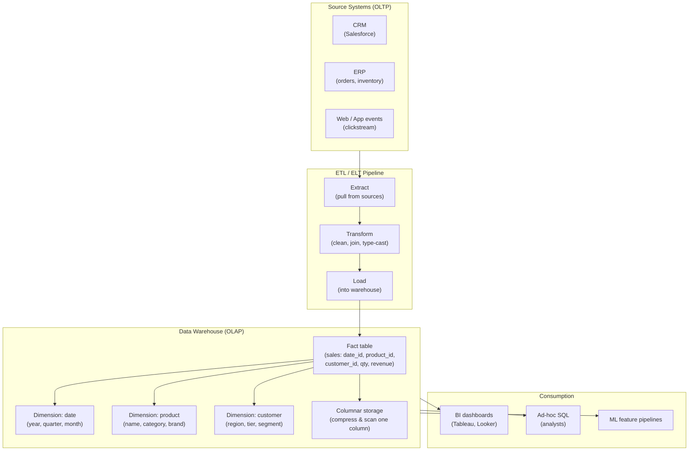

## In simple terms

A **data warehouse** is a database built for *asking big questions*, not for running an app. The databases behind a live application are tuned to read and write a few rows very fast ("get order #4821"). A data warehouse is tuned for the opposite: scanning millions or billions of rows to answer analytical questions ("what were total sales by region, per month, for the last three years?"). It pulls data together from many sources into one place designed for reporting and analysis.

## The Visual Map



## More detail

The split is often described as **OLTP vs. OLAP**:

- **OLTP** (Online Transaction Processing) — the operational databases that run the business, optimized for many small, fast reads and writes. Row-oriented storage, indexed for single-row lookups, normalized schemas, ACID transactions.
- **OLAP** (Online Analytical Processing) — the warehouse, optimized for large scans and aggregations over historical data. Columnar storage, denormalized schemas, MPP, no concurrent writes.

**What makes a warehouse fast at analytics:**

- **Columnar storage** — data is stored column-by-column rather than row-by-row. A query summing one column reads only that column's bytes from disk, not every column of every row. For a table with 50 columns and 1 billion rows, a single-column aggregate reads 2% of the data a row-oriented scan would.
- **Denormalized (star / snowflake) schemas** — a central **fact table** (e.g., `sales`) surrounded by **dimension tables** (date, product, customer). The fact table records events; dimensions hold descriptive attributes. This pre-joins avoid expensive runtime joins on large tables.
- **Massively parallel processing (MPP)** — a query is split across dozens to thousands of nodes, each processing a slice of the data in parallel.
- **Separation of storage and compute** — modern cloud warehouses (Snowflake, BigQuery) store data in object storage (S3, GCS) and spin compute resources up/down per query. Pay per query, not per server.
- **Zone maps and micro-partitions** — columnar warehouses track min/max values per column per file block. A query with `WHERE year = 2025` skips all blocks where `year_max < 2025 OR year_min > 2025` without reading them.

**Star schema example:**

```
fact_sales(sale_id, date_id, product_id, customer_id, store_id, qty, revenue)
   ↓ FK              ↓ FK          ↓ FK           ↓ FK
dim_date(date_id, year, quarter, month, week, day_of_week)
dim_product(product_id, name, brand, category, subcategory)
dim_customer(customer_id, name, region, tier, acquisition_channel)
dim_store(store_id, name, city, country)
```

A BI tool generates queries like: `SELECT d.quarter, p.category, SUM(f.revenue) FROM fact_sales f JOIN dim_date d USING(date_id) JOIN dim_product p USING(product_id) GROUP BY 1, 2`.

**Newer patterns:**
- **Data lake** — raw files (Parquet, ORC, JSON) in cheap object storage (S3, GCS). Flexible schema, low cost, but requires cleaning before use.
- **Lakehouse** (Databricks Delta Lake, Apache Iceberg) — adds ACID transactions, schema enforcement, and time-travel to data lake files, blending warehouse structure with lake economics.
- **Streaming warehouse** — Apache Flink, ksqlDB, and Materialize apply SQL to real-time event streams, reducing the batch lag from nightly to seconds.

## Under the Hood

Simulating columnar vs. row storage scan performance in Python:

```python
#!/usr/bin/env python3
"""Row-oriented vs column-oriented scan: read one column from 1M rows."""
import time, array, random, struct

N = 1_000_000

# --- Row-oriented: all columns stored together ---
# Each row: (sale_id:int, date_id:int, product_id:int, customer_id:int, revenue:float)
# To sum revenue, we must skip 4 ints (16 bytes) per row
ROW_SIZE = 5  # 5 values per row
row_data = array.array('d', [0.0] * (N * ROW_SIZE))
for i in range(N):
    base = i * ROW_SIZE
    row_data[base + 0] = i          # sale_id
    row_data[base + 1] = i % 365    # date_id
    row_data[base + 2] = i % 1000   # product_id
    row_data[base + 3] = i % 10000  # customer_id
    row_data[base + 4] = random.uniform(10, 500)  # revenue

t0 = time.perf_counter()
total_row = 0.0
for i in range(N):
    total_row += row_data[i * ROW_SIZE + 4]  # skip to revenue column
row_ms = (time.perf_counter() - t0) * 1000

# --- Column-oriented: each column stored separately ---
revenue_col = array.array('d', [row_data[i * ROW_SIZE + 4] for i in range(N)])

t0 = time.perf_counter()
total_col = sum(revenue_col)  # read contiguous revenue bytes
col_ms = (time.perf_counter() - t0) * 1000

print(f"Rows: {N:,}, columns per row: {ROW_SIZE}")
print(f"Row-oriented scan (sum revenue): {row_ms:.1f} ms  total={total_row:,.2f}")
print(f"Col-oriented scan (sum revenue): {col_ms:.1f} ms  total={total_col:,.2f}")
print(f"Speedup: {row_ms/col_ms:.1f}x  (reads {1/ROW_SIZE:.0%} of the data)")
print()
print("In real columnar stores, run-length encoding and dictionary compression")
print("compress the column further — e.g. date_id (365 values in 1M rows)")
print("compresses ~100x, so the actual I/O advantage is much larger.")
```

## Engineering Trade-offs

**Column storage vs. row-by-row writes**
Columnar storage is excellent for read-heavy scans but poor for individual row writes. Inserting one row requires appending to every column file simultaneously. Warehouses handle this by buffering writes in an in-memory row buffer (delta store) and merging into column files in the background. BigQuery buffers streaming inserts; Snowflake uses micro-partitions; Redshift uses unsorted region compaction. For OLTP-style insert rates (thousands/second per row), columnar storage is impractical.

**Star schema vs. normalized schema**
A 3NF OLTP schema joins on demand. A star schema denormalises dimension attributes into the fact table's surroundings, pre-joining so runtime queries are simpler and faster. The trade-off: update anomalies (if a product is renamed, it must be changed in the dimension table, and the dimension table must be slowly-changed-dimension (SCD) type-2 tracked to preserve history). Star schemas are intentionally denormalised because OLAP reads far outnumber writes; consistency is maintained at ETL load time.

**MPP vs. single-node**
MPP queries run on dozens to hundreds of nodes — fast for large scans, but coordination overhead makes them slower than a single node for tiny queries. A BigQuery query that finishes in 0.3 seconds on a 1 GB table might actually be slower than SQLite on the same table because of distributed query setup time. Warehouses shine at >10 GB table sizes; for small datasets, a local DuckDB is faster with lower cost.

**Batch ETL vs. streaming**
Traditional warehouses are loaded nightly via batch ETL. Analysts query yesterday's data. This is simple to implement but introduces up to 24 hours of lag. Streaming pipelines (Kafka → Flink → warehouse) reduce lag to seconds but add operational complexity: schema evolution, exactly-once delivery, backfill handling, and late-arriving data. Most organizations use batch for most data and reserve streaming for time-critical metrics (live dashboards, fraud detection).

**Storage/compute separation vs. co-location**
Cloud warehouses separate storage (S3/GCS) from compute. Advantages: pay only for queries, no idle compute costs, independent scaling. Disadvantages: queries must transfer data from object storage to compute nodes — even with caching, first-query latency can be 5–30 seconds for large scans. Traditional MPP (Teradata, early Redshift) co-locates storage and compute, delivering lower query latency at fixed cost.

## Real-world examples

- **Snowflake** — stores data as compressed micro-partitions in S3; each query spins up a "virtual warehouse" (compute cluster) that reads only the micro-partitions relevant to the query (using column metadata to prune). Virtual warehouses auto-suspend after inactivity — no cost when idle.
- **Google BigQuery** — serverless: no cluster to manage; queries are billed by bytes scanned. It uses Dremel (distributed query engine) over Colossus (distributed storage) with columnar Capacitor format. A 1 TB table scan costs $5 at list price; partitioning and clustering reduce scanned bytes by 100× for filtered queries.
- **Amazon Redshift** — offers both serverless and provisioned clusters. RA3 instance type separates storage (S3) from compute; Redshift Spectrum queries S3 directly without loading. AQUA (Advanced Query Accelerator) offloads scan-and-filter to hardware accelerators near storage.
- **dbt (data build tool)** — SQL-based transformation tool that runs in the warehouse. `dbt run` materialises SQL models (views or tables) in the warehouse; `dbt test` validates data quality. Used at thousands of companies to manage the T in ELT.
- **Netflix's Iceberg migration** — Netflix migrated from Hive (partitioned S3 files) to Apache Iceberg for ACID semantics, schema evolution, and time-travel on data lake tables. Iceberg's hidden partitioning and metadata tracking eliminated the "partition evolution" problem that required full table rewrites in Hive.

## Common misconceptions

- **"A data warehouse is just a big regular database."** It's architecturally different — columnar storage, denormalized schema, MPP execution, no OLTP write path. Running OLTP workloads on a warehouse is slow; running warehouse analytics on an OLTP database is also slow. They're purpose-built for different access patterns.
- **"Warehouses hold live data."** They usually hold data loaded on a schedule or with seconds to minutes of streaming lag. They're a snapshot for analysis, not the system of record. Using a warehouse as a transactional database for application reads will break under concurrent writes.
- **"A data lake replaces the warehouse."** Data lakes store raw files cheaply but lack schema enforcement, query optimization, and transactional guarantees. The lakehouse pattern (Iceberg, Delta Lake) adds warehouse-like properties on top of lake storage — but it requires additional tooling and doesn't replace purpose-built warehouses for complex interactive analytics.

## Try it yourself

Simulate a star-schema aggregate query and compare to a row scan:

```bash
python3 - << 'EOF'
import sqlite3, time, random

conn = sqlite3.connect(':memory:')
c = conn.cursor()

# Star schema (simplified)
c.executescript('''
CREATE TABLE dim_date    (date_id INTEGER PRIMARY KEY, year INTEGER, quarter INTEGER, month INTEGER);
CREATE TABLE dim_product (product_id INTEGER PRIMARY KEY, name TEXT, category TEXT);
CREATE TABLE fact_sales  (id INTEGER PRIMARY KEY, date_id INTEGER, product_id INTEGER,
                          qty INTEGER, revenue REAL);
''')

# Load dimensions
for i in range(1, 366):
    month = (i - 1) // 30 + 1
    quarter = (month - 1) // 3 + 1
    c.execute("INSERT INTO dim_date VALUES (?,2025,?,?)", (i, quarter, month))
for i in range(1, 21):
    cat = ['Electronics','Furniture','Clothing','Sports'][i % 4]
    c.execute("INSERT INTO dim_product VALUES (?,?,?)", (i, f'Product {i}', cat))

# Load 500K fact rows
N = 500_000
rows = [(i, random.randint(1,365), random.randint(1,20),
         random.randint(1,10), random.uniform(10,500)) for i in range(N)]
c.executemany("INSERT INTO fact_sales VALUES (?,?,?,?,?)", rows)
conn.commit()

# OLAP query: revenue by category and quarter (needs join)
t0 = time.perf_counter()
results = c.execute("""
    SELECT p.category, d.quarter, SUM(f.revenue) as total_rev, SUM(f.qty) as total_qty
    FROM fact_sales f
    JOIN dim_date d    ON d.date_id    = f.date_id
    JOIN dim_product p ON p.product_id = f.product_id
    GROUP BY p.category, d.quarter
    ORDER BY p.category, d.quarter
""").fetchall()
q_ms = (time.perf_counter() - t0) * 1000

print(f"{N:,} fact rows, star-schema aggregate in {q_ms:.0f} ms:")
for r in results:
    print(f"  {r[0]:<15} Q{r[1]}  revenue=${r[2]:>10,.0f}  qty={r[3]:>6,}")
EOF
```

## Learn next

- [ETL](/t/etl) — how data from operational systems is extracted, transformed, and loaded into the warehouse; ETL quality determines warehouse data quality.
- [Columnar Store](/t/columnar-store) — the storage format that makes warehouse analytics fast; understanding column compression and zone maps explains why warehouses can scan billions of rows quickly.
- [Normalization](/t/normalization) — the OLTP design discipline that warehouses deliberately depart from; understanding 3NF explains why star schemas denormalize and what trade-offs they accept.
