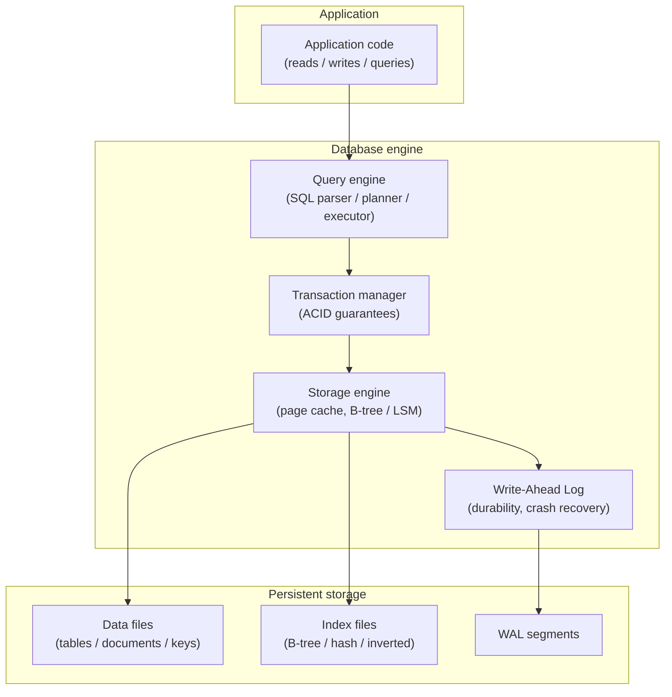

## In simple terms

A database is a place to put data so you can find it again — and a system that helps you do that. It is more structured than a folder of files and more durable than memory.

## The Visual Map



## More detail

Databases come in many flavours. The dominant split is **relational** vs **non-relational**:

| Model | Examples | Best for |
|---|---|---|
| **Relational** | PostgreSQL, MySQL, SQLite | Structured data, joins, ACID transactions |
| **Document** | MongoDB, Couchbase | JSON-like hierarchical records |
| **Key-value** | Redis, DynamoDB | High-speed lookups, caches, sessions |
| **Wide-column** | Cassandra, ScyllaDB | Very wide rows, time-series, high-write |
| **Graph** | Neo4j, JanusGraph | Relationship traversal, social graphs |
| **Search/analytics** | OpenSearch, ClickHouse | Full-text search, OLAP aggregations |
| **Vector** | Pinecone, pgvector | Nearest-neighbour similarity for embeddings |

A database engine solves three problems simultaneously:

- **Correctness** — return the right answer, even under concurrent access from many clients.
- **Performance** — find rows in millions in milliseconds, not seconds.
- **Durability** — survive crashes, disk failures, and power cuts without losing committed data.

These goals create tensions. A write-optimised storage engine (LSM tree, used in Cassandra/RocksDB) is fast for writes but requires compaction background work. A read-optimised engine (B-tree, used in PostgreSQL/MySQL) has better random read performance but slower writes.

**Two major workload types:**

- **OLTP (Online Transaction Processing)** — many small, concurrent reads and writes, e.g. an e-commerce order system. Needs fast single-row lookups, low latency, high concurrency. Relational databases with B-tree indexes dominate.
- **OLAP (Online Analytical Processing)** — fewer, complex queries scanning millions of rows for aggregations, e.g. "revenue by region last quarter." Needs columnar storage and parallel scan. Data warehouses (Snowflake, BigQuery, ClickHouse, Redshift) dominate.

## Under the Hood

A relational database query from SQL to storage access — tracing PostgreSQL's path for a simple SELECT:

```sql
-- SELECT name, price FROM products WHERE category = 'electronics' AND price < 100;
--
-- PostgreSQL internal execution path:
--
-- 1. PARSE: text → parse tree (grammar check, token extraction)
-- 2. ANALYZE: resolve table/column names, type-check (products.price is numeric ✓)
-- 3. REWRITE: apply query rewriting rules (views, RLS policies)
-- 4. PLAN: generate candidate plans, estimate row counts via statistics:
--    Option A: Seq Scan (scan all 500K rows, filter)          cost: 5000
--    Option B: Index Scan on idx_products_category (25 rows)  cost: 0.25
--    → Planner chooses Option B (estimated 25 rows pass both filters)
--
-- 5. EXECUTE: IndexScan on idx_products_category
--    - Traverse B-tree leaf pages for key = 'electronics'
--    - For each matching TID (tuple ID), fetch heap row
--    - Apply residual filter: price < 100
--    - Return matching rows to client
--
-- 6. STORAGE ENGINE:
--    - Buffer manager checks shared_buffers (page cache)
--    - On cache miss: read 8KB page from data files into shared_buffers
--    - Rows are (xmin, xmax, columns) — MVCC visibility filtered by snapshot
--
-- EXPLAIN ANALYZE output for this query:
EXPLAIN (ANALYZE, BUFFERS)
SELECT name, price
FROM products
WHERE category = 'electronics' AND price < 100;
-- Index Scan using idx_products_category on products
--   (cost=0.43..8.25 rows=25 width=48) (actual time=0.023..0.087 rows=18 loops=1)
--   Index Cond: (category = 'electronics')
--   Filter: (price < 100)
--   Buffers: shared hit=5
-- Planning Time: 0.4 ms  Execution Time: 0.1 ms
```

## Engineering Trade-offs

**Relational vs. document model**
Relational databases enforce schema at the database level — every row in a table has the same columns, and foreign keys maintain referential integrity. This prevents inconsistent data but requires schema migrations when the data shape changes. Document databases store flexible JSON records with no enforced shape, making it easy to add fields without migrations but leaving consistency enforcement to the application. For well-understood, stable domains (banking, ERP), relational wins. For rapidly-evolving schemas or heterogeneous records, document stores are more practical.

**OLTP (row-oriented) vs. OLAP (columnar)**
Row-oriented databases (PostgreSQL heap, InnoDB) store all columns of a row together on disk. Reading a full row is fast; scanning one column across millions of rows reads unnecessary data (all other columns). Columnar databases (ClickHouse, Parquet) store each column contiguously — aggregating one column across 1B rows reads 4 GB (4-byte integers) instead of 400 GB (100 bytes per row). For analytics, columnar is 10–100× faster; for single-row OLTP inserts/updates, row storage is better.

**Indexes vs. write overhead**
Every index speeds up reads matching the index key but slows down writes (INSERT/UPDATE/DELETE must update the index too). A table with 10 indexes takes 10× longer to insert into than one with no index. The write overhead is proportional to the number of indexes and their size. For OLTP, maintain 3–5 targeted indexes on common WHERE/JOIN columns; for data warehouses that rarely update data, indexing strategy differs (columnar compression handles scan performance instead).

**Durability vs. write latency (fsync trade-off)**
PostgreSQL's default: every `COMMIT` calls `fsync()` — the WAL is flushed to durable storage before the client receives "OK". This guarantees no committed data is lost on crash but limits write throughput to disk sync latency (~0.5–5 ms per commit on spinning disk, ~0.1 ms NVMe). Setting `synchronous_commit = off` removes the sync requirement, allowing thousands of commits per second — but up to 1 second of data loss on crash. Most OLTP systems keep fsync=on and instead batch writes using connection pooling.

**Horizontal scaling vs. SQL complexity**
Relational databases traditionally scale vertically (bigger machine) because distributed SQL — maintaining ACID guarantees across many nodes — requires distributed transactions (2PC), which are slow and complex. NoSQL databases (Cassandra, DynamoDB) scale horizontally by relaxing ACID guarantees (eventual consistency, no joins). NewSQL databases (CockroachDB, Spanner) achieve distributed ACID but at higher latency than single-node SQL. The choice: use a single large relational DB until you hit its limits (~100K writes/sec), then consider sharding or a distributed store.

## Real-world examples

- **Shopify's PostgreSQL** — Shopify runs millions of e-commerce stores on a Vitess-sharded MySQL cluster; each shard is a relational database instance. A single busy Black Friday processes ~80K transactions/second across the fleet.
- **Discord's message store** — Discord migrated from MongoDB (document) to Cassandra (wide-column) as their message volume grew to billions. Cassandra's write-optimised LSM tree handles 1M+ messages/minute without hot-spot contention.
- **Airbnb's multi-DB stack** — Airbnb uses MySQL for listings and bookings, Redis for session cache and rate limiting, Elasticsearch for search, and Apache Hive/Spark + Presto for analytics. Each database is chosen for its workload profile.
- **SQLite everywhere** — SQLite is used in every iOS and Android app (the OS embeds it), in Firefox (cookie store), in Python's `csv.db` module, and in many embedded devices. Its single-file design makes it ideal for local, application-level storage.
- **Snowflake vs. Redshift vs. BigQuery** — cloud data warehouses separate compute from storage. A Snowflake query reads columnar Parquet files from S3, spins up a virtual warehouse (1–512 nodes), runs vectorised SIMD scans, and shuts down. Pay per query, not per server.

## Common misconceptions

- **"NoSQL means no schema."** Most NoSQL stores have an implicit schema — it lives in your application code and ORM, not in the database. Changing the document structure requires migrating existing documents just as relational migrations require `ALTER TABLE`.
- **"Databases are interchangeable."** Switching from PostgreSQL to Cassandra requires redesigning the data model (no joins, query-first schema design), rewriting the access layer, and re-evaluating consistency trade-offs. The engine choice shapes the entire application architecture.
- **"ACID is always necessary."** For many applications (analytics, caches, event streams), eventual consistency is acceptable and much faster. ACID is essential for money, inventory, and medical records — less so for recommendation history or user activity logs.

## Try it yourself

Run a local SQLite database to explore query planning and index effects:

```bash
python3 - << 'EOF'
import sqlite3, time, random

# Create an in-memory SQLite DB (no files needed)
conn = sqlite3.connect(':memory:')
c = conn.cursor()

# Create table and insert 100K rows
c.execute('''CREATE TABLE products (
    id       INTEGER PRIMARY KEY,
    name     TEXT NOT NULL,
    category TEXT NOT NULL,
    price    REAL NOT NULL
)''')

categories = ['electronics', 'clothing', 'food', 'books', 'toys']
rows = [(i, f'Product {i}', random.choice(categories), random.uniform(1, 500))
        for i in range(100_000)]
c.executemany('INSERT INTO products VALUES (?,?,?,?)', rows)
conn.commit()

# --- Query WITHOUT index ---
t0 = time.perf_counter()
for _ in range(100):
    c.execute("SELECT name, price FROM products WHERE category='electronics' AND price < 50")
    c.fetchall()
no_idx_ms = (time.perf_counter()-t0)/100*1000

# --- Add composite index and query WITH index ---
c.execute('CREATE INDEX idx_cat_price ON products(category, price)')
conn.commit()

t0 = time.perf_counter()
for _ in range(100):
    c.execute("SELECT name, price FROM products WHERE category='electronics' AND price < 50")
    c.fetchall()
idx_ms = (time.perf_counter()-t0)/100*1000

print(f"100K rows, query: category='electronics' AND price < 50")
print(f"  Without index: {no_idx_ms:.2f} ms  (full table scan)")
print(f"  With index:    {idx_ms:.2f} ms")
print(f"  Speedup:       {no_idx_ms/idx_ms:.1f}x")
print()

# Show query plan
print("EXPLAIN QUERY PLAN with composite index (category, price):")
for row in c.execute("EXPLAIN QUERY PLAN SELECT name, price FROM products WHERE category='electronics' AND price < 50"):
    print(" ", row)
conn.close()
EOF
```

## Learn next

- [SQL](/t/sql) — the query language for relational databases; SELECT, INSERT, JOIN, and aggregation are the vocabulary for talking to 90% of databases.
- [Relational Model](/t/relational-model) — the mathematical foundation behind relational databases: relations, tuples, keys, and the algebra that SQL is built on.
- [Transaction ACID](/t/transaction-acid) — how databases guarantee that concurrent operations don't corrupt each other and that committed data survives crashes.
