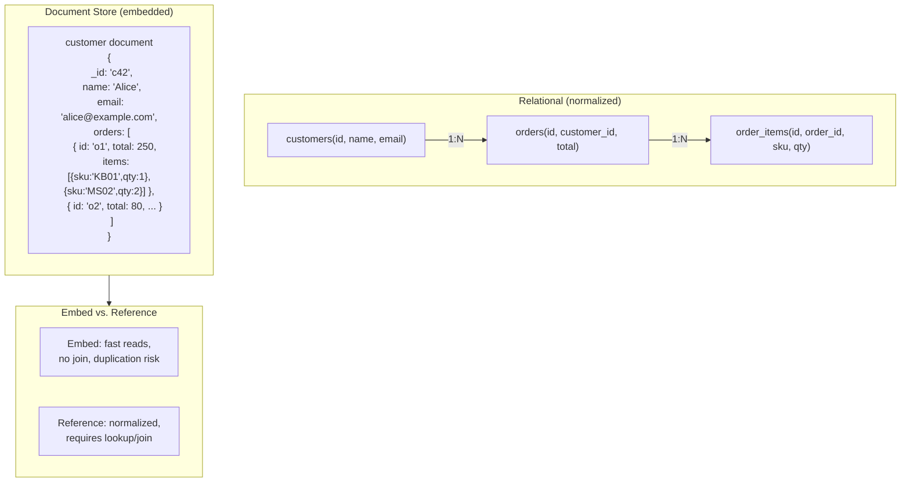

## In simple terms

A **document store** keeps your data as **documents** — flexible, self-contained records that look like JSON, with nested fields and lists inside them. Instead of splitting a customer and their orders across several tables joined by keys, you can store one customer document that *contains* its orders. Each document carries its own structure, so different records in the same collection can have different fields. The best-known example is **MongoDB**.

## The Visual Map



## More detail

A document store is a kind of [NoSQL](/t/nosql) database optimized for storing and querying semi-structured data:

- **Documents** are typically JSON (stored efficiently as BSON in MongoDB), grouped into **collections** (the rough analog of relational tables).
- **Schema-flexible** — there's no fixed table definition. You can add a field to one document without altering anything else. The application, not the database, owns the "schema."
- **Rich queries** — you can filter and index on nested fields (`order.items.sku`), not just top-level keys, which distinguishes a document store from a plain [key-value store](/t/key-value-store).
- **Denormalized by design** — related data is often embedded in one document so a read needs no joins. The trade-off is duplication and more work to keep copies consistent.

**Embed vs. reference — the central design decision:**

| | Embed | Reference |
|---|---|---|
| **Structure** | Nested document inside parent | Separate document + `_id` pointer |
| **Read** | One document fetch | Two fetches (or `$lookup` join) |
| **Write** | Update parent doc (atomically) | Update referenced doc independently |
| **Duplication** | Yes (city in every order) | No |
| **Document size** | Can grow unboundedly | Bounded |
| **Best for** | 1:few, data used together | 1:many, data used independently |

The same normalization tension as relational databases — made an application-level choice in document stores.

**Indexing in document stores:**
MongoDB supports B-tree indexes on any field, including nested paths (`{"orders.items.sku": 1}`) and array elements. Multi-key indexes index every element of an array field. A compound index `{category: 1, price: -1}` works identically to SQL's composite index.

**Multi-document transactions:**
MongoDB 4.0+ supports ACID multi-document transactions within a replica set; 4.2+ extends to sharded clusters. Before 4.0, applications achieved pseudo-atomicity by embedding all related data in one document (single-document writes are always atomic).

## Under the Hood

Python dict + JSON as a minimal document store — showing embed vs. reference patterns:

```python
#!/usr/bin/env python3
"""Document store patterns: embed vs reference, querying nested fields."""
import json, copy

# --- Embedded pattern: customer contains orders ---
customers = {
    "c1": {
        "_id": "c1",
        "name": "Alice",
        "email": "alice@example.com",
        "orders": [
            {"order_id": "o1", "total": 250,
             "items": [{"sku": "KB01", "name": "Keyboard", "qty": 1, "price": 120},
                       {"sku": "MS02", "name": "Mouse",    "qty": 2, "price": 65}]},
            {"order_id": "o2", "total": 80,
             "items": [{"sku": "USB3", "name": "USB Hub",  "qty": 1, "price": 80}]},
        ]
    },
    "c2": {
        "_id": "c2",
        "name": "Bob",
        "email": "bob@example.com",
        "orders": [
            {"order_id": "o3", "total": 420,
             "items": [{"sku": "KB01", "name": "Keyboard", "qty": 2, "price": 120},
                       {"sku": "MON1", "name": "Monitor",  "qty": 1, "price": 180}]},
        ]
    }
}

# Query: find all orders containing SKU 'KB01' — scan nested arrays
print("Orders containing KB01:")
for cid, doc in customers.items():
    for order in doc["orders"]:
        if any(item["sku"] == "KB01" for item in order["items"]):
            print(f"  customer={doc['name']} order={order['order_id']} total={order['total']}")

# Query: total revenue per SKU across all customers
from collections import defaultdict
sku_revenue = defaultdict(float)
sku_qty     = defaultdict(int)
for doc in customers.values():
    for order in doc["orders"]:
        for item in order["items"]:
            sku_revenue[item["sku"]] += item["price"] * item["qty"]
            sku_qty[item["sku"]]     += item["qty"]

print("\nRevenue per SKU:")
for sku in sorted(sku_revenue, key=sku_revenue.get, reverse=True):
    print(f"  {sku}  revenue={sku_revenue[sku]:.2f}  qty={sku_qty[sku]}")

# Update one nested item price — must update every document that embeds it
print("\nUpdating KB01 price from $120 → $130:")
updated = 0
for doc in customers.values():
    for order in doc["orders"]:
        for item in order["items"]:
            if item["sku"] == "KB01":
                item["price"] = 130
                updated += 1
print(f"  Updated {updated} item occurrence(s) across all embedded documents")
print("  (In a normalized schema, only ONE row in a products table changes)")
```

## Engineering Trade-offs

**Embedding vs. referencing vs. normalization**
Embedding co-locates related data so a single fetch returns everything. This is fast for reads (no join round-trip) but creates duplication: if a product's name changes, you must update every document that embeds it. Referencing avoids duplication but requires multiple fetches or a `$lookup` aggregation (MongoDB's JOIN equivalent). The decision is application-specific: embed data used together always, reference data with independent update patterns. This is the same trade-off as normalization vs. denormalization in relational databases, made at the data modelling level rather than the schema constraint level.

**Schema flexibility vs. data quality**
No schema enforcement at the database level means any document shape is accepted — developer velocity is high during rapid iteration. The downside: when your application has multiple versions (old and new clients, gradual rollouts, old code paths), documents in the same collection can have incompatible shapes. "Schema-on-read" means every query must handle multiple shapes. Most mature document store deployments add application-level schema validation (Mongoose schemas, MongoDB JSON Schema validation) to recover the safety that relational databases provide by default.

**Document size limits vs. unbounded arrays**
MongoDB documents have a 16 MB maximum. A customer document with an embedded `orders` array grows without bound as the customer places more orders. "Grow-as-needed" arrays that could become large (social media posts, IoT readings) should be referenced, not embedded. Capped collections and time-series collections (MongoDB 5.0+) handle high-volume append workloads.

**Horizontal scaling vs. cross-document transactions**
Document stores often scale by sharding — distributing documents across nodes by shard key. Cross-shard transactions are expensive (two-phase commit across nodes). The document store model encourages designing around single-document operations, which are always atomic and fast. This is a strong force toward embedding — but embedding has its own trade-offs. The ideal design minimizes cross-document transactions by matching the document shape to the application's primary access pattern.

**Multi-document transactions vs. atomicity-by-embedding**
A single document write in MongoDB is always atomic, including all embedded subdocuments. Adding multi-document transactions (4.0+) adds distributed coordination overhead. For most use cases, careful data modeling that co-locates data that must change together into one document is faster and simpler than using multi-document transactions.

## Real-world examples

- **MongoDB content management** — a CMS stores each article as one document: title, body, tags, author reference, published date, and SEO metadata. A single document fetch returns everything the article page needs. Authors' profiles live in a separate collection (referenced, not embedded) because they change independently.
- **Firestore for mobile apps** — Google's Firestore (Firebase) syncs document changes to mobile clients in real time via WebSocket. A chat app stores each message as a document in a `chats/{chatId}/messages` subcollection. Mobile clients subscribe to the subcollection and receive live updates.
- **Amazon DocumentDB** — AWS-managed MongoDB-compatible document database running on Aurora storage. Used by companies that want MongoDB's API with RDS-style managed infrastructure.
- **Product catalog with variant attributes** — an e-commerce catalog where a book document has `{author, isbn, pages}` and a shirt document has `{size: ['S','M','L'], color, material}`. Relational requires a generic "attribute" table; a document store stores each product's natural shape without extra joins.
- **MongoDB Change Streams** — applications subscribe to a collection's change stream (backed by the replica set oplog) to react to inserts and updates in real time. Used for cache invalidation, audit logging, and event-driven microservices.

## Common misconceptions

- **"Document stores have no schema, so there's nothing to design."** The schema just moves into your application code — and an inconsistent shape across documents becomes *your* problem to handle at read time. Production document store deployments almost always add schema validation at the application or database layer.
- **"Document stores can't do joins or transactions."** Modern ones (MongoDB 3.6+ `$lookup`, 4.0+ transactions) added both; the old "NoSQL means no guarantees" framing is outdated. MongoDB's multi-document ACID transactions cover most transactional use cases.
- **"Embed everything for performance."** Unbounded arrays cause large documents; large documents hurt write performance (whole document must be rewritten); multi-document updates require scanning every document that embeds the changed data. Embed selectively — not by default.

## Try it yourself

Simulate document store operations in Python with JSON documents:

```bash
python3 - << 'EOF'
import json
from collections import defaultdict

# A tiny in-memory document collection (list of dicts)
products = [
    {"_id": "p1", "name": "Laptop",   "category": "Electronics", "price": 999,
     "specs": {"cpu": "M3", "ram_gb": 16, "storage_gb": 512}},
    {"_id": "p2", "name": "Mouse",    "category": "Electronics", "price": 25,
     "specs": {"dpi": 1600, "wireless": True}},
    {"_id": "p3", "name": "Desk",     "category": "Furniture",   "price": 450,
     "specs": {"width_cm": 140, "height_cm": 75, "material": "oak"}},
    {"_id": "p4", "name": "Keyboard", "category": "Electronics", "price": 120,
     "specs": {"layout": "TKL", "switch": "Cherry MX Blue", "wireless": False}},
]

# Find documents matching a filter (like MongoDB's find)
def find(collection, query):
    def matches(doc, q):
        for k, v in q.items():
            if '.' in k:
                parts = k.split('.')
                val = doc
                for p in parts:
                    val = val.get(p, None) if isinstance(val, dict) else None
                if val != v: return False
            elif doc.get(k) != v:
                return False
        return True
    return [doc for doc in collection if matches(doc, query)]

# Query 1: find all Electronics
electronics = find(products, {"category": "Electronics"})
print("Electronics products:")
for p in electronics:
    print(f"  {p['name']:<12} ${p['price']}")

# Query 2: find wireless peripherals (nested field query)
wireless = find(products, {"specs.wireless": True})
print(f"\nWireless products (specs.wireless=True):")
for p in wireless:
    print(f"  {p['name']}")

# Aggregation: average price by category
by_cat = defaultdict(list)
for p in products: by_cat[p["category"]].append(p["price"])
print("\nAverage price by category:")
for cat, prices in by_cat.items():
    print(f"  {cat:<15} avg=${sum(prices)/len(prices):.2f}")

# Schema flexibility: add a field to one document
products[0]["discount_pct"] = 10  # only Laptop has this field
has_discount = [p for p in products if "discount_pct" in p]
print(f"\nProducts with discount: {[p['name'] for p in has_discount]}")
print("Other products don't have that field — schema flexibility in action")
EOF
```

## Learn next

- [NoSQL](/t/nosql) — the broad family of non-relational databases that document stores belong to; understanding the trade-offs across key-value, document, wide-column, and graph stores contextualizes when to choose each.
- [Normalization](/t/normalization) — the relational design discipline that document stores deliberately depart from; understanding normal forms explains what "denormalized by design" means and what consistency guarantees are surrendered.
- [Indexing](/t/indexing) — B-tree indexes on nested document fields work the same as relational indexes; understanding index design is equally important in document stores for avoiding full collection scans.
