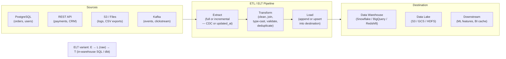

## In simple terms

**ETL** stands for **Extract, Transform, Load** — the assembly line that moves data from where it's *created* to where it's *analyzed*. **Extract** pulls data out of source systems (app databases, APIs, log files). **Transform** cleans and reshapes it — fixing formats, merging sources, computing fields, removing duplicates. **Load** writes the result into a destination, usually a [data warehouse](/t/data-warehouse). Without ETL, an organization's data stays trapped in dozens of disconnected systems that can't be analyzed together.

## The Visual Map



## More detail

A few things make ETL its own discipline rather than "just copying data":

**Extract — pulling from heterogeneous sources**
- Sources differ in format: relational tables, JSON APIs, flat CSV files, event streams, S3 Parquet files.
- **Incremental extraction** only pulls records modified since the last run, using either: an `updated_at` timestamp column (simple but misses deletes), or **Change Data Capture (CDC)** which reads the source database's replication log (PostgreSQL WAL, MySQL binlog) — capturing every insert, update, and delete.
- Extraction must handle rate limits, authentication, schema drift (a new column appears in the source), and partial failures.

**Transform — where most work lives**
- Standardizing formats: dates from 10 different source systems arrive in 10 different formats.
- Joining: customer IDs in the app database differ from customer IDs in the CRM — identity resolution.
- Validating: nulls in non-nullable columns, negative prices, dates in the future.
- Aggregating: pre-computing daily revenue by store to avoid repeating that computation in every BI query.
- Deduplicating: the same order appears twice because of a webhook retry.

**Load — writing to the destination**
- **Full load**: truncate destination and reload everything. Simple but slow; only practical for small tables.
- **Incremental append**: add new records to an existing table. No history loss; accumulates duplicates if sources retry.
- **Upsert (merge)**: insert new rows, update existing ones matched by key. Correct but requires a key to match on.

**ELT — the modern reversal:**
With cheap, powerful cloud data warehouses, it's often better to load raw data first and transform it *inside* the warehouse using SQL. Tools like **dbt** (data build tool) popularized this: define transformations as version-controlled `.sql` models, run them in the warehouse on schedule. Advantages: transformation runs on warehouse compute (not a separate transform server), SQL models are testable and documented, historical reprocessing is trivial (rerun the SQL).

**Orchestration:**
ETL pipelines are dependency graphs of tasks. **Apache Airflow** (Python DAGs), **Dagster** (asset-centric, type-safe), and **Prefect** (dynamic, event-driven) schedule and monitor these graphs, handling retries, backfills (rerunning historical windows), and alerting.

## Under the Hood

A minimal ETL pipeline in Python — extract from a simulated API, transform, load into SQLite:

```python
#!/usr/bin/env python3
"""Mini ETL: extract from JSON, transform, load into SQLite."""
import sqlite3, json, datetime

# --- EXTRACT: simulate pulling from two source APIs ---
raw_orders = [
    {"id": "O1", "customer": "alice@example.com", "total": "$250.00",
     "date": "2026-01-05T09:32:10Z", "status": "shipped"},
    {"id": "O2", "customer": "bob@example.com",   "total": "80",
     "date": "Jan 8, 2026",          "status": "delivered"},
    {"id": "O3", "customer": "alice@example.com", "total": "$120.50",
     "date": "2026-01-12T14:00:00Z", "status": "pending"},
    {"id": "O2", "customer": "bob@example.com",   "total": "80",
     "date": "Jan 8, 2026",          "status": "delivered"},  # duplicate!
]

raw_customers = [
    {"email": "alice@example.com", "name": "Alice Smith", "region": "US"},
    {"email": "bob@example.com",   "name": "Bob Jones",   "region": "UK"},
]

# --- TRANSFORM ---
def parse_date(s):
    for fmt in ("%Y-%m-%dT%H:%M:%SZ", "%b %d, %Y"):
        try: return datetime.datetime.strptime(s, fmt).date().isoformat()
        except ValueError: pass
    raise ValueError(f"Unknown date format: {s!r}")

def parse_price(s):
    return float(str(s).replace("$", "").strip())

# 1. Normalize date and price formats
orders_clean = []
for o in raw_orders:
    orders_clean.append({
        "id":     o["id"],
        "email":  o["customer"].lower().strip(),
        "total":  parse_price(o["total"]),
        "date":   parse_date(o["date"]),
        "status": o["status"],
    })

# 2. Deduplicate (keep last by id)
seen = {}
for o in orders_clean:
    seen[o["id"]] = o
orders_deduped = list(seen.values())

# 3. Join customers → add name and region
cust_map = {c["email"]: c for c in raw_customers}
orders_enriched = []
for o in orders_deduped:
    cust = cust_map.get(o["email"], {})
    orders_enriched.append({**o, "name": cust.get("name"), "region": cust.get("region")})

print(f"Extracted {len(raw_orders)} raw orders → after dedup+enrich: {len(orders_enriched)}")
for o in orders_enriched:
    print(f"  {o['id']}  {o['name']:<15} ${o['total']:>7.2f}  {o['date']}  {o['status']}")

# --- LOAD: upsert into SQLite (idempotent) ---
conn = sqlite3.connect(':memory:')
conn.execute('''CREATE TABLE orders (
    id TEXT PRIMARY KEY, name TEXT, region TEXT, email TEXT,
    total REAL, date TEXT, status TEXT
)''')
conn.executemany('''
    INSERT INTO orders VALUES (?,?,?,?,?,?,?)
    ON CONFLICT(id) DO UPDATE SET status=excluded.status, total=excluded.total
''', [(o["id"],o["name"],o["region"],o["email"],o["total"],o["date"],o["status"])
      for o in orders_enriched])
conn.commit()

# Verify
print("\nWarehouse table after load:")
for row in conn.execute("SELECT id, name, region, total, date, status FROM orders ORDER BY date"):
    print(f"  {row[0]}  {row[1]:<15} [{row[2]}]  ${row[3]:>7.2f}  {row[4]}  {row[5]}")
conn.close()
```

## Engineering Trade-offs

**Full load vs. incremental — correctness vs. cost**
A full load (truncate → reload everything) is simple, idempotent, and always correct. It's also expensive: extracting and loading 10 TB every night when only 100 MB changed is wasteful. Incremental loads process only new/changed rows. The trade-off: incremental extraction is complex — `updated_at` misses deletes and doesn't capture records updated since the last run if the timestamp is updated out of order; CDC is accurate but requires database replication access and handling schema changes in the log.

**ETL vs. ELT — transform location**
Classic ETL transforms data before loading, using a dedicated compute layer (Spark, custom Python). ELT loads raw data first, transforming in-warehouse with SQL. ELT advantages: the warehouse scales compute elastically; SQL models are version-controlled; reprocessing historical data is just rerunning SQL. ELT disadvantages: raw data lands in the warehouse (possibly with PII that should not be persisted); transformation SQL can be slow for large joins that a Spark job would handle better.

**Idempotency — safe to rerun?**
A pipeline step is idempotent if running it twice produces the same result as running it once. `INSERT … ON CONFLICT DO UPDATE` (upsert) is idempotent; plain `INSERT` is not (creates duplicates on retry). Idempotent pipelines are essential for reliability: failed steps must be safely retried without manual cleanup. Designing for idempotency adds complexity (natural keys for deduplication, delete tracking) but eliminates a major class of production incidents.

**Late-arriving data**
Events often arrive after the window they belong to: a mobile app sends a click event hours after the user went offline; a payment processor's webhook arrives 12 hours late. Batch ETL pipelines re-process yesterday's partition when late data arrives; streaming pipelines use watermarks (Flink, Spark Streaming) to delay closing a window until expected late arrivals have had time to arrive. Late data that falls outside the watermark is discarded or triggers an alert.

**Data quality vs. pipeline throughput**
Adding validation rules (assert totals are positive, email formats are valid, foreign keys exist in dimension tables) catches bad data early but slows the pipeline and can block loads when upstream systems send unexpected shapes. Teams balance: fail fast on critical validation failures, warn-and-continue on soft failures, add monitoring dashboards for data quality metrics. dbt tests (not null, unique, accepted_values, referential integrity) provide a declarative way to validate warehouse data after load.

## Real-world examples

- **Airbnb's Minerva** — Airbnb built a "Metrics Platform" (Minerva) that defines metrics in code, then generates and runs ETL jobs to compute those metrics consistently across all dashboards and ML models. Previously, 10 teams had 10 different SQL definitions of "active listings."
- **Stripe's event pipeline** — Stripe processes hundreds of millions of payment events daily. Events flow Kafka → Flink → internal data warehouse. The transform step enriches raw event payloads with customer and dispute data from operational stores; the load step upserts into partitioned Parquet tables.
- **dbt at GitLab** — GitLab's entire analytics stack is an open-source dbt project. Hundreds of SQL models transform raw Salesforce, Zendesk, and product usage data into clean reporting tables. The project runs in GitLab CI; every merge request shows a dbt test report.
- **CDC with Debezium** — Debezium reads PostgreSQL's WAL stream and emits row-level change events (INSERT/UPDATE/DELETE) to Kafka. Downstream consumers build materialized views of the source tables in real time — no polling, no `updated_at` hacks, deletes are captured.
- **Netflix's Hollow** — Netflix uses a custom in-memory data propagation framework (Hollow) for its metadata ETL: content titles, availability windows, and subtitles are transformed and published as immutable snapshots that edge servers consume via delta updates. Processing 200 million member-facing records in under 5 minutes on a daily cycle.

## Common misconceptions

- **"ETL is a one-time data migration."** A few pipelines are one-time migrations, but most ETL is *ongoing* — pipelines that run continuously or on schedule to keep the warehouse fresh. They require maintenance as source schemas evolve and business definitions change.
- **"ETL and ELT are completely different."** Same three operations; ELT just reorders them to exploit a powerful warehouse's compute for the transform step. The design concerns (source extraction, data quality, load strategy) are identical.
- **"A mature ETL pipeline just runs."** ETL pipelines are maintenance-heavy: sources add columns, change formats, or stop sending data; business definitions of "revenue" or "active user" change; data quality problems cause silent failures. Monitoring, alerting, and data quality testing are as important as the pipeline code itself.

## Try it yourself

Run a mini ELT pipeline: load raw CSV-like data, then transform with SQL in SQLite:

```bash
python3 - << 'EOF'
import sqlite3, datetime

conn = sqlite3.connect(':memory:')
c = conn.cursor()

# LOAD raw data (ELT: load first, transform in DB)
c.execute('''CREATE TABLE raw_sales (
    order_id TEXT, customer TEXT, product TEXT,
    amount_str TEXT, date_str TEXT
)''')
raw = [
    ("O1","alice@x.com","Laptop", "$999.00", "2026-01-05"),
    ("O2","bob@x.com",  "Mouse",  "25",      "2026-01-05"),
    ("O3","alice@x.com","Monitor","$299.99",  "2026-02-10"),
    ("O4","carol@x.com","Laptop", "$999.00",  "2026-02-15"),
    ("O1","alice@x.com","Laptop", "$999.00",  "2026-01-05"),  # duplicate
]
c.executemany("INSERT INTO raw_sales VALUES (?,?,?,?,?)", raw)

# TRANSFORM in SQL (like dbt model)
c.execute('''CREATE TABLE sales AS
    SELECT DISTINCT
        order_id,
        customer,
        product,
        CAST(REPLACE(amount_str, "$", "") AS REAL) AS amount,
        SUBSTR(date_str, 1, 7) AS month
    FROM raw_sales
    WHERE amount_str IS NOT NULL
      AND CAST(REPLACE(amount_str, "$", "") AS REAL) > 0
''')

print("Transformed sales table:")
for r in c.execute("SELECT * FROM sales ORDER BY month, order_id"):
    print(f"  {r[0]}  {r[1]:<15} {r[2]:<10} ${r[3]:>8.2f}  month={r[4]}")

print("\nMonthly revenue (aggregation in DB):")
for r in c.execute("SELECT month, SUM(amount) FROM sales GROUP BY month ORDER BY month"):
    print(f"  {r[0]}  ${r[1]:,.2f}")

conn.close()
EOF
```

## Learn next

- [Data Warehouse](/t/data-warehouse) — the destination where ETL pipelines deliver processed data; the warehouse's columnar format and MPP architecture are optimized for the query patterns ETL enables.
- [Normalization](/t/normalization) — the schema design discipline ETL enforces when mapping denormalized source data into structured warehouse tables; understanding 1NF–3NF explains ETL transform decisions.
- [Query Plan](/t/query-plan) — understanding how the warehouse executes the SQL transforms in ELT pipelines helps diagnose slow dbt models and optimize transformation performance.
