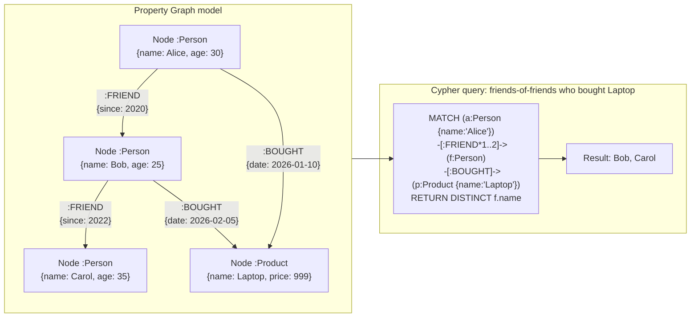

## In simple terms

Social networks, fraud detection, recommendation engines, and knowledge graphs all have one thing in common: the relationships between entities are as important as the entities themselves. A relational database models relationships as foreign-key joins — great for one hop, painful for five. A graph database stores entities as **nodes** and relationships as **edges** with their own properties, and can traverse multi-hop paths in milliseconds by following pointers rather than joining tables.

## The Visual Map



## More detail

**Data model:** a **property graph** (the dominant model, used by Neo4j, AWS Neptune, ArangoDB) consists of:
- **Nodes** — entities with a label (`:Person`, `:Product`) and key-value properties (`{name: "Alice", age: 30}`).
- **Edges** — directed, typed relationships between two nodes, also with properties (`[:BOUGHT {date: "2024-01-01"}]`).

**Index-free adjacency:** each node stores direct pointers to its adjacent edges. Traversal from node to neighbour is O(1) pointer follow — not a table scan. A 5-hop traversal touches only the relevant subgraph, not the entire dataset. This is the core performance advantage over relational joins, which grow as O(n × m) for each join across large tables.

**Query languages:**
- **Cypher** (Neo4j, OpenCypher standard) — declarative pattern-matching syntax: `MATCH (a:Person)-[:FRIEND]->(b) WHERE a.name='Alice' RETURN b`.
- **Gremlin** (Apache TinkerPop standard) — imperative traversal API: `g.V().has('name','Alice').out('FRIEND').values('name')`.
- **SPARQL** — for RDF triple stores (subject-predicate-object); knowledge graphs, linked data.
- **GQL** — ISO standard graph query language (2024) aligning Cypher and other dialects.

**When graph databases excel:**
- Multi-hop queries: "friends of friends", "shortest path", "all transactions within 3 hops of account X".
- Flexible, evolving relationships — adding a new relationship type requires no schema migration.
- Knowledge graphs, recommendation engines, fraud rings, access control, network topology.

**When they don't excel:**
- Bulk analytics over all nodes/edges — graph DBs are traversal-optimised; full scans are slower than a columnar store.
- Simple key-value or tabular lookups — unnecessary complexity.
- Very high write throughput — maintaining index-free adjacency pointers during bulk inserts is expensive.

**RDF triple stores** (Amazon Neptune SPARQL mode, Stardog) represent data as subject-predicate-object triples. Used in knowledge graphs (Wikidata, Google Knowledge Graph) and semantic web applications.

## Under the Hood

A pure-Python adjacency-list graph with BFS traversal — the core operation of a graph database:

```python
#!/usr/bin/env python3
"""Property graph: BFS traversal, shortest path, friend-of-friend queries."""
from collections import defaultdict, deque

class PropertyGraph:
    def __init__(self):
        self.nodes = {}   # id → {label, props}
        self.edges = defaultdict(list)  # src_id → [(rel_type, dst_id, props)]
        self.in_edges = defaultdict(list)  # dst_id → [(rel_type, src_id, props)]

    def add_node(self, node_id, label, **props):
        self.nodes[node_id] = {"label": label, **props}

    def add_edge(self, src, rel_type, dst, **props):
        self.edges[src].append((rel_type, dst, props))
        self.in_edges[dst].append((rel_type, src, props))

    def neighbors(self, node_id, rel_type=None):
        return [(dst, props) for rt, dst, props in self.edges[node_id]
                if rel_type is None or rt == rel_type]

    def bfs(self, start, rel_type, max_depth=2):
        """BFS traversal: return all nodes reachable within max_depth hops."""
        visited = {start}
        queue = deque([(start, 0)])
        result = []
        while queue:
            node, depth = queue.popleft()
            if depth > 0:
                result.append((node, depth))
            if depth < max_depth:
                for dst, _ in self.neighbors(node, rel_type):
                    if dst not in visited:
                        visited.add(dst)
                        queue.append((dst, depth + 1))
        return result

    def shortest_path(self, start, end, rel_type=None):
        """BFS shortest path between two nodes."""
        if start == end: return [start]
        visited = {start}
        queue = deque([(start, [start])])
        while queue:
            node, path = queue.popleft()
            for dst, _ in self.neighbors(node, rel_type):
                if dst == end: return path + [dst]
                if dst not in visited:
                    visited.add(dst)
                    queue.append((dst, path + [dst]))
        return None

# Build social graph
g = PropertyGraph()
for name in ['Alice','Bob','Carol','Dave','Eve','Frank']:
    g.add_node(name, 'Person', name=name)
g.add_node('Laptop', 'Product', name='Laptop', price=999)
g.add_node('Mouse',  'Product', name='Mouse',  price=25)

g.add_edge('Alice', 'FRIEND',  'Bob')
g.add_edge('Alice', 'FRIEND',  'Carol')
g.add_edge('Bob',   'FRIEND',  'Dave')
g.add_edge('Carol', 'FRIEND',  'Eve')
g.add_edge('Dave',  'FRIEND',  'Frank')
g.add_edge('Alice', 'BOUGHT',  'Laptop')
g.add_edge('Bob',   'BOUGHT',  'Mouse')
g.add_edge('Carol', 'BOUGHT',  'Laptop')

# Query 1: friends-of-friends of Alice (up to 2 hops)
print("Friends up to 2 hops from Alice:")
for node, depth in g.bfs('Alice', 'FRIEND', max_depth=2):
    print(f"  {node}  (depth={depth})")

# Query 2: shortest path Alice -> Frank
path = g.shortest_path('Alice', 'Frank', 'FRIEND')
print(f"\nShortest path Alice -> Frank: {' -> '.join(path)}")

# Query 3: who among Alice's network (depth<=2) bought Laptop?
friends = {n for n, _ in g.bfs('Alice', 'FRIEND', max_depth=2)}
print("\nFriends-of-friends who bought Laptop:")
for friend in friends:
    bought = [dst for dst, _ in g.neighbors(friend, 'BOUGHT')]
    if 'Laptop' in bought:
        print(f"  {friend}")
```

## Engineering Trade-offs

**Index-free adjacency vs. relational joins**
A graph database's key performance advantage is O(1) pointer-following per hop. A relational database answering "friends of friends" does two self-joins: `SELECT b.friend_id FROM friends a JOIN friends b ON a.friend_id = b.user_id WHERE a.user_id = 42`. Each join is O(n) or O(log n) depending on indexes. For k hops, the relational cost is O(n^k) in the worst case; graph traversal is O(edges_traversed). At 5+ hops, graph databases win decisively.

**Graph storage vs. bulk scan performance**
Graph databases store adjacency lists optimised for traversal. A query that touches all 100M nodes (compute PageRank) requires scanning all adjacency lists — more random I/O than a columnar scan. For bulk graph analytics (PageRank, community detection, betweenness centrality), purpose-built graph analytics frameworks (Apache Spark GraphX, GraphBLAS, Pregel) outperform online graph databases.

**Schema flexibility vs. consistency**
Property graphs are schema-optional: you can add a new node label or edge type without any migration. This is powerful for rapidly-evolving knowledge graphs. The trade-off: no schema enforcement means a misspelled relationship type (`FRIENDS` vs. `FRIEND`) silently creates a parallel edge type that queries don't traverse. Production graph databases add application-level schema validation or use constraint features (Neo4j schema constraints) to recover this safety.

**Write throughput vs. pointer maintenance**
Every edge addition must update the source node's adjacency list pointer. For bulk data loads (import 100M edges), updating adjacency pointers sequentially can be a bottleneck. Graph databases typically offer batch import modes (`neo4j-admin import`, Gremlin bulk load) that bypass online indexing for better throughput, requiring the database to be taken offline during import.

**Graph databases vs. PostgreSQL recursive CTEs**
PostgreSQL's recursive CTE (`WITH RECURSIVE`) can traverse graph structures stored as a relational edge table. For shallow traversal (2–3 hops) on small graphs (<1M edges), PostgreSQL with an indexed edge table often matches graph database performance. For deep traversal or large graphs, index-free adjacency in a purpose-built graph database pulls ahead significantly. The rule: start with PostgreSQL recursive CTEs; migrate to a graph database when multi-hop traversal becomes a bottleneck.

## Real-world examples

- **Neo4j at Mastercard** — Mastercard uses Neo4j for real-time fraud detection. A fraudulent ring involves multiple accounts, merchants, and transactions connected in specific patterns. A Cypher query checks if a new transaction is connected to known fraud patterns within 3 hops in milliseconds — impossible at scale with SQL JOINs.
- **Amazon Neptune for AWS IAM** — AWS stores IAM policies, roles, users, and resource relationships as a graph to evaluate access control policies. "Can this role access this S3 bucket?" becomes a graph reachability query through policy chains.
- **LinkedIn's people graph** — LinkedIn's "People You May Know" feature traverses the social graph to find 2nd-degree connections. LinkedIn open-sourced their distributed graph processing framework (LinkedIn DataBus) for replication.
- **Google Knowledge Graph** — the knowledge graph powering the info boxes in search results stores entities (people, places, organizations) and their relationships as a property graph, with over 500 billion facts. Wikidata, used as a public equivalent, is available via SPARQL at query.wikidata.org.
- **Weaviate and graph-augmented RAG** — recent AI applications augment retrieval with graph traversal: a question about "Alice's colleagues who worked on project X" traverses both a graph database (organizational hierarchy, project membership) and a vector store (semantic similarity). This "graph RAG" pattern combines the strengths of both database types.

## Common misconceptions

- **"Graph databases are always faster than relational databases."** For multi-hop traversal and path queries, graph databases win. For bulk aggregations, simple lookups, or shallow joins (1–2 hops), a relational or columnar database is often faster. Match the tool to the access pattern.
- **"Graph databases have no schema."** Property graphs are schema-optional, not schema-free. Most production deployments have explicit node labels, required properties, and relationship-type constraints. Neo4j supports schema constraints (`CONSTRAINT ON (p:Person) ASSERT p.email IS UNIQUE`).
- **"SQL can't do graph queries."** PostgreSQL's recursive CTEs handle graph traversal for small, shallow graphs. For complex multi-hop queries on large graphs, purpose-built graph databases with index-free adjacency are significantly faster.

## Try it yourself

Build a small property graph and run BFS traversal and shortest-path in Python:

```bash
python3 - << 'EOF'
from collections import deque, defaultdict

# Adjacency-list property graph
edges = defaultdict(list)  # node -> [(type, neighbor)]
for src, rel, dst in [
    ('Alice','FRIEND','Bob'), ('Alice','FRIEND','Carol'),
    ('Bob','FRIEND','Dave'), ('Carol','FRIEND','Eve'),
    ('Eve','FRIEND','Frank'), ('Dave','FRIEND','Frank'),
]:
    edges[src].append((rel, dst))
    edges[dst].append((rel, src))  # undirected friendship

def bfs_hops(start, rel, max_depth):
    visited = {start}
    q = deque([(start, 0)])
    result = []
    while q:
        node, d = q.popleft()
        if d > 0: result.append((node, d))
        if d < max_depth:
            for r, nb in edges[node]:
                if r == rel and nb not in visited:
                    visited.add(nb)
                    q.append((nb, d+1))
    return result

def shortest_path(start, end):
    visited = {start}
    q = deque([(start, [start])])
    while q:
        node, path = q.popleft()
        for _, nb in edges[node]:
            if nb == end: return path + [nb]
            if nb not in visited:
                visited.add(nb)
                q.append((nb, path + [nb]))
    return None

print("All friends reachable from Alice (up to 3 hops):")
for node, depth in bfs_hops('Alice', 'FRIEND', max_depth=3):
    print(f"  {node:<10} ({depth} hop{'s' if depth>1 else ''})")

path = shortest_path('Alice', 'Frank')
print(f"\nShortest path Alice -> Frank:")
print(f"  {' -> '.join(path)}  ({len(path)-1} hops)")
EOF
```

## Learn next

- [NoSQL](/t/nosql) — the broad family of non-relational databases that graph databases belong to; understanding the NoSQL landscape contextualizes when graph is the right choice vs. key-value, document, or columnar.
- [Normalization](/t/normalization) — the relational schema design principle that graph databases bypass; understanding what normalized schema can and can't express cleanly explains when to reach for a graph database.
- [Graph Theory](/t/graph-theory) — the mathematical foundation of nodes, edges, paths, and traversal algorithms that graph databases implement at the storage level.
