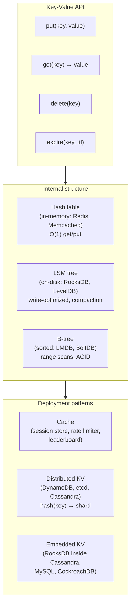

## In simple terms

A **key-value store** is the database equivalent of a hash table: you `put(key, value)` and `get(key)`. That's almost the entire API. The value can be a string, a blob, JSON, or whatever you want — the store doesn't look inside. It's the simplest possible data store, and that simplicity is exactly why it scales so well.

## The Visual Map



## More detail

Where key-value stores show up:

- **In-memory** (Redis, Memcached) — sub-millisecond access, used as cache, session store, queue, rate limiter, leaderboard. Redis adds rich value types: strings, hashes, lists, sorted sets, streams.
- **On-disk, embedded** (RocksDB, LevelDB, LMDB) — embedded engines inside other databases. RocksDB is the storage engine for CockroachDB, TiKV, MyRocks, Ceph's BlueStore, and many others.
- **Distributed** (DynamoDB, etcd, Cassandra-as-KV) — keys spread across many machines via consistent hashing. DynamoDB distributes across three availability zones with replication; etcd uses Raft for strong consistency.
- **Hardware-style** (S3, Azure Blob Storage, Google Cloud Storage) — "give me this key, give me back the bytes" at the object storage level.

**What you can do:**
- `put(key, value)` — write
- `get(key)` — read
- `delete(key)` — remove
- `expire(key, ttl)` — auto-delete after a duration (essential for caches)
- `incr(key)` / `decr(key)` — atomic increment (counters, rate limiters)
- `compare-and-swap(key, expected, new)` — optimistic locking (etcd)
- Range scans on *sorted* KV stores (LMDB, FoundationDB, TiKV, Bigtable)

**What you typically cannot do:**
- Query by something other than the key (`WHERE value.city = 'Paris'`)
- Join across keys
- Transactions spanning many keys (some stores have this: Redis MULTI/EXEC, DynamoDB transactions, FoundationDB full ACID)

**Why it scales:** `hash(key)` deterministically picks the node that owns that key. There's no cross-node coordination for single-key operations — reads and writes are local to one shard. As you add shards, throughput scales linearly. Relational databases require global coordination for joins and foreign key checks; key-value stores avoid this entirely.

**Redis value types beyond strings:**
- **Hash** — `HSET user:42 name Alice email alice@x.com` stores a nested map
- **Sorted set (ZSET)** — `ZADD leaderboard 4200 user:42` for ranked scores
- **List** — `LPUSH queue:jobs job1` for pub/sub queues
- **Stream** — append-only log with consumer group acknowledgement (Kafka-lite)

## Under the Hood

A pure-Python LRU key-value cache with TTL — the core of what Redis does in memory:

```python
#!/usr/bin/env python3
"""Minimal key-value store with TTL and LRU eviction."""
import time
from collections import OrderedDict

class KVStore:
    def __init__(self, capacity=5):
        self.capacity = capacity
        self.data     = OrderedDict()  # key → (value, expires_at or None)

    def set(self, key, value, ttl=None):
        expires_at = time.monotonic() + ttl if ttl else None
        if key in self.data:
            self.data.move_to_end(key)
        self.data[key] = (value, expires_at)
        if len(self.data) > self.capacity:
            evicted, _ = self.data.popitem(last=False)  # evict LRU
            print(f"  [evict] LRU key '{evicted}' evicted (capacity={self.capacity})")

    def get(self, key):
        if key not in self.data:
            return None
        value, expires_at = self.data[key]
        if expires_at and time.monotonic() > expires_at:
            del self.data[key]
            return None  # expired
        self.data.move_to_end(key)  # mark as recently used
        return value

    def delete(self, key):
        return self.data.pop(key, None) is not None

    def __repr__(self):
        now = time.monotonic()
        items = []
        for k, (v, exp) in self.data.items():
            ttl_left = f" TTL={exp-now:.1f}s" if exp else ""
            items.append(f"{k}={v!r}{ttl_left}")
        return f"KVStore({', '.join(items)})"

kv = KVStore(capacity=4)
kv.set("session:alice", {"user_id": 1, "role": "admin"}, ttl=60)
kv.set("session:bob",   {"user_id": 2, "role": "user"},  ttl=60)
kv.set("rate:192.0.2.1", 3, ttl=60)  # requests this minute
kv.set("config:feature_x", True)

print(kv)
print(f"get session:alice → {kv.get('session:alice')}")
print(f"get session:carol → {kv.get('session:carol')}")  # miss

# LRU eviction
kv.set("config:feature_y", False)  # triggers eviction of LRU entry
print(kv)

# TTL: set a key that expires immediately
kv.set("temp", "gone soon", ttl=0.001)
time.sleep(0.01)
print(f"get temp after expiry → {kv.get('temp')}")

# Use as a counter
kv.set("counter:page_views", 0)
kv.set("counter:page_views", kv.get("counter:page_views") + 1)
kv.set("counter:page_views", kv.get("counter:page_views") + 1)
print(f"counter:page_views = {kv.get('counter:page_views')}")
```

## Engineering Trade-offs

**Simplicity vs. query power**
A key-value API is the most constrained possible database interface. That constraint is what makes it fast and scalable: no query parsing, no join planner, no schema validation. But "no query by value" means every access pattern must be designed into the key structure. `user:{id}:orders` works as a key for a user's orders; "find all users who placed orders in France" doesn't work without scanning every key or maintaining a secondary index application-side.

**In-memory vs. on-disk durability**
Redis stores data in memory by default (microsecond latency) with optional disk persistence: RDB (periodic snapshot) or AOF (append-only log of commands). A crash before the next RDB snapshot loses data; AOF with `appendfsync always` is durable but has write throughput limits. Memcached has no persistence — it's a pure cache. For durable key-value storage, RocksDB (disk-based LSM tree) persists everything but has higher latency (~0.1 ms vs. ~0.01 ms for Redis).

**Distributed consistency vs. latency**
Single-node KV stores are fast because they need no coordination. Distributed KV stores make consistency trade-offs: DynamoDB offers eventual consistency (default) or strongly consistent reads (1.5× more expensive); etcd uses Raft for linearizable reads at the cost of cross-node coordination latency (~5 ms instead of ~0.1 ms). Cassandra (with its tunable consistency — ONE, QUORUM, ALL) lets you choose per-read.

**Hash sharding vs. range queries**
Distributing keys by `hash(key)` eliminates hotspots but destroys key order — range scans (`keys from 'user:a' to 'user:z'`) require querying all shards. Sorted KV stores (LMDB, FoundationDB, TiKV) use B-trees or ordered distributed structures so range scans are efficient, but load balancing (adding shards) requires re-range rather than simple rehashing. DynamoDB sort keys enable range queries within a partition key.

**Single-threaded vs. multi-threaded**
Redis is largely single-threaded for its command processing loop. This eliminates locking overhead and makes operations atomic by default: `INCR counter` is guaranteed to be atomic without a lock. The single-thread design limits throughput to what one CPU core can handle (~1M ops/s for simple GET/SET). Redis 6.0 added multi-threaded I/O for network handling while keeping command execution single-threaded. Memcached is fully multi-threaded and scales across cores.

## Real-world examples

- **Twitter's home timeline** — Redis stores each user's home timeline as a sorted set (ZSET), keyed by user ID. When Alice follows Bob, Bob's tweets are pushed ("fan-out on write") into Alice's timeline ZSET. A page load reads one ZSET: O(log n) instead of a SQL JOIN across follows, tweets, and users tables.
- **etcd in Kubernetes** — every Kubernetes API object (Pod, Service, ConfigMap, Secret) is stored as a protobuf value under a structured key (`/registry/pods/{namespace}/{name}`). etcd's Raft-based strong consistency ensures all control plane nodes see the same cluster state. The entire Kubernetes state machine is built on top of etcd's watch (subscribe to key prefix changes) and compare-and-swap operations.
- **DynamoDB at Amazon** — the 2007 Dynamo paper described DynamoDB's design: consistent hashing for partitioning, eventual consistency by default (vector clocks for conflict resolution), always-writable with reconciliation on read. Amazon used it internally for the shopping cart, product catalog, and session management.
- **RocksDB as embedded storage** — Cassandra uses RocksDB as its sstable storage engine (via STRATIO Cassandra on Rocks). CockroachDB, TiKV, and Ceph all use RocksDB. It provides an in-process KV API with write-ahead logging, LSM compaction, and bloom filters — a foundation for higher-level systems.
- **Redis as rate limiter** — `INCR rate:{ip}:{minute}; EXPIRE rate:{ip}:{minute} 60` increments a per-IP-per-minute counter atomically. If the value exceeds the threshold after INCR, reject the request. One round trip to Redis; no locks; atomicity from Redis's single-threaded model.

## Common misconceptions

- **"Key-value stores are just for caching."** They are often used as durable primary stores: DynamoDB tables are the primary database for thousands of production applications; etcd is the authoritative state store for Kubernetes; Redis with AOF persistence is a durable primary store for session, queue, and stream data.
- **"Redis is single-threaded so it must be slow."** A single Redis instance handles ~100K–1M simple ops/second because the single-threaded model eliminates locking, context switches, and cache-line contention. For most applications, a single Redis instance is the database, not a bottleneck.
- **"DynamoDB is just a big hash map."** DynamoDB supports composite primary keys (partition key + sort key), allowing range queries within a partition; local and global secondary indexes for alternate access patterns; transactions (with 2PC); streams (CDC); and on-demand or provisioned capacity. It's significantly more expressive than a flat hash map.

## Try it yourself

Build a simple key-value store with TTL in pure Python, then use Python's built-in dict as a benchmark:

```bash
python3 - << 'EOF'
import time

# Minimal KV store simulation
store = {}      # key → (value, expiry)
hits = misses = expired = 0

def kv_set(k, v, ttl=None):
    store[k] = (v, time.monotonic() + ttl if ttl else None)

def kv_get(k):
    global hits, misses, expired
    if k not in store:
        misses += 1
        return None
    v, exp = store[k]
    if exp and time.monotonic() > exp:
        del store[k]
        expired += 1
        return None
    hits += 1
    return v

# Populate
for i in range(1000):
    kv_set(f"user:{i}", {"id": i, "name": f"User {i}"}, ttl=60)
kv_set("config:debug", True)
kv_set("temp:token", "abc123", ttl=0.001)  # expires almost immediately

time.sleep(0.01)

# Access patterns
for i in range(0, 1000, 10): kv_get(f"user:{i}")  # 100 hits
for i in range(1000, 1100):  kv_get(f"user:{i}")  # 100 misses
kv_get("temp:token")                              # expired

print(f"Store size: {len(store)}")
print(f"Hits: {hits}  Misses: {misses}  Expired keys accessed: {expired}")
print(f"config:debug = {kv_get('config:debug')}")
print(f"user:42 = {kv_get('user:42')}")

# Demonstrate key naming convention for multiple access patterns
# (same data, multiple keys — the KV way to support different queries)
users_by_id    = {}
users_by_email = {}
for i in range(5):
    email = f"user{i}@example.com"
    users_by_id[f"user:{i}"]        = {"id": i, "email": email}
    users_by_email[f"email:{email}"] = i  # maps to id

# Lookup by email
email = "user3@example.com"
uid = users_by_email.get(f"email:{email}")
user = users_by_id.get(f"user:{uid}")
print(f"\nLookup by email '{email}': {user}")
print("(Requires TWO key lookups and maintaining TWO data structures)")
EOF
```

## Learn next

- [Document Store](/t/document-store) — adds the ability to query and index into the value itself; the natural next step when key-value lookups aren't expressive enough and you need rich nested queries.
- [Normalization](/t/normalization) — the relational design discipline that key-value stores deliberately skip; understanding what is surrendered (referential integrity, no-duplication) clarifies when to choose KV vs. relational.
- [Hash Table](/t/hash-table) — the data structure underlying in-memory key-value stores; understanding hash collision resolution and load factor explains KV store performance characteristics.
