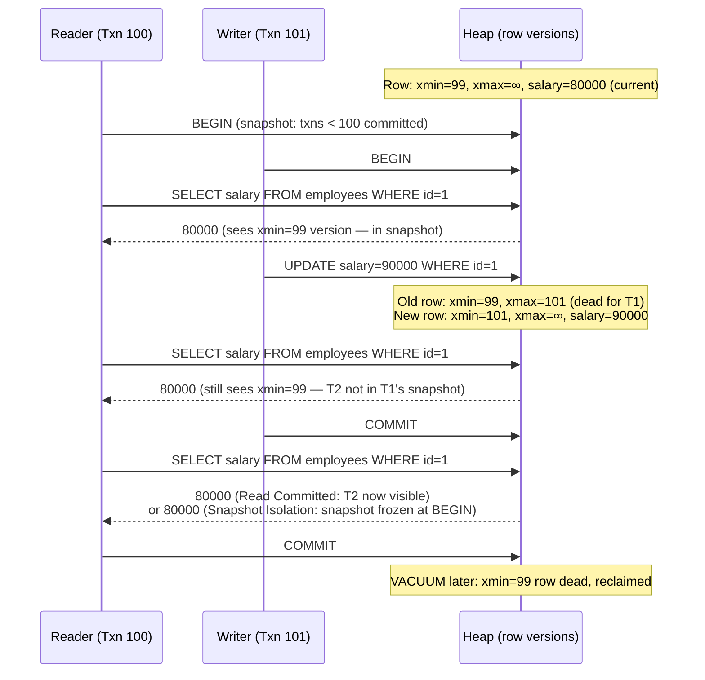

## In simple terms

When a writer updates a row and a reader reads it at the same moment, the classic solution is to block one of them. MVCC avoids this: instead of overwriting the row, the writer creates a **new version** of it tagged with a transaction ID. The reader's transaction sees the version that existed at the moment it started — a consistent snapshot of the past — and is never blocked. Writers and readers run concurrently without locking each other out.

## The Visual Map



## More detail

Each PostgreSQL row has additional metadata: `xmin` (the transaction ID that created this version) and `xmax` (the transaction ID that deleted or updated it, or "infinity" if current). When a reader starts a transaction, it gets a **snapshot**: a record of which transactions were committed at that moment. The reader sees a row version if:
- `xmin` ≤ snapshot (the creating transaction committed before the snapshot)
- `xmax` > snapshot or `xmax = ∞` (the deleting transaction committed after the snapshot, or hasn't yet)

**Write behaviour:** UPDATE does not modify in place. It:
1. Marks the old row with `xmax = current_txid` (making it "dead" to future snapshots)
2. Inserts a new row with `xmin = current_txid`

The old version remains visible to any snapshot taken before the update.

**Isolation levels via MVCC snapshots:**

| Level | When snapshot is taken | What you see |
|---|---|---|
| **Read Committed** | At start of each statement | Latest committed data at statement time |
| **Repeatable Read** | At start of first statement | All statements see the same snapshot |
| **Serializable (SSI)** | At transaction start + conflict detection | Serializable history or abort |

**MySQL InnoDB MVCC:** stores old versions in a separate **undo log** tablespace rather than as in-place copies in the heap. When a reader needs an old version, InnoDB reconstructs it from the current version by replaying undo log entries backwards. This avoids heap bloat but adds CPU cost for old-version reconstruction.

**Garbage collection:**
Old row versions accumulate because any running snapshot may need them. PostgreSQL's `VACUUM` process identifies versions where `xmax` is older than the oldest active transaction and reclaims them. Insufficient vacuuming causes:
- **Table bloat** — dead versions accumulate, inflating table size
- **Index bloat** — index entries point to dead heap tuples
- **Transaction ID wraparound** — PostgreSQL's 32-bit XID counter wraps after ~2 billion transactions; without aggressive VACUUM, old XIDs become "future" XIDs and the database stops

## Under the Hood

A Python simulation of MVCC row versioning and snapshot visibility:

```python
#!/usr/bin/env python3
"""MVCC simulation: versioned rows, snapshots, and vacuum."""

class RowVersion:
    def __init__(self, xmin, xmax, data):
        self.xmin = xmin   # txid that created this version
        self.xmax = xmax   # txid that deleted it (None = current)
        self.data = data

class MVCCTable:
    def __init__(self):
        self.versions = []     # all row versions, never overwritten
        self.committed = set() # committed transaction IDs

    def insert(self, txid, data):
        self.versions.append(RowVersion(xmin=txid, xmax=None, data=data))

    def update(self, txid, row_id, new_data):
        # Find the current visible version (xmax=None, xmin committed or own txid)
        for v in self.versions:
            if v.data.get('id') == row_id and v.xmax is None:
                v.xmax = txid  # mark old version dead
                self.versions.append(RowVersion(xmin=txid, xmax=None, data={**new_data, 'id': row_id}))
                return
        raise KeyError(f"Row {row_id} not found")

    def commit(self, txid):
        self.committed.add(txid)

    def snapshot_read(self, snapshot_at_txid, row_id):
        """Return the row version visible to a snapshot taken at snapshot_at_txid."""
        visible_txids = {t for t in self.committed if t <= snapshot_at_txid}
        for v in reversed(self.versions):
            if v.data.get('id') != row_id:
                continue
            xmin_visible = v.xmin in visible_txids
            xmax_invisible = v.xmax is None or (v.xmax not in visible_txids)
            if xmin_visible and xmax_invisible:
                return v.data
        return None

    def vacuum(self, oldest_active_snapshot):
        """Remove versions where xmax < oldest_active_snapshot (dead to all)."""
        before = len(self.versions)
        self.versions = [v for v in self.versions
                         if v.xmax is None or v.xmax >= oldest_active_snapshot]
        print(f"  VACUUM: removed {before - len(self.versions)} dead version(s)")

# Scenario: T99 inserts salary=80000, T101 updates to 90000
db = MVCCTable()
db.commit(99)
db.insert(txid=99, data={'id': 1, 'name': 'Alice', 'salary': 80000})

# T100 begins (reader), T101 updates concurrently
T100_snapshot = 100  # snapshot at T100 start: only T99 committed
db.update(txid=101, row_id=1, new_data={'name': 'Alice', 'salary': 90000})
db.commit(101)

print("Snapshots after T101 commits salary->90000:")
print(f"  T100 snapshot (before T101):  {db.snapshot_read(T100_snapshot, 1)}")
print(f"  T102 snapshot (after T101):   {db.snapshot_read(102, 1)}")

# Show all versions in heap
print(f"\nHeap versions ({len(db.versions)} total):")
for v in db.versions:
    status = 'LIVE' if v.xmax is None else f'dead(xmax={v.xmax})'
    print(f"  xmin={v.xmin} xmax={v.xmax or '∞'} [{status}] data={v.data}")

# Vacuum: T100 completes, oldest snapshot is now 102
db.vacuum(oldest_active_snapshot=102)
print(f"\nHeap after VACUUM ({len(db.versions)} version(s) remaining):")
for v in db.versions:
    print(f"  xmin={v.xmin} data={v.data}")
```

## Engineering Trade-offs

**MVCC read/write concurrency vs. storage overhead**
MVCC's core benefit: readers and writers don't block each other. A long-running report doesn't need to hold locks on the tables it reads, and writers don't have to wait for that report to complete. The cost: every UPDATE creates a dead row version that occupies space until VACUUM reclaims it. A table with high UPDATE rates (e.g., a counter column updated on every request) accumulates dead tuples rapidly, causing table bloat without regular VACUUM.

**Long transactions vs. VACUUM effectiveness**
The oldest running transaction determines how far back VACUUM can reclaim dead tuples. If Transaction T100 started 2 hours ago and is still running, all row versions created since T100 started must be retained — even if T102, T103, ... T10000 have all committed updates to the same rows. One long-running query can block garbage collection for the entire database. PostgreSQL's `idle_in_transaction_session_timeout` terminates sessions idle inside a transaction to prevent this.

**Write skew and snapshot isolation**
Snapshot isolation prevents dirty reads and non-repeatable reads but allows **write skew**: two transactions read the same data, make decisions based on it, and write non-overlapping rows. Example: "decrement balance if balance > 0" — two concurrent transactions both read balance=100, both decide to proceed, both decrement; final balance = -100. PostgreSQL's Serializable Snapshot Isolation (SSI) detects write skew via predicate tracking and aborts one transaction, at higher CPU cost.

**PostgreSQL heap MVCC vs. InnoDB undo logs**
PostgreSQL stores all row versions in the heap alongside live tuples. This gives fast version reads (no reconstruction needed) but causes table bloat on write-heavy workloads. MySQL InnoDB stores the current version in the heap and old versions in the undo log; old-version reads reconstruct the row by applying undo operations. InnoDB doesn't bloat the main table, but high-concurrency reads of old versions are slower (undo log chain traversal).

**CockroachDB distributed MVCC**
CockroachDB and YugabyteDB implement MVCC over distributed key-value stores. Each write carries a timestamp (Hybrid Logical Clock); a read at timestamp T sees all versions committed before T. The distributed snapshot is consistent across all nodes because Paxos/Raft commits guarantee a global ordering. Long-running transactions in distributed MVCC may need to wait for the clock to advance beyond the transaction's uncertainty window — adding latency compared to single-node MVCC.

## Real-world examples

- **PostgreSQL `xmin`/`xmax` inspection** — `SELECT xmin, xmax, ctid, * FROM employees WHERE id = 1` shows the live row's transaction IDs and physical location (block, offset). After an UPDATE without VACUUM, you see two rows at different `ctid` values — the dead version and the live one.
- **PostgreSQL autovacuum** — PostgreSQL runs `autovacuum` workers in the background to reclaim dead tuples. The `pg_stat_user_tables.n_dead_tup` column shows how many dead tuples are waiting for VACUUM. When `n_dead_tup` grows disproportionately, it indicates autovacuum can't keep up (common after bulk updates).
- **Transaction ID wraparound at Sentry** — Sentry published a post-mortem on a PostgreSQL transaction ID wraparound incident that caused 9 hours of downtime. Their autovacuum wasn't keeping up with write volume; XID approached 2^31. PostgreSQL entered "protection mode" (refusing all writes) to avoid data corruption. Recovery required an emergency full VACUUM FREEZE.
- **MySQL InnoDB purge thread** — InnoDB's purge thread asynchronously removes undo log records that are no longer needed by any active MVCC snapshot. `SHOW ENGINE INNODB STATUS` shows the purge lag. A heavy workload with long transactions causes purge lag to grow, increasing undo tablespace size and slowing down old-version reads.
- **Git as conceptual MVCC** — each Git commit is an immutable snapshot of the repository state. Branches read consistent histories. "Deleting" a commit (git reset) doesn't remove the object; it just moves a pointer. Garbage collection (`git gc`) prunes unreachable objects — analogous to VACUUM.

## Common misconceptions

- **"MVCC means no locking."** MVCC eliminates read-write conflicts (readers don't block writers, writers don't block readers). Write-write conflicts — two transactions updating the same row — still require row-level write locks. MVCC replaces read locks with snapshots, not all locks.
- **"Old versions are deleted immediately after COMMIT."** Dead versions persist until VACUUM (PostgreSQL) or the InnoDB purge thread (MySQL) reclaims them. A long-running transaction forces retention of all versions created since it started, even if those rows have been overwritten many times since.
- **"Snapshot isolation is equivalent to serializable."** Snapshot isolation prevents most anomalies but allows write skew. Serializable isolation (via SSI in PostgreSQL or 2PL) prevents all anomalies. For financial applications where two concurrent transactions checking the same condition could both proceed and cause an invalid state, serializable isolation is required.

## Try it yourself

Simulate PostgreSQL-style MVCC with Python — row versions, snapshots, and vacuum:

```bash
python3 - << 'EOF'
# Minimal MVCC: rows with (xmin, xmax, data), snapshot-based reads
committed = set()

class Row:
    def __init__(self, xmin, data):
        self.xmin = xmin
        self.xmax = None   # None = live
        self.data = data

heap = []
committed.add(1)
heap.append(Row(xmin=1, data={"id": 1, "salary": 80000}))
heap.append(Row(xmin=1, data={"id": 2, "salary": 60000}))

def read_snapshot(txid):
    """Return rows visible to a snapshot taken at 'txid'."""
    snap = {t for t in committed if t <= txid}
    result = []
    for r in heap:
        if r.xmin in snap and (r.xmax is None or r.xmax not in snap):
            result.append(r.data)
    return result

def update(txid, row_id, new_salary):
    """MVCC update: mark old version dead, insert new version."""
    for r in heap:
        if r.data.get("id") == row_id and r.xmax is None:
            r.xmax = txid
            heap.append(Row(xmin=txid, data={"id": row_id, "salary": new_salary}))
            return
    raise KeyError(row_id)

# T5 reads before T10 updates
snapshot_T5 = 5
print(f"T5 reads (snapshot at {snapshot_T5}):", read_snapshot(snapshot_T5))

update(txid=10, row_id=1, new_salary=95000)
committed.add(10)

print(f"T5 still reads old version:          ", read_snapshot(5))
print(f"T11 reads new version (after T10):   ", read_snapshot(11))

print(f"\nAll heap versions:")
for r in heap:
    status = 'LIVE' if r.xmax is None else f'dead(xmax={r.xmax})'
    print(f"  xmin={r.xmin} xmax={r.xmax or 'inf'} [{status}] {r.data}")

# VACUUM: reclaim dead versions invisible to all active snapshots
# oldest_snapshot=6: T5 already committed, but some transaction at snapshot 6
# could still need the pre-T10 version (xmax=10 > 6) — NOT reclaimable yet
oldest = 6
before = len(heap)
heap[:] = [r for r in heap if r.xmax is None or r.xmax >= oldest]
print(f"\nVACUUM (oldest_snapshot={oldest}): {before} -> {len(heap)} versions — T10 not reclaimable (xmax=10 >= 6)")

# Now all snapshots < T10 have completed: oldest_snapshot = 11
oldest = 11
before = len(heap)
heap[:] = [r for r in heap if r.xmax is None or r.xmax >= oldest]
print(f"VACUUM (oldest_snapshot={oldest}): {before} -> {len(heap)} versions — dead tuple reclaimed")
for r in heap:
    print(f"  xmin={r.xmin} data={r.data}")
EOF
```

## Learn next

- [Normalization](/t/normalization) — schema design determines how many concurrent updates hit the same rows; a well-normalised schema with narrow tables reduces write contention and simplifies MVCC garbage collection.
- [Columnar Store](/t/columnar-store) — columnar systems use different concurrency models (typically append-only delta buffers) that avoid MVCC dead-tuple accumulation, at the cost of different read/write trade-offs.
- [Write-Ahead Log](/t/write-ahead-log) — MVCC new row versions are written to the WAL before being committed; understanding WAL explains how MVCC achieves durability and crash recovery for the new versions it creates.
