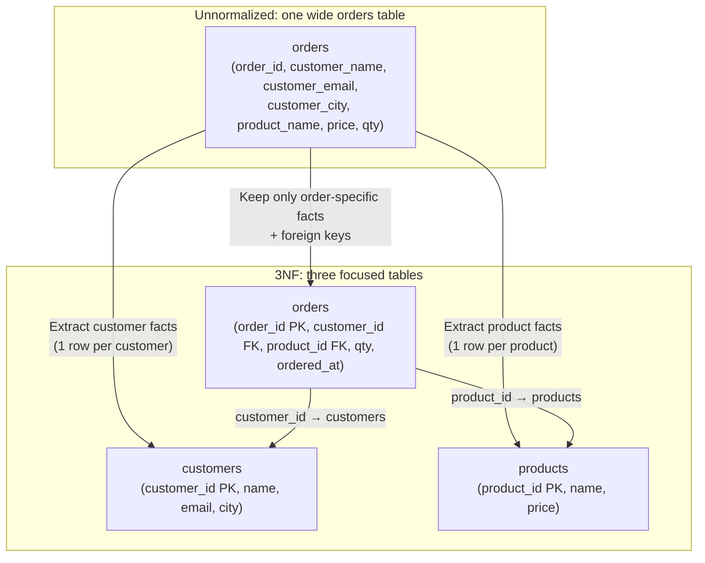

## In simple terms

**Normalization** is a set of design rules for relational databases. You break wide tables into narrower, more focused ones so the same fact is stored in exactly one place. That way, updating a customer's address means updating one row, not hunting through every order they ever placed.

## The Visual Map



## More detail

Normalization is described as a series of **normal forms** (NF), each addressing a specific kind of redundancy:

**1NF — Atomic values, no repeating groups**
Every column holds a single, indivisible value. A column `phone_numbers` storing `"555-1234, 555-5678"` violates 1NF; it should be a separate `phone_numbers` table or two separate columns.

**2NF — Full functional dependency on the whole key**
Applies to tables with composite primary keys. Every non-key column must depend on the *entire* composite key, not just part of it. A `order_lines(order_id, product_id, product_name, qty)` table violates 2NF because `product_name` depends only on `product_id`, not on `(order_id, product_id)`. Fix: separate `products` table.

**3NF — No transitive dependencies**
Every non-key column must depend *directly* on the key, not on another non-key column. `employees(emp_id, dept_id, dept_name)` violates 3NF because `dept_name` depends on `dept_id` (a non-key), not on `emp_id`. Fix: separate `departments` table.

**BCNF (Boyce-Codd Normal Form) — Stricter 3NF**
Every determinant (left-hand side of a functional dependency) must be a superkey. Handles edge cases 3NF misses when there are multiple overlapping candidate keys.

**Higher forms (4NF, 5NF, 6NF)** — address multi-valued and join dependencies; rarely needed in practice outside academic databases.

**In practice, OLTP databases aim for 3NF / BCNF** and back off only with measurement-backed reason.

**Update anomalies prevented by normalization:**
- **Insertion anomaly** — can't add a new product without creating an order (if stored in the same table).
- **Update anomaly** — changing a customer's city requires updating every row in the orders table.
- **Deletion anomaly** — deleting the last order for a customer loses the customer's data.

**Denormalization** is the deliberate inverse: copy data across tables (precomputed columns, materialised views, wide tables) to speed up specific reads. It trades storage and update complexity for read performance. Denormalize after measuring, never by default.

## Under the Hood

Demonstrating a 3NF schema vs. a denormalised one — and the anomalies that arise:

```python
#!/usr/bin/env python3
"""Show update anomaly in denormalized schema vs. clean 3NF."""
import sqlite3

conn = sqlite3.connect(':memory:')
c = conn.cursor()

# --- Denormalized (single table, repeats customer data) ---
c.execute('''CREATE TABLE orders_denorm (
    order_id      INTEGER PRIMARY KEY,
    customer_id   INTEGER,
    customer_name TEXT,
    customer_city TEXT,
    product       TEXT,
    qty           INTEGER
)''')
c.executemany('INSERT INTO orders_denorm VALUES (?,?,?,?,?,?)', [
    (1, 42, 'Alice Smith', 'Boston', 'Laptop',  1),
    (2, 42, 'Alice Smith', 'Boston', 'Mouse',   2),
    (3, 42, 'Alice Smith', 'Boston', 'Monitor', 1),  # Alice has 3 orders
    (4, 99, 'Bob Jones',   'NYC',    'Tablet',  1),
])

# Alice moves to Seattle — must update ALL 3 rows to avoid inconsistency
c.execute("UPDATE orders_denorm SET customer_city='Seattle' WHERE customer_id=42")
boston = c.execute("SELECT COUNT(*) FROM orders_denorm WHERE customer_id=42 AND customer_city='Boston'").fetchone()[0]
print(f"Denormalized: rows still showing Boston for Alice after update: {boston}")
print("  (0 = consistent only if ALL rows were updated — easy to miss one)")
print()

# --- 3NF: separate customers and orders ---
c.execute('CREATE TABLE customers (id INTEGER PRIMARY KEY, name TEXT, city TEXT)')
c.execute('CREATE TABLE orders_norm (id INTEGER PRIMARY KEY, customer_id INTEGER REFERENCES customers(id), product TEXT, qty INTEGER)')
c.executemany('INSERT INTO customers VALUES (?,?,?)', [(42, 'Alice Smith', 'Boston'), (99, 'Bob Jones', 'NYC')])
c.executemany('INSERT INTO orders_norm VALUES (?,?,?,?)', [(1,42,'Laptop',1),(2,42,'Mouse',2),(3,42,'Monitor',1),(4,99,'Tablet',1)])

# Alice moves — update ONE row
c.execute("UPDATE customers SET city='Seattle' WHERE id=42")
city = c.execute("SELECT city FROM customers WHERE id=42").fetchone()[0]
print(f"3NF: Alice's city after update: {city}")
print("  (only ONE row to update — no anomaly possible)")
print()

# Join query works cleanly
print("Order list (joined from 3NF tables):")
for row in c.execute('''
    SELECT o.id, c.name, c.city, o.product, o.qty
    FROM orders_norm o JOIN customers c ON o.customer_id = c.id
    ORDER BY o.id
'''):
    print(f"  order={row[0]} customer={row[1]} city={row[2]} product={row[3]} qty={row[4]}")
conn.close()
```

## Engineering Trade-offs

**3NF schema vs. query complexity**
A well-normalised schema requires JOINs to reconstruct denormalised views. A query that once read one row from a fat table now JOINs 3–4 tables. For complex reports, this adds planning and execution cost. The benefit: data is consistent by construction; the cost: query complexity and sometimes performance for read-heavy workloads.

**Normalisation vs. read performance (OLTP vs OLAP)**
OLTP reads typically fetch one entity at a time (one order, one user) — a join of 3 tables via indexed foreign keys is fast (milliseconds). OLAP queries scan millions of rows across many joins — the join cost is multiplied. Data warehouses use **denormalised star schemas**: a central `fact_orders` table with customer and product attributes duplicated alongside it, eliminating the runtime join. ETL processes maintain consistency at load time.

**Referential integrity vs. write throughput**
Foreign key constraints ensure that every `order.customer_id` references a real customer row. The database checks this on every INSERT and DELETE — a small cost per write (an index lookup on the parent table). At 100K inserts/second, constraint checking can become a bottleneck. Some teams disable FK enforcement for bulk loads and re-enable after, or skip FK constraints in favour of application-level enforcement for maximum write throughput.

**Schema evolution vs. normalisation rigidity**
A well-normalised schema is easier to extend (add a column to one table, not many), but schema migrations in normalised schemas can be complex (splitting a column across two tables requires a migration that touches data). Flexible document schemas (MongoDB, DynamoDB) avoid this at the cost of denormalisation and application-level consistency. The trade-off: normalisation wins for stable domains; document models win for rapidly-changing schemas.

**Surrogate keys vs. natural keys**
Normalisation recommends using a stable, minimal primary key. Natural keys (email, username, social security number) are meaningful but can change (users change emails). Surrogate keys (AUTO_INCREMENT id, UUID) never change, making them safer foreign key targets. The downside: queries now need JOINs to look up the human-readable value; the upside: the primary key is stable across all tables that reference it.

## Real-world examples

- **The 3NF paper (E. F. Codd, 1973)** — "Further Normalization of the Data Base Relational Model" introduced 3NF and functional dependencies; it is the theoretical basis for every relational database schema design 50 years later.
- **Django ORM models** — Django's model system naturally leads to 3NF: each `Model` class becomes one table with a surrogate `id` primary key; `ForeignKey` fields implement referential integrity. The generated SQL schema is almost always 3NF by default.
- **Hospital patient records** — a denormalised patient record (patient_name, doctor_name, hospital_name all in one table) creates update anomalies: changing a doctor's name requires updating every appointment row. 3NF separates patients, doctors, hospitals, and appointments into four tables.
- **E-commerce star schema** — a fact table `orders(order_id, customer_id, product_id, date_id, revenue, qty)` with dimension tables `customers`, `products`, `dates` is the canonical data warehouse pattern. It is deliberately denormalised (first normal violation: `date.year` depends on `date.month` which depends on `date_id`) for analytics performance.
- **PostgreSQL partial denormalization with triggers** — teams sometimes add a denormalised column (`orders.customer_city`) maintained by a database trigger that fires on `customers` UPDATE. This gives read performance without manual update-anomaly risk, at the cost of trigger complexity.

## Common misconceptions

- **"Higher normal form is always better."** 3NF is usually the practical sweet spot. BCNF and higher forms can hurt performance by creating more tables, more joins, and more complex schema evolution — without preventing real-world anomalies that 3NF already prevents.
- **"Denormalisation is a design smell."** It is a deliberate trade-off. Data warehouses, materialised views, search indexes, and caches are all forms of beneficial denormalisation; they are standard tools, not signs of poor design. Denormalize after measuring a performance problem, not prophylactically.
- **"Only relational databases need normalisation."** Document databases (MongoDB) and key-value stores have analogous redundancy problems. Embedding order items in a customer document is denormalisation; it has the same update anomaly risk. NoSQL data modelling has its own normalisation-analogous patterns (embedding vs. referencing).

## Try it yourself

Explore functional dependencies and update anomalies with SQLite:

```bash
python3 - << 'EOF'
import sqlite3

conn = sqlite3.connect(':memory:')
c = conn.cursor()

# Simulate a common first design: orders with repeated customer data
c.execute('''CREATE TABLE orders_bad (
    order_id      INTEGER PRIMARY KEY,
    customer_id   INTEGER,
    customer_name TEXT,
    customer_email TEXT,
    product       TEXT,
    price         REAL,
    qty           INTEGER
)''')
c.executemany('INSERT INTO orders_bad VALUES (?,?,?,?,?,?,?)', [
    (1, 7, 'Carol White', 'carol@example.com', 'Keyboard', 49.99, 2),
    (2, 7, 'Carol White', 'carol@example.com', 'Mouse',    19.99, 1),
    (3, 7, 'Carol White', 'carol@old.com',     'Monitor', 299.99, 1),  # BUG: old email
])

# The inconsistency is already there (two emails for same customer_id)
emails = [r[0] for r in c.execute("SELECT DISTINCT customer_email FROM orders_bad WHERE customer_id=7")]
print(f"Emails for customer 7 in denormalized table: {emails}")
print("  (should be 1, but we have an inconsistency — classic update anomaly)")

# Fix: normalize into two tables
c.execute('''CREATE TABLE customers (
    id    INTEGER PRIMARY KEY,
    name  TEXT,
    email TEXT UNIQUE
)''')
c.execute('''CREATE TABLE orders_good (
    id          INTEGER PRIMARY KEY,
    customer_id INTEGER REFERENCES customers(id),
    product     TEXT,
    price       REAL,
    qty         INTEGER
)''')
c.execute("INSERT INTO customers VALUES (7, 'Carol White', 'carol@example.com')")
c.executemany('INSERT INTO orders_good VALUES (?,?,?,?,?)', [
    (1, 7, 'Keyboard', 49.99, 2),
    (2, 7, 'Mouse',    19.99, 1),
    (3, 7, 'Monitor', 299.99, 1),
])

# One email, always consistent
emails_norm = [r[0] for r in c.execute("SELECT DISTINCT email FROM customers WHERE id=7")]
print(f"\nEmails for customer 7 in normalized schema: {emails_norm}")
print("  (always 1 — the schema makes the anomaly impossible)")
print()
print("Carol updates her email — one row, one place:")
c.execute("UPDATE customers SET email='carol@new.com' WHERE id=7")
new_email = c.execute("SELECT email FROM customers WHERE id=7").fetchone()[0]
print(f"  All 3 orders now see: {new_email}")
conn.close()
EOF
```

## Learn next

- [Relational Model](/t/relational-model) — the mathematical foundation normalization is built on; functional dependencies, keys, and relations are the formal tools used to prove a schema is in a given normal form.
- [SQL](/t/sql) — the language for implementing normalised schemas with `CREATE TABLE`, `FOREIGN KEY`, and `JOIN`; normalisation theory maps directly to SQL DDL patterns.
- [Indexing](/t/indexing) — a normalised schema often makes indexing simpler: foreign keys are natural index candidates, and well-separated tables have fewer columns to index.
