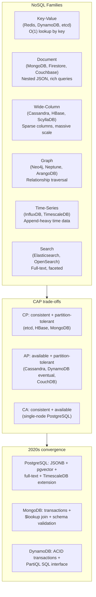

## In simple terms

**NoSQL** ("Not Only SQL") is the loose label for databases that aren't relational. The category covers wildly different systems: key-value stores like Redis, document stores like MongoDB, wide-column stores like Cassandra, graph databases like Neo4j. The thing they share is "we made a deliberate trade against the relational model to get something else" — usually scale, flexibility, or a specific data shape.

## The Visual Map



## More detail

The major NoSQL families:

| Family | Examples | Best at | Primary trade-off |
|---|---|---|---|
| **Key-value** | Redis, DynamoDB, etcd | O(1) lookup, cache, counters | No query beyond key |
| **Document** | MongoDB, Firestore, Couchbase | Nested JSON objects, rich filter | Joins are awkward |
| **Wide-column** | Cassandra, HBase, ScyllaDB | Massive write throughput, time data | Limited query patterns |
| **Graph** | Neo4j, Neptune, ArangoDB | Multi-hop relationship traversal | Smaller ecosystem, no mass-scan |
| **Search** | Elasticsearch, OpenSearch | Full-text, facets, aggregations | Eventually consistent |
| **Time-series** | InfluxDB, TimescaleDB, ClickHouse | Append-only time data, rollups | Specialised query model |

**Why NoSQL emerged (~2009):**

1. **Horizontal scale** — single-master relational databases hit a ceiling under 2000s web traffic. MySQL with a single writer, sharded by application code, was painful. Cassandra and DynamoDB were designed from the start to run across hundreds of nodes with no single point of failure.
2. **Schema flexibility** — early-stage products change shape constantly. `ALTER TABLE` on a 100M-row table was a multi-hour operation. JSON documents could evolve without migrations.
3. **Specific data shapes** — some domains are not naturally tabular. Social graphs are graphs. Time-series is append-heavy with retention windows. Full-text search requires inverted indexes. Relational databases could support these but with significant complexity.

**CAP theorem framing:**
Every distributed database makes trade-offs between Consistency, Availability, and Partition tolerance. Cassandra (and most AP systems) are available during network partitions but allow stale reads. etcd and ZooKeeper are CP: they stop accepting writes during a partition to maintain consistency. The choice depends on the application: a shopping cart can be eventually consistent (AP); a bank balance cannot.

**The convergence story (2015–2026):**
- Relational DBs got better at scale: PostgreSQL with logical replication, partitioning, CockroachDB/Spanner/YugabyteDB adding horizontal SQL.
- NoSQL DBs got more relational: MongoDB added transactions (4.0), `$lookup` joins, JSON Schema validation. DynamoDB added transactions and PartiQL.
- PostgreSQL ate parts of NoSQL: `JSONB` is a competitive document store with indexing; `pg_trgm` and `tsvector` for full-text; `pgvector` for nearest-neighbour search; TimescaleDB extension for time-series.

In 2026, the choice is rarely "SQL vs. NoSQL" wholesale. The typical mature stack: PostgreSQL (system of record), Redis (cache / queue / rate limiter), Elasticsearch (full-text), InfluxDB or TimescaleDB (metrics and IoT), possibly a vector store for ML embeddings.

## Under the Hood

Demonstrating Cassandra's query-first design principle with a Python simulation — schema must match access pattern:

```python
#!/usr/bin/env python3
"""NoSQL query-first design: one table per access pattern (Cassandra style)."""

# In Cassandra (wide-column), you design the table around the query,
# not the normalized entity. Here we simulate with Python dicts.

# Source data: messages
messages = [
    {"user": "alice", "timestamp": 1700000001, "text": "hello world",     "room": "general"},
    {"user": "bob",   "timestamp": 1700000002, "text": "hi alice",        "room": "general"},
    {"user": "alice", "timestamp": 1700000003, "text": "let's discuss DX","room": "engineering"},
    {"user": "carol", "timestamp": 1700000004, "text": "agree!",          "room": "engineering"},
    {"user": "bob",   "timestamp": 1700000005, "text": "sounds good",     "room": "general"},
]

# Access pattern 1: "get all messages in a room, newest first"
# → Table keyed by (room, timestamp)
room_messages = {}
for m in messages:
    key = m["room"]
    room_messages.setdefault(key, []).append(m)
for key in room_messages:
    room_messages[key].sort(key=lambda x: -x["timestamp"])

print("Access pattern 1: messages in 'general' (newest first):")
for m in room_messages.get("general", []):
    print(f"  t={m['timestamp']} [{m['user']}] {m['text']}")

# Access pattern 2: "get all messages by a user, newest first"
# → SEPARATE table keyed by (user, timestamp)
# Cassandra: you'd CREATE a second table, duplicate the data
user_messages = {}
for m in messages:
    key = m["user"]
    user_messages.setdefault(key, []).append(m)
for key in user_messages:
    user_messages[key].sort(key=lambda x: -x["timestamp"])

print("\nAccess pattern 2: messages by 'alice':")
for m in user_messages.get("alice", []):
    print(f"  t={m['timestamp']} [{m['room']}] {m['text']}")

# In SQL, ONE messages table handles both queries with different WHERE clauses
# In Cassandra, you need TWO tables (with duplicated data) — one per access pattern
print(f"\nDuplicated rows for 2 access patterns: {len(messages) * 2} total rows (vs {len(messages)} in SQL)")
print("This is 'query-first design': design tables around queries, not entities.")
print("Write amplification and duplication are the trade for single-partition reads.")
```

## Engineering Trade-offs

**Query flexibility vs. write throughput**
Relational databases can answer arbitrary queries — the query planner will figure out a plan. NoSQL databases trade query flexibility for write throughput. Cassandra's log-structured merge tree (LSM) handles 100K+ writes/second per node but requires all queries to be designed into the primary key. Adding a new access pattern requires a new table and backfilling the data.

**Schema flexibility vs. consistency**
No schema enforcement means you can ship faster during development and avoid painful migrations. The cost: "schema-on-read" means every consumer of the data must handle every past version of the document shape. A field renamed in the application three years ago may still exist in old documents. At scale, schema-on-read becomes expensive in application code complexity and subtle data quality bugs.

**BASE vs. ACID — availability trade-offs**
AP NoSQL systems (Cassandra, DynamoDB with eventual consistency) follow BASE: **B**asically Available, **S**oft state, **E**ventually consistent. They remain available during network partitions by accepting writes on any replica and reconciling later. This enables the "always writable" property but allows temporary inconsistency: two nodes may return different values for the same key immediately after a write. ACID databases (PostgreSQL, MySQL) block or fail during partitions to maintain consistency.

**Horizontal scaling vs. cross-entity transactions**
NoSQL stores scale writes horizontally by sharding across nodes. But operations that span multiple partitions (cross-shard transactions) require distributed coordination — expensive in latency and complexity. The typical NoSQL design avoids this by denormalizing related data into one partition. This makes single-entity reads fast but makes "update X and Y atomically" hard.

**Data duplication vs. join cost**
Cassandra-style "query-first design" creates one table per access pattern. A `messages` entity stored in both a `messages_by_room` table and a `messages_by_user` table is duplicated. Writes must update both tables (write amplification). Deletes must find and remove all copies. The trade: reads are O(1) partition lookups; consistency between copies is the application's responsibility.

## Real-world examples

- **Netflix + Cassandra** — Netflix stores viewing history, account metadata, and device state in Cassandra. The always-writable model means a member can continue streaming during a network partition; stale data is reconciled when the partition heals. Netflix has contributed extensive tooling for Cassandra operations.
- **Twitter / X multi-store architecture** — Twitter uses relational (MySQL, sharded) for accounts and tweets, Cassandra for social graphs, Redis for the home timeline cache, Manhattan (in-house KV) for ad targeting, Elasticsearch for search. Each store is chosen for its workload.
- **DynamoDB at Amazon** — every Amazon.com page load touches dozens of DynamoDB tables (product catalog, shopping cart, recommendations). DynamoDB's single-digit-millisecond latency at any scale is the requirement; no relational database meets it at that write throughput.
- **MongoDB at Expedia** — Expedia stores hotel content (descriptions, photos, amenities, policy data) in MongoDB. Hotel attributes vary drastically by property type and region; a flexible document schema avoids thousands of sparse columns. MongoDB's aggregation pipeline replaces ETL transforms that would otherwise require Spark.
- **Elasticsearch for log search** — Elasticsearch is the "E" in the ELK stack (Elasticsearch, Logstash, Kibana). Every log line is a JSON document in an inverted index. A query "find all ERROR logs from service X in the last hour" — full-text with time filter — returns in milliseconds on terabytes of logs.

## Common misconceptions

- **"NoSQL means no schema."** Most production NoSQL workloads have a strict, implicit schema defined in application code; the DB just doesn't enforce it. That's a feature for prototyping and a liability at scale. MongoDB, DynamoDB, and Cassandra all support schema validation or enforce schema via primary key structure.
- **"NoSQL is faster than SQL."** For a single key lookup, sometimes. For complex queries with joins and aggregations, SQL (especially on an OLAP engine) is usually faster and simpler. "NoSQL is fast" is short for "NoSQL avoids the features that make SQL slow under certain workloads."
- **"You have to choose between SQL and NoSQL."** Most production systems use both: a relational database as the system of record, with NoSQL stores for specific capabilities (cache, search, time-series, graph). The question is not "which one" but "which for what."

## Try it yourself

Compare access patterns: relational JOIN vs. NoSQL denormalized lookup:

```bash
python3 - << 'EOF'
import sqlite3, time

conn = sqlite3.connect(':memory:')
c = conn.cursor()

# Relational: 3NF tables with JOIN
c.executescript('''
CREATE TABLE users (id INTEGER PRIMARY KEY, name TEXT, region TEXT);
CREATE TABLE posts (id INTEGER PRIMARY KEY, user_id INTEGER, content TEXT, created_at INTEGER);
CREATE INDEX idx_user ON posts(user_id);
''')
for i in range(1000):
    c.execute("INSERT INTO users VALUES (?,?,?)", (i, f"User {i}", ["US","EU","APAC"][i%3]))
for i in range(10000):
    c.execute("INSERT INTO posts VALUES (?,?,?,?)", (i, i%1000, f"Post {i}", 1700000000+i))
conn.commit()

# Relational query: posts by user 42 with user info (JOIN)
t0 = time.perf_counter()
for _ in range(1000):
    r = c.execute("SELECT u.name, u.region, p.content, p.created_at FROM posts p JOIN users u ON u.id = p.user_id WHERE p.user_id = 42 ORDER BY p.created_at DESC LIMIT 10").fetchall()
rel_us = (time.perf_counter()-t0)*1000

# NoSQL: denormalized (embed user data in each post row)
c.execute('''CREATE TABLE posts_denorm (
    id INTEGER PRIMARY KEY, user_id INTEGER, user_name TEXT, user_region TEXT,
    content TEXT, created_at INTEGER)''')
c.execute('''INSERT INTO posts_denorm
    SELECT p.id, p.user_id, u.name, u.region, p.content, p.created_at
    FROM posts p JOIN users u ON u.id = p.user_id''')
c.execute("CREATE INDEX idx_uid ON posts_denorm(user_id)")
conn.commit()

t0 = time.perf_counter()
for _ in range(1000):
    r2 = c.execute("SELECT user_name, user_region, content, created_at FROM posts_denorm WHERE user_id = 42 ORDER BY created_at DESC LIMIT 10").fetchall()
nosql_us = (time.perf_counter()-t0)*1000

print(f"Relational (JOIN):         {rel_us:.1f} ms for 1000 queries")
print(f"Denormalized (NoSQL-style):{nosql_us:.1f} ms for 1000 queries")
print(f"Speedup: {rel_us/nosql_us:.1f}x")
print(f"\nTrade-off: denormalized table is {c.execute('SELECT COUNT(*) FROM posts_denorm').fetchone()[0]} rows")
print("If user 42 changes region, ALL their post rows must be updated.")
print("(In relational: update 1 row in users table — done.)")
conn.close()
EOF
```

## Learn next

- [Normalization](/t/normalization) — the relational design discipline that NoSQL stores deliberately depart from; understanding 3NF explains what consistency guarantees are surrendered when denormalizing.
- [Transaction ACID](/t/transaction-acid) — the consistency model relational databases provide and NoSQL stores often relax; BASE vs. ACID is the core trade-off in distributed databases.
- [Key-Value Store](/t/key-value-store) — the simplest and most-deployed NoSQL family; a concrete starting point for understanding how different the NoSQL API is from SQL.
