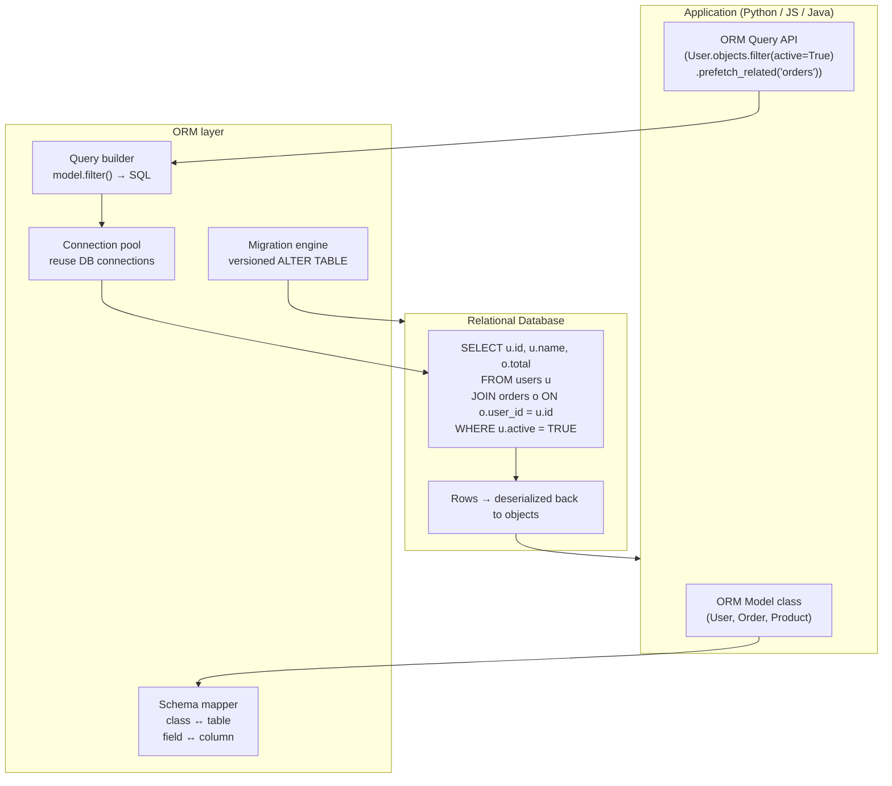

## In simple terms

An **ORM** (Object-Relational Mapper) is a library that lets you talk to a relational database through your programming language's object model instead of writing SQL strings. You define a `User` class, the ORM creates a `users` table; you ask `user.orders`, the ORM does the SQL join. It hides the impedance mismatch between objects (graphs of mutable references) and relational data (sets of rows).

## The Visual Map



## More detail

ORMs typically provide:

- **Schema mapping** — class ↔ table, field ↔ column. A Django `Model` or SQLAlchemy `Base` subclass becomes a table definition.
- **Querying** — chainable API in your language that translates to SQL: `User.objects.filter(active=True).order_by('-created_at')`.
- **Relationships** — `has_many`, `belongs_to`, `has_one`, `many_to_many`. The ORM generates the JOIN or subquery.
- **Migrations** — versioned schema changes: `makemigrations` / `migrate` (Django), `alembic upgrade head` (SQLAlchemy), `prisma migrate deploy` (Prisma).
- **Connection pooling** — reuse DB connections across requests.
- **Lifecycle hooks** — `before_save`, `after_create`, `on_destroy`.
- **Eager / lazy loading** — control how related rows are fetched; lazy is convenient but causes N+1 queries; eager loading requires explicit opt-in.

**Popular ORMs by language (2026):**

| Language | ORMs | Query builders |
|---|---|---|
| Python | Django ORM, SQLAlchemy | SQLAlchemy Core, Tortoise |
| Ruby | ActiveRecord (Rails) | Sequel |
| Java | Hibernate / JPA | jOOQ, QueryDSL |
| .NET | Entity Framework Core | Dapper |
| JS / TS | TypeORM, Sequelize | Prisma, Drizzle, Kysely |
| Go | GORM, ent | sqlx, bun |
| Rust | Diesel, SeaORM | sqlx |

**The N+1 problem — the most common ORM pitfall:**
Fetching 50 posts with `for post in Post.objects.all(): print(post.author.name)` fires 51 queries: one to get the posts, then one per post to lazy-load the author. The fix is explicit eager loading: `Post.objects.select_related('author')` or `Post.objects.prefetch_related('comments')` — one query instead of N+1. Not knowing this turns an ORM from a productivity tool into a performance hazard.

**Query builders vs. full ORMs:**
The 2020s saw a strong shift toward query builders (Drizzle, Kysely, jOOQ, sqlx) that stop short of full ORM: type-safe, composable, you write something that looks like SQL in your language, but there's no magic relationship loading or lifecycle hooks. Less magic, much less surprise. The trade-off: no migrations or schema-from-model generation — those must be handled separately.

## Under the Hood

A minimal ORM in pure Python — showing schema mapping, query building, and eager loading to fix N+1:

```python
#!/usr/bin/env python3
"""Mini ORM: mapper, query builder, eager loading to prevent N+1."""
import sqlite3

# Database setup
conn = sqlite3.connect(':memory:')
conn.row_factory = sqlite3.Row
conn.executescript('''
CREATE TABLE users (id INTEGER PRIMARY KEY, name TEXT, active INTEGER);
CREATE TABLE orders (id INTEGER PRIMARY KEY, user_id INTEGER, total REAL, status TEXT);
INSERT INTO users VALUES (1,'Alice',1),(2,'Bob',1),(3,'Carol',0);
INSERT INTO orders VALUES
  (1,1,250.0,'shipped'),(2,1,80.0,'delivered'),
  (3,2,420.0,'pending'),(4,2,60.0,'delivered');
''')

class QuerySet:
    def __init__(self, table, conn, filters=None, prefetch=None):
        self.table   = table
        self.conn    = conn
        self.filters = filters or {}
        self._prefetch = prefetch or []

    def filter(self, **kwargs):
        return QuerySet(self.table, self.conn, {**self.filters, **kwargs}, self._prefetch)

    def prefetch_related(self, *related):
        return QuerySet(self.table, self.conn, self.filters, list(related))

    def _build_sql(self):
        sql = f"SELECT * FROM {self.table}"
        params = []
        if self.filters:
            clauses = [f"{k} = ?" for k in self.filters]
            sql += " WHERE " + " AND ".join(clauses)
            params = list(self.filters.values())
        return sql, params

    def __iter__(self):
        sql, params = self._build_sql()
        rows = [dict(r) for r in self.conn.execute(sql, params)]
        # Eager load related
        if 'orders' in self._prefetch:
            ids = [r['id'] for r in rows]
            if ids:
                placeholders = ','.join('?' * len(ids))
                rel_rows = self.conn.execute(
                    f"SELECT * FROM orders WHERE user_id IN ({placeholders})", ids).fetchall()
                from collections import defaultdict
                orders_map = defaultdict(list)
                for o in rel_rows: orders_map[o['user_id']].append(dict(o))
                for r in rows: r['orders'] = orders_map.get(r['id'], [])
        return iter(rows)

class Model:
    def __init__(self, table, conn):
        self.objects = QuerySet(table, conn)

User  = Model('users',  conn)
Order = Model('orders', conn)

# --- Lazy-style: N+1 simulation (what happens WITHOUT prefetch) ---
queries = [0]
real_exec = conn.execute
def counting_exec(sql, params=()):
    queries[0] += 1
    return real_exec(sql, params)

print("Without prefetch (N+1 pattern):")
users = list(User.objects.filter(active=1))
for u in users:
    # Simulate lazy loading: execute a query per user
    orders = real_exec("SELECT * FROM orders WHERE user_id = ?", (u['id'],)).fetchall()
    print(f"  {u['name']}: {len(orders)} orders")
print(f"  Queries executed: 1 (users) + {len(users)} (orders) = {1 + len(users)} total")

# --- Eager-style: prefetch_related fixes N+1 ---
print("\nWith prefetch_related('orders') — 2 queries total:")
users_with_orders = list(User.objects.filter(active=1).prefetch_related('orders'))
for u in users_with_orders:
    print(f"  {u['name']}: {len(u['orders'])} orders (totals: {[o['total'] for o in u['orders']]})")
print("  Queries executed: 2 (users + all orders in one IN clause)")
conn.close()
```

## Engineering Trade-offs

**Developer velocity vs. performance**
ORMs reduce boilerplate — models, relationships, migrations, CRUD operations — dramatically. For typical OLTP workloads (single-entity reads, simple filters, paginated lists), ORM-generated SQL is efficient. For complex queries (multi-table aggregations, window functions, CTEs), ORMs generate verbose or incorrect SQL; raw SQL or a query builder is required. The pragmatic approach: use ORM for 80% of queries, escape to raw SQL for the 20% that need it.

**The N+1 query trap**
Lazy loading is the default in most ORMs: accessing `post.author` triggers a separate SELECT per post. Fetching a list of 100 posts and accessing the author for each fires 101 queries — invisible in development (fast SQLite), catastrophic in production (100× more round-trips to the database). Every developer using an ORM must understand eager loading (`include`, `join`, `prefetch_related`) and use `EXPLAIN` to verify the generated SQL.

**Type safety vs. expressiveness**
Modern typed ORMs (Prisma, Drizzle, SQLAlchemy 2.0 with type stubs) give compile-time errors on invalid field names. This prevents a class of bugs but constrains expressiveness — complex SQL constructs (lateral joins, custom aggregates, recursive CTEs) often don't fit the type-safe API and require dropping to raw SQL or `text()` literals, losing type safety for those queries.

**Migrations vs. schema drift**
ORM migration tools (Django `manage.py migrate`, Alembic, Flyway) generate versioned migration files that apply to any environment in order. This is powerful but requires discipline: migration files must be committed with the model changes, and production migrations often require review (locking implications of `ALTER TABLE`, index creation on large tables). Without migration tooling, schema drift (dev DB ≠ staging ≠ production) is a persistent source of bugs.

**Connection pooling vs. serverless cold starts**
ORMs manage a connection pool to the database. In traditional long-running servers, this works well — connections are established once and reused. In serverless (AWS Lambda, Vercel Edge) where each invocation may be a fresh process, the pool is empty on cold start. PgBouncer (external connection pooler) or serverless-aware clients (neon's `@neondatabase/serverless`) solve this. ORMs designed for traditional servers (Django, ActiveRecord) often perform poorly in serverless environments without additional pooling layers.

## Real-world examples

- **GitHub's ActiveRecord** — GitHub runs one of the world's largest Rails applications. ActiveRecord generates all the SQL for issues, pull requests, and comments. The team has open-sourced tooling for detecting N+1 queries (`github.com/github/github` is private, but they publish talks on AR at scale), sharding, and custom query analysis.
- **Django ORM at Instagram** — Instagram ran Django ORM on PostgreSQL as its primary database layer for years. The team published extensively on sharding strategies (they sharded by user ID) and using Django ORM raw queries for performance-critical paths.
- **Prisma's code generation approach** — Prisma introduced a `schema.prisma` DSL that generates a fully type-safe TypeScript client. Every model field, relation, and filter is typed — accessing a nonexistent field is a compile error. This influenced TypeScript ORMs significantly and drove adoption of the query-builder pattern.
- **SQLAlchemy's "unit of work" pattern** — SQLAlchemy tracks all changes to loaded objects in a "session" and flushes them to the database in the correct order (respecting foreign key dependencies) on `session.commit()`. This pattern made complex multi-object saves safe and predictable.
- **Drizzle ORM** — Drizzle is a TypeScript query builder (technically not a full ORM) that generates SQL at compile time. All queries are type-safe and map one-to-one with SQL constructs. In benchmarks, Drizzle + Postgres.js outperforms Prisma by 2–5× on simple queries due to lower abstraction overhead.

## Common misconceptions

- **"You can avoid learning SQL by using an ORM."** SQL knowledge is what lets you debug ORM-generated queries, fix N+1 patterns, and optimize slow operations. Every professional backend engineer using an ORM eventually needs to read and write SQL. ORMs remove SQL typing, not SQL understanding.
- **"ORMs are always slower than raw SQL."** A naive use (lazy loading, no indexes on join columns) is slow. A careful use (eager loading, correct indexes, raw SQL escape hatches for complex queries) performs comparably to hand-written SQL for most OLTP workloads. The ORM is not the bottleneck — missing indexes and N+1 patterns are.
- **"ORMs handle all database operations."** ORMs handle CRUD well. Bulk inserts, complex aggregations, recursive queries, database-specific features (PostgreSQL `COPY`, partial indexes, `LISTEN/NOTIFY`), and high-throughput write paths often require raw SQL or dedicated tooling.

## Try it yourself

Demonstrate the N+1 problem and the eager-loading fix with SQLite:

```bash
python3 - << 'EOF'
import sqlite3, time

# Wrapper to count queries without monkey-patching
class CountingDB:
    def __init__(self, conn): self.conn = conn; self.count = 0
    def execute(self, sql, params=()):
        self.count += 1
        return self.conn.execute(sql, params)

raw = sqlite3.connect(':memory:')
raw.row_factory = sqlite3.Row
raw.executescript('''
CREATE TABLE authors (id INTEGER PRIMARY KEY, name TEXT);
CREATE TABLE books   (id INTEGER PRIMARY KEY, author_id INTEGER, title TEXT, year INTEGER);
CREATE INDEX idx_author ON books(author_id);
''')
for i in range(100):
    raw.execute("INSERT INTO authors VALUES (?,?)", (i, f"Author {i}"))
for i in range(500):
    raw.execute("INSERT INTO books VALUES (?,?,?,?)", (i, i%100, f"Book {i}", 2000+i%24))
raw.commit()

# N+1: fetch all authors, then lazy-load each one's book count
db = CountingDB(raw)
t0 = time.perf_counter()
authors = db.execute("SELECT * FROM authors").fetchall()
for a in authors:
    _ = db.execute("SELECT COUNT(*) FROM books WHERE author_id = ?", (a["id"],)).fetchone()[0]
n1_ms = (time.perf_counter()-t0)*1000
n1_q = db.count

# Eager load: two queries total (authors + all book counts in one go)
db2 = CountingDB(raw)
t0 = time.perf_counter()
authors2 = db2.execute("SELECT * FROM authors").fetchall()
counts = {r["author_id"]: r["cnt"] for r in db2.execute(
    "SELECT author_id, COUNT(*) cnt FROM books GROUP BY author_id"
)}
eager_ms = (time.perf_counter()-t0)*1000
eager_q = db2.count

print(f"N+1 pattern:    {n1_q} queries in {n1_ms:.1f} ms")
print(f"Eager loading:  {eager_q} queries in {eager_ms:.1f} ms")
print(f"Reduction: {n1_q} -> {eager_q} queries ({n1_q/eager_q:.0f}x fewer)")
raw.close()
EOF
```

## Learn next

- [Query Plan](/t/query-plan) — `EXPLAIN ANALYZE` reveals the SQL an ORM generates and whether it uses indexes; this is the primary tool for diagnosing slow ORM queries and N+1 problems.
- [Normalization](/t/normalization) — the schema design principles ORMs implement as relationship types (`ForeignKey`, `ManyToManyField`); understanding 3NF explains why ORM models are structured the way they are.
- [Schema Migration](/t/schema-migration) — how ORM migration tools manage the gap between model definitions and database schema; migration tooling is often bundled with the ORM and is critical for safe schema evolution.
