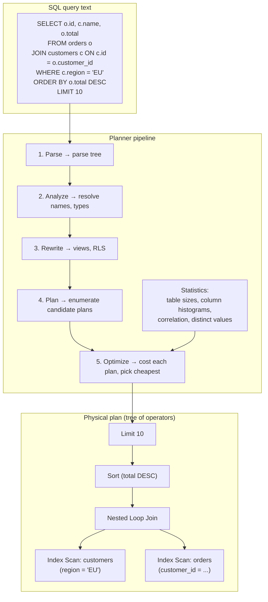

## In simple terms

When you give a database a SQL query, it doesn't run it directly — it first parses it, considers many possible ways to compute the answer, and picks the cheapest one. That chosen plan is the **query plan**: a tree of physical operations (scan this index, then join with that table, then sort). Reading the query plan is the single most important skill in tuning slow queries.

## The Visual Map



## More detail

In PostgreSQL, the command is `EXPLAIN`:

```sql
EXPLAIN SELECT * FROM orders WHERE customer_id = 42;

-- Index Scan using orders_customer_id_idx on orders
--   (cost=0.43..8.45 rows=10 width=64)
--   Index Cond: (customer_id = 42)
```

`EXPLAIN ANALYZE` runs the query and reports actual timings alongside estimates — the gold standard:

```sql
EXPLAIN (ANALYZE, BUFFERS) SELECT * FROM orders WHERE customer_id = 42;

-- Index Scan using orders_customer_id_idx on orders
--   (cost=0.43..8.45 rows=10 width=64)
--   (actual time=0.024..0.071 rows=12 loops=1)
--   Index Cond: (customer_id = 42)
--   Buffers: shared hit=5
-- Planning Time: 0.3 ms  Execution Time: 0.1 ms
```

**Common plan operators to recognise:**

| Operator | When used | Red flag |
|---|---|---|
| **Seq Scan** | Read every row | On >10K rows with a selective WHERE |
| **Index Scan** | Walk B-tree, fetch rows | Usually good |
| **Index Only Scan** | Index covers all columns | Best case |
| **Bitmap Heap Scan** | Combine multiple indexes (OR/AND) | Normal for low-selectivity |
| **Nested Loop Join** | Per outer row, lookup inner | Bad if outer set is large and inner has no index |
| **Hash Join** | Build hash table from one side, probe | Normal for large joins |
| **Merge Join** | Both inputs sorted, walk in parallel | Good on sorted data |
| **Sort** | Sort result | Expensive if large; check for `external merge` (disk spill) |
| **HashAggregate** | GROUP BY using hash | Check memory use |

**How the optimizer chooses a plan:**
The optimizer uses **statistics** (stored in `pg_statistic`): row counts, column histograms (value distribution), `n_distinct` (number of unique values), and correlation (how ordered a column is on disk). It generates candidate plan trees, estimates their cost using these statistics, and picks the cheapest.

Bad statistics → wrong cost estimates → bad plan. Run `ANALYZE orders;` (or rely on `autovacuum`) to refresh statistics after bulk loads.

**Common red flags in EXPLAIN output:**

- **Seq Scan on a large table** with a selective WHERE → missing index.
- **Row estimate off by 100×** (`rows=10` but `actual rows=1000`) → stale statistics; run `ANALYZE`.
- **Nested loop with a large outer** and no index on the inner join column → missing index on foreign key.
- **External merge** on a Sort node → sort spilled to disk; increase `work_mem`.
- **Cost is low but actual time is high** → buffer cache misses; data not in `shared_buffers`.

## Under the Hood

Using SQLite's `EXPLAIN QUERY PLAN` to observe how index presence changes the plan:

```python
#!/usr/bin/env python3
"""Observe query plan changes with EXPLAIN QUERY PLAN in SQLite."""
import sqlite3, time

conn = sqlite3.connect(':memory:')
c = conn.cursor()

# Build a large-ish table
c.executescript('''
CREATE TABLE orders (
    id          INTEGER PRIMARY KEY,
    customer_id INTEGER,
    region      TEXT,
    total       REAL,
    status      TEXT
);
''')
import random
regions = ['EU','US','APAC','LA']
statuses = ['pending','shipped','delivered','cancelled']
rows = [(i, random.randint(1,1000), random.choice(regions),
         random.uniform(10,500), random.choice(statuses)) for i in range(200_000)]
c.executemany('INSERT INTO orders VALUES (?,?,?,?,?)', rows)
conn.commit()

query = "SELECT id, total FROM orders WHERE customer_id = 42 AND status = 'shipped'"

# Without index
print("=== Without index ===")
print("EXPLAIN QUERY PLAN:")
for row in c.execute(f"EXPLAIN QUERY PLAN {query}"):
    print(f"  {row}")
t0 = time.perf_counter()
r1 = c.execute(query).fetchall()
no_idx_ms = (time.perf_counter()-t0)*1000
print(f"Rows returned: {len(r1)}  Time: {no_idx_ms:.1f} ms")

# With composite index
c.execute('CREATE INDEX idx_cust_status ON orders(customer_id, status)')
conn.commit()

print("\n=== With index (customer_id, status) ===")
print("EXPLAIN QUERY PLAN:")
for row in c.execute(f"EXPLAIN QUERY PLAN {query}"):
    print(f"  {row}")
t0 = time.perf_counter()
r2 = c.execute(query).fetchall()
idx_ms = (time.perf_counter()-t0)*1000
print(f"Rows returned: {len(r2)}  Time: {idx_ms:.2f} ms")
print(f"Speedup: {no_idx_ms/idx_ms:.0f}x  (same results: {set(r1)==set(r2)})")
conn.close()
```

## Engineering Trade-offs

**Optimizer vs. developer — who decides the plan?**
The optimizer is a cost model, not a guarantee. It makes decisions based on statistics that may be stale, cardinality estimates that can be wrong for correlated predicates, and cost constants calibrated for average hardware. A `random_page_cost` setting calibrated for spinning disk causes the optimizer to prefer seq scans on an NVMe database. Understanding when to trust the optimizer and when to intervene (with index hints or `pg_hint_plan`) is an advanced skill. The rule: trust the optimizer first, intervene only with `EXPLAIN` evidence.

**Statistics accuracy vs. maintenance cost**
`autovacuum` and `ANALYZE` update table statistics automatically. By default, PostgreSQL samples 1/300 of the table rows for histograms (controlled by `default_statistics_target`). For tables with very non-uniform distributions (timestamps that heavily cluster on recent dates, customer IDs that are skewed), the default sample underestimates skew. Increasing `ALTER TABLE orders ALTER COLUMN customer_id SET STATISTICS 500` samples more rows for that column, improving estimates for filters on it — at the cost of longer `ANALYZE` runs.

**Join order vs. plan space explosion**
For N tables in a join, there are roughly N! orderings to consider. PostgreSQL limits exhaustive search to `join_collapse_limit` tables (default 8); for larger joins, it uses the "genetic query optimizer" (GEQO). This makes planning fast but may miss the optimal plan for queries joining 12+ tables. The real-world fix: simplify large joins by materializing intermediate results with CTEs or temporary tables.

**`work_mem` vs. hash and sort performance**
Hash joins and hash aggregates build in-memory hash tables. Sorts sort in memory. The memory per operation is bounded by `work_mem` (default 4 MB in PostgreSQL). A query with multiple parallel sorts and hash joins can use `work_mem × number_of_operations` memory simultaneously. When `work_mem` is exhausted, operations spill to disk ("external merge" in EXPLAIN output) — 10–100× slower. Increasing `work_mem` for complex analytical queries (`SET work_mem = '256MB'`) can eliminate disk spills.

**Parallel query vs. single-threaded plans**
PostgreSQL 10+ supports parallel seq scans, parallel aggregates, and parallel joins. `max_parallel_workers_per_gather` controls parallelism. A 10M-row seq scan might use 4 workers and complete 3× faster. Parallel query is disabled by default for tables smaller than `min_parallel_table_scan_size` (8 MB) and for queries run inside transactions with serializable isolation. When the optimizer chooses a parallel plan, look for "Gather Merge" or "Parallel Seq Scan" in the EXPLAIN output.

## Real-world examples

- **The `EXPLAIN ANALYZE` habit** — every slow query at Stripe, GitHub, and Shopify goes through `EXPLAIN (ANALYZE, BUFFERS)` first. The plan reveals whether the issue is a missing index (seq scan), stale statistics (wrong row estimates), or a design problem (Cartesian product from a missing JOIN condition).
- **pganalyze and EXPLAIN.dalibo.com** — visualization tools that render an EXPLAIN plan as an annotated tree with heat maps for slow nodes. Reduces the cognitive load of reading large plans with 20+ nodes.
- **The 100× estimate miss** — a typical production war story: a query on `events` ran for 30 seconds. EXPLAIN showed the optimizer estimated 10 rows; actual was 10,000. The column was correlated with another column, and the optimizer's independence assumption gave a wildly wrong estimate. Fix: `CREATE STATISTICS` (PostgreSQL 10+) to model the correlation.
- **auto_explain in production** — the `auto_explain` PostgreSQL extension logs the query plan for any query exceeding a configured duration threshold. Setting `auto_explain.log_min_duration = '100ms'` captures slow query plans without manual instrumentation — essential for finding the 1% of queries that consume 90% of database time.
- **MySQL optimizer hints** — MySQL 8.0 added `/*+ INDEX_MERGE(orders ix1, ix2) */` hints to force specific plan operations. Shopify uses these in a handful of critical queries where the optimizer consistently picks a suboptimal plan due to table size effects.

## Common misconceptions

- **"Adding an index always speeds up a query."** Only if the optimizer uses it. With stale statistics, very low selectivity (WHERE clause matches >15% of rows), or a covering condition already satisfied by another index, the optimizer may still seq-scan. Always verify with `EXPLAIN ANALYZE` before and after adding an index.
- **"Rewriting the SQL is the way to fix performance."** Usually the issue is an index, stale statistics, misconfigured `work_mem`, or wrong join order — not the SQL text itself. Two semantically equivalent SQL rewrites often produce identical plans. Fix the plan; fixing the SQL is a secondary tool.
- **"EXPLAIN without ANALYZE shows the actual plan."** `EXPLAIN` without `ANALYZE` shows the *estimated* plan and *estimated* costs — it does not execute the query. `EXPLAIN ANALYZE` executes the query and reports actual rows and timings. For diagnosis, always use `EXPLAIN ANALYZE`; use plain `EXPLAIN` only to check the plan without paying the execution cost.

## Try it yourself

Use SQLite's `EXPLAIN QUERY PLAN` to see how the planner changes strategy when an index is added:

```bash
python3 - << 'EOF'
import sqlite3, time, random

conn = sqlite3.connect(':memory:')
c = conn.cursor()
c.executescript('''
CREATE TABLE events (
    id      INTEGER PRIMARY KEY,
    user_id INTEGER,
    event   TEXT,
    ts      INTEGER
);
''')

N = 300_000
c.executemany('INSERT INTO events VALUES (?,?,?,?)', [
    (i, random.randint(1,5000), random.choice(['click','view','purchase']),
     1700000000+i) for i in range(N)])
conn.commit()

uid, ts_min = 42, 1700100000

def run(label, query):
    print(f"\n{label}:")
    print("Plan:")
    for row in c.execute(f"EXPLAIN QUERY PLAN {query}", (uid, ts_min)):
        print(f"  {row[3]}")
    t0 = time.perf_counter()
    rows = c.execute(query, (uid, ts_min)).fetchall()
    ms = (time.perf_counter()-t0)*1000
    print(f"Rows: {len(rows)}  Time: {ms:.1f} ms")

q = "SELECT event, ts FROM events WHERE user_id = ? AND ts > ? ORDER BY ts"
run("Without index", q)
c.execute("CREATE INDEX idx_user_ts ON events(user_id, ts)")
conn.commit()
run("With index (user_id, ts)", q)
conn.close()
EOF
```

## Learn next

- [Indexing](/t/indexing) — the primary tool the optimizer uses to decide between seq scan and index scan; understanding B-tree structure explains why certain queries are index-scannable and others aren't.
- [Normalization](/t/normalization) — well-normalized schemas with explicit foreign keys make join ordering clearer for the optimizer and produce better cost estimates.
- [Transaction ACID](/t/transaction-acid) — isolation level affects which plans the optimizer can use; serializable isolation disables certain parallel query plans.
