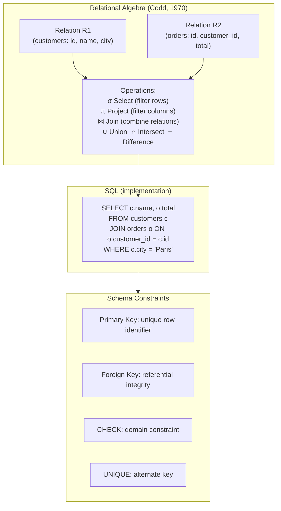

## In simple terms

The **relational model** describes data as a collection of **tables** (formally, *relations*). Each table has named columns, and each row is a tuple of values for those columns. You ask questions of the data with a small, fixed set of operations — select, project, join, union, difference — and any complex query is built from those building blocks.

## The Visual Map



## More detail

E.F. Codd published "A Relational Model of Data for Large Shared Data Banks" in 1970. Its central ideas:

- **Relations are sets of tuples.** A table has a fixed schema (column names and types); each row is one tuple. There are no duplicates in a true relation (tables in SQL can have duplicates — this is a SQL deviation from the formal model).
- **Operations are declarative.** You describe *what* you want, not *how* to compute it. The query optimizer decides the execution strategy.
- **Keys identify rows.** A **primary key** is unique per row; a **foreign key** in one table references the primary key of another, enforcing referential integrity.
- **Schema is separate from data.** Structure is declared once; the DBMS enforces it on every insert and update.
- **Integrity constraints** — uniqueness, foreign keys, check constraints — are part of the schema definition, not application code.

**Relational algebra** is the formal query language:

| Operation | Symbol | SQL equivalent | Meaning |
|---|---|---|---|
| Select (filter) | σ | `WHERE` | Keep rows matching a predicate |
| Project | π | `SELECT col1, col2` | Keep specific columns |
| Join | ⋈ | `JOIN ... ON` | Combine rows from two relations where keys match |
| Union | ∪ | `UNION` | All rows from both (no duplicates) |
| Intersection | ∩ | `INTERSECT` | Rows in both relations |
| Difference | − | `EXCEPT` | Rows in first but not second |
| Rename | ρ | `AS alias` | Rename a relation or attribute |

Every SQL query is a composition of relational algebra operations — the query planner converts SQL to an algebraic expression tree, then optimises it.

**From this foundation came:**
- **SQL** as the standard query language (ANSI 1986, now ANSI/ISO SQL:2023).
- **Normalization** as the design discipline for avoiding redundancy (Codd, 1971).
- **ACID transactions** — the relational model's commitment to consistency.

NoSQL stores relax parts of this model (no joins, no schema, eventual consistency) in exchange for scale or flexibility — but most still describe their tables in relational terms and expose SQL-like query interfaces (DynamoDB PartiQL, Cassandra CQL).

## Under the Hood

Relational algebra translated to Python — showing how a join is just set operations on tuples:

```python
#!/usr/bin/env python3
"""Mini relational algebra engine: relations as lists of dicts."""

# Two relations (tables)
customers = [
    {"id": 1, "name": "Alice", "city": "Paris"},
    {"id": 2, "name": "Bob",   "city": "Berlin"},
    {"id": 3, "name": "Carol", "city": "Paris"},
]

orders = [
    {"id": 101, "customer_id": 1, "total": 250},
    {"id": 102, "customer_id": 1, "total": 80},
    {"id": 103, "customer_id": 2, "total": 420},
]

# σ (select): filter rows matching a predicate
def select(rel, pred):
    return [row for row in rel if pred(row)]

# π (project): keep only named columns
def project(rel, cols):
    return [{c: row[c] for c in cols} for row in rel]

# ⋈ (natural join): combine rows where join key matches
def join(r1, r2, key1, key2):
    result = []
    for a in r1:
        for b in r2:
            if a[key1] == b[key2]:
                merged = {**a, **b}
                result.append(merged)
    return result

# Query: customers in Paris who placed orders, showing name and total
# SQL equivalent:
#   SELECT c.name, o.total FROM customers c
#   JOIN orders o ON o.customer_id = c.id
#   WHERE c.city = 'Paris'

paris_customers = select(customers, lambda c: c["city"] == "Paris")
joined = join(paris_customers, orders, "id", "customer_id")
result = project(joined, ["name", "total"])

print("Paris customers with orders:")
for row in result:
    print(f"  {row}")

# Verify against SQLite
import sqlite3
conn = sqlite3.connect(':memory:')
c = conn.cursor()
c.execute("CREATE TABLE customers (id INTEGER, name TEXT, city TEXT)")
c.execute("CREATE TABLE orders (id INTEGER, customer_id INTEGER, total INTEGER)")
c.executemany("INSERT INTO customers VALUES (?,?,?)", [(r['id'], r['name'], r['city']) for r in customers])
c.executemany("INSERT INTO orders VALUES (?,?,?)", [(r['id'], r['customer_id'], r['total']) for r in orders])
sql_result = c.execute("""
    SELECT c.name, o.total FROM customers c
    JOIN orders o ON o.customer_id = c.id
    WHERE c.city = 'Paris'
""").fetchall()
print("\nSQL result (same query via SQLite):")
for row in sql_result:
    print(f"  name={row[0]} total={row[1]}")
conn.close()
```

## Engineering Trade-offs

**Declarative vs. procedural queries**
The relational model's "describe what, not how" means the database owns the execution strategy. The same query can be answered with a sequential scan, an index lookup, or a hash join — the optimizer chooses based on statistics. This is powerful but opaque: when a query is slow, you're debugging the planner's decisions, not your own code. `EXPLAIN ANALYZE` exposes the plan; in procedural systems, you'd just read the code.

**Schema rigidity vs. flexibility**
A relational schema enforces data shape at the database level: every row has the same columns, types are enforced, foreign keys are checked. This prevents a whole class of data quality bugs but requires schema migrations (`ALTER TABLE`) to evolve. Document databases shift schema enforcement to the application layer — more flexible for evolving requirements, but data quality is only as good as every past version of the application that wrote to the collection.

**Joins vs. denormalization**
A normalised relational schema splits data into focused tables; answering a question often requires joining 3–5 tables. In OLTP (few rows per join, indexed foreign keys), this is fast. In OLAP (joining 100M rows), joins are expensive — data warehouses denormalize into wide fact tables to eliminate runtime joins. The relational model is best for write-heavy, highly concurrent OLTP; dimensional models (star schema) are the deliberate departure from 3NF for analytics.

**Set semantics vs. order**
Relations are sets — unordered by definition. SQL tables can have duplicates (multisets) and queries return rows in unspecified order without `ORDER BY`. This is mathematically clean but catches newcomers: relying on implicit result ordering is a bug. The DBMS can return rows in any order that satisfies the query; `ORDER BY` is the only guarantee.

**Relational algebra completeness vs. expressiveness**
Codd's 8 relational operations (select, project, join, union, intersection, difference, division, rename) are *relationally complete* — any query expressible in first-order logic can be expressed with them. But some queries require extensions: recursion (hierarchical data, shortest path), aggregation (`SUM`/`COUNT`), window functions. SQL adds these beyond relational algebra, making it more expressive but harder to optimize for novel patterns like graph traversal.

## Real-world examples

- **Every order system** — `orders(id, customer_id, product_id, qty, total)` with foreign keys to `customers` and `products` is the canonical relational design. One `JOIN` answers "what did each customer order?"
- **Google Spanner** — Google's globally distributed database implements the relational model (SQL, ACID transactions, foreign keys) over thousands of servers. It uses Paxos consensus groups to maintain ACID across datacenters. The relational model works at planet scale with the right infrastructure.
- **SQLite in every device** — SQLite implements the relational model in a single ~350 KB library. It's embedded in every iOS/Android app, Firefox, Chrome, VS Code, and Python (standard library). The same SQL and relational algebra that runs on a 128-node Spanner cluster runs on a wearable.
- **Data Vault** — a data warehouse modelling technique that separates business keys (hubs), relationships (links), and descriptive attributes (satellites) into distinct tables. It is a systematic application of the relational model's normalization principles to slowly-changing dimensions in warehouses.
- **ORM relationships** — Django's `ForeignKey`, SQLAlchemy's `relationship()`, and ActiveRecord's `belongs_to` are all implementations of the relational model's foreign key concept. The relational model is so pervasive that object-relational mapping is a standard software category.

## Common misconceptions

- **"Relational means SQL."** SQL is the dominant *language* for the relational model, but the model is older and more general. Codd designed it in the language of set theory and first-order logic; SQL came later and deviates from the formal model (allows duplicates, has `NULL`, adds ordering, aggregation, and recursion beyond pure relational algebra).
- **"NoSQL replaces relational."** NoSQL stores complement rather than replace the relational model. For most transactional application data — where correctness matters more than write throughput — the relational model is the safer default. NoSQL wins for specific access patterns: high-write key-value lookups (Redis), flexible document hierarchies (MongoDB), time-series (InfluxDB), graph traversal (Neo4j).
- **"A JOIN is expensive."** A join between two indexed tables via a foreign key is typically a handful of B-tree lookups — microseconds. "Joins are slow" usually means "unindexed joins on large tables are slow," which is an indexing problem, not a relational model problem.

## Try it yourself

Explore the relational algebra operations directly in Python, then verify with SQLite:

```bash
python3 - << 'EOF'
import sqlite3

conn = sqlite3.connect(':memory:')
c = conn.cursor()

# Build a small 3-table schema
c.executescript('''
CREATE TABLE departments (id INTEGER PRIMARY KEY, name TEXT);
CREATE TABLE employees (
    id    INTEGER PRIMARY KEY,
    name  TEXT,
    dept_id INTEGER REFERENCES departments(id),
    salary  INTEGER
);
INSERT INTO departments VALUES (1,'Engineering'),(2,'Sales'),(3,'HR');
INSERT INTO employees VALUES
  (1,'Alice',1,120000),
  (2,'Bob',  1,110000),
  (3,'Carol',2, 90000),
  (4,'Dave', 2, 85000),
  (5,'Eve',  3, 75000);
''')

# σ Select: employees earning > 100K
print("Employees earning > 100K:")
for r in c.execute("SELECT name, salary FROM employees WHERE salary > 100000"):
    print(f"  {r[0]:10} {r[1]:>8,}")

# ⋈ Join: employees with department names
print("\nEmployees with department (join):")
for r in c.execute("""
    SELECT e.name, d.name, e.salary
    FROM employees e JOIN departments d ON e.dept_id = d.id
    ORDER BY e.salary DESC
"""):
    print(f"  {r[0]:10} dept={r[1]:12} salary={r[2]:>8,}")

# π Project + aggregate (beyond relational algebra — SQL extension)
print("\nAverage salary per department:")
for r in c.execute("""
    SELECT d.name, AVG(e.salary) as avg_sal
    FROM employees e JOIN departments d ON e.dept_id = d.id
    GROUP BY d.id
    ORDER BY avg_sal DESC
"""):
    print(f"  {r[0]:12} avg={r[1]:,.0f}")

conn.close()
EOF
```

## Learn next

- [Normalization](/t/normalization) — the design discipline for arranging tables to eliminate redundancy; built directly on the functional dependency theory Codd formalized in the relational model.
- [SQL](/t/sql) — the query language that implemented the relational model for practitioners; every SQL clause maps to one or more relational algebra operations.
- [Indexing](/t/indexing) — B-tree indexes on primary and foreign keys make the relational model's join operations fast; indexing strategy is inseparable from relational schema design.
