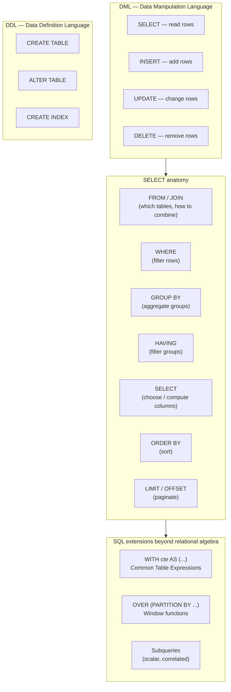

## In simple terms

SQL is the language you use to talk to most databases. Instead of writing loops to find data, you describe the data you want and the database figures out the fastest way to retrieve it.

## The Visual Map



## More detail

A SQL query is built from a few core clauses, executed in logical order different from the written order:

```sql
SELECT title, author, published_at          -- 6. choose columns
FROM   posts                                -- 1. load table
JOIN   authors a ON a.id = posts.author_id  -- 2. join
WHERE  published_at >= '2026-01-01'         -- 3. filter rows
GROUP  BY author_id                         -- 4. aggregate
HAVING COUNT(*) > 1                         -- 5. filter groups
ORDER  BY published_at DESC                 -- 7. sort
LIMIT  10;                                  -- 8. paginate
```

**SQL sublanguages:**

| Sublanguage | Statements | Purpose |
|---|---|---|
| **DML** (Data Manipulation) | SELECT, INSERT, UPDATE, DELETE | Read and modify data |
| **DDL** (Data Definition) | CREATE/ALTER/DROP TABLE, CREATE INDEX | Schema management |
| **DCL** (Data Control) | GRANT, REVOKE | Permissions |
| **TCL** (Transaction Control) | BEGIN, COMMIT, ROLLBACK, SAVEPOINT | Atomicity |

**Core SQL features:**

- **JOINs** — `INNER JOIN` (only matched rows), `LEFT JOIN` (all left + matched right), `RIGHT JOIN`, `FULL OUTER JOIN`, `CROSS JOIN` (all combinations).
- **Aggregates** — `COUNT`, `SUM`, `AVG`, `MIN`, `MAX` combined with `GROUP BY`.
- **Window functions** — `ROW_NUMBER()`, `RANK()`, `LAG()`, `SUM(...) OVER (PARTITION BY ...)` — compute aggregates per partition without collapsing rows.
- **CTEs** — `WITH name AS (...)` — reusable named subqueries; recursive CTEs traverse hierarchical data (org charts, file systems).
- **Subqueries** — a `SELECT` inside a `WHERE` or `FROM` clause; scalar subqueries return one value, correlated subqueries reference the outer query per row.

**SQL execution order (logical):**

The written order of clauses in a SELECT statement differs from the evaluation order:
`FROM` → `JOIN` → `WHERE` → `GROUP BY` → `HAVING` → `SELECT` → `DISTINCT` → `ORDER BY` → `LIMIT`

This matters for debugging: a `WHERE` clause cannot reference a column alias defined in `SELECT` (it hasn't been evaluated yet), but `ORDER BY` can.

**SQL portability:** The core SELECT/INSERT/UPDATE/DELETE is portable across PostgreSQL, MySQL, SQLite, and Oracle. Dialects diverge on: window functions syntax, string functions (`ILIKE` vs `LIKE` case-insensitivity), `RETURNING`, `ON CONFLICT`, and procedural extensions (`PL/pgSQL` vs `PL/SQL` vs T-SQL).

## Under the Hood

A tour of SQL features from basic to advanced using SQLite in Python:

```python
#!/usr/bin/env python3
"""SQL feature tour: SELECT, JOIN, aggregate, window functions, CTE."""
import sqlite3

conn = sqlite3.connect(':memory:')
conn.row_factory = sqlite3.Row
c = conn.cursor()

# Schema setup
c.executescript('''
CREATE TABLE authors (id INTEGER PRIMARY KEY, name TEXT, country TEXT);
CREATE TABLE posts (
    id          INTEGER PRIMARY KEY,
    title       TEXT,
    author_id   INTEGER REFERENCES authors(id),
    views       INTEGER,
    published   TEXT   -- ISO date
);
INSERT INTO authors VALUES
    (1,'Alice','US'), (2,'Bob','UK'), (3,'Carol','US');
INSERT INTO posts VALUES
    (1,'SQL Basics',       1, 1200, '2026-01-10'),
    (2,'Query Planning',   1, 3400, '2026-02-15'),
    (3,'Window Functions', 2,  800, '2026-01-20'),
    (4,'ACID Explained',   2, 2100, '2026-03-01'),
    (5,'Index Internals',  3,  560, '2026-02-08'),
    (6,'Join Strategies',  3, 4200, '2026-03-20');
''')

# 1. Basic SELECT with JOIN
print("Posts with author names (JOIN):")
for r in c.execute("""
    SELECT p.title, a.name, p.views
    FROM posts p JOIN authors a ON a.id = p.author_id
    ORDER BY p.views DESC LIMIT 3
"""):
    print(f"  {r['title']:<24} by {r['name']:<8} views={r['views']:>5,}")

# 2. Aggregate with GROUP BY
print("\nTotal views per author (GROUP BY):")
for r in c.execute("""
    SELECT a.name, COUNT(*) as posts, SUM(p.views) as total_views
    FROM posts p JOIN authors a ON a.id = p.author_id
    GROUP BY a.id
    ORDER BY total_views DESC
"""):
    print(f"  {r['name']:<8} posts={r['posts']} total_views={r['total_views']:>6,}")

# 3. Window function: running total of views per author
print("\nRunning total views per author (window function):")
for r in c.execute("""
    SELECT a.name, p.title, p.published, p.views,
           SUM(p.views) OVER (PARTITION BY a.id ORDER BY p.published) AS running_total
    FROM posts p JOIN authors a ON a.id = p.author_id
    ORDER BY a.id, p.published
"""):
    print(f"  {r['name']:<8} {r['published']} views={r['views']:>5,}  running={r['running_total']:>6,}")

# 4. CTE: rank authors by total views
print("\nAuthor ranking (CTE + RANK window function):")
for r in c.execute("""
    WITH author_totals AS (
        SELECT a.name, SUM(p.views) as total_views
        FROM posts p JOIN authors a ON a.id = p.author_id
        GROUP BY a.id
    )
    SELECT name, total_views,
           RANK() OVER (ORDER BY total_views DESC) as rank
    FROM author_totals
"""):
    print(f"  #{r['rank']} {r['name']:<8} total_views={r['total_views']:>6,}")

conn.close()
```

## Engineering Trade-offs

**Declarative vs. procedural — who owns the plan?**
In SQL, you declare *what* you want; the database engine decides *how* to compute it. This is powerful: the optimizer can choose among sequential scan, index scan, hash join, or merge join based on table statistics. It also means the "obvious" SQL isn't always the fastest — two semantically equivalent queries can have 100× different performance if one generates a better plan. `EXPLAIN ANALYZE` makes the optimizer's choice visible and is essential for SQL performance work.

**N+1 queries — the ORM trap**
An ORM that maps `for post in posts: post.author.name` generates one SELECT per post — the "N+1 problem." With 1000 posts, that's 1001 round trips to the database. The SQL fix is one JOIN or a batched `WHERE id IN (...)`. Understanding SQL is what lets you spot and fix ORM-generated N+1 problems; without that knowledge, they silently degrade performance.

**Window functions vs. self-joins**
Before window functions (added to SQL:2003), computing "rank within a group" required a correlated self-join or a subquery. With `RANK() OVER (PARTITION BY dept ORDER BY salary DESC)`, it's one scan. Window functions almost always produce a better query plan and simpler SQL than the equivalent pre-2003 patterns; they're worth learning as a distinct skill from basic SQL.

**NULL semantics**
SQL's three-valued logic (`TRUE`, `FALSE`, `NULL`) catches newcomers. `NULL != NULL` (both return NULL), `NULL IN (1, NULL)` returns NULL (not TRUE), and aggregate functions silently ignore NULLs. `IS NULL` / `IS NOT NULL` are the correct operators. Design schemas to avoid NULLs where possible; use `COALESCE(col, default)` to handle them in queries.

**Transactions and isolation**
A `BEGIN` / `COMMIT` block makes multiple SQL statements atomic. But concurrent transactions can see each other's partial state depending on the **isolation level** (READ UNCOMMITTED, READ COMMITTED, REPEATABLE READ, SERIALIZABLE). Higher isolation prevents anomalies (dirty reads, phantom reads) but increases lock contention. Most OLTP applications use READ COMMITTED (PostgreSQL default) and explicitly lock with `SELECT FOR UPDATE` when needed.

## Real-world examples

- **CTEs for readability** — large data pipelines at Airbnb and Stripe use multi-step CTEs (WITH step1 AS (...), step2 AS (...)) to express complex transformations as named stages, making queries self-documenting and easier to test incrementally.
- **Window functions for analytics** — `LAG(revenue, 1) OVER (PARTITION BY store ORDER BY month)` computes month-over-month change per store in one query; before window functions, this required a self-join with aliased subqueries.
- **`EXPLAIN ANALYZE` debugging** — a PostgreSQL query taking 30 seconds becomes 30 ms after adding a composite index — the `EXPLAIN` plan showed a sequential scan on a 10M-row table that an index on `(user_id, created_at)` resolved.
- **SQLite in CI** — Django tests run against an in-memory SQLite database (`:memory:`), which starts up in milliseconds and runs the same ORM-generated SQL as PostgreSQL. The relational model's portability makes this practical.
- **BigQuery SQL at scale** — BigQuery executes standard SQL against petabyte datasets using distributed columnar storage and parallel joins across thousands of nodes. The SQL is standard; the execution plan is massively parallel.

## Common misconceptions

- **"SQL is slow."** A slow query is slow; SQL itself is fast. A well-indexed query on a properly tuned database returns in microseconds. Performance problems are almost always from missing indexes, bad query plans (use `EXPLAIN`), N+1 patterns, or missing aggregation.
- **"ORM means I never need SQL."** ORMs generate SQL. When the ORM generates a slow or wrong query, SQL knowledge is the only way to diagnose and fix it. Every production engineer who uses an ORM eventually needs to understand the SQL it generates.
- **"You can't do X in SQL."** SQL with CTEs, window functions, lateral joins, and recursive CTEs is surprisingly expressive. Most "I had to do this in application code" problems (ranking, running totals, tree traversal, pivot tables) have clean SQL solutions.

## Try it yourself

Explore SQL — basic queries, joins, aggregates, and window functions — all in one Python script:

```bash
python3 - << 'EOF'
import sqlite3

conn = sqlite3.connect(':memory:')
c = conn.cursor()

c.executescript('''
CREATE TABLE products (id INTEGER PRIMARY KEY, name TEXT, category TEXT, price REAL);
CREATE TABLE sales    (id INTEGER PRIMARY KEY, product_id INTEGER, qty INTEGER, sale_date TEXT);
INSERT INTO products VALUES
  (1,'Laptop','Electronics',999),
  (2,'Mouse','Electronics',25),
  (3,'Desk','Furniture',450),
  (4,'Chair','Furniture',300),
  (5,'Lamp','Furniture',80);
INSERT INTO sales VALUES
  (1,1,2,'2026-01-05'),(2,2,10,'2026-01-05'),
  (3,3,1,'2026-01-12'),(4,4,3,'2026-01-20'),
  (5,1,1,'2026-02-03'),(6,5,5,'2026-02-15'),
  (7,2,8,'2026-02-20'),(8,3,2,'2026-03-01');
''')

# Aggregate: revenue by category
print("Revenue by category:")
for r in c.execute("""
    SELECT p.category, SUM(p.price * s.qty) as revenue
    FROM sales s JOIN products p ON p.id = s.product_id
    GROUP BY p.category
    ORDER BY revenue DESC
"""):
    print(f"  {r[0]:<15} ${r[1]:>8,.2f}")

# Window: rank products by revenue within category
print("\nProduct rank within category (window function):")
for r in c.execute("""
    SELECT p.category, p.name,
           SUM(p.price * s.qty) as revenue,
           RANK() OVER (PARTITION BY p.category ORDER BY SUM(p.price*s.qty) DESC) as cat_rank
    FROM sales s JOIN products p ON p.id = s.product_id
    GROUP BY p.id
    ORDER BY p.category, cat_rank
"""):
    print(f"  [{r[0]}] #{r[3]} {r[1]:<10} ${r[2]:>8,.2f}")
conn.close()
EOF
```

## Learn next

- [Indexing](/t/indexing) — how the database makes SQL queries fast; B-tree indexes on `WHERE` and `JOIN` columns turn sequential scans into logarithmic lookups.
- [Query Plan](/t/query-plan) — `EXPLAIN ANALYZE` shows how the database executes your SQL; understanding plans is essential for optimizing slow queries.
- [Normalization](/t/normalization) — how to design the tables your SQL queries run against; good schema design makes SQL simpler and indexes more effective.
