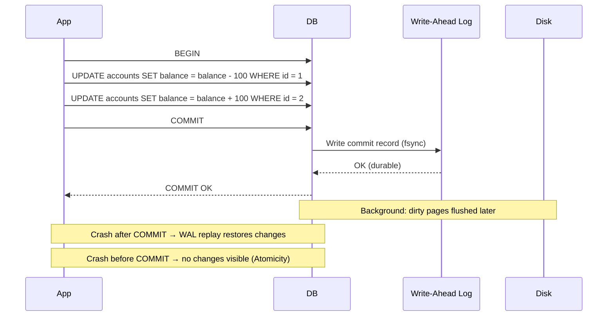

## In simple terms

An **ACID transaction** is a group of database operations that the system treats as one. Either *all* of them happen, or *none* of them do; while it runs, other transactions don't see partial work; after it commits, the result survives crashes and power cuts. Without this guarantee, every concurrent write becomes a potential race condition.

## The Visual Map



## More detail

ACID stands for four properties that a transactional database guarantees:

**Atomicity — all or nothing**
A transaction either commits completely or has no effect. A bank transfer debits one account and credits another; if anything fails between those two operations, neither change is visible. The database engine uses a write-ahead log and a rollback mechanism to guarantee this.

**Consistency — valid state to valid state**
Every transaction must leave the database in a state that satisfies all declared constraints (foreign keys, unique constraints, check constraints, triggers). If a transaction would violate a constraint, it is rolled back. Consistency is partially the database's responsibility (enforcing schema rules) and partly the application's (business rules that can't be expressed as schema constraints).

**Isolation — concurrent transactions appear serial**
Concurrent transactions appear to run one at a time. How strictly this is enforced depends on the **isolation level**:

| Level | Dirty read | Non-repeatable read | Phantom read | PG implementation |
|---|---|---|---|---|
| Read uncommitted | Possible | Possible | Possible | Same as RC (PG never allows dirty reads) |
| Read committed | Prevented | Possible | Possible | Each statement sees its own snapshot |
| Repeatable read | Prevented | Prevented | Possible (ANSI) | Snapshot isolation in PG (no phantoms either) |
| Serializable | Prevented | Prevented | Prevented | SSI (predicate locking + conflict detection) |

PostgreSQL's default is **Read Committed**. Most applications use Read Committed or Repeatable Read; full Serializable is used for financial systems where phantom reads would cause incorrect results (e.g., "insert only if balance > 0" checked by multiple concurrent transactions).

**Durability — committed data survives crashes**
Once a transaction commits, the database guarantees the result will survive crashes, power cuts, and OS failures. This is implemented with a **write-ahead log (WAL)**: the log record is flushed to durable storage (fsync) before "COMMIT OK" is returned to the client. On restart after a crash, the engine replays the WAL to reconstruct the committed state.

**Implementation techniques:**

- **MVCC (Multi-Version Concurrency Control)** — each row has version metadata (in PostgreSQL: `xmin`/`xmax` transaction IDs). A read sees the row versions that were committed before the reader's transaction began. Writers don't block readers; readers don't block writers.
- **Two-Phase Locking (2PL)** — transactions acquire shared (read) or exclusive (write) locks; no lock is released until commit. Serializable isolation but high contention.
- **Optimistic concurrency** — don't lock on read; validate at commit that no conflicting write occurred; retry on conflict. Good for low-contention workloads. Used by PostgreSQL SSI and many ORMs.

## Under the Hood

Demonstrating isolation levels with concurrent SQLite transactions in Python:

```python
#!/usr/bin/env python3
"""Show ACID properties with SQLite: atomicity and isolation."""
import sqlite3, threading

# --- Atomicity: all-or-nothing transfer ---
conn = sqlite3.connect(':memory:', check_same_thread=False)
c = conn.cursor()
c.executescript('''
CREATE TABLE accounts (id INTEGER PRIMARY KEY, balance INTEGER);
INSERT INTO accounts VALUES (1, 1000), (2, 500);
''')

def transfer(amount, should_fail=False):
    try:
        conn.execute('BEGIN')
        conn.execute('UPDATE accounts SET balance = balance - ? WHERE id = 1', (amount,))
        if should_fail:
            raise RuntimeError("Simulated failure mid-transaction")
        conn.execute('UPDATE accounts SET balance = balance + ? WHERE id = 2', (amount,))
        conn.execute('COMMIT')
        return "committed"
    except Exception as e:
        conn.execute('ROLLBACK')
        return f"rolled back ({e})"

print("Initial balances:", dict(conn.execute('SELECT id, balance FROM accounts').fetchall()))
r1 = transfer(200)
print(f"Transfer $200: {r1}")
print("After successful transfer:", dict(conn.execute('SELECT id, balance FROM accounts').fetchall()))

r2 = transfer(300, should_fail=True)
print(f"Transfer $300 (fails mid-way): {r2}")
print("After failed transfer (atomicity):", dict(conn.execute('SELECT id, balance FROM accounts').fetchall()))
# Balances unchanged — atomicity preserved

# --- Isolation: read committed vs repeatable read behavior ---
print("\n--- Isolation demo ---")
conn2a = sqlite3.connect(':memory:')
conn2b = sqlite3.connect(':memory:', isolation_level=None)
conn2a.execute('CREATE TABLE t (val INTEGER)')
conn2a.execute('INSERT INTO t VALUES (10)')
conn2a.commit()

# Read committed: each statement sees latest committed data
# (SQLite always uses serializable, so this is illustrative)
conn2a.execute('BEGIN')
v1 = conn2a.execute('SELECT val FROM t').fetchone()[0]
# Another "connection" updates the value here in a real DB
conn2a.execute('UPDATE t SET val = 20')
v2 = conn2a.execute('SELECT val FROM t').fetchone()[0]
conn2a.execute('ROLLBACK')

print(f"Within transaction: read val={v1}, then (after own update) val={v2}")
print("Rollback: val restored =", conn2a.execute('SELECT val FROM t').fetchone()[0])
```

## Engineering Trade-offs

**Durability vs. write throughput (the fsync trade-off)**
PostgreSQL's default: every `COMMIT` calls `fsync()` — the WAL is flushed to durable storage before returning "OK" to the client. This guarantees no committed data is lost on crash, but limits throughput to disk sync latency: ~0.5–5 ms on spinning disk, ~0.05 ms NVMe. Setting `synchronous_commit = off` (PostgreSQL) or `innodb_flush_log_at_trx_commit = 2` (MySQL) removes the sync requirement — write throughput can increase 10–100×, but the last ~1 second of commits may be lost on crash. Most OLTP systems keep fsync=on and batch writes with connection pooling.

**Isolation level vs. throughput and anomaly risk**
Serializable isolation ensures no concurrency anomalies but has the highest overhead: predicate locks, conflict detection, and potential retries on conflict. Read Committed allows phantom reads and non-repeatable reads but has the lowest lock contention. The pragmatic approach: use Read Committed for most queries, escalate to Repeatable Read or Serializable for critical sections (account balance checks, inventory reservation). Over-pessimistic isolation kills throughput; under-pessimistic isolation corrupts data.

**MVCC vs. lock-based isolation**
MVCC (PostgreSQL, MySQL InnoDB, Oracle) gives readers a snapshot of the database at transaction start — reads never block writes, writes never block reads. The trade-off: dead rows (old versions) accumulate and must be vacuumed (PostgreSQL VACUUM, InnoDB purge). Lock-based isolation (SQL Server default) blocks readers when a writer holds an exclusive lock; no dead rows to clean, but higher reader/writer contention.

**Long transactions vs. lock retention**
A transaction that holds locks for minutes (a long-running migration, an interactive session) blocks all conflicting reads and writes for the duration. In PostgreSQL, a long transaction also delays VACUUM from reclaiming space (the transaction's xmin prevents pruning old row versions, causing table bloat). The operational rule: keep transactions short — move business logic out of transactions, batch large operations, use `LOCK TIMEOUT` to fail fast rather than wait indefinitely.

**Distributed transactions vs. availability**
ACID transactions across multiple database nodes require distributed coordination: two-phase commit (2PC), Paxos, or Raft. 2PC is correct but slow and blocks on coordinator failure. This is why NoSQL systems (Cassandra, DynamoDB) use eventual consistency (BASE) instead of ACID — they trade consistency guarantees for availability and partition tolerance. NewSQL databases (CockroachDB, Google Spanner) achieve distributed ACID but at higher latency than single-node SQL.

## Real-world examples

- **Bank transfers** — the canonical ACID example. A single transfer involves `UPDATE accounts WHERE id=1`, `UPDATE accounts WHERE id=2`, `INSERT INTO ledger`, `INSERT INTO audit_log` — all in one transaction. Without atomicity, a crash between the debit and credit creates phantom money.
- **E-commerce inventory** — "check stock > 0, then decrement" must be one atomic transaction to prevent overselling. `SELECT ... FOR UPDATE` acquires a row lock, preventing concurrent transactions from reading the same stock count until the first one commits.
- **PostgreSQL SSI for financial systems** — serializable snapshot isolation (SSI) in PostgreSQL detects write skew: two transactions reading balance and both deciding to overdraft. SSI detects the conflict and aborts one transaction, maintaining correctness without pessimistic locking.
- **MongoDB multi-document transactions** — MongoDB added multi-document ACID transactions in 4.0 (2018), initially requiring a replica set, later supporting sharded clusters. Before 4.0, operations on multiple documents required application-level compensation.
- **`SAVEPOINT` for partial rollback** — `SAVEPOINT sp1; INSERT INTO t VALUES (1); ROLLBACK TO sp1;` rolls back to the savepoint without aborting the whole transaction. Used in ORMs to implement partial rollback (e.g., try to insert, roll back to savepoint on constraint violation, continue).

## Common misconceptions

- **"Default isolation is serializable."** The default isolation level for almost every database is *not* serializable. PostgreSQL defaults to Read Committed; MySQL InnoDB to Repeatable Read; SQLite to Serializable (due to its single-writer model). Serializable must be explicitly requested and is rarely the default because of its throughput cost.
- **"ACID guarantees no anomalies."** Only at the Serializable isolation level. Read Committed allows phantom reads and non-repeatable reads; Repeatable Read (ANSI) allows phantom reads. "I use ACID transactions" doesn't mean "I'm safe from all concurrency bugs" — the isolation level matters.
- **"Transactions are slow."** A simple single-row transaction on a warm NVMe database commits in ~0.05–0.1 ms. Transactions are slow when they are long (holding locks), contended (many concurrent transactions fighting for the same rows), or require remote coordination (distributed 2PC).

## Try it yourself

Observe ACID properties directly in SQLite:

```bash
python3 - << 'EOF'
import sqlite3

conn = sqlite3.connect(':memory:')
conn.execute('CREATE TABLE accounts (id INTEGER PRIMARY KEY, name TEXT, balance INTEGER)')
conn.execute("INSERT INTO accounts VALUES (1,'Alice',1000),(2,'Bob',500)")
conn.commit()

def show_balances(label):
    rows = conn.execute('SELECT name, balance FROM accounts').fetchall()
    print(f"{label}: " + ", ".join(f"{r[0]}={r[1]}" for r in rows))

show_balances("Initial")

# Atomicity: commit succeeds — both updates persist
conn.execute('BEGIN')
conn.execute('UPDATE accounts SET balance = balance - 200 WHERE id = 1')
conn.execute('UPDATE accounts SET balance = balance + 200 WHERE id = 2')
conn.execute('COMMIT')
show_balances("After $200 transfer (COMMIT)")

# Atomicity: rollback — neither update persists
conn.execute('BEGIN')
conn.execute('UPDATE accounts SET balance = balance - 999 WHERE id = 1')
conn.execute('UPDATE accounts SET balance = balance + 999 WHERE id = 2')
conn.execute('ROLLBACK')
show_balances("After attempted $999 transfer (ROLLBACK)")

# Consistency: constraint violation rolls back
conn.execute('CREATE TABLE orders (id INTEGER PRIMARY KEY, acct_id INTEGER REFERENCES accounts(id), amount INTEGER)')
conn.execute('PRAGMA foreign_keys = ON')
try:
    conn.execute('BEGIN')
    conn.execute('INSERT INTO orders VALUES (1, 999, 50)')  # 999 = nonexistent account
    conn.execute('COMMIT')
    print("Inserted (should not reach here)")
except Exception as e:
    conn.execute('ROLLBACK')
    print(f"Constraint violation rolled back: {e}")

show_balances("Final")
EOF
```

## Learn next

- [Write-Ahead Log](/t/write-ahead-log) — the WAL is the implementation mechanism for both Atomicity and Durability; understanding it explains how crash recovery works and what `fsync` actually guarantees.
- [MVCC](/t/mvcc) — multi-version concurrency control is how PostgreSQL and MySQL implement Isolation without blocking readers; it is the mechanism behind snapshot-based isolation levels.
- [Normalization](/t/normalization) — the relational design discipline that complements ACID by ensuring the database schema makes invalid states unrepresentable, reducing the need for complex constraint checking.
