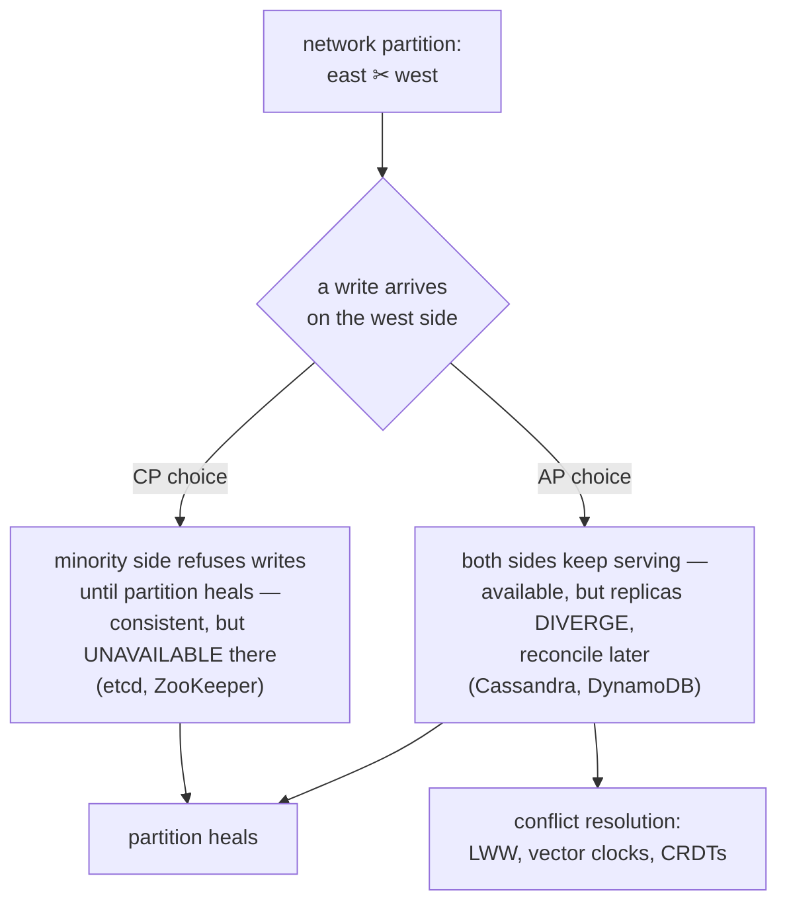

## In simple terms

The **CAP theorem** says: when a distributed system experiences a network partition (some nodes can't talk to others), it has to choose between two undesirable behaviours — either refuse to serve some requests (giving up Availability) or serve them with potentially stale or wrong data (giving up Consistency). You can't have both during a partition. C, A, and P stand for **Consistency**, **Availability**, and **Partition tolerance**, and the punchline is "pick at most two" — but in practice, P is forced on you by reality, so you really pick C or A.

## The Visual Map



## More detail

Formally:

- **Consistency** (in CAP terms) = linearizability: every read returns the most recent write.
- **Availability** = every request gets a non-error response.
- **Partition tolerance** = the system keeps operating despite network partitions.

Eric Brewer stated CAP as a conjecture in 2000; Gilbert and Lynch proved it in 2002.

What it actually means in practice:

- Network partitions in real distributed systems are inevitable (cables get cut, switches fail, regions fail). So your system must tolerate them.
- During a partition, you choose:
  - **CP**: refuse requests on the minority side until the partition heals. Examples: most databases with single-master writes, etcd, ZooKeeper.
  - **AP**: keep serving on both sides; reconcile when the partition heals (with conflict resolution, last-write-wins, CRDTs). Examples: Cassandra by default, DynamoDB, Riak.
- Outside partitions, you can have both C and A — CAP is specifically a *during-partition* trade-off.

CAP is often criticised as **too binary**. The richer modern framing is **PACELC**: in the presence of a Partition, pick A or C; Else (no partition), pick Latency or Consistency. Latency-vs-consistency is a continuous, everyday trade-off that CAP doesn't capture.

CAP is also often misapplied:

- "MongoDB is CP" — only with the right configuration; with default reads, it's somewhere between.
- "DynamoDB is AP" — partly; it offers strongly-consistent reads at higher cost and latency.
- "PostgreSQL is CA" — only if you ignore partitions, which is fine on a single machine but meaningless on a replicated cluster.

The real-world art is choosing your trade-offs **per data type, per access path**: strongly consistent for money transfers, eventually consistent for likes counts, available with conflict resolution for shared documents. CAP is the foundational vocabulary for talking about these trade-offs — knowing it (and its limitations) lets you read database docs critically and pick the right store for each workload.

## Under the Hood

Both choices, as code — the same partition, two policies:

```python
class Node:
    def __init__(self, peers_reachable):
        self.data, self.total, self.reachable = {}, 3, peers_reachable

    def write_cp(self, k, v):
        # CP: a write needs a majority (2 of 3) — count yourself + reachable peers
        if 1 + self.reachable < self.total // 2 + 1:
            raise RuntimeError("UNAVAILABLE: no quorum on this side of the partition")
        self.data[k] = v
        return "committed"

    def write_ap(self, k, v):
        self.data[k] = v                       # AP: always accept...
        return "accepted locally (will sync & resolve conflicts later)"

majority_side = Node(peers_reachable=1)        # sees 1 peer -> has quorum
minority_side = Node(peers_reachable=0)        # isolated

print(majority_side.write_cp("x", 1))          # committed
print(minority_side.write_ap("x", 2))          # accepted — divergence created
try:
    minority_side.write_cp("x", 2)
except RuntimeError as e:
    print(e)                                   # the CP refusal, made explicit
```

CP turns the partition into visible errors; AP turns it into invisible divergence. Neither is free — the theorem just forbids pretending otherwise.

## Engineering Trade-offs

- **CP: correctness you can see fail.** Refusing minority-side requests keeps one true history but converts every partition into a partial outage — acceptable for cluster metadata (etcd), painful for a shopping cart.
- **AP: availability that defers the bill.** Serving both sides keeps users happy during the partition; the cost arrives at heal time as conflicts your application must resolve, and "last write wins" quietly discards somebody's write.
- **PACELC: the everyday version.** Even without partitions, strong consistency costs a quorum round-trip per operation. Cross-region, that's 50–150 ms on every write — the reason many systems choose weaker reads *all the time*, not just during failures.
- **Per-operation, not per-system.** Tunable-consistency stores (Cassandra's `ONE`/`QUORUM`/`ALL`, DynamoDB's read modes) show the mature position: pay for linearizability on the money path, take eventual consistency on the likes counter — within one database.

## Real-world examples

- **Amazon DynamoDB** lets each request choose: eventually-consistent reads are cheaper and lower-latency; strongly-consistent reads cost more and are slower.
- **Cassandra**'s tunable consistency (`ONE`, `QUORUM`, `ALL`) is per-query CAP control: write to `QUORUM` and read `QUORUM` for strong consistency; both at `ONE` for max availability.
- **Google Spanner** uses synchronised atomic clocks to achieve external consistency across continents — sometimes pitched as "CA in the absence of partitions, CP during one".
- **etcd / ZooKeeper** are explicitly CP: during a partition, the minority side stops accepting writes; Kubernetes can't update cluster state while etcd is unavailable.

## Common misconceptions

- **"CAP means a system is CA or CP or AP."** P is non-negotiable in a real distributed system. The choice is C or A *during partitions*.
- **"Consistency in CAP = ACID consistency."** No — CAP consistency means linearizability (one specific consistency model). ACID's C is a different (weaker) notion.

## Try it yourself

The quorum arithmetic behind tunable consistency: reads and writes overlap (and are strongly consistent) exactly when R + W > N:

```bash
python3 -c "
N = 3
print(f'{\"W\":>2} {\"R\":>2}  R+W>N  guarantee')
for W, R in [(1,1), (1,3), (2,2), (3,1), (1,2)]:
    strong = R + W > N
    note = 'every read overlaps the last write' if strong else 'a read can miss the last write (stale)'
    print(f'{W:>2} {R:>2}  {str(strong):5}  {note}')
"
```

`W=2, R=2` on 3 replicas is the classic sweet spot; `W=1, R=1` is the fast, eventually-consistent corner. Same cluster, dialled per request.

## Learn next

- [Eventual consistency](/t/eventual-consistency) — the model AP systems live in.
- [Consensus](/t/consensus) — the machinery CP systems use to stay consistent.
- [Replication](/t/replication) — where the divergence problem comes from in the first place.
