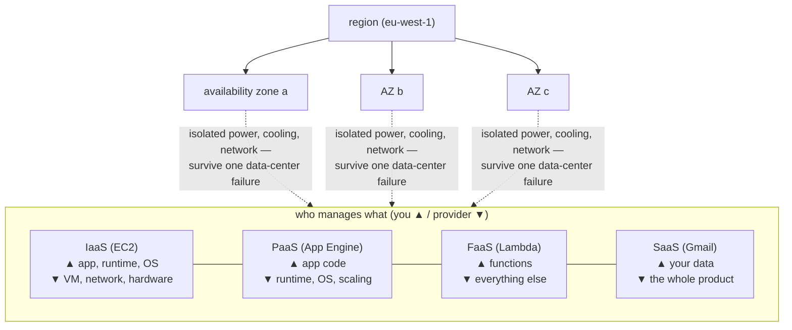

## In simple terms

A **cloud provider** rents you computing instead of selling you hardware. Rather than buying servers, wiring up a data center, and maintaining it, you ask the provider for a server (or a database, or storage) over the internet, use it for as long as you need, and pay for what you use. The big three are **Amazon Web Services (AWS)**, **Microsoft Azure**, and **Google Cloud (GCP)**. The pitch: turn a giant up-front capital expense into a usage-based bill, and turn months of procurement into an API call.

## The Visual Map



## More detail

Cloud services are usually grouped by how much the provider manages for you:

- **IaaS (Infrastructure as a Service)** — raw building blocks: virtual machines, block storage, networks. You manage the OS and everything above. (AWS EC2, Azure VMs.)
- **PaaS (Platform as a Service)** — you deploy your app; the provider runs the OS, runtime, and scaling. (App Engine, Azure App Service.)
- **SaaS (Software as a Service)** — finished applications delivered over the web (Gmail, Salesforce).
- **Serverless / FaaS** — you supply functions; the platform handles everything else. (See [serverless](/t/serverless).)

Providers organize capacity into **regions** (geographic areas) and **availability zones** (isolated data centers within a region) so you can place workloads near users and survive a single data-center failure. They also offer hundreds of **managed services** — databases, queues, [container](/t/container) orchestration ([Kubernetes](/t/kubernetes)), machine learning, CDNs — so teams assemble systems instead of building each piece.

Two recurring themes: **elasticity** (scale up for a traffic spike, scale down after, pay accordingly) and the risk of **vendor lock-in** (the deeper you use a provider's proprietary services, the harder it is to leave).

The cloud changed who can build at scale: a two-person startup can now rent the same caliber of infrastructure as a bank, paying pennies until it grows. Cloud providers run a large fraction of all internet services today, and "where and how do we run this" is now a default architectural question for nearly every software project.

## Under the Hood

"Infrastructure as an API call" concretely means infrastructure as *code* — a Terraform definition the provider's API turns into running hardware:

```text
# main.tf — a tiny but real slice of cloud infrastructure
resource "aws_instance" "web" {
  ami           = "ami-0c02fb55956c7d316"   # OS image
  instance_type = "t3.small"                # 2 vCPU, 2 GB — resized by editing this line
  subnet_id     = aws_subnet.public_a.id    # placed in one availability zone

  tags = { Name = "web-1", Team = "storefront" }
}

resource "aws_db_instance" "orders" {
  engine            = "postgres"
  instance_class    = "db.t3.medium"
  allocated_storage = 50
  multi_az          = true     # provider keeps a standby in another AZ —
                               # replication & failover are THEIR problem
}
```

`terraform apply` diffs this against reality and creates, resizes, or destroys to match — the same declarative-reconciliation idea Kubernetes uses, applied to data centers. The `multi_az = true` line is the cloud's core value proposition in miniature: an entire replication-and-failover architecture, rented as a boolean.

## Engineering Trade-offs

- **Elasticity vs steady-state cost.** Pay-per-use is unbeatable for spiky or unknown load; at large, predictable scale, owning hardware wins — the math behind well-known "cloud repatriation" moves (Dropbox, 37signals). Reserved instances and savings plans are the providers' counter-offer.
- **Managed services vs lock-in.** DynamoDB or Spanner gives you world-class engineering for an API call, but proprietary APIs make leaving expensive. Open interfaces (Postgres-compatible, S3-compatible, Kubernetes) are the standard hedge, at some loss of provider-specific polish.
- **Someone else's ops vs someone else's outage.** Providers run better data centers than almost any company could — and when a region fails, thousands of businesses go down together, with nothing to do but wait. Multi-region architecture is the mitigation, at significant complexity and cost.
- **Shared responsibility is easy to misread.** The provider secures the infrastructure; *you* secure your configuration. The recurring cloud breach is not a hacked hypervisor — it's a public S3 bucket or over-broad IAM role.

## Real-world examples

- **Netflix** runs almost entirely on AWS, scaling thousands of servers up and down with viewing demand.
- A startup launches a global app on managed databases and serverless functions with no servers of its own to patch.
- A major AWS region outage taking down large swaths of the web is a recurring reminder of how concentrated this infrastructure has become.

## Common misconceptions

- **"The cloud is just someone else's computer."** True at the base, but the value is the *managed services and elasticity* layered on top, not just rented hardware.
- **"The cloud is always cheaper."** It's cheaper to *start* and to handle variable load; at steady, predictable, very large scale, owning hardware can win — which is why some companies repatriate workloads.

## Try it yourself

The rent-vs-buy math every infrastructure team eventually does — on-demand vs reserved vs owning:

```bash
python3 -c "
hours_per_month = 730
on_demand  = 0.0832          # \$/hr, a typical 2-vCPU instance
reserved   = 0.0524          # same instance, 1-year commitment
server_buy = 1200            # comparable hardware + 3yr amortised power/space

for util in (0.10, 0.50, 1.00):
    od  = on_demand * hours_per_month * util * 36
    res = reserved * hours_per_month * 36          # committed: paid regardless
    own = server_buy
    best = min(('on-demand', od), ('reserved', res), ('own', own), key=lambda x: x[1])
    print(f'utilisation {util:>4.0%}: on-demand \${od:7.0f} | reserved \${res:7.0f} | own \${own} -> {best[0]}')
"
```

Low utilisation favours on-demand, steady full load favours owning — elasticity is what you're paying for, so the answer hinges on how bursty your real workload is.

## Learn next

- [Serverless](/t/serverless) — the far end of "the provider manages everything".
- [Container](/t/container) — the portable unit that eases moving between providers.
- [Kubernetes](/t/kubernetes) — the orchestration layer offered managed by every cloud.
